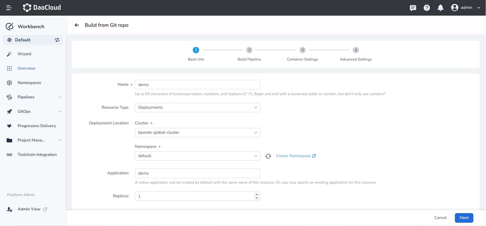
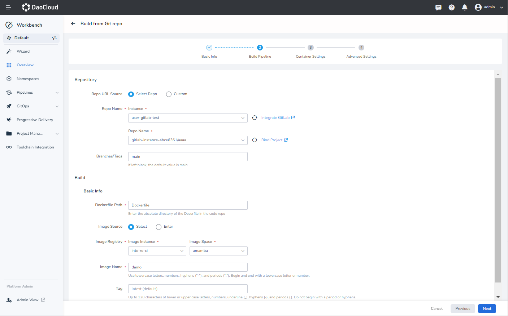
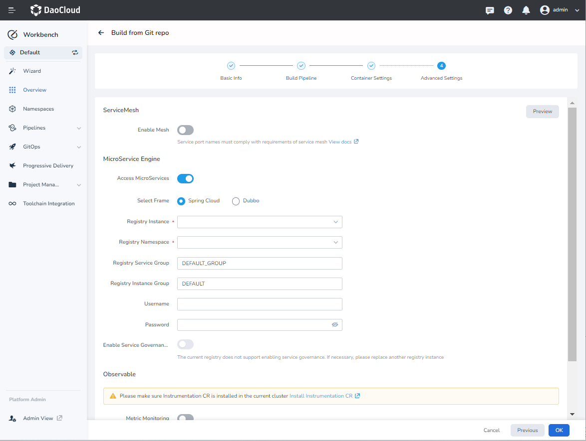
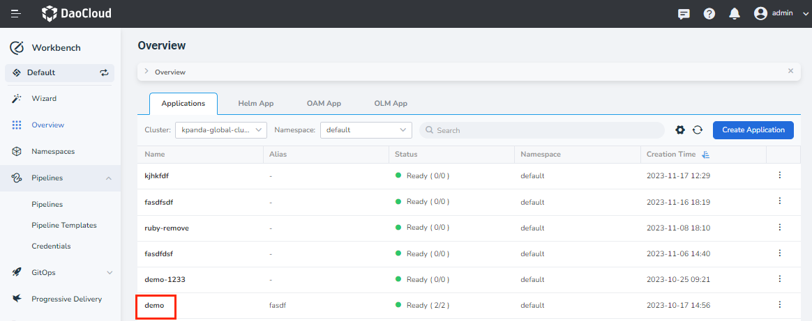
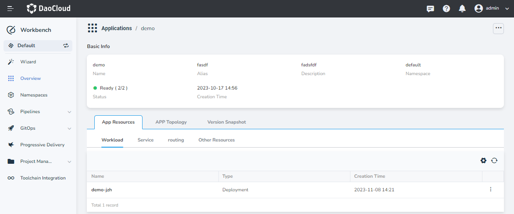

# Building Microservices Apps from Git Repo

The Workbench supports building applications using four methods:
Git repo, Jar packages, container images, and Helm templates. This article
explains how to build a traditional microservices application from a Git repo
source code, enabling features such as traffic governance, log viewing, monitoring, and tracing.

## Prerequisites

- You need to create a workspace and a user who is added to the workspace with the
  `workspace edit` role. Refer to [Creating a Workspace](../../../ghippo/user-guide/workspace/workspace.md)
  and [Users and Roles](../../../ghippo/user-guide/access-control/user.md).
- Create two credentials that can access the code repo and image repo.
  See [Credential Management](../pipeline/credential.md).
- Prepare a GitLab repo and a Harbor repo.

## Create Credentials

Following [Credential Management](../pipeline/credential.md), create two credentials:

1. On the `Credentials` page, create two credentials:

    - git-credential: Username and password for accessing the code repo.
    - registry-credential: Username and password for accessing the image repo.

2. Once created, you can view the credentials on the `Credential List` page.

## Create Microservices App from Git

1. In the `Workbench` -> `Wizard` page, click `Build with Git Repo`.

    

2. Fill in the basic information as per the instructions and click `Next`:

    - Name: Specify the name of the resource workload.
    - Resource Type: Select Stateless Workload, which is currently the only supported option.
    - Deployment Location: Choose the cluster and namespace where the application will be deployed.
      If you want to integrate with microservices, make sure you have
      [created a registry](../../../skoala/trad-ms/hosted/index.md) in the current workspace.
    - Application: Specify the name of the native application. You can select from an existing list
      or create a new one, which by default will have the same name as specified.
    - Instances: Specify the number of instances (Pods).

    

3. Fill in the pipeline configuration details based on the instructions and click `Next`.

    - Repo: Select a repo or enter the Git repo address. In this example, the Git repo address
      is `https://gitlab.daocloud.cn/ndx/skoala.git`, which should be replaced with the actual
      address. The choice of repo is from the GitLab instance integrated by the user.
    - Branch: The default branch is `main` and can be left unchanged.
    - Credentials: Select the credential (`git-credential`) for accessing the code repo.
      If it is a public repo, no need to fill this field.
    - Dockerfile Path: Enter the absolute path of the Dockerfile in the code repo.
      For example, `demo/integration/springcloud-nacos-sentinel/code/Dockerfile`.
    - Target Image Name: Select or enter the target image name. In this example, the address is
      [`release-ci.daocloud.io/test-lfj/fromgit`](http://release-ci.daocloud.io/test-lfj/fromgit),
      which should be replaced with the actual address. The choice of image repo is from the
      image repo instance integrated and bound to the current workspace.
    - Tag: Enter the version of the image repo, for example, `v2.0.0`.
    - Credentials: Select the credentials for accessing the image repo, for example, `registry-credential`.
    - ContextPath: Set the context path for the docker build command execution. Specify the relative path
      to the root of the code directory, such as `target`. If left blank, it defaults to the directory
      where the Dockerfile is located.
    - Build Arguments: The build arguments are passed to the build command in the form of `--build-arg`.
      You can set the upstream artifact download address, upstream image download address as parameters
      and also define custom parameters.

    

4. Fill in the container configuration details based on the instructions and click `Next`.

    - Service Configuration: Specify how the service can be accessed within the
      cluster, node, or load balancer. Example values:

        name | protocol | port | targetPort
        ---- | -------- | ---- | ----------
        http | TCP      | 8081 | 8081
        health-http | TCP | 8999 | 8999
        service | TCP      | 9555 | 9555

        > For more detailed information about service configuration, refer to
        > [Creating Services](../../../kpanda/user-guide/network/create-services.md).

    - Resource Limits: Specify the resource limits for the application, including CPU and memory.

    - Lifecycle: Set commands that need to be executed during container startup, after startup,
      and before shutdown. For more details, refer to
      [Container Lifecycle Configuration](../../../kpanda/user-guide/workloads/pod-config/lifecycle.md).

    - Health Checks: Define health checks to determine the health status of the container and application,
      improving availability. For more details, refer to
      [Container Health Check Configuration](../../../kpanda/user-guide/workloads/pod-config/health-check.md).

    - Environment Variables: Configure container parameters, add environment variables, or pass
      configurations to the Pod. For more details, refer to
      [Container Environment Variable Configuration](../../../kpanda/user-guide/workloads/pod-config/env-variables.md).

    - Data Storage: Configure data volume mounting and data persistence for containers.

    

5. On the `Advanced Configuration` page, click `Enable Microservice Integration`.
   Configure the parameters as per the instructions and click `OK`.

    - Framework Selection: Choose between `Spring Cloud` and `Dubbo`. In this case, select `Spring Cloud`.
    - Registry Instance: Currently, only hosted Nacos registry instances from the
     [Microservices Engine](../../../skoala/trad-ms/hosted/index.md) are supported.
    - Registry Namespace: The Nacos namespace for the microservices application.
    - Registry Service Group: The service group for the microservices application.
    - Username/Password: If the registry instance requires authentication, enter the username and password.
    - Enable Service Governance: The selected registry instance should have
     [Sentinel or Mesh governance plugins enabled](../../../skoala/trad-ms/hosted/plugins/plugin-center.md).

    

## Viewing and Accessing Microservices Information

1. On the left navigation bar, click `Overview`, and within the `Native Applications` tab,
   select the native application to view its details.

    

2. In the details page, under the `Application Resources` tab, select the resource with
   the `Service Mesh` label and click it.

    

3. You will be redirected to the Microservices Engine where you can view the
   [service details](../../../skoala/trad-ms/hosted/services/check-details.md).
