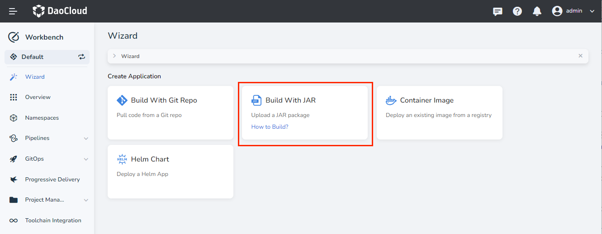
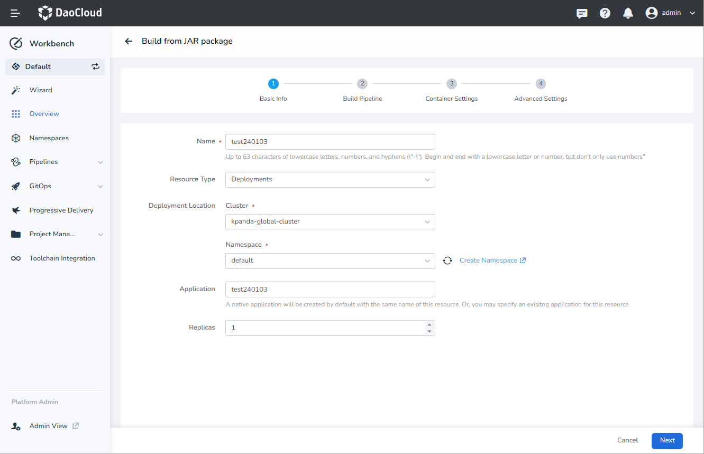
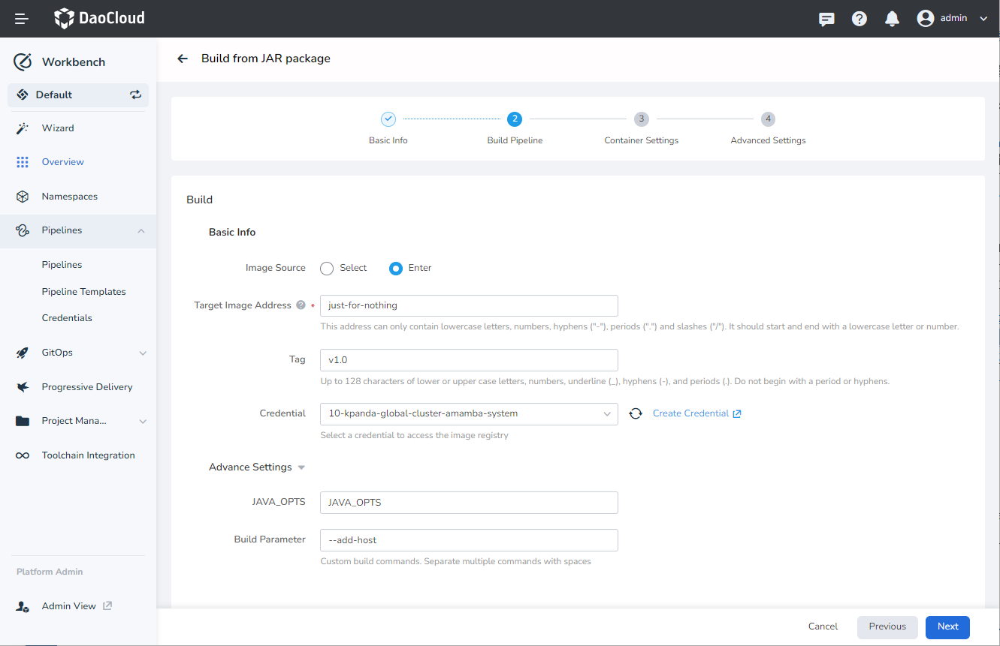
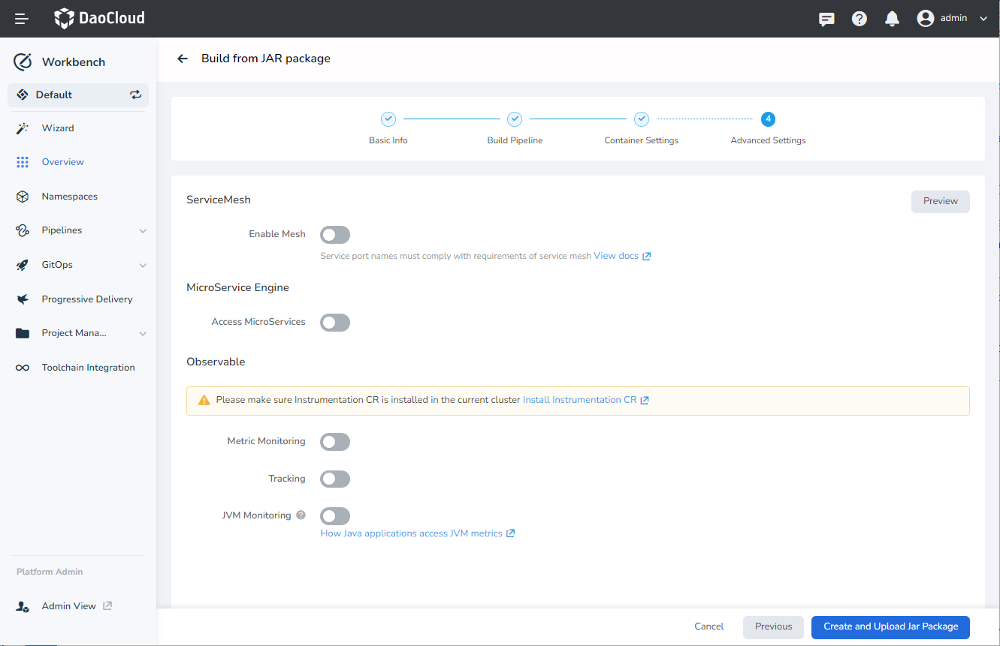
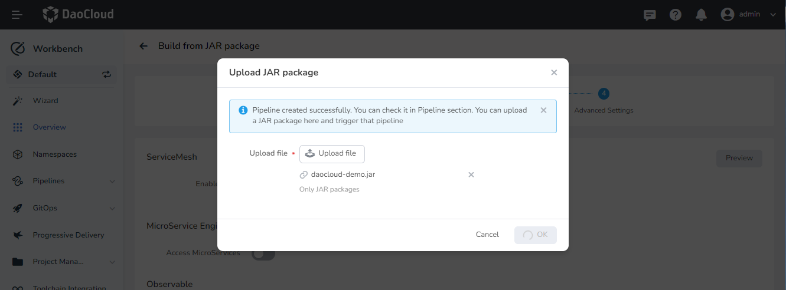
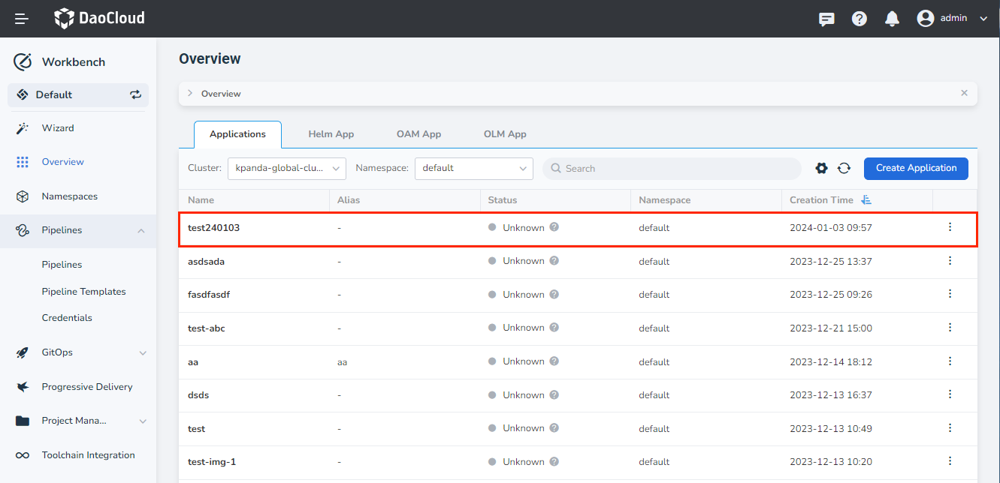

# Deploy Java Applications Based on Jar Packages

Workbench supports building applications in four ways: [Git Repo](create-app-git.md), Jar package, container image, and Helm chart. This article describes how to deploy a Java application via a Jar file.

## prerequisites

1. [Create a workspace](../../../ghippo/user-guide/workspace/workspace.md) and a [User](../../../ghippo/user-guide/access-control/user.md). The user needs to join this workspace and have the __Workspace Editor__ role.

2. [Create a credential](../pipeline/credential.md) for accessing the image repository, such as __registry__.

3. Prepare an image repository, like a Harbor repository.

4. Download [daocloud-demo.jar](https://github.com/huoyinghao/filedownload/raw/main/daocloud-demo.jar).

## Steps

1. Click __Wizards__ on the left navigation bar, and then select __Build With Jar__.

    

2. Fill in the basic information with reference to the following requirements, and then click __Next__.

    - Name: Maximum 63 characters, can only contain lowercase letters, numbers, and a separator ("-"), and must start and end with a lowercase letter or number.
    - Resource Type: Select whether the application to be created is a stateless load or a stateful load.
    - Deployment Location: Select which namespace under which cluster to deploy the application. Only clusters that exist in the current workspace can be selected.
    - Application: Select the group to which the application belongs. Empty means do not group this app.
    - Replicas: Set the number of Pods for the application.

        

3. Refer to the following requirements to configure the pipeline, and then click __Next__.

    - Target Image Address: Name the target image, including the storage path of the target image, for example __release-ci.daocloud.io/test-lfj/fromjar__.
    - Tag: Tag the target image, such as the version number __v1.0__.
    - Credential: Select the credential to access the registry, such as __registry-credential__.
    - JAVA_OPTS: Variables used to set JVM-related operating parameters, such as __-server -Xms2048m -Xmx2048m -Xss512k__.
    - Build Parameters: Build parameters will be passed to the build command in the form of __--build-arg__, which supports setting the upstream product download address and upstream mirror download address as parameters, and also supports custom arbitrary parameters.

        

4. Fill in the container configuration with reference to the following requirements, and click __Next__.

    - Access Mode: Support access to the application only within the cluster through clusterIP, or allow access outside the cluster through NodePort, or access through a load balancer.
    - Port Settings: fill in the port number that needs to be exposed according to the actual business scenario.

        > For more detailed instructions on service configuration, please refer to [Create Service](../../../kpanda/user-guide/network/create-services.md).

    - Resource Limit: CPU and memory quotas must not exceed the remaining resources in the current workspace of the application's namespace.

    - Lifecycle: Set the commands that need to be executed when the container starts, after it starts, and before it stops. For details, please refer to [Container Lifecycle Configuration](../../../kpanda/user-guide/workloads/pod-config/lifecycle.md).

    - Health Check: used to judge the health status of containers and applications, which helps to improve the availability of applications. For details, please refer to [Container Health Check Configuration](../../../kpanda/user-guide/workloads/pod-config/health-check.md).

    - Environment Variables: Configure container parameters in Pods, add environment variables or pass configurations to Pods, etc. For details, please refer to [Container environment variable configuration](../../../kpanda/user-guide/workloads/pod-config/env-variables.md).

    - Data Storage: Configure the settings for container mounted data volumes and data persistence.

        

5. Refer to the following instructions to choose whether to enable advanced features, and then click __Create and Upload Jar Package__.

    - Service Mesh: Choose whether to enable the [Service Mesh for DCE 5.0](../../../mspider/intro/index.md) module to govern microservice traffic.
    - Microservice Engine: Whether to connect the newly created application to the [DCE 5.0 Microservice Engine](../../../skoala/intro/index.md) module.
        > For the configuration of the microservice engine, please refer to [Build Microservice Application Based on Git Repository](create-app-git.md).
    - Observable: Select whether to enable grayscale publishing. For more information about canary release, please refer to [Canary Release](../release/canary.md).

        

6. Select the file to be uploaded and click __OK__.

    

7. After the creation is successful, the corresponding pipeline will be triggered to run. Click __Pipelines__ in the left navigation bar to view its running status.

    > The naming rule of the pipeline is "corresponding application name-random number". For example, the corresponding application name is __demo__ through the pipeline name __demo-4615a8__.

    

8. After the pipeline is successfully executed, click __Overview__ on the left navigation bar and select the __Applications__ tab to view the newly created app.

    
