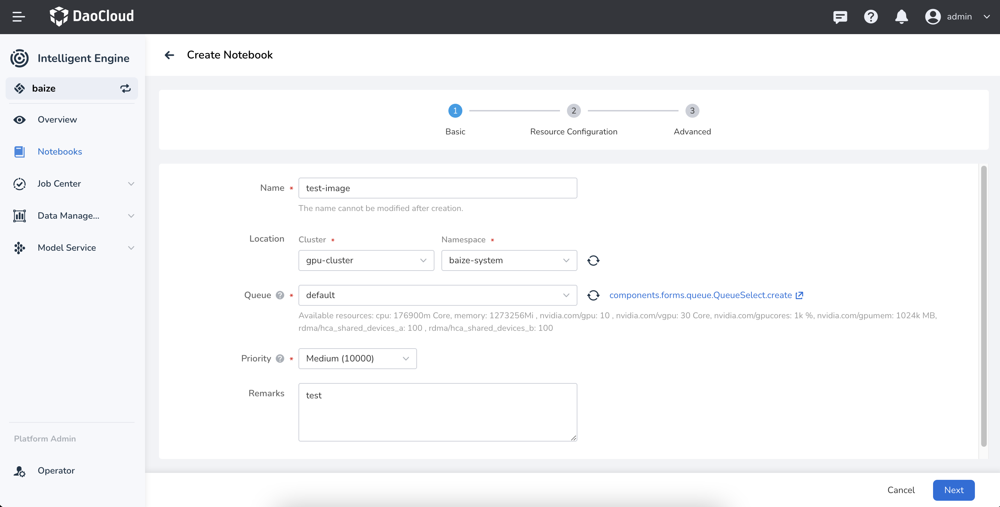
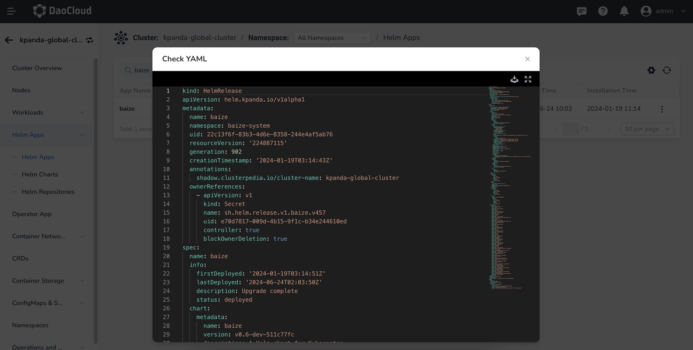

# Update Built-in Notebook Images

In the Notebook, multiple available base images are provided by default for developers to choose from.
In most cases, this will meet the developers' needs.



DaoCloud provides a default Notebook image that contains all necessary development tools and resources.

```markdown
baize/baize-notebook
```

This Notebook includes basic development tools. Taking `baize-notebook:v0.5.0` (May 30, 2024) as an example, the relevant dependencies and versions are as follows:

| Dependency    | Version  | Description                                               |
| ------------- | -------- | --------------------------------------------------------- |
| Ubuntu        | 22.04.3  | Default OS                                                |
| Python        | 3.11.6   | Default Python version                                    |
| pip           | 23.3.1   |                                                           |
| conda(mamba)  | 23.3.1   |                                                           |
| jupyterlab    | 3.6.6    | JupyterLab image, providing a complete Notebook experience |
| codeserver    | v4.89.1  | Mainstream Code development tool for a familiar experience |
| *baizectl     | v0.5.0   | DaoCloud built-in CLI task management tool                |
| *SSH          | -        | Supports local SSH direct access to the Notebook container |
| *kubectl      | v1.27    | Kubernetes CLI for managing container resources within Notebook |

!!! note

    With each version iteration, DCE 5.0 will proactively maintain and update.

However, sometimes users may need custom images. This page explains how to update images and add them to the Notebook creation interface for selection.

## Build Custom Images (For Reference Only)

!!! note

    Building a new image **requires using `baize-notebook` as the base image** to ensure the Notebook runs properly.

When building a custom image, it is recommended to first understand the Dockerfile of
the baize-notebook image to better understand how to build a custom image.

### Dockerfile for baize-notebook

```dockerfile
ARG BASE_IMG=docker.m.daocloud.io/kubeflownotebookswg/jupyter:v1.8.0

FROM $BASE_IMG

USER root

# install - useful linux packages
RUN export DEBIAN_FRONTEND=noninteractive \
 && apt-get -yq update \
 && apt-get -yq install --no-install-recommends \
    openssh-server git git-lfs bash-completion \
 && apt-get clean \
 && rm -rf /var/lib/apt/lists/*

# remove default s6 jupyterlab run script
RUN rm -rf /etc/services.d/jupyterlab

# install - useful jupyter plugins
RUN mamba install -n base -y jupyterlab-language-pack-zh-cn \
  && mamba clean --all -y

ARG CODESERVER_VERSION=v4.89.1
ARG TARGETARCH

RUN curl -fsSL "https://github.com/coder/code-server/releases/download/$CODESERVER_VERSION/code-server_${CODESERVER_VERSION/v/}_$TARGETARCH.deb" -o /tmp/code-server.deb \
  && dpkg -i /tmp/code-server.deb \
  && rm -f /tmp/code-server.deb

ARG CODESERVER_PYTHON_VERSION=2024.4.1
ARG CODESERVER_JUPYTER_VERSION=2024.3.1
ARG CODESERVER_LANGUAGE_PACK_ZH_CN=1.89.0
ARG CODESERVER_YAML=1.14.0
ARG CODESERVER_DOTENV=1.0.1
ARG CODESERVER_EDITORCONFIG=0.16.6
ARG CODESERVER_TOML=0.19.1
ARG CODESERVER_GITLENS=15.0.4

# configure for code-server extensions
# # https://github.com/kubeflow/kubeflow/blob/709254159986d2cc99e675d0fad5a128ddeb0917/components/example-notebook-servers/codeserver-python/Dockerfile
# # and
# # https://github.com/kubeflow/kubeflow/blob/709254159986d2cc99e675d0fad5a128ddeb0917/components/example-notebook-servers/codeserver/Dockerfile
RUN code-server --list-extensions --show-versions \
  && code-server --list-extensions --show-versions \
  && code-server \
    --install-extension MS-CEINTL.vscode-language-pack-zh-hans@$CODESERVER_LANGUAGE_PACK_ZH_CN \
    --install-extension ms-python.python@$CODESERVER_PYTHON_VERSION \
    --install-extension ms-toolsai.jupyter@$CODESERVER_JUPYTER_VERSION \
    --install-extension redhat.vscode-yaml@$CODESERVER_YAML \
    --install-extension mikestead.dotenv@$CODESERVER_DOTENV \
    --install-extension EditorConfig.EditorConfig@$CODESERVER_EDITORCONFIG \
    --install-extension tamasfe.even-better-toml@$CODESERVER_TOML \
    --install-extension eamodio.gitlens@$CODESERVER_GITLENS \
    --install-extension catppuccin.catppuccin-vsc-pack \
    --force \
  && code-server --list-extensions --show-versions

# configure for code-server
RUN mkdir -p /home/${NB_USER}/.local/share/code-server/User \
  && chown -R ${NB_USER}:users /home/${NB_USER} \
  && cat <<EOF > /home/${NB_USER}/.local/share/code-server/User/settings.json
{
  "gitlens.showWelcomeOnInstall": false,
  "workbench.colorTheme": "Catppuccin Mocha",
}
EOF

RUN mkdir -p /tmp_home/${NB_USER}/.local/share \
  && mv /home/${NB_USER}/.local/share/code-server /tmp_home/${NB_USER}/.local/share

# set ssh configuration
RUN mkdir -p /run/sshd \
 && chown -R ${NB_USER}:users /etc/ssh \
 && chown -R ${NB_USER}:users /run/sshd \
 && sed -i "/#\?Port/s/^.*$/Port 2222/g" /etc/ssh/sshd_config \
 && sed -i "/#\?PasswordAuthentication/s/^.*$/PasswordAuthentication no/g" /etc/ssh/sshd_config \
 && sed -i "/#\?PubkeyAuthentication/s/^.*$/PubkeyAuthentication yes/g" /etc/ssh/sshd_config \
 && rclone_version=v1.65.0 && \
       arch=$(uname -m | sed -E 's/x86_64/amd64/g;s/aarch64/arm64/g') && \
       filename=rclone-${rclone_version}-linux-${arch} && \
       wget http://10.6.100.13:8081/repository/github.com/rclone/rclone/releases/download/${rclone_version}/${filename}.zip -O ${filename}.zip && \
       unzip ${filename}.zip && mv ${filename}/rclone /usr/local/bin && rm -rf ${filename} ${filename}.zip

# Init mamba
RUN mamba init --system

# init baize-base environment for essential python packages
RUN mamba create -n baize-base -y python \
  && /opt/conda/envs/baize-base/bin/pip install tensorboard \
  && mamba clean --all -y \
  && ln -s /opt/conda/envs/baize-base/bin/tensorboard /usr/local/bin/tensorboard

# prepare baize-runtime-env directory
RUN mkdir -p /opt/baize-runtime-env \
  && chown -R ${NB_USER}:users /opt/baize-runtime-env

ARG APP
ARG PROD_NAME
ARG TARGETOS

COPY out/$TARGETOS/$TARGETARCH/data-loader /usr/local/bin/
COPY out/$TARGETOS/$TARGETARCH/baizectl /usr/local/bin/

RUN chmod +x /usr/local/bin/baizectl /usr/local/bin/data-loader && \
    echo "source /etc/bash_completion" >> /opt/conda/etc/profile.d/conda.sh && \
    echo "source <(baizectl completion bash)" >> /opt/conda/etc/profile.d/conda.sh && \
    echo "source <(kubectl completion bash)" >> /opt/conda/etc/profile.d/conda.sh && \
    echo '[ -f /run/baize-env ] && export $(cat /run/baize-env | xargs)' >> /opt/conda/etc/profile.d/conda.sh && \
    echo 'alias conda="mamba"' >> /opt/conda/etc/profile.d/conda.sh

USER ${NB_UID}
```

### Build Your Image

```dockerfile
ARG BASE_IMG=release.daocloud.io/baize/baize-notebook:v0.5.0

FROM $BASE_IMG
USER root

# Do Customization
RUN mamba install -n baize-base -y pytorch torchvision torchaudio cpuonly -c pytorch \
 && mamba install -n baize-base -y tensorflow \
 && mamba clean --all -y

USER ${NB_UID}
```

## Add to the Notebook Image List (Helm)

!!! warning

    Note that this must be done by the platform administrator. Be cautious with changes.

Currently, the image selector needs to be modified by updating the `Helm` parameters of `baize`. The specific steps are as follows:

In the `Helm Applications` list of the kpanda-global-cluster global management cluster,
find baize, enter the update page, and modify the Notebook image in the `YAML` parameters:



Note the parameter modification path `global.config.notebook_images`:

```yaml
...
global:
  ...
  config:
    notebook_images:
      ...
      names: release.daocloud.io/baize/baize-notebook:v0.5.0
      # Add your image information here
```

After the update is completed and the Helm application restarts successfully,
you can see the new image in the Notebook creation interface image selection.
