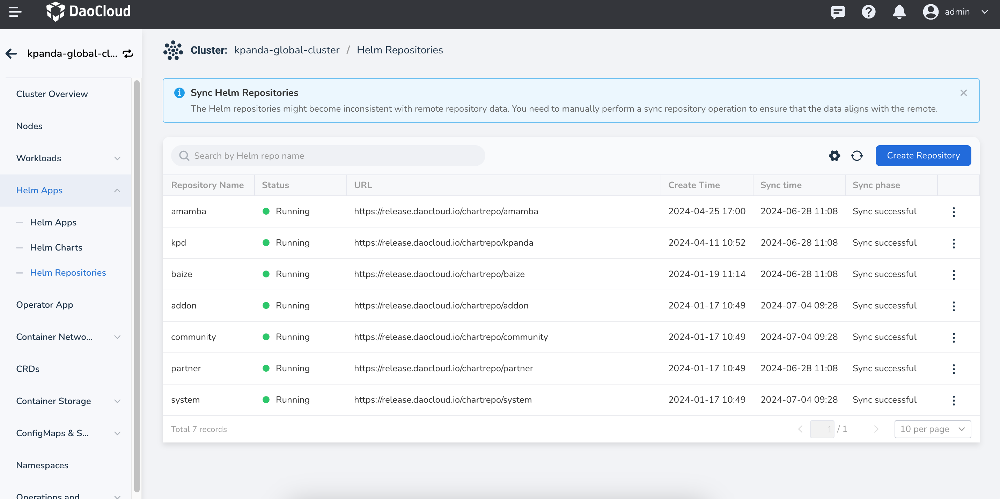

# Deploy Label Studio

!!! note

    Refer to the video tutorial: [Data Labeling and Dataset Usage Instructions](../../videos/baize.md#data-label-and-dataset)

[Label Studio](https://labelstud.io/) is an open-source data labeling tool used for various
machine learning and artificial intelligence jobs. Here is a brief introduction to Label Studio:

- Supports labeling of various data types including images, audio, video, and text
- Can be used for jobs such as object detection, image classification, speech transcription,
  and named entity recognition
- Provides a customizable labeling interface
- Supports various labeling formats and export options

Label Studio offers a powerful data labeling solution for data scientists and
machine learning engineers due to its flexibility and rich features.

## Deploy to DCE 5.0

To use Label Studio in AI Lab, it needs to be deployed to the
[Global Service Cluster](../../kpanda/user-guide/clusters/cluster-role.md#global-service-cluster).
You can quickly deploy it using Helm.

!!! note

    For more deployment details, refer to [Deploy Label Studio on Kubernetes](https://labelstud.io/guide/install_k8s).

1. Enter the Global Service Cluster, find __Helm Apps__ -> __Helm Repositories__ from the left navigation bar,
   click the __Create Repository__ button, and fill in the following parameters:

    

    

1. After successfully adding the repository, click the __┇__ on the right side of the list and
   select __Sync Repository__. Wait a moment to complete the synchronization.
   (This sync operation will also be used for future updates of Label Studio).

    

1. Then navigate to the __Helm Charts__ page, search for `label-studio`, and click the card.

    <!-- add image later -->

1. Choose the latest version and configure the installation parameters as shown below,
   naming it `label-studio`. It is recommended to create a new namespace. Switch the
   parameters to `YAML` and modify the configuration according to the instructions.

    ```yaml
    global:
      image:
        repository: heartexlabs/label-studio   # Configure proxy address here if docker.io is inaccessible
      extraEnvironmentVars:
        LABEL_STUDIO_HOST: https://{DCE_Access_Address}/label-studio    # Use the DCE 5.0 login address, refer to the current webpage URL
        LABEL_STUDIO_USERNAME: {User_Email}    # Must be an email, replace with your own
        LABEL_STUDIO_PASSWORD: {User_Password}
    app:
      nginx:
        livenessProbe:
          path: /label-studio/nginx_health
        readinessProbe:
          path: /label-studio/version
    ```

    <!-- add image later -->

At this point, the installation of Label Studio is complete.

!!! warning

    By default, PostgreSQL will be installed as the data service middleware. If the image pull fails,
    it may be because `docker.io` is inaccessible. Ensure to switch to an available proxy.

> If you have your own PostgreSQL data service middleware, you can use the following parameters:

```yaml
global:
  image:
    repository: heartexlabs/label-studio   # Configure proxy address here if docker.io is inaccessible
  extraEnvironmentVars:
    LABEL_STUDIO_HOST: https://{DCE_Access_Address}/label-studio    # Use the DCE 5.0 login address, refer to the current webpage URL
    LABEL_STUDIO_USERNAME: {User_Email}    # Must be an email, replace with your own
    LABEL_STUDIO_PASSWORD: {User_Password}
app:
  nginx:
    livenessProbe:
      path: /label-studio/nginx_health
    readinessProbe:
      path: /label-studio/version
postgresql:
  enabled: false  # Disable the built-in PostgreSQL
externalPostgresql:
  host: "postgres-postgresql"  # PostgreSQL address
  port: 5432
  username: "label_studio"  # PostgreSQL username
  password: "your_label_studio_password"  # PostgreSQL password
  database: "label_studio"  # PostgreSQL database name
```

## Add GProduct to Navigation Bar

To add Label Studio to the DCE 5.0 navigation bar, you can refer to the method in
[Global Management OEM IN](../../ghippo/best-practice/oem/oem-in.md).
The following example shows how to add it to the secondary navigation of AI Lab.

### Add Proxy Access

```yaml
apiVersion: ghippo.io/v1alpha1
kind: GProductProxy
metadata:
  name: label-studio
spec:
  gproduct: label-studio
  proxies:
  - authnCheck: false
    destination:
      host: label-studio-ls-app.label-studio.svc.cluster.local
      port: 80
    match:
      uri:
        prefix: /label-studio
```

### Add to AI Lab

Modify the CRD for `GProductNavigator` CR `baize`, then make the following changes:

```yaml
apiVersion: ghippo.io/v1alpha1
kind: GProductNavigator
metadata:
  labelings:
    meta.helm.sh/release-name: baize
    meta.helm.sh/release-namespace: baize-system
  labels:
    app.kubernetes.io/managed-by: Helm
    gProductName: baize
  name: baize
spec:
  category: cloudnativeai
  gproduct: baize
  iconUrl: ./ui/baize/logo.svg
  isCustom: false
  localizedName:
    en-US: AI Lab
    zh-CN: AI Lab
  menus:
    - iconUrl: ''
      isCustom: false
      localizedName:
        en-US: AI Lab
        zh-CN: AI Lab
      name: workspace-view
      order: 1
      url: ./baize
      visible: true
    - iconUrl: ''
      isCustom: false
      localizedName:
        en-US: Operator
        zh-CN: 运维管理
      name: admin-view
      order: 1
      url: ./baize/admin
      visible: true
    # Start adding
    - iconUrl: ''
      localizedName:
        en-US: Data Labeling
        zh-CN: 数据标注
      name: label-studio
      order: 1
      target: blank    # Control new blank page
      url: https://{DCE_Access_Address}/label-studio    # url to access
      visible: true
    # End adding
  name: AI Lab
  order: 10
  url: ./baize
  visible: true
```

### Adding Effect


## Conclusion

The above describes how to add Label Studio and integrate it as an labeling component in
AI Lab. By adding labels to the datasets in AI Lab, you can associate
it with algorithm development and improve the algorithm development process.
For further usage, refer to relevant documentation.
