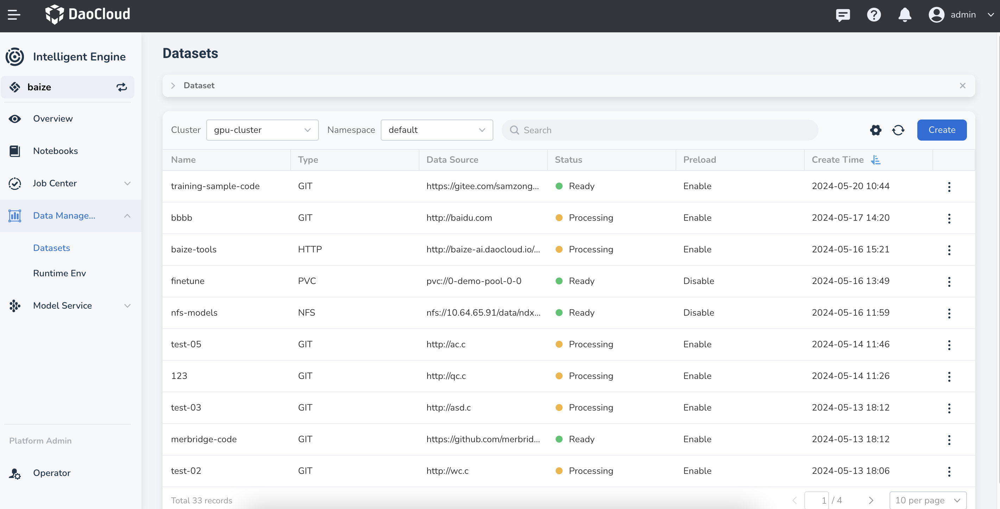
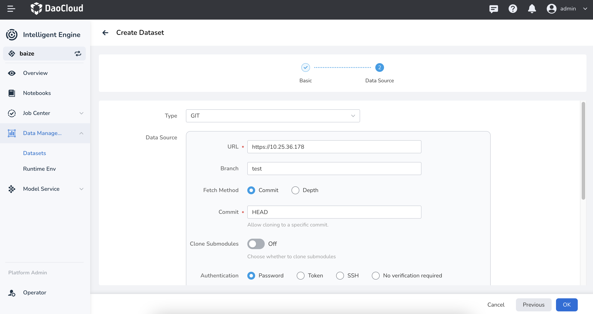
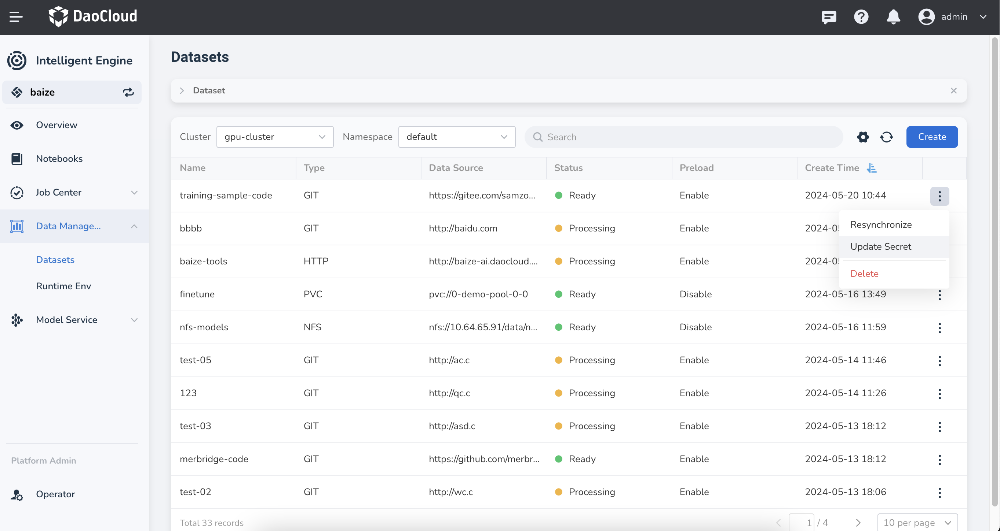
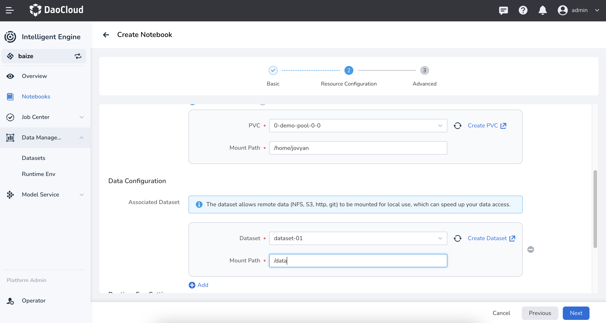
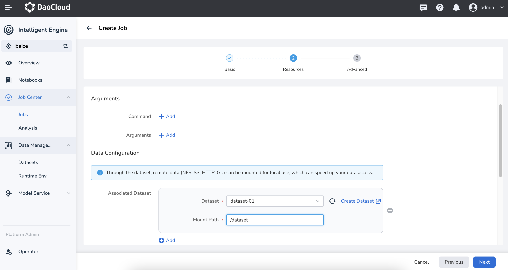
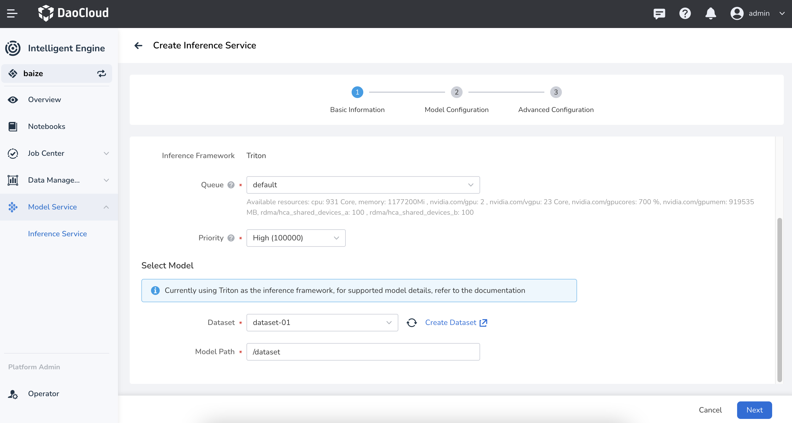

# Create and Use Datasets

Intelligent Engine provides comprehensive dataset management functions needed for model development, training, and inference processes. Currently, it supports unified access to various data sources.

With simple configurations, you can connect data sources to Intelligent Engine, achieving unified data management, preloading, dataset management, and other functionalities.

## Create a Dataset

1. In the left navigation bar, click **Data Management** -> **Datasets**, and then click the **Create** button on the right.

    

2. Select the working cluster and namespace to which the dataset belongs, then click **Next**.

    

3. Configure the data source type for the target data, then click **OK**.

    

    Currently supported data sources include:

    - GIT: Supports repositories such as GitHub, GitLab, Gitee, etc.
    - S3: Supports object storage like Amazon Cloud
    - HTTP: Directly input a valid HTTP URL
    - PVC: Supports pre-created Kubernetes PersistentVolumeClaim
    - NFS: Supports NFS shared storage

4. Upon successful creation, the dataset will be returned to the dataset list.
   You can perform more actions by clicking **⋮** on the right.

    

!!! info

    The system will automatically perform a one-time data preloading after the dataset is successfully created; the dataset cannot be used until the preloading is complete.

## Use Dataset

Once the dataset is successfully created, it can be used in tasks such as model training and inference.

### Use in Notebook

In creating a Notebook, you can directly use the dataset; the usage is as follows:

- Use the dataset as training data mount
- Use the dataset as code mount

### Use in Training obs

- Use the dataset to specify job output
- Use the dataset to specify job input
- Use the dataset to specify TensorBoard output

### Use in Inference Services

- Use the dataset to mount a model

