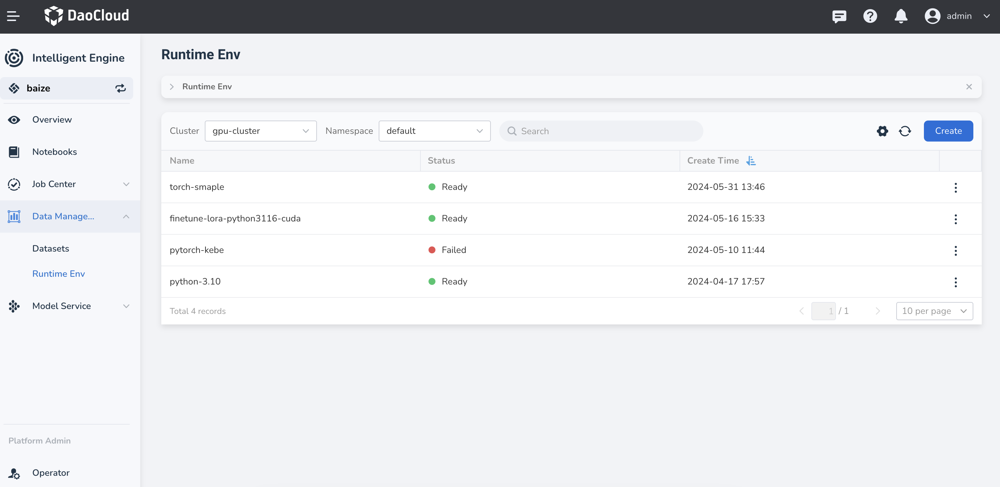
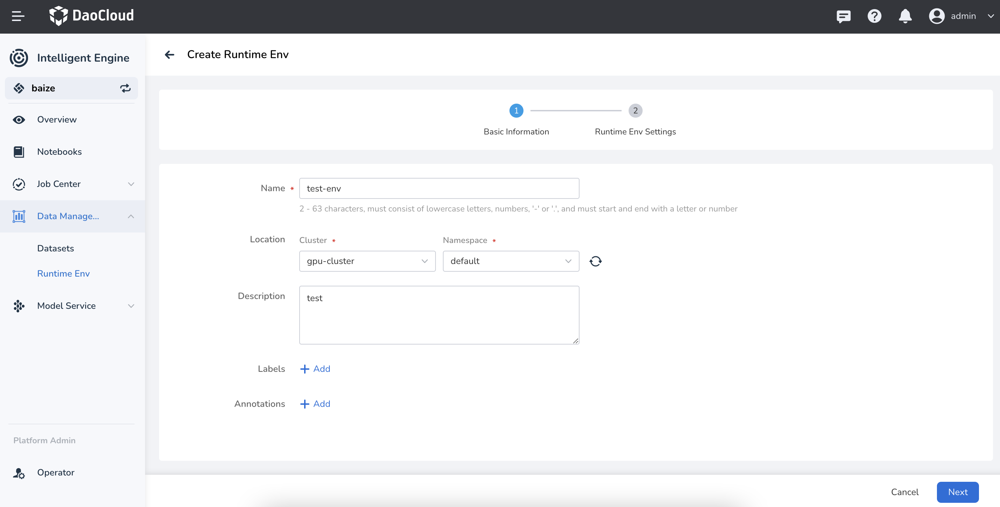
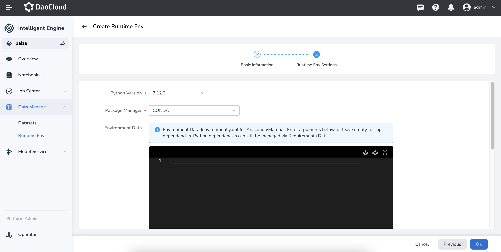

# Manage Python Environment Dependencies

This document aims to guide users on managing environment dependencies using DCE AI Lab. Below are the specific steps and considerations.

1. [Overview](#overview)
2. [Create a New Environment](#create-a-new-environment)
3. [Configure Environment](#configure-environment)
4. [Troubleshooting](#troubleshooting)

## Overview

Traditionally, Python environment dependencies are built into an image, which includes the Python version
and dependency packages. This approach has high maintenance costs and is inconvenient to update, often requiring a complete rebuild of the image.

In DCE AI Lab, users can manage pure environment dependencies through the
**Environment Management** module, decoupling this part from the image. The advantages include:

- One environment can be used in multiple places, such as in Notebooks, distributed training tasks, and even inference services.
- Updating dependency packages is more convenient; you only need to update the environment dependencies without rebuilding the image.

The main components of the environment management are:

- **Cluster** : Select the cluster to operate on.
- **Namespace** : Select the namespace to limit the scope of operations.
- **Environment List** : Displays all environments and their statuses under the current cluster and namespace.



| Field | Description | Example Value |
|-----|------|-------|
| Name | The name of the environment. | my-environment |
| Status | The current status of the environment (normal or failed). New environments undergo a warming-up process, after which they can be used in other jobs. | Normal |
| Python Version | The current Python version of the environment. | 3.12.3 |
| Package Manager | The current package management tool of the environment. | CONDA |
| Namespace | The current namespace of the environment. | `default` |
| Creation Time | The time the environment was created. | 2023-10-01 10:00:00 |

## Create a New Environment

On the **Environment Management** interface, click the **Create** button at the top right
to enter the environment creation process.



| Field | Description | Example Value |
|-----|------|------|
| Name | Enter the name of the environment. The name is 2-63 characters long and must start and end with a lowercase letter or a digit. | my-environment |
| Deployment Location | **Cluster** : Select the cluster to deploy. | `gpu-cluster` |
| | **Namespace** : Select the namespace. | `default` |
| Remarks | Enter the remarks. | This is a test environment |
| Labels | Add labels to the environment. | env:test |
| Annotations | Add annotations to the environment. After completing the information, click **Next** to proceed to environment configuration. | Annotation example |

## Configure Environment

In the environment configuration step, users need to configure the Python version and dependency management tool.



| Field | Description | Example Value |
|-----|-----|--------|
| Python Version | Select the required Python version. | 3.12.3 |
| Package Manager | Select the package management tool, either `PIP` or `CONDA`. | PIP |
| Environment Data | If `PIP` is selected: Enter the dependency package list in `requirements.txt` format in the editor below. | numpy==1.21.0 |
| | If `CONDA` is selected: Enter the dependency package list in `environment.yaml` format in the editor below. | |
| Other Options | **Additional pip Index URLs** : Configure additional pip index URLs; suitable for internal enterprise private repositories or PIP acceleration sites. | `https://pypi.example.com` |
| | **GPU Configuration** : Enable or disable GPU configuration; some GPU-related dependency packages need GPU resources configured during preloading. | Enabled |
| | **Associated Storage** : Select the associated storage configuration; environment dependency packages will be stored in the associated storage. **Note: Storage must support `ReadWriteMany`.** | my-storage-config |
| | **Data Storage Size** : Enable or disable the data storage size setting; reasonably evaluate the data volume to avoid wasting storage resources; if not configured by default, it is unlimited (100 TB). | Enabled |
| | **Recommended pip Mirrors** : In mainland China, you can use mirrors such as Tsinghua TUNA (`https://pypi.tuna.tsinghua.edu.cn/simple`) or Aliyun (`https://mirrors.aliyun.com/pypi/simple`) to improve the download speed. | |

After configuration, click the **Create** button, and the system will automatically create and configure the new Python environment.

### Example Dependency Files

You can refer to the following templates when filling in the editor. The platform automatically writes the environment name and Python version, so you do not need to specify them manually.

In mainland China network environments, you can prioritize domestic Conda mirror sources (such as Tsinghua TUNA and Aliyun) to improve the dependency download speed.

```yaml title="environment.yaml"
channels:
  - defaults
  - https://mirrors.tuna.tsinghua.edu.cn/anaconda/pkgs/main
dependencies:
  - pytorch=2.2
  - torchvision
  - torchaudio
  - pip
  - pip:
      - numpy==1.24.4
      - matplotlib>=3.8
```

```txt title="requirements.txt"
torch==2.2.0
torchvision==0.17.0
torchaudio==2.2.0
numpy>=1.24
matplotlib>=3.8
```

## Troubleshooting

- If environment creation fails:
    - Check if the network connection is normal.
    - Verify that the Python version and package manager configuration are correct.
    - Ensure the selected cluster and namespace are available.

- If dependency preloading fails:
    - Check if the `requirements.txt` or `environment.yaml` file format is correct.
    - Verify that the dependency package names and versions are correct. If other issues arise, contact the platform administrator or refer to the platform help documentation for more support.

---

These are the basic steps and considerations for managing Python dependencies in DCE AI Lab.
