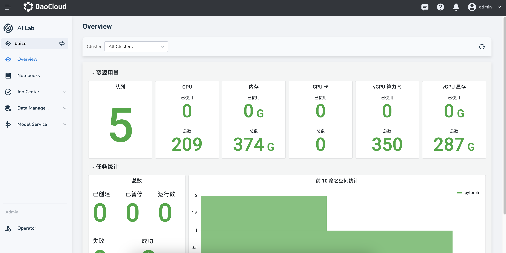

---
hide:
  - toc
---

# Developer Console

The Developer Console is where developers run daily tasks such as AI inference and large language model training.

The overview provides a quick snapshot of the current workspace’s resources and usage,
including details on GPU resources, notebooks, tasks, and datasets.
