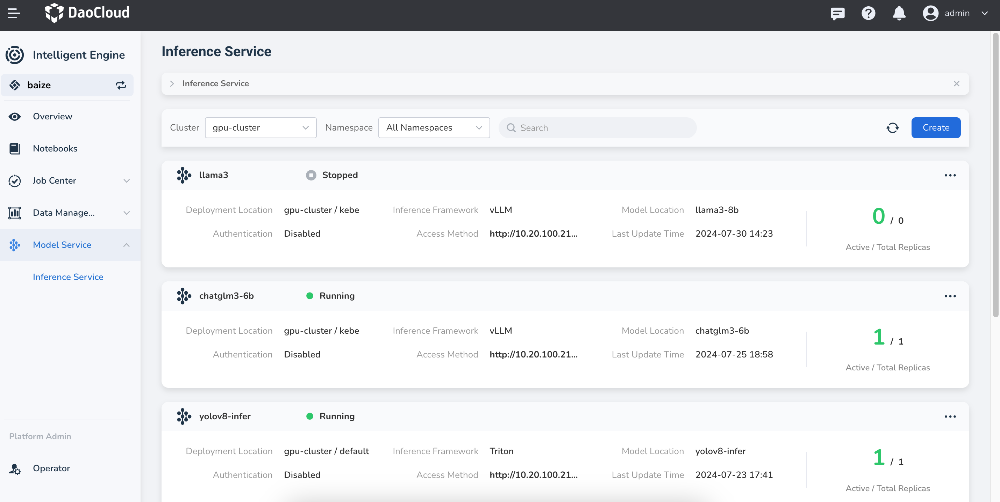

# Model Support

With the rapid iteration of AI Lab, we have now supported various model inference services.
Here, you can see information about the supported models.

- AI Lab v0.3.0 launched model inference services, facilitating users to directly use
  the inference services of AI Lab without worrying about model deployment and maintenance
  for traditional deep learning models.
- AI Lab v0.6.0 supports the complete version of vLLM inference capabilities,
  supporting many large language models such as `LLama`, `Qwen`, `ChatGLM`, and more.

!!! note

    The support for inference capabilities is related to the version of AI Lab.
    Refer to the [Release Notes](../../intro/release-notes.md) to understand the latest version and update timely.

You can use GPU types that have been verified by DCE 5.0 in AI Lab.
For more details, refer to the [GPU Support Matrix](../../../kpanda/user-guide/gpu/gpu_matrix.md).

## Triton Inference Server

Through the Triton Inference Server, traditional deep learning models can be well supported.
Currently, AI Lab supports mainstream inference backend services:

| Backend | Supported Model Formats | Description |
| ------- | ----------------------- | ----------- |
| pytorch | TorchScript, PyTorch 2.0 formats | [triton-inference-server/pytorch_backend](https://github.com/triton-inference-server/pytorch_backend) |
| tensorflow | TensorFlow 2.x | [triton-inference-server/tensorflow_backend](https://github.com/triton-inference-server/tensorflow_backend) |
| vLLM (Deprecated) | TensorFlow 2.x | [triton-inference-server/tensorflow_backend](https://github.com/triton-inference-server/tensorflow_backend) |

!!! danger

    The use of Triton's Backend vLLM method has been deprecated.
    It is recommended to use the latest support for vLLM to deploy your large language models.

## vLLM

With vLLM, we can quickly use large language models. Here,
you can see the list of models we support, which generally aligns with the `vLLM Support Models`.

- HuggingFace Models: We support most of HuggingFace's models. You can see more models at the
  [HuggingFace Model Hub](https://huggingface.co/models).
- The [vLLM Supported Models](https://docs.vllm.ai/en/stable/models/supported_models.html)
  list includes supported large language models and vision-language models.
- Models fine-tuned using the vLLM support framework.

### New Features of vLLM

Currently, AI Lab also supports some new features when using vLLM as an inference tool:

- Enable `Lora Adapter` to optimize model inference services during inference.
- Provide a compatible `OpenAPI` interface with `OpenAI`, making it easy for users
  to switch to local inference services at a low cost and quickly transition.
