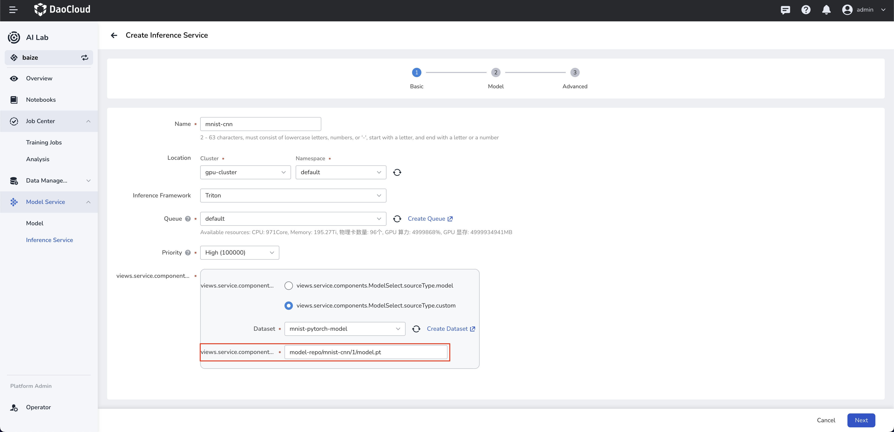
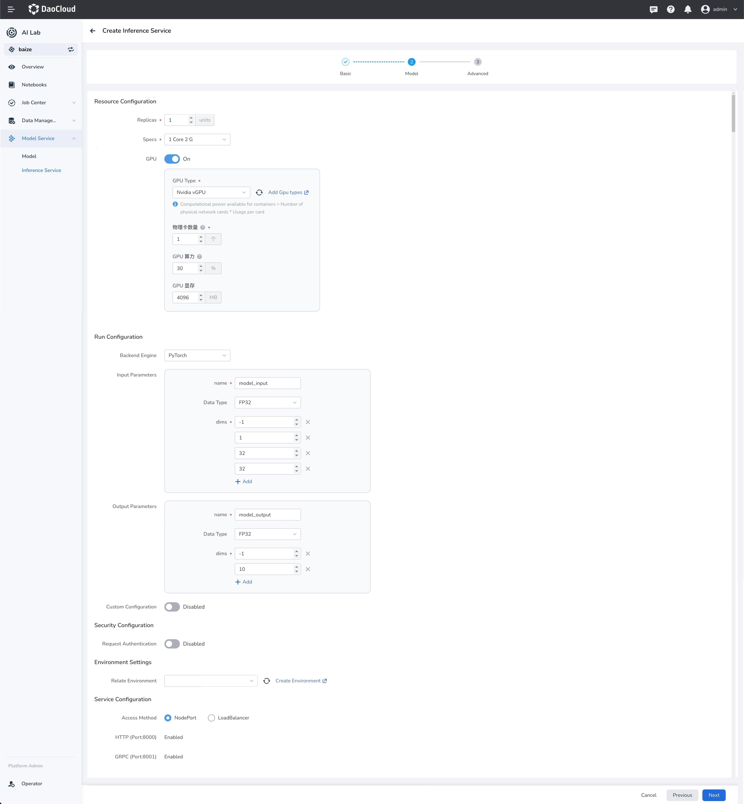
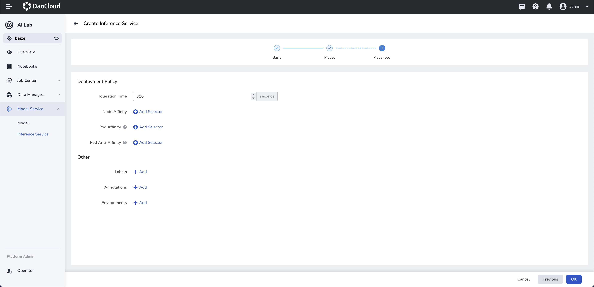
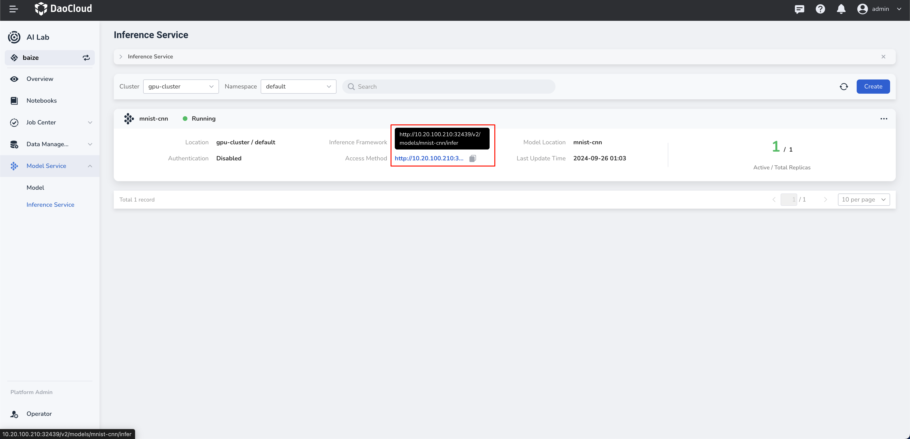

# Create Inference Service Using Triton Framework

The AI Lab currently offers Triton and vLLM as inference frameworks. Users can quickly start a high-performance inference service with simple configurations.

!!! danger

    The use of Triton's Backend vLLM method has been deprecated.
    It is recommended to use the latest support for vLLM to deploy your large language models.

## Introduction to Triton

Triton is an open-source inference server developed by NVIDIA, designed to simplify the deployment and inference of machine learning models. It supports a variety of deep learning frameworks, including TensorFlow and PyTorch, enabling users to easily manage and deploy different types of models.

## Prerequisites

Prepare model data: Manage the model code in dataset management and ensure that the data is successfully preloaded. The following example illustrates the PyTorch model for mnist handwritten digit recognition.

!!! note

    The model to be inferred must adhere to the following directory structure within the dataset:

    ```bash
      <model-repository-name>
      └── <model-name>
         └── <version>
            └── <model-definition-file>
    ```

The directory structure in this example is as follows:

```bash
    model-repo
    └── mnist-cnn
        └── 1
            └── model.pt
```

## Create Inference Service

Currently, form-based creation is supported, allowing you to create services with field prompts in the interface.



### Configure Model Path

The model path `model-repo/mnist-cnn/1/model.pt` must be consistent with the directory structure of the dataset.

## Model Configuration



### Configure Input and Output Parameters

!!! note

    The first dimension of the input and output parameters defaults to `batchsize`, setting it to `-1` allows for the automatic calculation of the batchsize based on the input inference data. The remaining dimensions and data type must match the model's input.

### Configure Environment

You can import the environment created in [Manage Python Environment Dependencies](../dataset/environments.md) to serve as the runtime environment for inference.

## Advanced Settings



### Configure Authentication Policy

Supports API key-based request authentication. Users can customize and add authentication parameters.

### Affinity Scheduling

Supports automated affinity scheduling based on GPU resources and other node configurations. It also allows users to customize scheduling policies.

## Access



<!-- The model inference service provides multiple access methods by default, enabling clients to interact with the inference service through different protocols. You can access the service in the following ways:

1. **HTTP/REST API**

   - Triton provides a REST-based API, allowing clients to perform model inference via HTTP POST requests.
   - Clients can send requests with JSON-formatted bodies containing input data and related metadata.

2. **gRPC API**

   - Triton also provides a gRPC interface, a high-performance, open-source, general-purpose RPC framework.
   - gRPC supports streaming, making it more efficient for handling large amounts of data.

3. **C++ and Python Client Libraries**

   - Triton offers client libraries for C++ and Python, making it more convenient to write client code in these languages.
   - The client libraries encapsulate the details of HTTP/REST and gRPC, providing simple function calls to perform inference.

Each access method has its specific use cases and advantages. For instance, HTTP/REST API is typically used for simple and cross-language scenarios, while gRPC is suitable for high-performance and low-latency applications. The C++ and Python client libraries offer richer functionality and better performance, ideal for deep integration in these language environments. -->

### API Access

- Triton provides a REST-based API, allowing clients to perform model inference via HTTP POST requests.
- Clients can send requests with JSON-formatted bodies containing input data and related metadata.

#### HTTP Access

1. **Send HTTP POST Request**: Use tools like `curl` or HTTP client libraries (e.g., Python's `requests` library) to send POST requests to the Triton Server.

2. **Set HTTP Headers**: Configuration generated automatically based on user settings, include metadata about the model inputs and outputs in the HTTP headers.

3. **Construct Request Body**: The request body usually contains the input data for inference and model-specific metadata.


##### Example curl Command

```bash
  curl -X POST "http://<ip>:<port>/v2/models/<inference-name>/infer" \
  -H "Content-Type: application/json" \
  -d '{
    "inputs": [
      {
        "name": "model_input",            
        "shape": [1, 1, 32, 32],          
        "datatype": "FP32",               
        "data": [
          [0.1234, 0.5678, 0.9101, ... ]  
        ]
      }
    ]
  }'
```

- `<ip>` is the host address where the Triton Inference Server is running.
- `<port>` is the port where the Triton Inference Server is running.
- `<inference-name>` is the name of the inference service that has been created.
- `"name"` must match the `name` of the input parameter in the model configuration.
- `"shape"` must match the `dims` of the input parameter in the model configuration.
- `"datatype"` must match the `Data Type` of the input parameter in the model configuration.
- `"data"` should be replaced with the actual inference data.

<!-- #### gRPC Access

1. **Generate Client Code**: Use the model definition files provided by Triton (usually `.pbtxt` files) to generate gRPC client code.

2. **Create gRPC Client Instance**: Use the generated code to create a gRPC client instance.

3. **Send gRPC Request**: Construct a gRPC request that includes the model input data.

4. **Receive Response**: Wait for the server to process the request and receive the response.

##### Example gRPC Access Code

```python
from triton_client.grpc import *
from triton_client.utils import *

# Initialize gRPC client
try:
    triton_client = InferenceServerClient('localhost:8001')
except Exception as e:
    logging.error("failed to create gRPC client: " + str(e))

# Construct input data
model_name = 'chatglm2-6b'
input_data = ...  # Your model input data

# Create input and output
inputs = [InferenceServerClient.Input('input_names', input_data.shape, "TYPE")]
outputs = [InferenceServerClient.Output('output_names')]

# Send inference request
results = triton_client.infer(model_name, inputs, outputs)

# Get inference result
output_data = results.as_numpy('output_names')
```

- `localhost:8001` is the default gRPC port for Triton; change it if configured differently.
- `input_data` is your model input data, which needs to be preprocessed according to the model requirements.
- `TYPE` is the data type of the model input, such as `FP32` and `INT32`. -->

Please note that the above example code needs to be adjusted according to your specific model and environment. The format and content of the input data must also comply with the model's requirements.

<!-- ### Web UI Access (Coming Soon)

> Web UI access is under development, stay tuned. -->