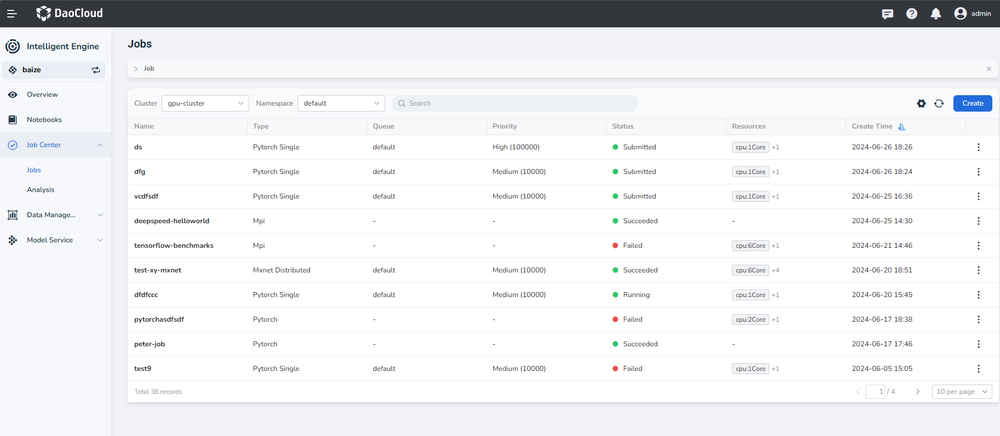
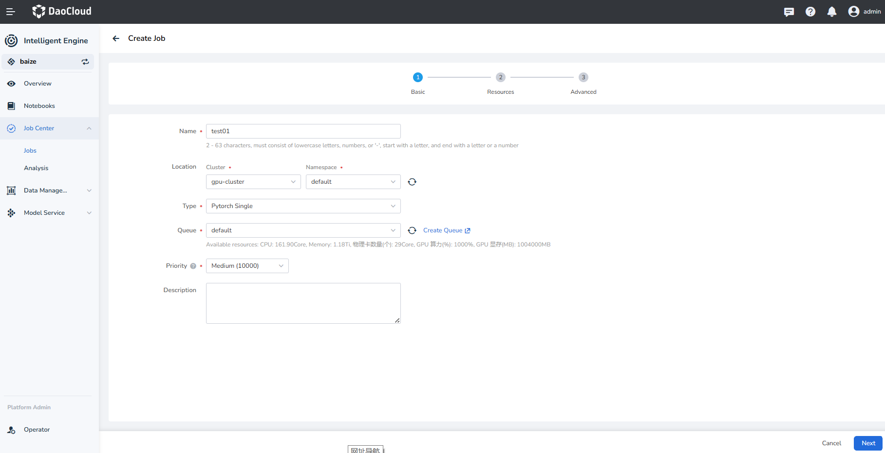
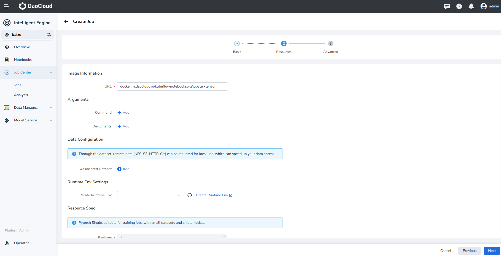
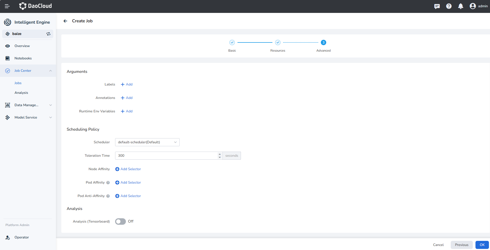

# Create Job

Job management refers to the functionality of creating and managing job lifecycles through job scheduling 
and control components.

DCE 5.0 Smart Computing Capability adopts Kubernetes' Job mechanism to schedule various AI inference and 
training jobs.

1. Click **Job Center** -> **Jobs** in the left navigation bar to enter the job list. Click the **Create** button 
   on the right.

    

2. The system will pre-fill basic configuration data, including the cluster, namespace, type, queue, priority, etc. 
   Adjust these parameters and click **Next**.

    

3. Configure the URL, runtime parameters, and associated datasets, then click **Next**.

    

4. Optionally add labels, annotations, runtime env variables, and other job parameters. Select a scheduling policy 
   and click **Confirm**.

    

5. After the job is successfully created, it will have several running statuses:

    - Running
    - Queued
    - Submission successful, Submission failed
    - Successful, Failed

## Next Steps

- [View Job Load](./view.md)
- [Delete Job](./delete.md)
