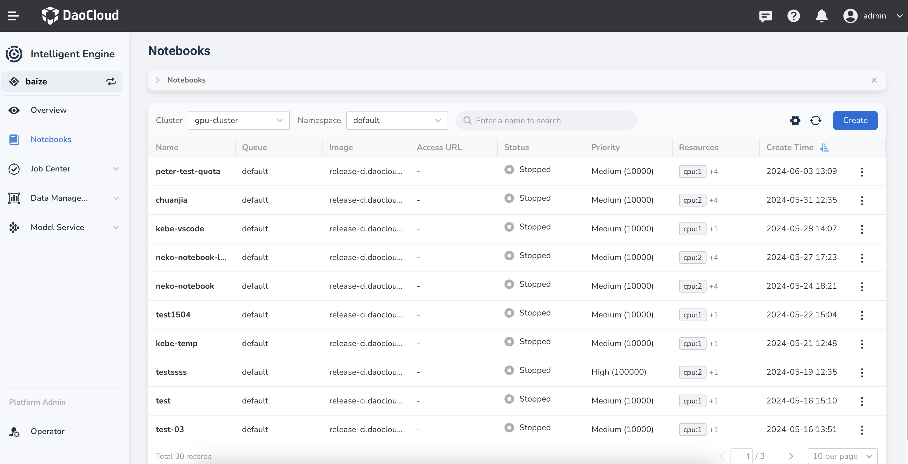
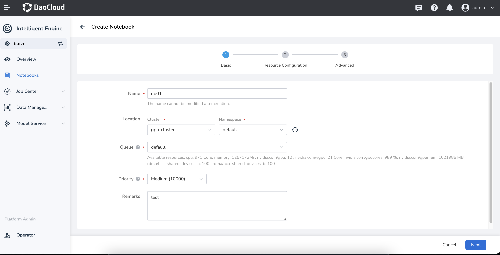

# Create Notebook

Notebook provides an online web interactive programming environment, making it convenient for developers to quickly conduct data science and machine learning experiments.

Upon entering the developer console, developers can create and manage Notebooks in different clusters and namespaces.

1. Click **Notebooks** in the left navigation bar to enter the Notebook list. Click the **Create** button on the right.

    

2. The system will pre-fill basic configuration data, including the cluster, namespace,
   queue, priority, resources, and job arguments. Adjust these arguments and click **OK**.

    

3. The newly created Notebook will initially be in the **Pending** state, and will change to **Running**
   after a moment, with the latest one appearing at the top of the list by default.

    

4. Click the **⋮** on the right side to perform more actions: update arguments, start/stop, view workload details, and delete.

!!! note

    If you choose pure CPU resources and find that all GPU cards on the node are mounted,
    you can try adding the following container environment variable to resolve this issue:

    ```config
    NVIDIA_VISIBLE_DEVICES=""
    ```
