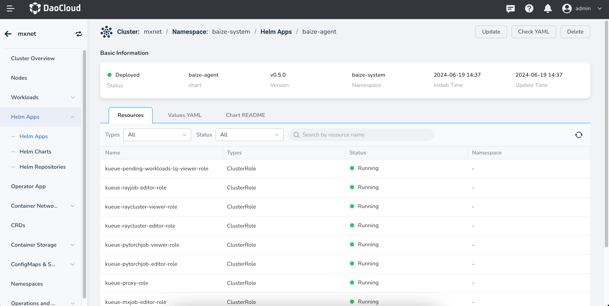
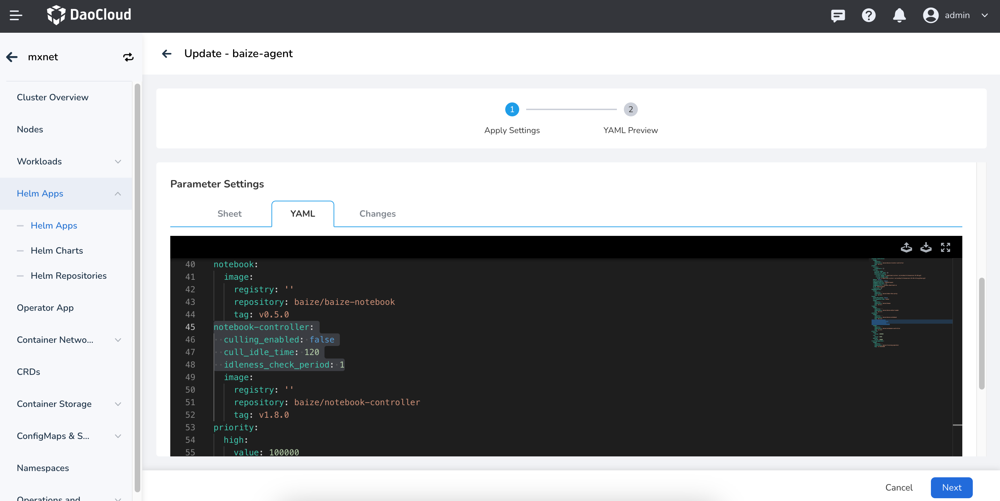

# Automatic Shutdown of Idle Notebooks

To optimize resource usage, the smart computing system automatically shuts down idle notebooks
after a period of inactivity. This helps free up resources when a notebook is not in use.

- **Advantages**: This feature significantly reduces resource waste from long periods of inactivity,
  enhancing overall efficiency.
- **Disadvantages**: Without proper backup strategies in place, this may lead to potential data loss.

!!! note

    This feature is enabled by default at the cluster level, with a default timeout of 30 minutes.

## Change Configurations

Currently, configuration changes must be made manually, but more convenient options will be available in the future.

To modify the deployment parameters of `baize-agent` in your worker cluster, update the Helm application.

### Modify on UI

1. In the clusters page, locate your worker cluster, go to its details,
   select __Helm Apps__, and find `baize-agent` under the `baize-system` namespace, Click __Update__ on the upper right corner.

    

2. Adjust YAML as shown below:

    

    ```yaml
    ...
    notebook-controller:
      culling_enabled: false
      cull_idle_time: 120
      idleness_check_period: 1
    ...
    ```

3. After confirming the changes, click __Next__ and __OK__ .

### Modify on CLI

In the console, use the `helm upgrade` command to change the configuration:

```bash
# Set version number
export VERSION=0.8.0

# Update Helm Chart 
helm upgrade --install baize-agent baize/baize-agent \
    --namespace baize-system \
    --create-namespace \
    --set global.imageRegistry=release.daocloud.io \
    --set notebook-controller.culling_enabled=true \    # Enable automatic shutdown (default: true)
    --set notebook-controller.cull_idle_time=120 \      # Set idle timeout to 120 minutes (default: 30 minutes)
    --set notebook-controller.idleness_check_period=1 \ # Set check interval to 1 minute (default: 1 minute)
    --version=$VERSION
```

!!! note

    To prevent data loss after an automatic shutdown, upgrade to v0.8.0 or higher
    and enable the auto-save feature in your notebook configuration.
