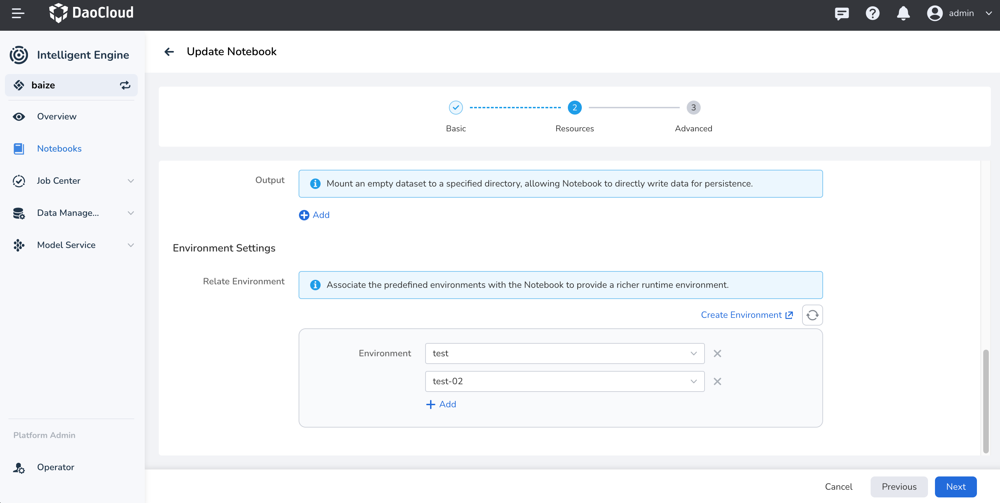

# Use Environments in Notebooks

Environment management is one of the key features of AI Lab. By associating an environment
in a **Notebook** , you can quickly switch between different environments, making it easier for them to develop and debug.

## Select an Environment When Creating a Notebook

When creating a **Notebook**, you can select one or more environments.
If there isn’t a suitable environment, you can create a new one in **Environments** .



> For instructions on how to create an environment, refer to [Environments](../dataset/environments.md).

## Use Environments in Notebooks

!!! note

    In the Notebook, both `conda` and `mamba` are provided as environment management tools.
    You can choose the appropriate tool based on their needs.

In AI Lab, you can use the `conda` environment management tool.
You can view the list of current environments in the Notebook by using the command `!conda env list`.

```bash
(base) jovyan@chuanjia-jupyter-0:~/yolov8$ conda env list
# conda environments:
#
dkj-python312-pure       /opt/baize-runtime-env/dkj-python312-pure/conda/envs/dkj-python312-pure
python-3.10              /opt/baize-runtime-env/python-3.10/conda/envs/python-3.10
torch-smaple             /opt/baize-runtime-env/torch-smaple/conda/envs/torch-smaple
base                  *  /opt/conda     # Currently activated environment
baize-base               /opt/conda/envs/baize-base
```

This command lists all `conda` environments and adds an asterisk (*)
before the currently activated environment.

## Manage Kernel Environment in JupyterLab

In JupyterLab, the environments associated with the Notebook are automatically bounded
to the Kernel list, allowing you to quickly switch environments through the Kernel.


With this method, you can simultaneously write and debug algorithms in a single Notebook.

## Switch Environments in a Terminal

> The Notebook for AI Lab now also supports VSCode.

If you prefer managing and switching environments in the Terminal, you can follow these steps:

Upon first starting and using the Notebook, you need to execute `conda init`,
and then run `conda activate <env_name>` to switch to the proper environment.

```bash
(base) jovyan@chuanjia-jupyter-0:~/yolov8$ conda init bash  # Initialize bash environment, only needed for the first use
no change     /opt/conda/condabin/conda
 change     /opt/conda/bin/conda
 change     /opt/conda/bin/conda-env
 change     /opt/conda/bin/activate
 change     /opt/conda/bin/deactivate
 change     /opt/conda/etc/profile.d/conda.sh
 change     /opt/conda/etc/fish/conf.d/conda.fish
 change     /opt/conda/shell/condabin/Conda.psm1
 change     /opt/conda/shell/condabin/conda-hook.ps1
 change     /opt/conda/lib/python3.11/site-packages/xontrib/conda.xsh
 change     /opt/conda/etc/profile.d/conda.csh
 change     /home/jovyan/.bashrc
 action taken.
Added mamba to /home/jovyan/.bashrc

==> For changes to take effect, close and re-open your current shell. <==

(base) jovyan@chuanjia-jupyter-0:~/yolov8$ source ~/.bashrc  # Reload bash environment
(base) jovyan@chuanjia-jupyter-0:~/yolov8$ conda activate python-3.10   # Switch to python-3.10 environment
(python-3.10) jovyan@chuanjia-jupyter-0:~/yolov8$ conda env list

              mamba version : 1.5.1
# conda environments:
#
dkj-python312-pure       /opt/baize-runtime-env/dkj-python312-pure/conda/envs/dkj-python312-pure
python-3.10           *  /opt/baize-runtime-env/python-3.10/conda/envs/python-3.10    # Currently activated environment
torch-smaple             /opt/baize-runtime-env/torch-smaple/conda/envs/torch-smaple
base                     /opt/conda
baize-base               /opt/conda/envs/baize-base
```

> If you prefer to use `mamba`, you will need to use `mamba init` and `mamba activate <env_name>`.

## View Packages in Environment

One important feature of different environment management is the ability
to use different packages by quickly switching environments within a Notebook.

You can use the command below to view all packages in the current environment using `conda`.

```bash
(python-3.10) jovyan@chuanjia-jupyter-0:~/yolov8$ conda list
# packages in environment at /opt/baize-runtime-env/python-3.10/conda/envs/python-3.10:
#
# Name                    Version                   Build  Channel
_libgcc_mutex             0.1                        main    defaults
_openmp_mutex             5.1                       1_gnu    defaults
... # Output truncated
idna                      3.7             py310h06a4308_0    defaults
ipykernel                 6.28.0          py310h06a4308_0    defaults
ipython                   8.20.0          py310h06a4308_0    defaults
ipython_genutils          0.2.0              pyhd3eb1b0_1    defaults
jedi                      0.18.1          py310h06a4308_1    defaults
jinja2                    3.1.4           py310h06a4308_0    defaults
jsonschema                4.19.2          py310h06a4308_0    defaults
jsonschema-specifications 2023.7.1        py310h06a4308_0    defaults
jupyter_client            7.4.9           py310h06a4308_0    defaults
jupyter_core              5.5.0           py310h06a4308_0    defaults
jupyter_events            0.8.0           py310h06a4308_0    defaults
jupyter_server            2.10.0          py310h06a4308_0    defaults
jupyter_server_terminals  0.4.4           py310h06a4308_1    defaults
jupyterlab_pygments       0.2.2           py310h06a4308_0    defaults
... # Output truncated
xz                        5.4.6                h5eee18b_1    defaults
yaml                      0.2.5                h7b6447c_0    defaults
zeromq                    4.3.5                h6a678d5_0    defaults
zlib                      1.2.13               h5eee18b_1    defaults
```

## Update Packages in Environment

Currently, you can update the packages in the environment through the
**Environment Management** UI in AI Lab.
