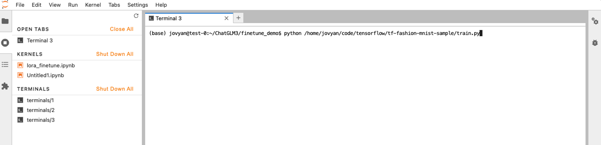
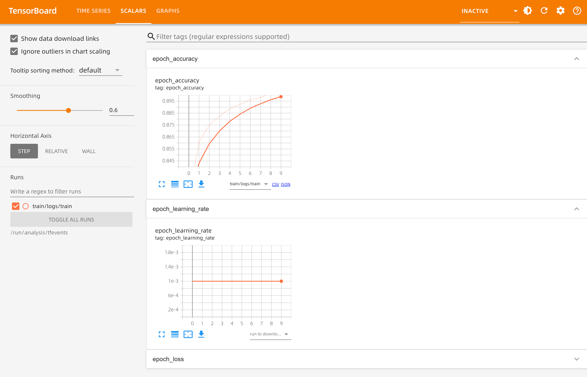

# Quick Start Guide

This article serves as a straightforward manual for users to leverage AI Lab throughout the development and training process involving datasets, Notebooks, and job training.

## Preparing Your Dataset

Start by clicking on **Data Management** -> **Datasets**, and then select the **Create** button to set up the three datasets outlined below.

### Dataset: Training Code

- **Code Source:** [https://github.com/samzong/training-sample-code.git](https://github.com/samzong/training-sample-code.git). This repository contains a simple TensorFlow code sample.
- If you're located in China, you can access it more quickly via Gitee: [https://gitee.com/samzong_lu/training-sample-code.git](https://gitee.com/samzong_lu/training-sample-code.git)
- The code can be found at: `tensorflow/tf-fashion-mnist-sample`


!!! note

    Currently, only the `StorageClass` with read-write mode `ReadWriteMany` is supported. Please use NFS or the recommended [JuiceFS](https://juicefs.com/en/).

### Dataset: Training Data

For this training session, we will use the Fashion-MNIST dataset, which can be found at [https://github.com/zalandoresearch/fashion-mnist.git](https://github.com/zalandoresearch/fashion-mnist.git).

If you're in China, you can use Gitee for a quicker download: [https://gitee.com/samzong_lu/fashion-mnist.git](https://gitee.com/samzong_lu/fashion-mnist.git)


!!! note

    If the training data dataset isn't created beforehand, it will be automatically downloaded during the training script execution. Preparing the dataset in advance can help speed up the training process.

### Dataset: Empty Dataset

AI Lab allows you to use `PVC` as the data source type for datasets. After creating an empty PVC bound to the dataset, you can utilize this empty dataset to store the output datasets from future training jobs, including models and logs.


## Environment Dependency: TensorFlow

When running the script, you'll need the `TensorFlow` Python library. You can use AI Lab's environment dependency management feature to download and prepare the necessary Python libraries in advance, eliminating the need for image builds.

> Check out the [Environment Dependency](./dataset/environments.md) guide to add a `CONDA` environment.

```yaml
name: tensorflow
channels:
  - defaults
  - conda-forge
dependencies:
  - python=3.12
  - tensorflow
prefix: /opt/conda/envs/tensorflow
```

!!! note

    After the environment is successfully set up, you only need to mount this environment to the Notebook or training jobs, using the base image provided by AI Lab.

## Using a Notebook to Debug Your Script

Prepare your development environment by clicking on **Notebooks** in the navigation bar, then hit **Create**.

- Associate the [three datasets](#preparing-your-dataset) you prepared earlier, filling in the mount paths as shown in the image below. Make sure to configure the empty dataset in the output dataset location.


- Select and bind the [environment dependency package](#tensorflow).

    Wait for the Notebook to be successfully created, then click the access link in the list to enter the Notebook. In the Notebook terminal, run the following command to start the training job:

    

    !!! note

        The script uses TensorFlow; if you forget to associate the dependency library, you can temporarily install it using `pip install tensorflow`.

        ```shell
        python /home/jovyan/code/tensorflow/tf-fashion-mnist-sample/train.py
        ```

## Creating a Training Job

1. Click on **Job Center** -> **Training Jobs** in the navigation bar to create a standalone `TensorFlow` job.
2. Fill in the basic parameters and click **Next**.
3. In the job resource configuration, correctly set up the job resources and click **Next**.

    - **Image:** If you prepared the environment dependency package earlier, you can use the default image. Otherwise, make sure the image includes the `TensorFlow` Python library.
    - **Shell:** Use `bash`.
    - **Enable Command:**
    
        ```bash
        python /home/jovyan/code/tensorflow/tf-fashion-mnist-sample/train.py
        ```

4. In the advanced configuration, enable **Job Analysis (TensorBoard)**, and click **OK**.

    !!! note

        Logs will be saved in the output dataset at `/home/jovyan/model/train/logs/`.


5. Return to the training job list and wait for the status to change to **Success**. Click on the **┇** icon on the right side of the list to view details, clone jobs, update priority, view logs, and delete jobs, among other options.

6. Once the job is successfully created, click on **Job Analysis** in the left navigation bar to check the job status and fine-tune your training.

    
