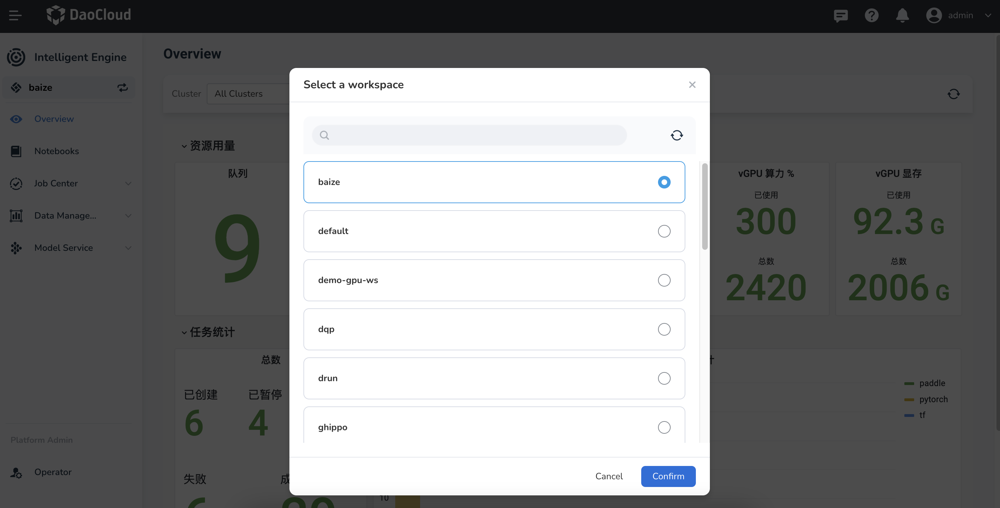
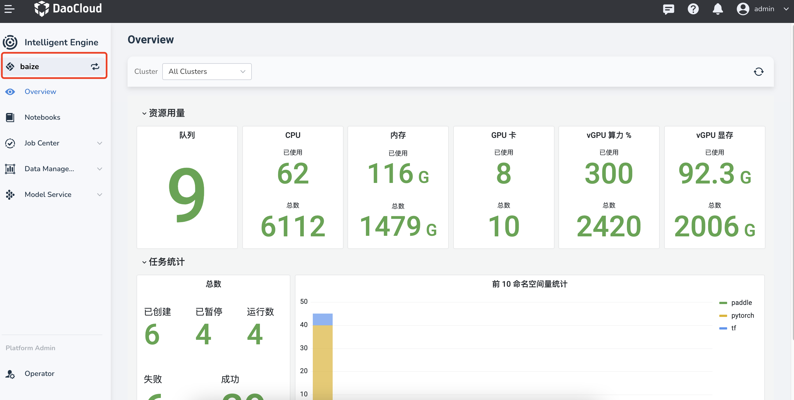
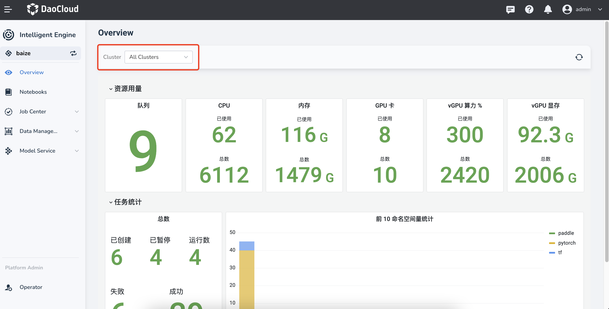
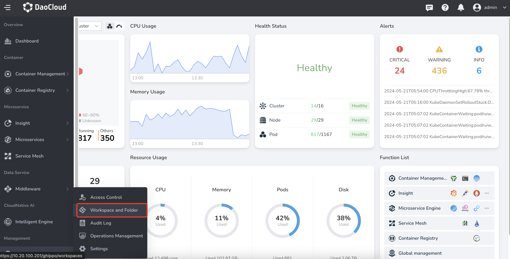
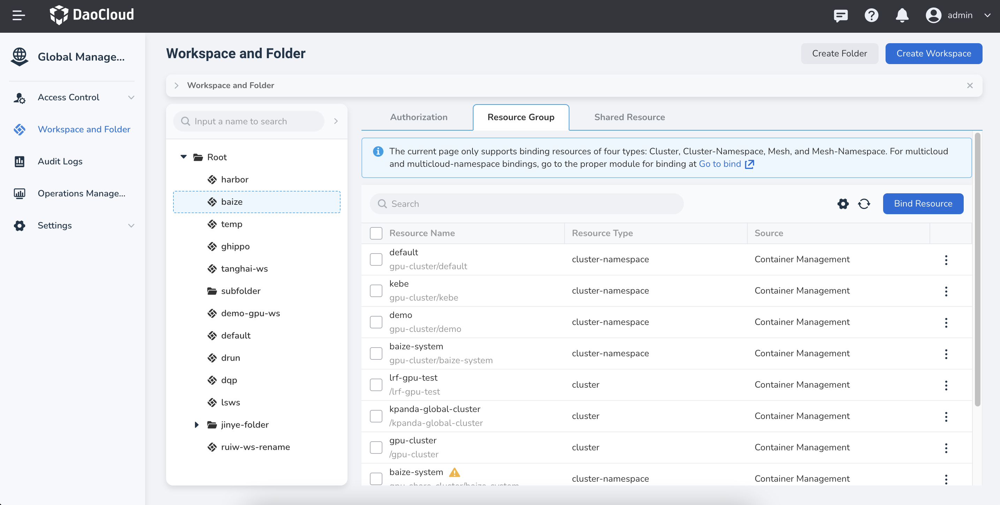
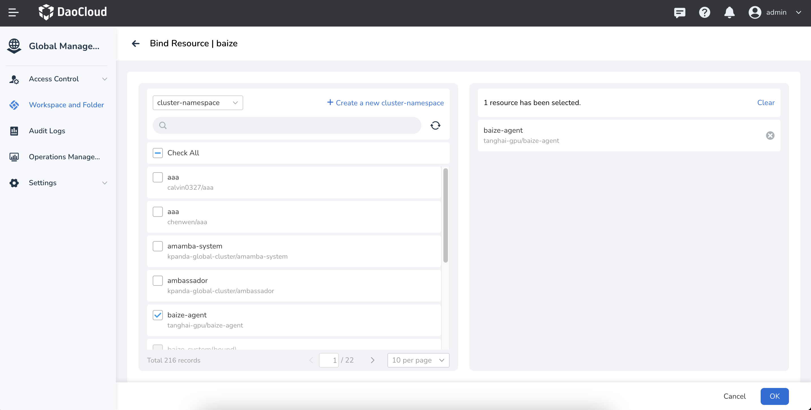
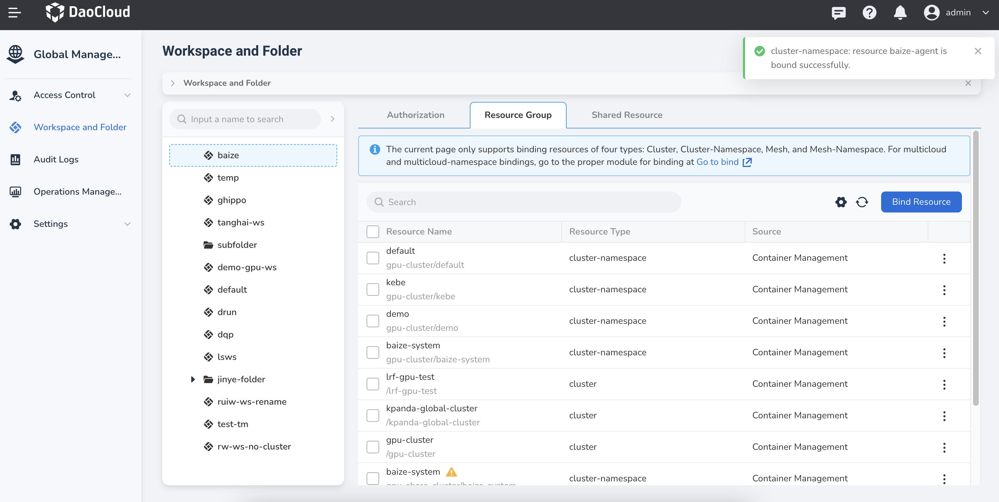
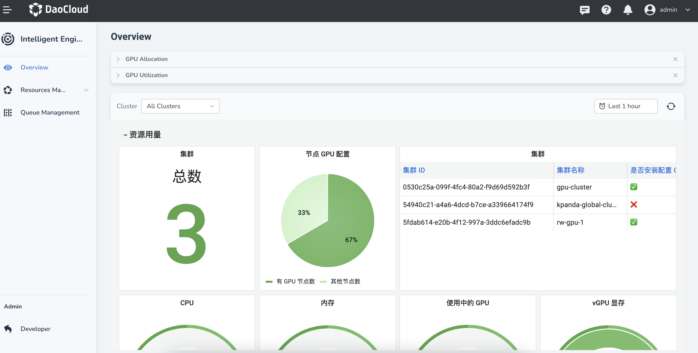

# First Time Usage

When entering DCE 5.0 Intelligent Engine for the first time, you need to:

[Choose a Workspace](#select-a-workspace)
[Select a Cluster](#select-cluster)
- [Confirm your Role](#roles)

## Select a Workspace

When first entering DCE 5.0 Intelligent Engine, you should select a [workspace](../../ghippo/user-guide/workspace/workspace.md).

If you need to change the current workspace, you can click the change icon in the left sidebar to select a different workspace.

!!! note

    If no available workspaces to choose from, you need to contact an administrator to create a workspace.

## Select Cluster

You can choose which cluster to deploy and execute intelligent computing operations.

If the cluster you want is not in the cluster list, you need to bind the cluster and namespace first.

1. Click the icon in the upper left corner to open the navigation bar, then click **Global Management** -> **Workspace and Folder**.

    

1. Find your workspace (e.g., `baize`) from the list, click the **Resource Group** tab, and then click the **Bind Resources** button on the right.

    

1. Check the namespaces and clusters you want to bind, then click **OK** .

    

1. A screen prompt will indicate a successful binding, and the bound clusters and namespaces will be displayed in the list.
   You can also authorize a user, add more resource groups, and create shared resources on this page.

    

## Roles

DCE 5.0 Intelligent Computing provides two roles. You can switch between the two administrator roles by clicking the menu item at the bottom left:

- Administrator - Developer: With capabilities of Notebooks, training tasks, datasets, etc.
- Platform Administrator - Operator: With capabilities of managing GPU resources, queues, etc.

Each role has an overview page that displays the current data that can be processed through graphical dashboards.

<!-- add image later -->

[Download DCE 5.0](../../download/index.md){ .md-button .md-button--primary }
[Install DCE 5.0](../../install/index.md){ .md-button .md-button--primary }
[Free Trial](../../dce/license0.md){ .md-button .md-button--primary }
