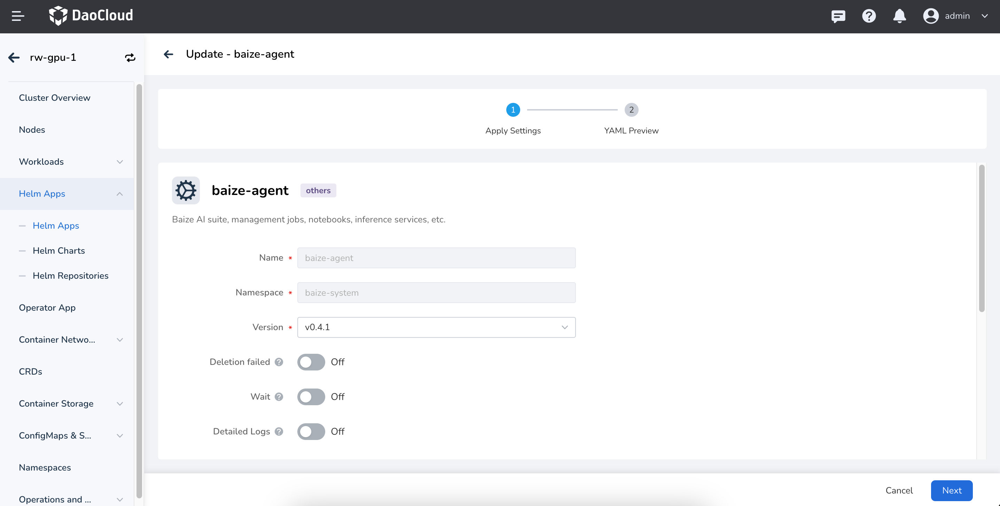

# Deploy AI Lab Components

Starting from version 0.17.0 of the DCE 5.0 installer, the AI Lab module can be installed concurrently
during the installation of the commercial version, **without the need for separate installation** ;
please contact the delivery support team to obtain the commercial installation package.

## Global Service Cluster

> AI Lab needs to be installed only in the [Global Service Cluster](../../kpanda/user-guide/clusters/cluster-role.md#global-service-cluster).

Go to the Global Service Cluster, then navigate to __Helm Apps__ -> __Helm Charts__ to
find `baize` and run the installation steps.

!!! note "Important Notes"

    * The namespace is `baize-system`
    * After replacing the environment address, open `<YOUR_DCE_HOST>/kpanda/clusters/kpanda-global-cluster/helm/charts/addon/baize`
    * `kpanda-global-cluster` is the name of the Global Service Cluster.

## baize-agent Worker Cluster

!!! warning

    If the cluster cannot be selected in AI Lab or indicates that `baize-agent` is missing,
    it means that the components for this worker cluster have not been successfully deployed.

In each worker cluster with computing resources, the corresponding basic components need to be deployed.
The main components include:

* `gpu-operator` initializes the GPU resources in the cluster.
  **This part may vary depending on the installation method of the GPU resource type**.
  For details, refer to [GPU Management](../../kpanda/user-guide/gpu/index.md).
* `insight-agent` is an observability component used to collect infrastructure information
  from the cluster, including logs, metrics, and events.
* `baize-agent` contains the core components of AI Lab, including scheduling, monitoring,
  and computing components like Pytorch and TensorFlow.
* [Optional] `nfs` storage service for dataset preloading.

!!! danger

    The above components must be installed; otherwise, functionality may not work properly.

### Install baize-agent on UI

> baize-agent needs to be deployed in the worker cluster.

Follow the prompts below to enter the worker cluster, then navigate to
__Helm Apps__ -> __Helm Charts__ to find `baize-agent` and execute the installation steps.

!!! note "Important Notes"

    * The namespace is `baize-system`
    * After replacing the environment address, open
      `<YOUR_DCE_HOST>/kpanda/clusters/<cluster_name>/helm/charts/addon/baize`
    * `cluster_name` is the name of the corresponding worker cluster.



Here is a YAML Example:

```yaml
cluster-controller:
  image:
    registry: ''
    repository: baize/baize-cluster-controller
    tag: v0.4.1
global:
  cluster:
    schedulers: []
  config:
    cluster_name: ''
    dataset_job_spec: {}
    inference_config:
      triton_image: m.daocloud.io/nvcr.io/nvidia/tritonserver:24.01-py3
      triton_images_map:
        VLLM: m.daocloud.io/nvcr.io/nvidia/tritonserver:24.01-vllm-python-py3
  debug: false
  high_available: false
  imagePullPolicy: IfNotPresent
  imagePullSecrets: []
  imageRegistry: release.daocloud.io
  prod: baize-agent
  resources: {}
kubeRbacProxy:
  image:
    registry: ''
    repository: baize/kube-rbac-proxy
    tag: v0.8.0
kueue:
  enablePlainPod: false
  fullnameOverride: kueue
  image:
    registry: ''
    repository: baize/kueue
    tag: v0.6.2
loader:
  image:
    registry: ''
    repository: baize/baize-data-loader
    tag: v0.4.1
notebook:
  image:
    registry: ''
    repository: baize/baize-notebook
    tag: v0.4.1
notebook-controller:
  image:
    registry: ''
    repository: baize/notebook-controller
    tag: v1.8.0
priority:
  high:
    value: 100000
  low:
    value: 1000
  medium:
    value: 10000
training-operator:
  image:
    registry: ''
    repository: baize/training-operator
    tag: v1-5525468
```

### Install baize-agent with helm

Ensure that the AI Lab components are already installed in the Global Service Cluster.
You can check in the GUI if the AI Lab module is available.

!!! info

You need to have an `AI Lab` entry in the main navigation bar to ensure that
the management components are deployed successfully.

```bash
# Baize is the development code name for the AI Lab component
helm repo add baize https://release.daocloud.io/chartrepo/baize
helm repo update baize
helm search repo baize # Get the latest version number
export VERSION=<version> # Make sure to use the current latest version
helm upgrade --install baize-agent baize/baize-agent \
    --create-namespace \
    -n baize-system \
    --set global.imageRegistry=release.daocloud.io \
    --version=${VERSION}
```

Once the above tasks are completed, the worker cluster will be successfully initialized,
and you can perform task training and model development in the AI Lab module.

### Components for Preloading

The dataset preloading capability provided in the AI Lab module relies on the storage service,
and it is recommended to use the NFS service:

* Deploy NFS Server

    * If an NFS already exists, you can skip this step.
    * If it does not exist, you can refer to the
      [NFS Service Deployment](../../baize/best-practice/deploy-nfs-in-worker.md) in best practices.

* Deploy `nfs-driver-csi`
* Deploy `StorageClass`

## Conclusion

After completing the above steps, you can fully experience the functionalities of AI Lab
 within the worker cluster. Enjoy your usage!
