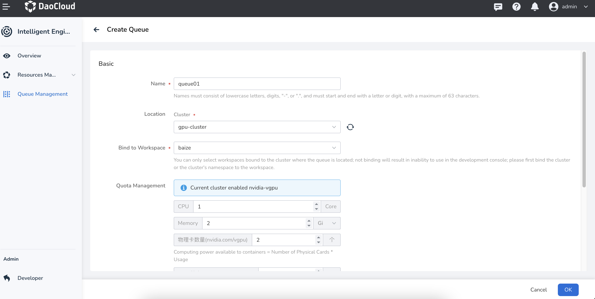
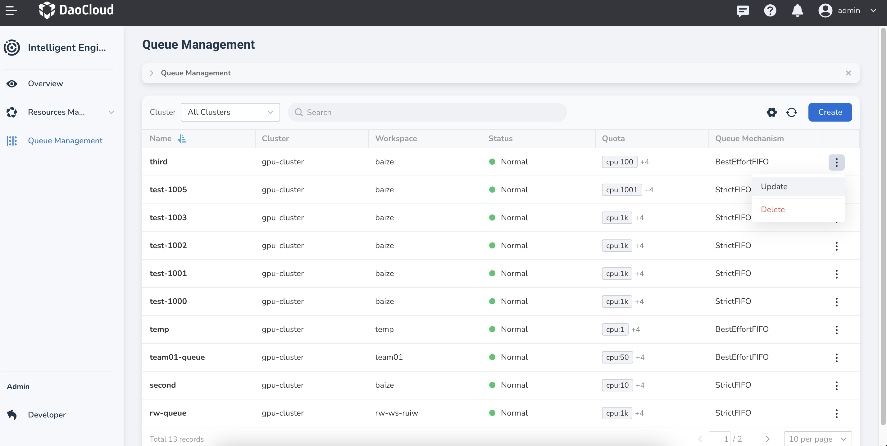

# Create Queue

In the Operator mode, queues can be used to schedule and optimize batch job workloads, effectively managing multiple tasks running on a cluster and optimizing resource utilization through a queue system.

1. Click **Queue Management** in the left navigation bar, then click the **Create** button on the right.

    

2. The system will pre-fill basic setup data, including the cluster to deploy to, workspace, queuing strategy, etc. click **OK** after adjusting these parameters.

    

3. A confirmation message will appear upon creation, returning you to the queue management list. Click the **⋮** on the right side of the list to perform additional operations such as update or delete.

    
