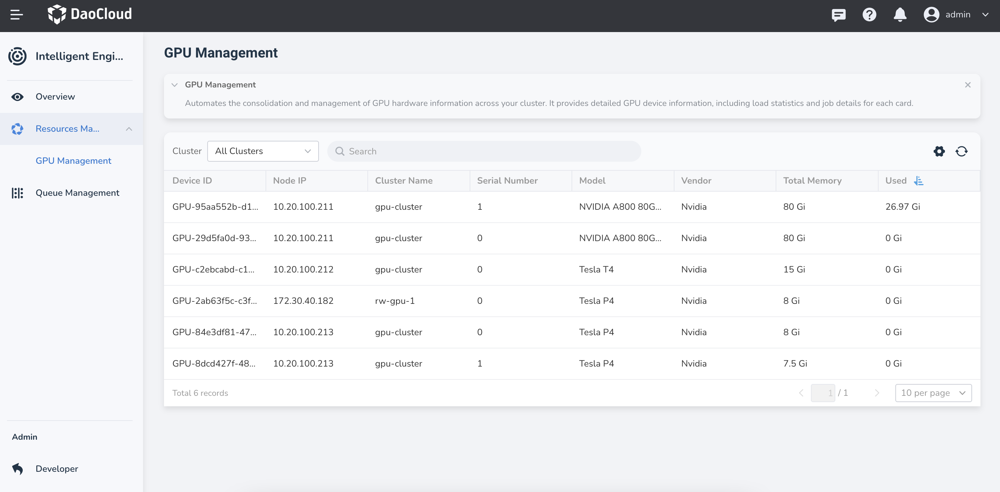

# GPU Management

Automatically consolidate GPU resource information across the entire platform, providing detailed GPU device information display, and allowing you to view workload statistics and task execution information for various GPUs.

After entering **Operator**, click **Resource Management** -> **GPU Management** in the left navigation bar to view GPU and task information.

