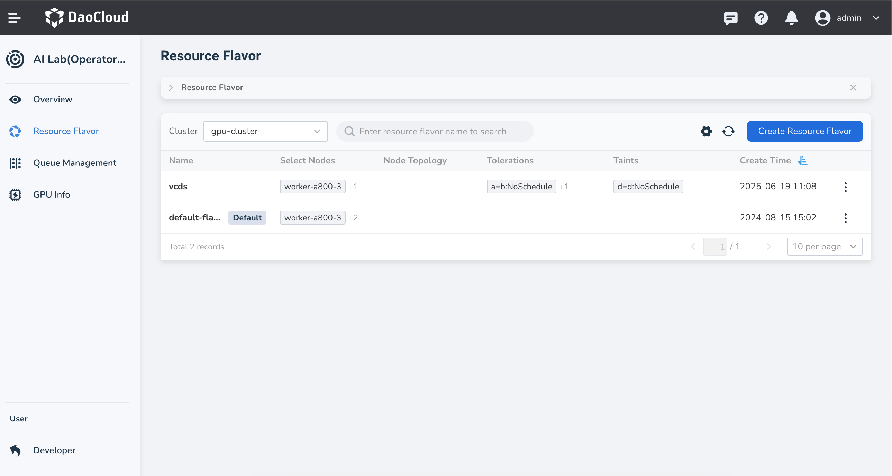
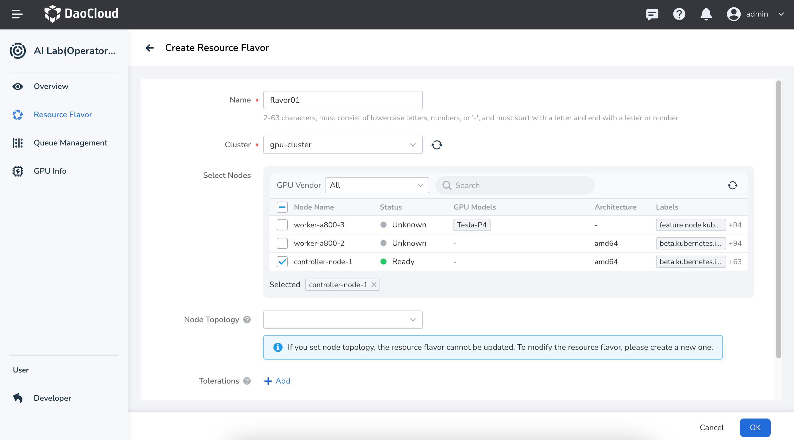

# Create a Resource Pool

A **resource pool** defines the available compute resources within a cluster and enables fine-grained resource management by associating workloads with specific node types.

This guide walks through the steps for creating a resource pool.

1. Navigate to the **Operations Management** view, select **Resource Pool** from the left-hand menu, and click the **Create Resource Pool** button in the top-right corner of the list.

    <!--  -->

2. Fill in the form based on your requirements, then click **OK**

    * **Name** : Must be 2–63 characters long, consisting of lowercase letters, digits, or hyphens (`-`). It must start with a letter and end with a letter or digit.
    * **Cluster** : The cluster in which the resource pool nodes reside.
    * **Select Nodes** : You can search for nodes by GPU vendor or node name.
    * **Node Topology** : Describes the physical or logical hierarchy of nodes in the Kubernetes cluster, such as zones, racks, or hosts. Defining the topology helps optimize job scheduling by ensuring Pods run on nodes with the most efficient network paths, which is ideal for AI/ML training or high-performance computing tasks.
    * **Tolerations** : Allow the scheduler to assign Pods to nodes with matching taints.
    * **Taints** : Allow a node to repel certain types of Pods. Taints and tolerations work together to prevent Pods from being scheduled onto unsuitable nodes.

    <!--  -->

3. After seeing the success prompt, you’ll be returned to the Resource Pool management list. Click the **┇** menu on the right side of a listed resource pool to perform actions like update or delete.

    <!--  -->
