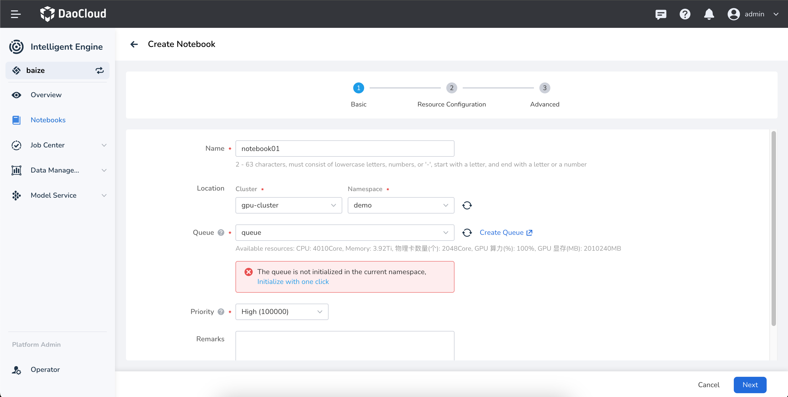

# Local Queue Initialization Failed

## Issue Description

When creating a Notebook, training task, or inference service, if the queue is being used for the first time in that namespace, you will be prompted to initialize the queue with a single click. However, the initialization may fail.

<!--  -->

## Issue Analysis

In intelligent computing, queue management capabilities are provided by `Kueue`. Kueue offers two types of queue management resources: `ClusterQueue` and `LocalQueue`.

- **ClusterQueue**: This is a cluster-level queue mainly used to manage resource quotas within the queue, including CPU, memory, GPU, etc.
- **LocalQueue**: This is a namespace-level queue that needs to point to a ClusterQueue for resource allocation within the queue.

In intelligent computing, if a specified `Namespace` does not have a `LocalQueue` when creating a service, you will be prompted to initialize the queue.

In rare cases, the `LocalQueue` initialization might fail due to special circumstances.

### Solution

Check if `Kueue` is running properly. If the `kueue-controller-manager` is not running, you can check its status with the following command:

```bash
kubectl get deploy kueue-controller-manager -n baize-system
```

If the `kueue-controller-manager` is not running properly, please fix `Kueue` first.

### Related Information

- [ClusterQueue](https://kueue.sigs.k8s.io/docs/concepts/cluster_queue/)
- [LocalQueue](https://kueue.sigs.k8s.io/docs/concepts/local_queue/)
