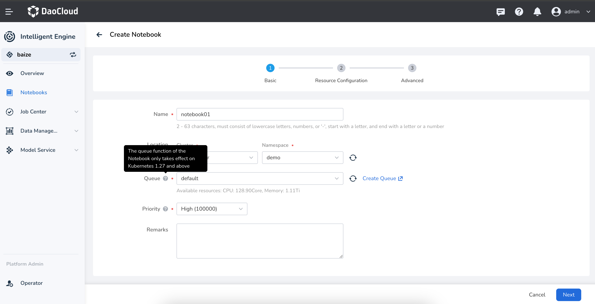
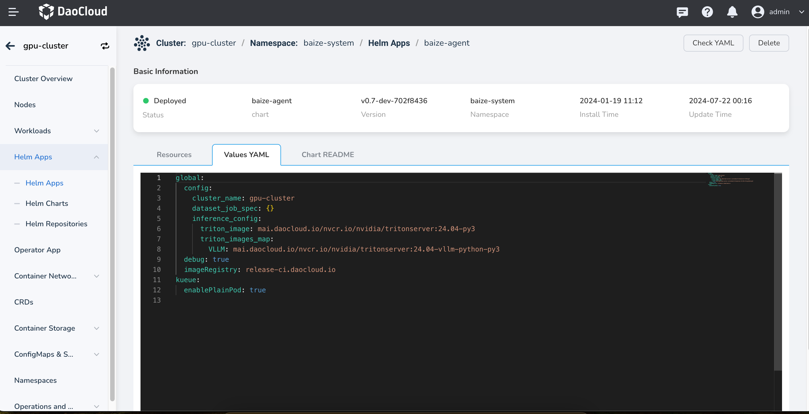

# Notebook Not Controlled by Queue Quotas

## Issue Description

In intelligent computing, users may find that when creating a Notebook, the selected queue allows the Notebook to be created successfully even if the resources are insufficient.

## Issue 01: Unsupported Kubernetes Version

The queue management capabilities in intelligent computing are provided by `Kueue`, and the `Notebook` service is provided through `JupyterHub`. `JupyterHub` has high requirements for the `Kubernetes` version. For versions below `v1.27`, even if queue quotas are set in `DCE`, and users select the quotas when creating a `Notebook`, the Notebook will not actually be restricted by the queue quotas.

<!--  -->

### Solution

Plan ahead and use `Kubernetes` version `v1.27` or above in the production environment.

### Related Information

- [Jupyter Notebook Documentation](https://jupyter-notebook.readthedocs.io/en/latest/)

## Issue 02: Configuration Not Enabled

> When the Kubernetes cluster version is greater than `v1.27`, the `Notebook` still cannot be restricted by the queue quotas.

This is because `Kueue` needs to enable support for `enablePlainPod` to be effective for the `Notebook` service.

<!--  -->

### Solution

Enable `enablePlainPod` support for `Kueue` when deploying `baize-agent` in the working cluster.

### Related Information

- [Run Plain Pods as a Kueue-Managed Job](https://kueue.sigs.k8s.io/docs/tasks/run/plain_pods/)
