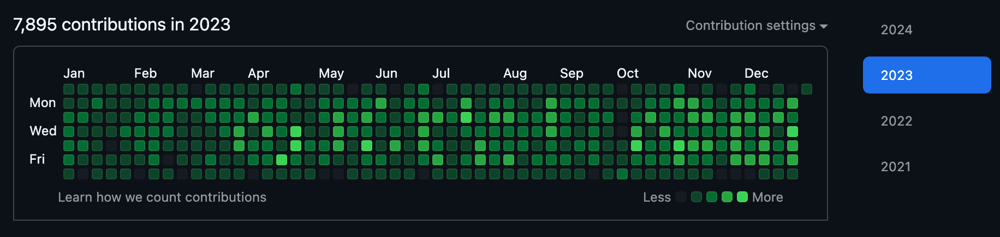
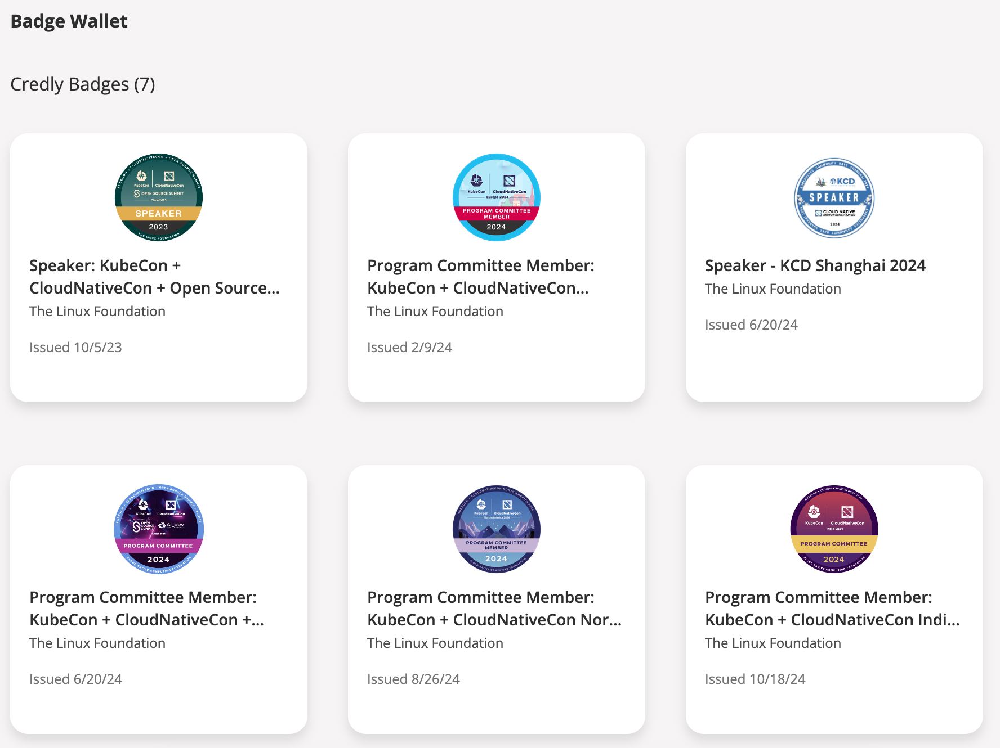
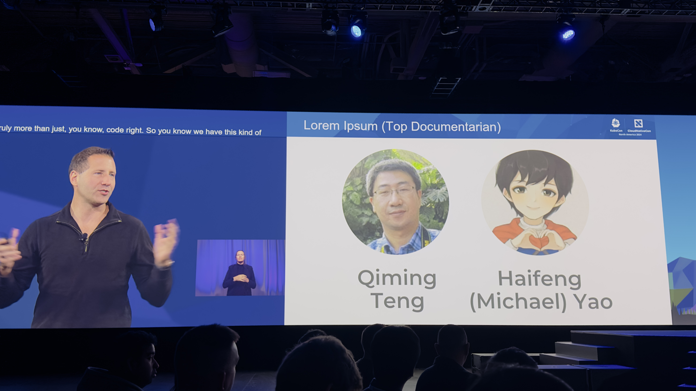
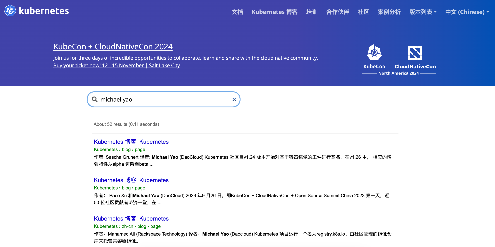

# From Community Novice to CNCF Ambassador

This article shares a personal journey of growth within the CNCF open-source community, featuring a protagonist named [Michael Yao](https://github.com/windsonsea).

## 2021: A Beginner's Journey

In February 2021, Michael joined a cloud-native startup called DaoCloud in Yangpu, Shanghai. His initial role involved writing and compiling bilingual documentation for an internal containerized PaaS platform on Confluence Wiki, aiming to make the code more accessible and the documentation user-friendly. During daily morning meetings, he often overheard discussions about container technologies and open-source contributions. Out of curiosity, he wondered if he could participate and how to get involved.

### Feeling Lost

He took the plunge and registered a GitHub account, only to be overwhelmed by the sheer number of 80 million developers on the platform. To him, GitHub seemed like just a website with a flashy blue interface, leaving him confused about how to navigate the vastness behind that page. He felt adrift and unsure where to start.

In his free time on weekends, he subscribed to public accounts like HelloGitHub to read articles and watched videos on platforms like Bilibili and Douyin about how to contribute, but he never made any actual contributions. This experience echoes what Keita, the organizer of the Japanese Kubernetes upstream training team, mentioned in a recent interview: “The hardest part of contributing to the community is taking that first step.” On average, it takes people between six months to two years to transition from knowing about open source to actively contributing.

### A Taste of Contribution

At the end of 2021, the open-source team at DaoCloud launched a project called [KLTS](https://klts.io/). The department head asked Michael to assist cloud-native developer [wzshiming](https://github.com/wzshiming) in improving the user documentation hosted on GitHub. KLTS stands for Kubernetes Long Term Support, and its primary mission is to provide long-term free maintenance support for early versions of Kubernetes. While this project was relatively niche, it offered a lifeline to many enterprises still running older Kubernetes versions in production.

With wzshiming's guidance, Michael installed [Git](https://git-scm.com/) locally and learned to use [VSCode](https://code.visualstudio.com/). He managed to push and submit changes to the KLTS repository through the command line, though it wasn't without its challenges. He frequently faced submission failures due to network issues or typos, leading to conflicts with online documentation that required various rebases. He often found himself seeking help, laptop in hand.

### A Shift in Perspective

Fortunately, as an engineering student, Michael became fascinated with Git commands after learning them. Just a few simple command lines allowed him to submit changes that were almost instantly visible on the website, enabling everyone to see his efforts and witness the changes happening in real-time. Google’s search engine operates on a principle: **websites that frequently update with valuable content will rank higher because they appear more alive**.

This starkly contrasted the standalone Office suite or corporate intranet Wiki pages; it marked a shift from closed to open, from individual to community, and from localized collaboration to global cooperation. This is one of the reasons the open-source community thrives—every PR submitted is a step forward, every change is visible to all, and each successful merge is celebrated. If someone finds an issue with a PR modification, anyone can leave a comment, and the PR will only be merged once all concerns are addressed.

## 2022: Getting Started

In 2022, DaoCloud's R&D department began recruiting more talent to develop the fifth-generation containerized platform, which later became the cloud-native operating system DCE 5.0. Michael was responsible for documentation and began researching how to build a documentation site. He explored options like [GitBook](https://www.gitbook.com/), [Docusaurus](https://docusaurus.io/), [Hugo](https://www.gohugo.org/), and [MkDocs](https://www.mkdocs.org/). Initially, he set up documentation sites for various Scrum teams using GitBook on the intranet but faced limitations due to a lack of IT support, resulting in only basic styling. Additionally, after GitBook commercialized, updates for the community version stagnated, causing the documentation for different Scrum teams to become disjointed and inconsistent.

### Entering GitHub

In early 2022, [samzong](https://github.com/samzong) joined DaoCloud and was extremely skilled at discovering, exploring, and utilizing various tools on GitHub. He was like a robotic cat, always pulling out valuable resources from Git, and like a navigator, he could always find the right path forward, earning him the nickname "Captain" among his colleagues. With Captain's help, Michael successfully consolidated documentation from over ten Scrum teams using MkDocs, migrating data from the intranet to GitHub and making all Markdown source files available to the global open-source community, resulting in the external site [docs.daocloud.io](https://docs.daocloud.io/). Regularly submitting, reviewing, and merging PRs became part of Michael's daily routine.

One day in mid-2022, Michael cloned the source data for k/website and noticed some documents that were awkwardly written. He attempted some text modifications and submitted a [small PR](https://github.com/kubernetes/website/pull/33568). This was his first external community PR, and he quickly received feedback from reviewers.

### Learning to Be Inclusive

From this PR, he learned the importance of inclusivity. While the original sentence was not very smooth, it was essential to avoid being impolite and harshly criticizing others’ work. The community is a collaboration of global contributors, and diverse ideas are inevitable; what feels natural to one person may not be to another. For instance, in Chinese, apart from the mainland, there are communities in Hong Kong, Macau, Taiwan, and Singapore, each facing different cultural environments and time zones. Everyone must learn to be understanding and patient, engage in friendly discussions, and empathize with one another. These are the qualities that the community values, reflected in every word of the [CNCF Code of Conduct](https://kubernetes.io/zh-cn/community/code-of-conduct/#cncf-community-code-of-conduct-v13).

Michael encountered a case regarding the translation of "Namespace" in Chinese. The most common term in the IT industry is “命名空间” (naming space), but there are alternative terms like “名字空间” (name space), “名称空间” (name space), and “命名域” (naming domain). The latter terms are not incorrect; they are just less common. Many new contributors question why the term isn’t standardized on k8s.io and why multiple terms exist. Those who have been around k/website for years know the answer, but often don’t mention it. The community had previously voted on this issue, with senior figures like [Jimmy Song](https://jimmysong.io/) and Tengqm preferring “名字空间” (name space), while newcomers leaned towards “命名空间” (naming space). During discussions, veterans refrained from explaining why, while newcomers insisted on challenging the terminology, leading to some ridicule and hostility until the CoC committee had to step in and lock the thread. There were no winners in this discussion, and it ultimately fizzled out.

### A Bit of Advice

Michael advises newcomers to start by tackling some [good first issues](https://github.com/kubernetes/website/issues?q=is%3Aopen+is%3Aissue+label%3A"good+first+issue") for contributions. Larger modifications can wait until they become more familiar with the community. Participants in the community have their own work, and most only contribute when they have time; larger PRs can be more challenging to merge, with some complex PRs potentially taking years. It’s best to make PR modifications specific to a particular aspect, allowing reviewers to grasp them at a glance. This way, it’s easy to receive `/lgtm` and `/approve` tags, leading to the successful merging of PRs and leaving behind a trail of accomplishments.

## 2023: Run, Brother

In 2023, Michael participated in several open-source projects, with the static compilation of external websites falling into three categories:

- Websites compiled using Hugo:

    - [k8s.io](http://k8s.io): The de facto standard technology for global AI load container orchestration, a CNCF graduated project, with DaoCloud ranking first in code contributions, and Michael being one of the maintainers.
    - [istio.io](http://istio.io): The most popular modern service mesh technology globally, a CNCF graduated project, with DaoCloud ranking in the top three for code contributions, and Michael being one of the maintainers.
    - [opentelemetry.io](https://opentelemetry.io/): The leading observability project globally, a CNCF graduated project, with three maintainers from DaoCloud, and Michael being one of them.
    - [klts.io](http://klts.io): An early project open-sourced by DaoCloud, providing free long-term support for older versions of Kubernetes, fixing various CVEs, with Michael as one of the maintainers.
    - [clusterpedia.io](http://clusterpedia.io): An open-source project donated by DaoCloud to CNCF, successfully joining the Sandbox, with Michael as one of the maintainers.
    - [merbridge.io](http://merbridge.io): An open-source project donated by DaoCloud to CNCF, successfully joining the Sandbox, with Michael as one of the maintainers.
    - [KWOK](https://kwok.sigs.k8s.io/): An open-source project donated by DaoCloud to the Kubernetes community, becoming a SIG project widely used by Apple, IBM, OpenAI, etc., with Michael serving as a reviewer.

- Websites compiled using MkDocs:

    - [docs.daocloud.io](http://docs.daocloud.io): The global documentation site for the fifth-generation cloud-native operating system open-sourced by DaoCloud, with Michael as the owner.
    - [docs.d.run](https://docs.d.run/): The global documentation site for the computing operating system open-sourced by DaoCloud, with Michael as the owner.
    - [kubean.io](https://kubean-io.github.io/kubean/en/): An open-source project donated by DaoCloud to CNCF, successfully joining the Sandbox, with Michael as one of the maintainers.
    - [spiderpool.io](https://spidernet-io.github.io/spiderpool/): An open-source project donated by DaoCloud to CNCF, successfully joining the Sandbox, with Michael as one of the maintainers.

- Websites compiled using Docusaurus:

    - [hwameistor.io](http://hwameistor.io): An open-source project donated by DaoCloud to CNCF, successfully joining the Sandbox, with Michael as one of the maintainers.
    - [karmada.io](http://karmada.io): Open-sourced by Huawei, with DaoCloud ranking first in code contributions, and Michael being one of the maintainers.

## 2024: Knowledge Gained

The prosperity of the community relies on the contributions of its members, and active contributors are the lifeblood of various projects.

In 2024, Michael participated multiple times in the Program Committee for reviewing KubeCon speaking topics:

- KubeCon Paris 2024
- KubeCon Salt Lake City 2024
- KubeCon New Delhi 2024
- KubeCon Hong Kong 2024

The North American KubeCon in 2024 will take place from November 12-15, featuring keynote speeches at the main venue. You might see Michael Yao's name on the award list.

## Conclusion

To date, many remarkable software projects have emerged from the open-source community: Linux, Android, Git, Kubernetes, Istio, OpenTelemetry, Grafana, MySQL, and more. These technologies underpin the internet, cloud computing, mobile applications, and AI training and inference, serving as essential catalysts for the advancement of human civilization. Most developers and programmers you know likely have another layer of identity within the community.

As new talents emerge, open-source projects require continuous fresh blood and more contributors to flourish. 

For newcomers looking to contribute to open-source communities, the hardest part might be taking that first step—installing the necessary tools, setting up the environment, and identifying areas for improvement. After that, engaging with others, finding a good mentor, and gradually forming a habit becomes a natural progression.

### Habits

Get into the habit of reviewing PRs, discovering and raising issues, and understanding various aspects of the community.

- Transitioning from understanding various messages on Slack to starting to like and comment
- Moving from silence, listening, and observing to contributing a few words
- Progressing from quietly attending online meetings and striving to understand different accents to participating in offline events and making friends
- Expanding from only using WeChat to incorporating Slack, Twitter, LinkedIn, and WhatsApp
- Evolving from attending KubeCon for the first time to engaging in various activities before and after the conference
- Transitioning from local involvement to international participation

### Inclusivity

The open-source community is highly inclusive, allowing anyone to find their place and engage in learning and communication. If you successfully merge a PR and leave a record, you'll take pride in your growth.

- Product: Join the release team, advance the development progress of various SIG teams according to the KEP development plan
- Development: Fix bugs, propose KEPs, submit code
- Testing: Submit and improve e2e test scripts
- Frontend: UI/UX technology
- Design: Create logos, various PNGs, SVGs, and mermaid diagrams
- Documentation: Write in English, translate into multiple languages
- Management: Draft codes of conduct, oversee community behavior, organize online meetings

### Patience

Contributing to the community often occurs sporadically. After you submit a PR or an issue, it usually takes some time to receive a response. Therefore, patience is key; most people focus on content they're interested in. If too much time passes without a response, you can review PR or issue records, @ the relevant personnel, and reflect on whether your submission had issues or could be improved.

### Atmosphere

For many, the community extends their workplace. Many come here to learn and connect, primarily to enhance their technical skills, broaden their horizons, and expand their networks, possibly to prove something, all with certain expectations. A positive atmosphere can encourage you to contribute more and may even lead to an obsession with it.

So what are you waiting for? Find an environment that encourages open-source contributions—be it a university, research institution, or a startup like DaoCloud, or even a giant like Google, Microsoft, Amazon, Huawei, Alibaba, Tencent, or Douyin. You will find and meet people on GitHub, discussing and solving problems together. The community transcends walls, companies, and national boundaries, allowing creativity to collide in cyberspace and spark inspiration.

### Rewards

Efforts will always be rewarded. If one day you search for your name and find numerous articles related to you, each with tens of thousands of views, the excitement in your heart will drive you to continue moving forward.

## Reference Links

- [CNCF Ambassador List](https://www.cncf.io/people/ambassadors/)
- [November 12-15, 2024: North America KubeCon Agenda](https://kccncna2024.sched.com/)
