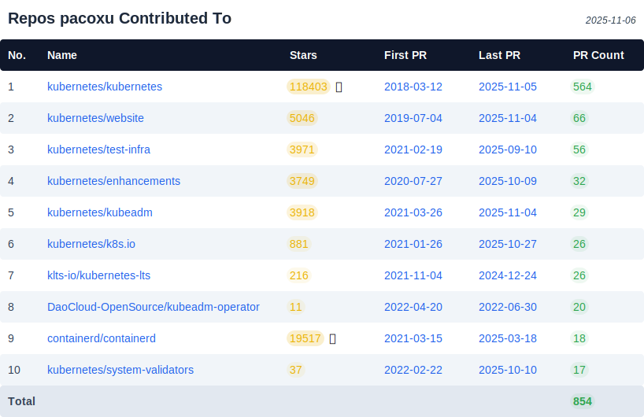

# Paco Xu Elected to the Kubernetes Steering Committee Again

> Subtitle: Building the Cloud-Native Foundation for the AI Era with the Community

In today's wave of digital transformation, artificial intelligence (AI) is reshaping industries at an unprecedented pace. Behind all this innovation lies **stable and efficient underlying technology support**.  
**Kubernetes (K8s), the de facto standard in the cloud-native domain, has long become the core foundation of AI infrastructure**.

From AI labs at tech giants to intelligent application development at startups, K8s is becoming the critical bridge connecting AI algorithms with real-world business scenarios. The Steering Committee, responsible for guiding K8s project development, directly influences the prosperity and evolution of the AI technology ecosystem.

## 2025 Kubernetes Steering Committee Election Results

The Kubernetes Steering Committee is the highest governing body of the Kubernetes project. It serves not only as the "helmsman" of the cloud-native community but also as a key promoter of the AI technology ecosystem. The committee oversees decisions regarding the project charter, sub-organizations, financial planning, and defines the project's values and organizational structure.  

The 2025 Steering Committee election has successfully concluded. The committee has 7 seats in total, with 4 seats up for election in 2025. Newly elected members serve a two-year term, all chosen by community vote.

The 4 newly elected members (term ending 2027) are:

- Kat Cosgrove, ([@katcosgrove](https://github.com/katcosgrove)), Minimus
- **Paco Xu, ([@pacoxu](https://github.com/pacoxu)), DaoCloud**
- Rita Zhang, ([@ritazh](https://github.com/ritazh)), Microsoft
- Maciej Szulik, ([@soltysh](https://github.com/soltysh)), Defense Unicorns

The 3 continuing members (term ending 2026) are:

- Antonio Ojea, ([@aojea](https://github.com/aojea)), Google
- Benjamin Elder, ([@BenTheElder](https://github.com/bentheelder)), Google
- Sascha Grunert, ([@saschagrunert](https://github.com/saschagrunert)), Red Hat

Both Maciej Szulik and Paco Xu were first elected to the Steering Committee in 2023, making this their second term. Paco Xu is also the only Chinese member on the committee.

### Focus on AI: Latest Kubernetes Community Working Groups

To further advance the integration of Kubernetes with AI and other emerging technologies, the community launched and operated the following working groups in 2025:

- [WG AI Conformance](https://github.com/kubernetes/community/tree/master/wg-ai-conformance): Defines baseline consistency and capabilities for AI workloads, answering the question “What compliant/consistent capabilities should AI have on Kubernetes?”
- [WG AI Gateway](https://github.com/kubernetes/community/tree/master/wg-ai-gateway): Explores routing, policies, and observability for inference traffic within the Gateway API ecosystem, in collaboration with projects like Gateway API Inference Extension (GAIE).
- [WG AI Integration](https://github.com/kubernetes/community/tree/master/wg-ai-integration): Focuses on practical integration of AI systems with Kubernetes, gathering real-world experience and proposals.

**How to Participate:** All working groups are listed on the community website’s [Community Groups page](https://www.kubernetes.dev/community/community-groups/), including Slack channels, mailing lists, and bi-weekly meetings. Practitioners or those interested in standards and implementation are welcome to join.

## About Paco

Paco is the team lead of DaoCloud’s open-source squad, responsible for tracking cutting-edge community technologies and transforming them into practical product capabilities.

He is energetic, loves football, and is a die-hard fan of Liverpool and Valencia. The author vividly remembers his signature when first joining: “Call me for football ⚽️”.

Since 2012, Paco has contributed code on GitHub, participating in 133 repositories. Over the past decade, his Kubernetes contributions total [15,769](https://k8s.devstats.cncf.io/d/13/developer-activity-counts-by-repository-group?orgId=1).

Recent merged PRs in Kubernetes-related repositories:

<figure markdown="span">
  { width="800" }
</figure>

Paco’s personal Kubernetes contributor card:

<figure markdown="span">
  { width="400" }
</figure>

!!! tip

    By simply modifying the URL, anyone can check their own Kubernetes contributions:
    <https://contribcard.clotributor.dev/pacoxu>

Paco actively organizes and participates in KubeCon, KCD, and other offline events. Beyond being a speaker, he has served as:

- KubeCon China 2024 Co-Chair
- Track Chair of KubeCon North America 2024
- Track Chair of KubeCon Europe 2025

On November 15, meet Paco at KCD Hangzhou 2025. He will deliver a keynote on recent Kubernetes community developments. Patrick Ohly (former Steering Committee member, DRA core developer) will share the latest DRA updates. Updates on the newly established WG AI Gateway, AI Integration, and AI Conformance will also be presented. For agenda and registration, see [KCD Hangzhou](https://community.cncf.io/events/details/cncf-kcd-hangzhou-presents-kcd-hangzhou-openinfra-days-china-2025/).

Paco has earned numerous badges:

He actively reviews code across various SIGs and WGs:

- [CNCF TAG Workloads](https://github.com/cncf/tag-workloads/) Chair
- [Kubernetes/Kubeadm](https://github.com/kubernetes/kubeadm/) Maintainer
- [LFAPAC Evangelist](https://evangelists.linuxfoundation.cn/evangelists)

Follow Paco:

- [GitHub @pacoxu](https://github.com/pacoxu)
- [Twitter/X @xu_paco](https://x.com/xu_paco)
- [LinkedIn @pacoxu2020](https://www.linkedin.com/in/pacoxu2020/)
- [WordPress Blog](https://pacoxu.wordpress.com/)
