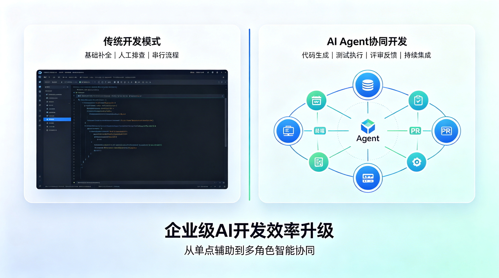
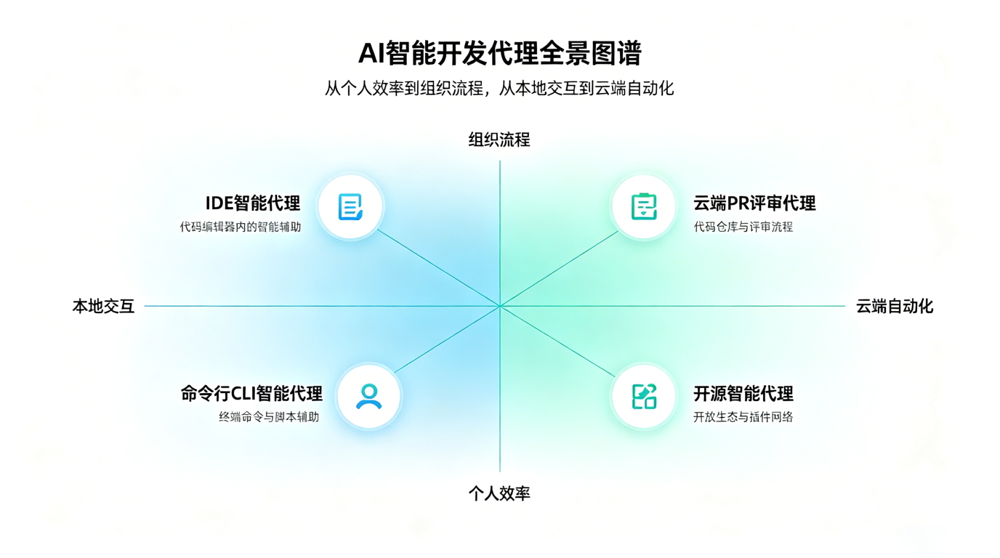
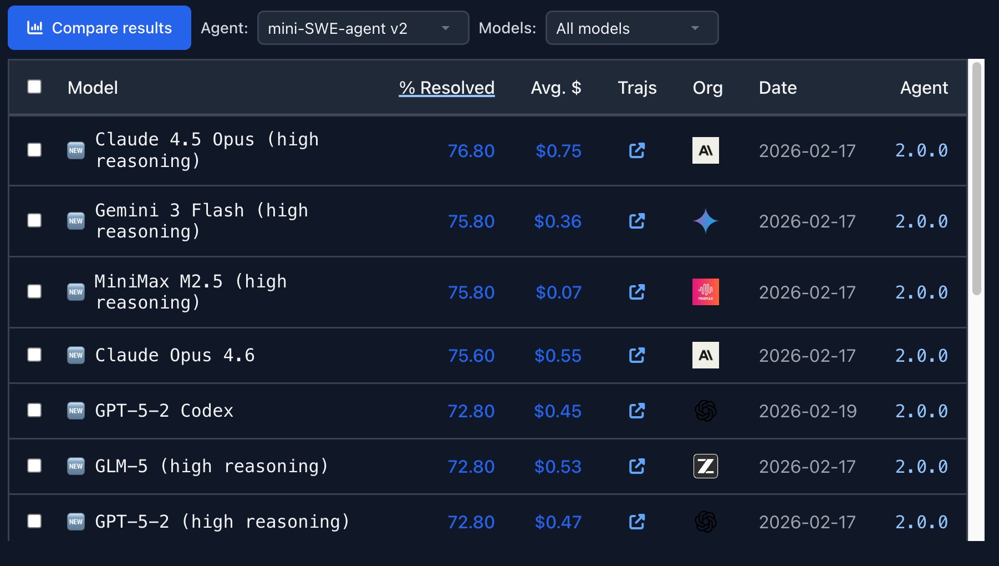
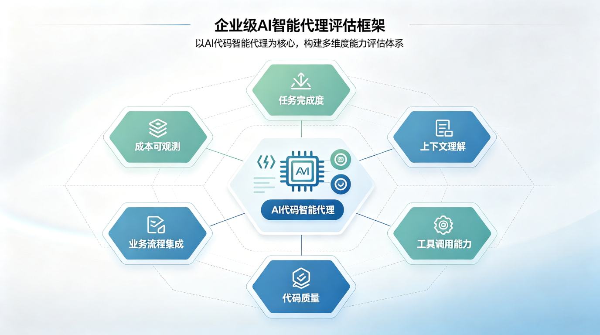
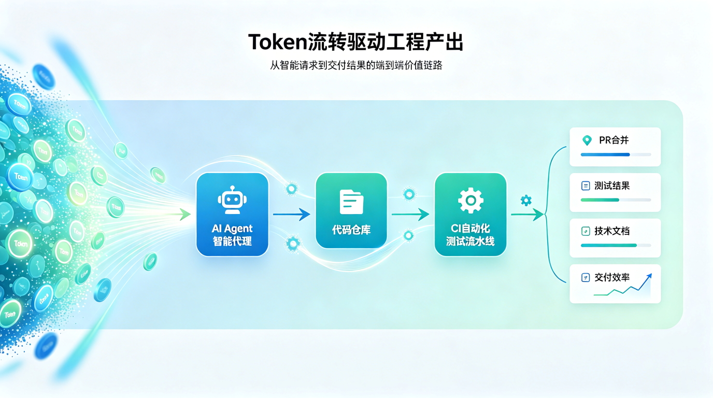
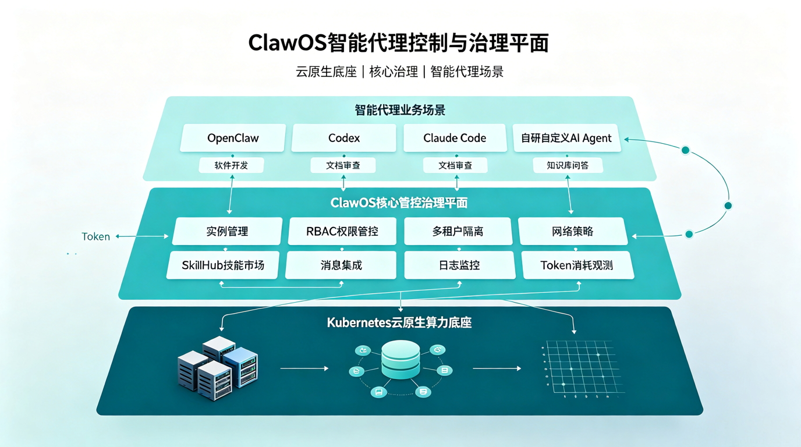

# From Copilot to Claude Code: How to Evaluate the Real Productivity of AI Agents?

In the past few years, the star of AI coding tools has been "code completion."

Developers wrote half, and the AI filled in the rest; developers described a function, and the AI generated a snippet. At this stage, when companies evaluated AI tools, they mostly looked at: how accurate the completion was, how fast the response was, and whether developers enjoyed using it.

But from GitHub Copilot and Cursor to Claude Code, Codex, and Devin, AI coding is entering a new phase:

**Agents are no longer just writing code; they are starting to complete tasks.**

They can read the codebase, understand issues, make plans, modify multiple files, run tests, fix failures, commit changes, and even automatically create pull requests.

This means that when companies evaluate AI agents, they can no longer ask simply: "Does it write good code?"

The more important question becomes:

**Can it reliably turn Tokens, model capabilities, and tool calls into real engineering output?**

## AI Coding Tools Are Evolving From "Assistants" to "Agents"

Early AI coding tools were more like a personal assistant: they responded to developer input and completed code generation, explanation, completion, and simple edits within a local context.

Today's AI agents, however, have begun to develop a more complete task-closing loop:

| Stage | Typical capability | What enterprises care about |
|---|---|---|
| Code completion | Complete functions, variables, and comments based on context | Faster coding |
| Conversational assistant | Explain code, generate snippets, and answer technical questions | Lower cost of understanding and searching |
| IDE Agent | Cross-file edits, command execution, and error fixing within a project | Higher individual developer efficiency |
| Cloud Agent | Create branches, modify code, and open PRs based on issues or tasks | Higher team task throughput |
| Organization-level Agent | Integrate permissions, standards, pipelines, metrics, and auditing | Governable AI R&D productivity |

From this evolution we can see that the value of AI agents no longer lies in "how much code was generated," but in whether they can enter the real software engineering workflow.

## Common AI Agents: Each With Its Own Battlefield

The AI agents currently on the market can roughly be divided into IDE-based, terminal-based, cloud PR-based, full-lifecycle engineer-based, and open-source self-hosted types.

| Tool / Agent | Primary form | Best-fit scenario |
|---|---|---|
| GitHub Copilot | IDE + GitHub Cloud Agent | GitHub issue-to-PR, code completion, team collaboration |
| Cursor Agent | AI-native IDE | High-frequency coding, frontend development, fast in-project iteration |
| Claude Code | CLI / IDE / Web / Desktop Agent | Complex code comprehension, refactoring, long-context tasks, terminal workflows |
| OpenAI Codex | CLI / Cloud / Desktop Agent | Multi-file edits, automation tasks, codebase comprehension, tool calls |
| Devin | Cloud AI software engineer | Relatively complete software development tasks, automated backlog handling |
| Windsurf / Cascade | AI IDE Agent | Project-level code changes, real-time developer collaboration |
| OpenCode / Aider / Cline / Roo Code | Open-source or semi-open-source Agent | Self-hosting, internal model integration, enterprise experimentation platform |

These tools are not simply stronger or weaker than each other; they suit different organizational workflows.

- If a team already revolves around GitHub Issues, Pull Requests, and Actions, the Copilot Agent will integrate more easily.
- If developers emphasize the local IDE experience, AI IDEs such as Cursor and Windsurf will feel more natural.
- If engineers are used to the terminal, scripts, and complex repository operations, Agents like Claude Code and Codex will have more room to shine.
- If an enterprise emphasizes controllability, self-hosting, and internal models, the open-source Agent ecosystem is more worth watching.

## Evaluating Agents: Don't Just Look at the Benchmark Leaderboards

Public benchmarks such as [SWE-bench](https://www.swebench.com/) and [Terminal-Bench](https://www.tbench.ai/) have become important references for evaluating AI agents.

[SWE-bench](https://www.swebench.com/) focuses more on an agent's ability to resolve real GitHub issues; [Terminal-Bench](https://www.tbench.ai/) tests an agent's ability to complete tasks such as system administration, data processing, security, and coding in a terminal environment.

These benchmarks are valuable because they push AI from "answering questions" to "completing tasks."

But for enterprises, public benchmarks can only answer part of the question. The real production environment introduces many more complex factors:

- Enterprise codebases may be larger, older, and more complex
- Internal frameworks and platform tools are not in the public training data
- Tasks depend on permissions, networks, artifact repositories, pipelines, and environment variables
- Code changes must comply with team standards and security requirements
- The final output must go through review, testing, compliance, and release processes
- Cost is not a single call, but ongoing Token consumption and model billing

Therefore, when evaluating AI agents, enterprises should not just ask "who ranks first on some leaderboard," but build their own evaluation framework.

## Six Dimensions for Evaluating Enterprise AI Agents

A genuine AI agent that can enter an enterprise production environment must at least withstand evaluation across six dimensions.

| Evaluation dimension | Key question | Why it matters |
|---|---|---|
| Task completion rate | Can it move from a requirements description to a runnable, testable, reviewable result? | Determines whether the agent can truly take on engineering tasks |
| Context comprehension | Can it understand large codebases, internal standards, historical decisions, and cross-module dependencies? | Determines usability in complex projects |
| Tool-calling capability | Can it safely run commands, tests, builds, searches, debugging, and internal tools? | Determines whether it can close the loop instead of only generating code |
| Quality and security | Is the code it generates reliable, maintainable, and security-compliant? | Determines whether the enterprise dares to connect it to core projects |
| Process integration | Can it enter issues, PRs, CI/CD, code review, and release processes? | Determines whether it becomes team productivity rather than a personal toy |
| Cost and observability | How many Tokens and how much cost did it consume, and how much output did it produce? | Determines whether AI usage is operable, optimizable, and scalable |

Behind these six dimensions is one sentence:

**What enterprises should evaluate is not "whether the agent can write code," but "whether the agent can reliably participate in software delivery."**

## Token Count Is Not Productivity; Token Conversion Rate Is

When enterprises broadly adopt tools such as Codex, Claude Code, Cursor, and Copilot, a new question emerges: how to measure the real effect of AI coding?

The easiest data to obtain is Tokens.

Tokens reflect the depth of AI tool usage, cost investment, and activity level. But Tokens themselves do not equal productivity.

An employee who consumes many Tokens may be efficiently completing a complex refactor, or may be repeatedly trial-and-erroring, asking the same questions, and submitting useless context. A team that consumes fewer Tokens is not necessarily underusing AI; it may have higher-quality prompts, clearer task breakdown, and more effective context management.

Therefore, what enterprises should really focus on is the **Token conversion rate**.

| Token data | Combined with engineering data | Question it can answer |
|---|---|---|
| Token consumption | PR creation / merge count | Does AI translate into real code changes? |
| Token consumption | Test pass rate | Is the AI-generated code reliable? |
| Token consumption | Number of review revisions | Does AI output reduce rework? |
| Token consumption | Requirement delivery cycle | Does AI shorten delivery time? |
| Token consumption | Defect rate | Does AI affect code quality? |
| Token consumption | Documentation and test coverage | Does AI improve the accumulation of engineering assets? |

The value of this kind of measurement is not to simply count "who used the most Tokens," but to turn AI coding from a personal experience into an observable, comparable, and optimizable production process for the organization.

## From Tool Procurement to Agent Productivity Operations

When introducing AI coding tools, many enterprises easily simplify the problem into a procurement decision: buy Copilot, buy Cursor, buy Claude Code, or adopt some model.

But the real challenge is not in procurement; it is in operations.

After AI agents enter an enterprise, they bring a series of new questions:

- Who can use which agents?
- Which codebases are allowed for agents to access?
- Which commands can be executed automatically, and which must be manually confirmed?
- Must generated code pass security scanning?
- How should AI-generated PRs be labeled, audited, and tracked?
- How should Token costs be attributed by team, project, and business line?
- Which efficient practices can be distilled into organizational templates?
- Which inefficient consumptions need optimization or limits?

This shows that what enterprises need is not just AI coding tools, but an **Agent productivity operations system**.

| Operational capability | Specific content | Enterprise value |
|---|---|---|
| Accounts and permissions | Control the access scope for users, codebases, tools, and environments | Reduce security and compliance risk |
| Rules and context | Distill coding standards, architectural principles, review requirements, and project knowledge | Improve agent output stability |
| Toolchain integration | Connect Git, CI/CD, testing, security scanning, knowledge bases, and ticketing systems | Let agents enter the real R&D process |
| Cost metering | Track Tokens, cost, call frequency, and task-dimension consumption | Support AI cost governance |
| Effect evaluation | Correlate metrics such as PRs, tests, delivery cycle, defects, and documentation | Measure whether AI delivers real output |
| Best practices | Distill prompts, Skills, agent templates, and task-breakdown methods | Turn personal experience into organizational capability |

The value of AI agents does not happen automatically.

Only after it is brought into organizational processes, engineering standards, and data metrics does it truly transform from a "handy tool" into "operable productivity."

## ClawOS: Turning Agents From Personal Tools Into Enterprise-Operable Assets

Once AI agents enter an enterprise environment, the question quickly shifts from "is a certain agent easy to use" to "how does the enterprise run and govern a group of agents at scale."

A team may simultaneously use agents of different forms such as Codex, Claude Code, Cursor, and OpenClaw: some are responsible for code comprehension, some for bug localization, some for PR review, some for document review, and some enter Feishu or Teams group chats to handle daily tasks.

If these agents are all configured by individuals, connect to models on their own, and manage API keys and tool permissions by themselves, the enterprise will soon encounter new governance problems: uncontrollable permissions, invisible costs, unsearchable logs, unclear network boundaries, hard-to-reuse Skills, and no one troubleshooting anomalies.

This is exactly the problem that [ClawOS](../../clawos/intro/index.md) solves.

ClawOS is DaoCloud's enterprise-facing multi-agent runtime and governance platform; it can be understood as the control plane and governance plane for running AI agents inside an enterprise. It is not a simple agent-list management platform, but helps enterprises run agents securely, stably, and controllably, and brings them into existing permission, network, collaboration, audit, and operations systems.

| Enterprise problem | ClawOS capability | Value to agent productivity |
|---|---|---|
| Agent instances are scattered, lacking unified management | Instance lifecycle management | Uniformly create, view, edit, and delete OpenClaw instances, making agent running state manageable |
| Multiple teams share agents, with unclear permission boundaries | Permission and multi-tenant isolation | Divide capability boundaries by regular user, tenant admin, and platform admin to avoid agents becoming uncontrollable black boxes |
| Agents can access systems and networks, making risk hard to control | Network policy governance | Manage the internal services, APIs, and default network policies that agents can access, clarifying capability boundaries |
| High-value capabilities are scattered in individual configurations | Skill management and distribution | Review, publish, distribute, authorize, and unpublish reusable Skills, turning them into enterprise capability assets |
| Agents only exist in the console, hard to enter workflows | Message channel integration | Connect enterprise message channels such as Feishu and Teams, letting agents enter employees' daily collaboration scenarios |
| Cost, logs, and failure rates are invisible | Observability, logs, and operations | Provide instance status, run logs, session transcript, trajectory log, Token usage, call count, error rate, and alerting information |

From this perspective, what ClawOS solves is not "which agent is more usable than Copilot, Claude Code, Codex, or Cursor," but a more fundamental problem when enterprises use agents at scale:

- How many agents are running?
- Which teams do they each serve?
- Which agents are normal, and which are abnormal?
- Which users and instances consume the most Tokens?
- Which Skills are used frequently?
- Which models cost the most?
- Which tasks have abnormal failure rates?
- Which operations need auditing and replay?
- Which network accesses carry risk?

This is also the key to enterprise-level AI coding entering the next stage: agents are no longer just individual engineers' efficiency tools, but will gradually become the organization's digital employees and automated execution units.

The value of ClawOS is to run, manage, observe, and audit these scattered agents, turning agents from "personal tools" into "enterprise-operable assets."

## Conclusion: Enterprises Need Not the "Strongest Agent," but an "Operable Agent System"

From Copilot to Claude Code, from Cursor to Codex, from Devin to open-source agents, AI agents are evolving rapidly.

But for enterprises, the real question is not "which agent is the strongest," but:

- **Which agent better fits our workflow?**
- **Which tasks are suitable to hand to agents?**
- **How do we ensure quality, security, and compliance?**
- **How do we measure whether Tokens are converted into real output?**
- **How do we distill personal usage experience into organizational capability?**

The next stage of AI coding will not just be a contest of tools, but a contest of operating systems.

Whoever establishes the usage metrics, cost governance, process integration, and productivity evaluation system for agents earlier will have a better chance of upgrading AI from a "personal efficiency tool" to an "organizational engineering capability."

In this sense, what enterprises need is not just Copilot, Claude Code, or Codex.

What enterprises truly need is an **Agent Factory** that runs continuously: letting agents be used correctly, letting Tokens be converted effectively, and letting AI truly enter the production process of software engineering.

## References

- [SWE-bench Agent Leaderboard](https://www.swebench.com/)
- [CLI/Terminal Agent Leaderboard](https://www.tbench.ai/)
- [GitHub Copilot Cloud Agent Documentation](https://docs.github.com/en/copilot/concepts/agents/cloud-agent/about-cloud-agent)
- [Claude Code Documentation](https://code.claude.com/docs/en/overview)
- [DaoCloud ClawOS Documentation](https://docs.daocloud.io/clawos/intro/)
- arXiv paper: [Comparison of AI Coding Agents: PR Acceptance Rate Analysis Based on Task Stratification](https://arxiv.org/abs/2602.08915)
- arXiv paper: [Configuring Agentic AI Coding Tools: An Exploratory Study](https://arxiv.org/abs/2602.14690)
