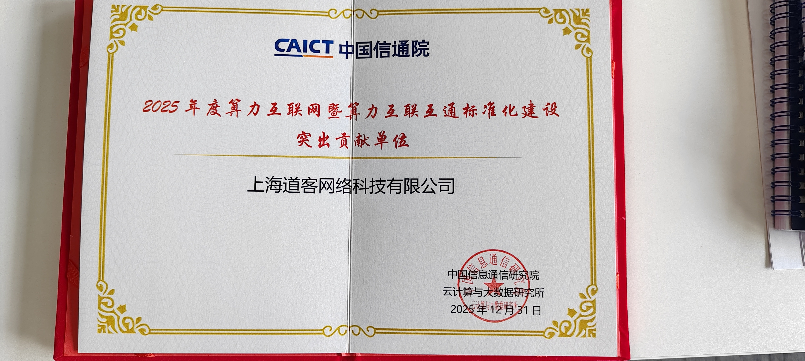
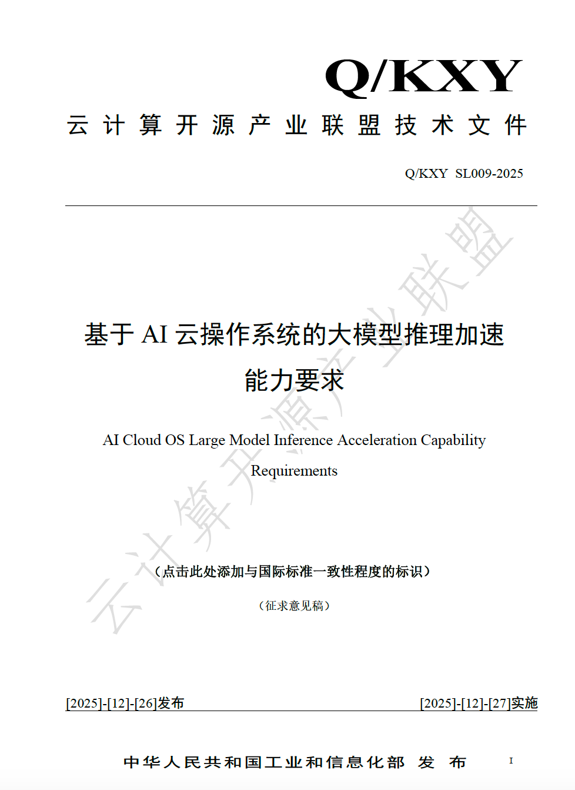
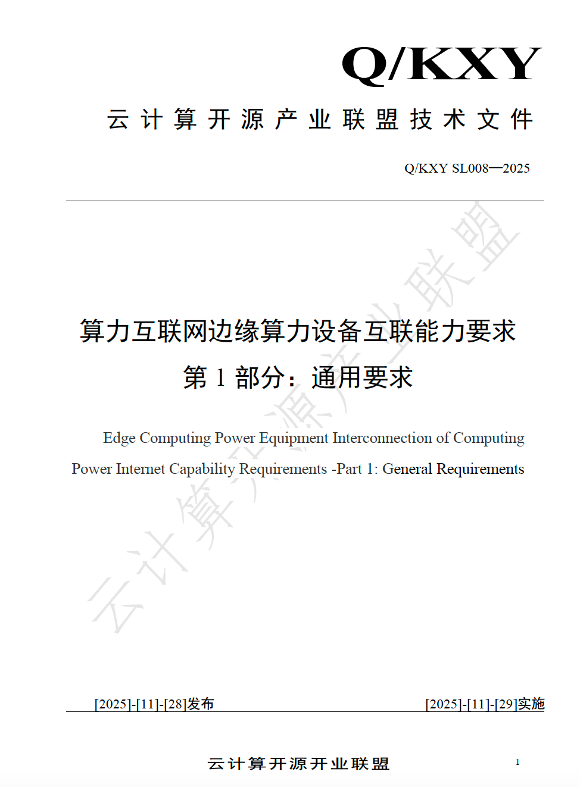
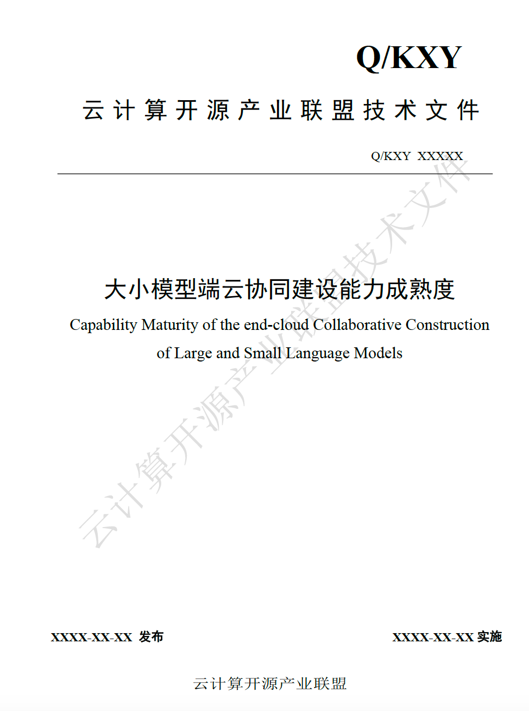
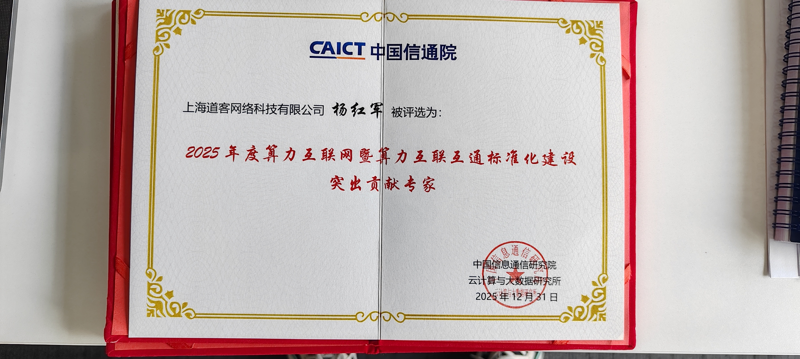
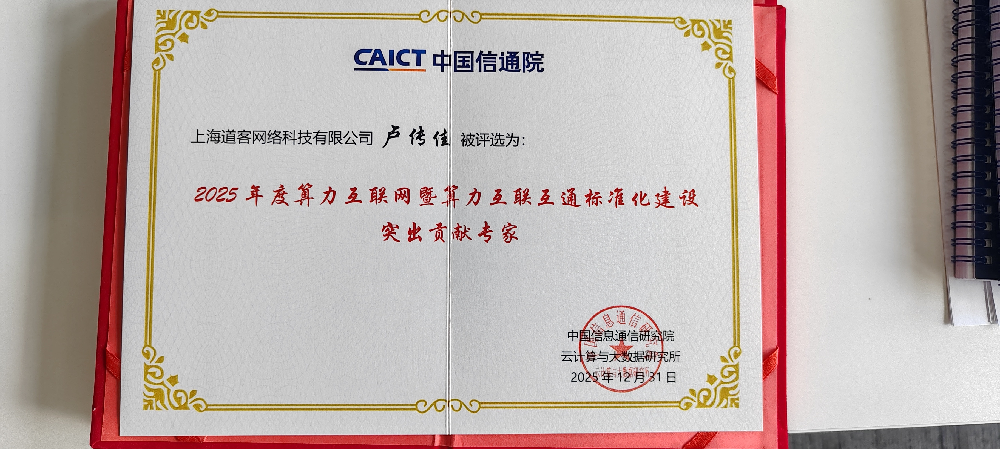
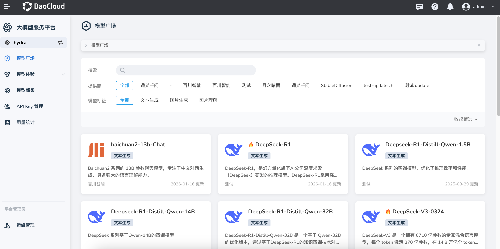

# DaoCloud Supports CAICT in Drafting National Standards for Large-Model Inference Acceleration and More

Great news! Shanghai DaoCloud Network Technology Co., Ltd. (DaoCloud), leveraging its leading strengths in **open-source technologies such as cloud-native computing, AI development, and large-model inference**, as well as its outstanding contributions to the standardization of computing power interconnectivity and the computing power internet, has been honored as an **Outstanding Contribution Unit for Computing Power Internet and Computing Power Interconnection Standardization in 2025**.

DaoCloud deeply participated in and assisted the China Academy of Information and Communications Technology (CAICT) in compiling multiple **standard documents related to large-model inference acceleration and computing power interconnectivity** for the **China Cloud Computing Open Source Industry Alliance**. These documents systematically outline and standardize key technical capabilities such as large-model inference, computing power scheduling, and interconnectivity, providing an important technical specification and reference basis for the scaled adoption and industrial development of artificial intelligence technologies in China.

## Core Standards Documents Drafted by DaoCloud

The several technical standard documents compiled in this effort were proposed and placed under the purview of the China Communications Standards Association:

- *Requirements for Large-Model Inference Acceleration Capabilities Based on an AI Cloud Operating System*, No. Q/KXY SL009-2025

    This document specifies the basic framework for AI cloud operating systems in large-model inference acceleration scenarios, including capability requirements in areas such as the core capabilities of AI cloud operating systems for large-model inference acceleration, observability, inference acceleration performance, stability, security, and compatibility.

    This document applies to the R&D and evaluation of AI cloud operating systems, the design and deployment of large-model inference platforms, the unified management and scheduling optimization of heterogeneous computing resource pools, and the selection and performance testing of inference acceleration frameworks. It aims to provide a unified technical specification for cloud computing service providers, AI enterprises, research institutions, and others, so as to achieve standardized cross-resource-pool computing power scheduling and inference acceleration, and to promote the efficient deployment and application of large-model technologies.

    

- *Requirements for Interconnection Capabilities of Computing Power Internet Edge Computing Devices*, No. Q/KXY SL008-2025

    This document specifies the general requirements for the interconnection of edge computing devices in the computing power internet, including its overall architecture, functional requirements, and security requirements. It covers core content such as networking structures, interface specifications, unified identity registration, and edge-end collaborative scheduling, and clarifies the interconnection capability requirements between different layers of resources and services.

    This document applies to two types of edge computing device forms—end-side computing devices and edge-side computing devices—and to scenarios such as device selection and deployment, interconnection design and implementation, and capability assessment and verification. It provides a basis for building an interconnection system for edge computing devices in the computing power internet that features a unified architecture, low latency, high efficiency, fixed-mobile convergence, and edge-end collaboration.

    

- *Maturity of Large-and-Small Model End-Cloud Collaborative Construction Capabilities*

    This document specifies the standardized processes and related capability requirements for carrying out large-and-small model end-cloud collaborative construction involving large models and small models, large models and domain-specific models, and large models and proprietary algorithms in real-world artificial intelligence application scenarios. It standardizes the technical and service capability requirements involved in AI application construction across capability domains such as infrastructure, resource management, task scheduling, collaborative execution, application services, and comprehensive assurance.

    This document is primarily aimed at large-model solution vendors, cloud service providers, system integrators, digital-technology companies of central state-owned enterprises, and enterprises and public institutions that carry out various AI application construction and operations. For construction demanders, it enables quantitative evaluation of the effectiveness of AI engineering projects in large-and-small model collaborative construction, guiding the development of various AI applications; for technology suppliers, it provides a scientific measure and theoretical reference for solutions in large-and-small model collaborative construction.

    This document can also serve as a reference for other industries or organizations, and as a standard basis for third-party authoritative institutions to measure and evaluate the technical service capabilities of AI technology and application delivery suppliers in carrying out related project activities.

    

## Outstanding Contributing Experts

During the standard-setting process, the innovation-declaring expert **Mr. Yang Hongjun (杨红军)** and product manager **Lu Chuanjia (卢传佳, "Captain")** were awarded the title of **Outstanding Contributing Expert for Computing Power Internet and Computing Power Interconnection Standardization in 2025**, making outstanding contributions to the development of the national large-model inference acceleration industry.

## DaoCloud Large-Model Service Platform

The fact that DaoCloud was able to participate in the development of national standards for large-model inference acceleration and make outstanding contributions stems from years of in-depth research and accumulation in large-model technologies. Its technical strength can be glimpsed through the various functional features of the DaoCloud Large-Model Service Platform.

The [DaoCloud Large-Model Service Platform](https://docs.daocloud.io/hydra/intro/) is a **one-stop large-model management and service platform** built for enterprise users. It helps enterprises quickly connect to, deploy, and manage various large-model services, addressing core pain points such as difficulty in model selection, complex deployment, and operational stability and security, and accelerating AI application deployment and digital transformation.

The platform provides one-stop full-lifecycle management capabilities, supporting the entire process from model onboarding, deployment, real-time inference, traffic governance, monitoring and auditing, to billing and statistics. Its core features include:

- **One-click deployment and simplified operations**: Provides both a graphical interface and an API dual-mode operation, supports minute-level deployment and go-live of mainstream large models, and offers dynamic scaling and multi-region deployment capabilities.
- **High-availability traffic governance and stability assurance**: Through an intelligent traffic policy engine and multi-layer rate-limiting mechanisms, it achieves fine-grained control at the API Key level, tenant level, and more, improving service stability and availability.
- **Distributed inference capabilities**: Supports multi-machine, multi-card deployment and heterogeneous GPUs (such as NVIDIA, Ascend, etc.), and improves inference performance and resource utilization efficiency through load-balancing strategies.
- **Precise billing and statistics**: Provides Token-level accurate metering and multi-dimensional call data statistics support, making it easy for enterprises to control costs and business metrics.
- **Unified management of multimodal models**: Through modules such as the "Model Marketplace", it centrally displays text, image, and other models, and supports model comparison, trial, and access examples, enabling enterprises to flexibly select and experience models according to their business needs.

At the same time, the platform features comprehensive security auditing functions, performing full logging of key operations such as model management, deployment templates, and API keys, ensuring compliance and traceability.

With these capabilities, the DaoCloud Large-Model Service Platform makes enterprises more efficient, secure, and stable when building AI applications and operating large-model services, significantly improving the efficiency of intelligent business innovation.
