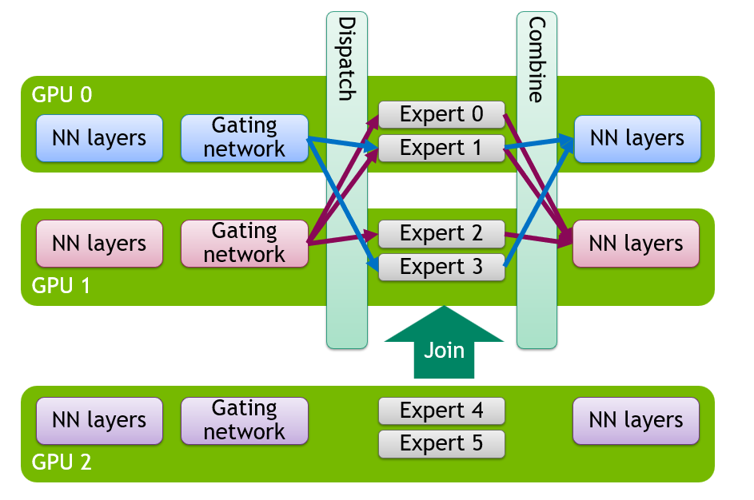

# Elastic Expert Parallelism in vLLM

Expert parallelism (EP) is a key technique for serving Mixture-of-Experts (MoE) models at high throughput. WideEP deployments (where EP spans many workers) maximize KV cache capacity, enabling very high concurrency or very long contexts. This is especially important for reinforcement learning workloads, which need both long context and high throughput, and agentic workloads, where multiturn conversations can stretch context length.

In vLLM, as in many other inference frameworks, EP was **static**: once a deployment started, its serving capacity was fixed. If request volume rose beyond that capacity, vLLM could not scale up to meet demand. If demand fell, it could not scale down to reduce GPU usage and cost. The only viable option was a full restart with a new configuration, which was slow and could drop a substantial amount of traffic.

**Elastic Expert Parallelism** (Elastic EP) changes this. It lets vLLM reconfigure the number of workers at runtime, so MoE deployments can scale up or down as demand changes, with minimal interruption to serving.

Elastic EP scales by adding or removing data-parallel (DP) workers. In vLLM, that changes the size of the shared expert-parallel (EP) group and how experts are distributed across workers, as we explain in [Background](#background-expert-parallelism-and-dp-attention). A single API call is all it takes:

```bash
curl -X POST http://localhost:8000/scale_elastic_ep \
  -H "Content-Type: application/json" \
  -d '{"new_data_parallel_size": 8}'
```

This API call resizes a running deployment from its current DP size to 8 workers.



<p align="center"><em>Elastic EP scale-up: a new GPU joins an active deployment, expanding the EP group without restarting existing workers.</em></p>

This post describes Elastic EP in vLLM ([RFC #20323](https://github.com/vllm-project/vllm/issues/20323), [PR #34861](https://github.com/vllm-project/vllm/pull/34861)), including the scale-up and scale-down flows, how vLLM coordinates reconfiguration with ongoing request execution, how the feature interacts with EPLB and EP communication backends, and why this work is highly relevant to vLLM's emerging fault-tolerance direction. It also discusses NIXL EP ([PR #35627](https://github.com/vllm-project/vllm/pull/35627)) as one backend whose communication model is particularly relevant to elastic reconfiguration and fault tolerance.

> **TL;DR for operators:**
> - Elastic EP lets vLLM scale MoE deployments up or down at runtime by changing DP size, without restarting the server.
> - You trigger a resize with `POST /scale_elastic_ep`; vLLM reconfigures the live topology and redistributes experts as needed.
> - This runtime reconfiguration path is a core building block for fault-tolerant serving in vLLM.
> - NIXL EP can significantly reduce reinitialization work during scale events and provide EP-side failure detection, reporting, and recovery capabilities.

## Background: Expert Parallelism and DP Attention

In MoE models, the attention layers remain dense, while most feed-forward layers are replaced with sparse expert layers that route each token to a selected set of experts. Before diving into elastic scaling, it helps to understand the two parallelism strategies that Elastic EP builds on.

**Data Parallel (DP) Attention** uses request-level parallelism: each engine-core handles a different shard of requests and maintains its own KV cache and scheduler. This is especially useful in architectures such as MLA, where tensor parallelism (TP) would otherwise duplicate the KV cache across GPUs, wasting memory and limiting batch size.

**Expert Parallelism (EP)** is used for the expert layers. Instead of sharding each expert across GPUs, experts are distributed across different GPUs, and tokens are dispatched only to the GPUs that own the selected experts.

In vLLM, attention runs independently on each DP worker, while the expert layers share one EP group across those workers (EP group size is `DP x TP`). Elastic EP changes the number of DP workers at runtime, which scales the EP group accordingly and redistributes experts across it.

## The Challenge: What State Needs to Change?

Scaling DP at runtime is not just a matter of launching or terminating processes. A change in EP size invalidates several pieces of runtime state:

- **Distributed communication groups.** The EP, DP, and world groups all embed a fixed rank set.
- **Expert assignment.** The mapping from experts to ranks changes when the EP size changes.
- **Model weights.** New ranks need model weights, and existing ranks may need updated expert weights after redistribution.
- **CUDA graphs and compiled state.** Both CUDA graph capture and `torch.compile` specialize around assumptions that change when the topology changes.

The implementation therefore treats scaling as a coordinated state machine. Each stage has explicit synchronization points, and those synchronization points must coexist safely with model forward execution.

## Scale-Up Flow

Scale-up from `DP=N` to `DP=M` (where `M > N`) is more complex than scale-down, as new ranks need to be brought into a live deployment.

1. Trigger and Request Handling

    The operation starts at `/scale_elastic_ep`. If `VLLM_ELASTIC_EP_DRAIN_REQUESTS=1` is set, vLLM first waits for in-flight work to drain, up to `drain_timeout` seconds (120 by default). Otherwise, scaling proceeds immediately.

2. New Engine Core Initialization

    Spinning up new engine-core workers relies on the Ray DP backend. During scale-up, the Ray DP backend brings up the additional DP workers needed for the target DP size on currently available GPUs. The new ranks receive the current expert mapping and initialize the model with placeholder weights. They then wait for the later transfer and reconfiguration stages that bring them into the active topology.

    Readiness is coordinated in two phases: one signal allows the existing ranks to create standby groups, and a later signal allows weight transfer to begin.

3. Standby Communication Groups

    A key design choice is that vLLM does not immediately tear down the active communication groups. Instead, the existing ranks first create **standby groups** that span the target set of ranks. These groups are created with `StatelessGroupCoordinator`, which is independent of PyTorch's global `WORLD` state.

    This makes it possible to prepare the new configuration before the switch, while the old configuration can still execute forward passes in the meantime.

    With `nixl_ep`, this transition can be incremental: instead of tearing down and recreating all EP-side connections, vLLM can add or remove ranks via NIXL EP's `connect_ranks()` / `disconnect_ranks()` APIs while keeping existing connections unaffected.

4. Expert Mapping and Weight Transfer

    Once the standby groups exist, we use them to broadcast the current expert mapping and transfer non-expert weights from the existing ranks to the new ranks, with the transfer work spread as evenly as possible across the existing ranks. Elastic EP reuses the same GPU-to-GPU send/receive path that EPLB uses for expert-weight movement, but extends it to attention layers, norms, embeddings, and other non-expert weights as well, using the available high-speed interconnect such as NVLink within a node or RDMA across nodes.

    Expert weights are not moved in this stage. They will be transferred by EPLB later, after the new topology becomes active. Ordinary EPLB activity is paused during the transition so it does not interfere with reconfiguration.

5. The Switch

    The switch is the point where all ranks stop using the old topology and start using the new one. At this stage, vLLM:

    1. Releases CUDA graphs and resets `torch.compile` state.
    2. Promotes the standby groups to active EP, DP, and world groups.
    3. Destroys the old groups.
    4. Reconfigures the MoE modules for the new EP size.
    5. Re-warms the model so CUDA graphs and compiled paths match the new setup.

    Engine coordination state, such as the running flag, wave counter, and step counter, is synchronized across the new DP group so that every rank resumes from a consistent point.

    At this point, the new ranks are part of the active DP group and can participate in forward passes and run attention, but they do not yet own experts. Expert ownership is updated in the EPLB reshuffle that follows.

6. EPLB Reshuffle

    With the new topology now active, EPLB redistributes experts across all `M` ranks. This updates the expert mapping and performs the expert-weight movement needed for the new layout. Normal EPLB operation resumes after the reshuffle completes.

## Scale-Down Flow

Scale-down from `DP=M` to `DP=N` follows the same general pattern as scale-up, but with one important difference: EPLB reshuffle must happen first. Ranks that are about to be removed may still own expert weights, so all `M` engine cores first participate in a reshuffle that consolidates experts onto the `N` surviving ranks and migrates any required expert weights off the departing ranks.

## Coordinating Reconfiguration Steps Across DP Ranks

One subtle issue is that DP engine cores run asynchronously, so they may receive a reconfiguration notification at slightly different times. By the time some ranks reach the next Elastic EP stage, others may already have started one more forward step. If the early ranks were to proceed immediately, the group would split between reconfiguration and forward execution, which deadlocks the deployment.

Elastic EP handles this with a **two-stage barrier**. The first barrier uses a timeout: if it does not complete in time, the ranks that arrived infer that some peers have already entered one more engine step, so they also return to the engine loop for one more iteration instead of proceeding alone. On the next iteration, once all ranks reach the same boundary, a second barrier without the timeout path lets them enter the next stage together.

## Path to Fault Tolerance

Elastic EP is a core building block for fault tolerance because it gives vLLM the runtime reconfiguration path needed after a failure. If a rank dies, Elastic EP provides the scale-down and scale-up path needed to remove that rank, redistribute its experts, and later add replacement capacity back without restarting the entire deployment. This is part of the broader fault-tolerance direction discussed in [RFC #30112](https://github.com/vllm-project/vllm/issues/30112).

At a high level, the recovery flow looks like this:

1. **Detect** the failure through health checks or backend-specific failure signals.
2. **Scale down** to remove the failed rank and redistribute its experts.
3. **Scale up** again once replacement capacity is available.

NIXL EP is also relevant here because it can detect, report, and recover from failures on the EP side, as well as reconnect replacement ranks when capacity becomes available again.

## Next Steps

Elastic EP already provides the core runtime reconfiguration path, but the current implementation still has a fairly specific scope and several obvious follow-on areas:

- **Support richer parallel configurations.** This includes `tensor_parallel_size>1` and additional parallelism configurations.
- **Support more serving features.** The current implementation caps `api_server_count` at 1 and does not yet support DBO or MoE draft/drafter models.
- **Reduce the reconfiguration window.** There is still work to do around overlap, warmup cost, CUDA graph recapture, and reuse of previously prepared state.
- **Connect Elastic EP to autoscaling policies.** The runtime control plane is there; policy and orchestration are separate work (Dynamo, llm-d).
- **Support additional DP backends.** Scale operations currently depend on the Ray DP backend.

## Getting Started

### Launch with Elastic EP Enabled

The example below uses `DeepSeek-V2-Lite-Chat` as a small MoE example. The current implementation targets Ray DP deployments with `tensor_parallel_size=1`, one API server, and no DBO.

```bash
vllm serve deepseek-ai/DeepSeek-V2-Lite-Chat \
    --trust-remote-code \
    --tensor-parallel-size 1 \
    --data-parallel-size 2 \
    --data-parallel-backend ray \
    --api-server-count 1 \
    --enable-expert-parallel \
    --enable-elastic-ep \
    --enable-eplb \
    --eplb-config.num_redundant_experts 0 \
    --all2all-backend allgather_reducescatter \
    --gpu-memory-utilization 0.8
```

### Scale Up at Runtime

With the Ray DP backend, adding capacity can be as simple as joining another node to the Ray cluster; once Ray sees the new GPUs, Elastic EP can scale the deployment onto them at runtime.

For example, on a new worker node:

```bash
ray start --address="${HEAD_NODE_IP}:6379"
```

```bash
curl -X POST http://localhost:8000/scale_elastic_ep \
  -H "Content-Type: application/json" \
  -d '{"new_data_parallel_size": 16}'
```

### Scale Down

```bash
curl -X POST http://localhost:8000/scale_elastic_ep \
  -H "Content-Type: application/json" \
  -d '{"new_data_parallel_size": 8}'
```

### Using NIXL EP as the Communication Backend

If you want to use NIXL EP with Elastic EP:

```bash
uv pip install nixl

vllm serve deepseek-ai/DeepSeek-V2-Lite-Chat \
    --trust-remote-code \
    --tensor-parallel-size 1 \
    --data-parallel-size 2 \
    --data-parallel-backend ray \
    --api-server-count 1 \
    --enable-expert-parallel \
    --enable-elastic-ep \
    --enable-eplb \
    --all2all-backend nixl_ep
```

See the [NIXL repository](https://github.com/ai-dynamo/nixl) for installation details and transport configuration.

## References

- [RFC #20323: Elastic Expert Parallelism](https://github.com/vllm-project/vllm/issues/20323)
- [PR #34861: [1/N] Elastic EP Milestone 2](https://github.com/vllm-project/vllm/pull/34861)
- [PR #35627: [2/N] Elastic EP Milestone 2: Integrating NIXL-EP](https://github.com/vllm-project/vllm/pull/35627)
- [RFC #30112: Fault-Tolerant Expert Parallelism](https://github.com/vllm-project/vllm/issues/30112)
- [RFC #16037: Data Parallel Attention and Expert Parallel MoEs](https://github.com/vllm-project/vllm/issues/16037)
