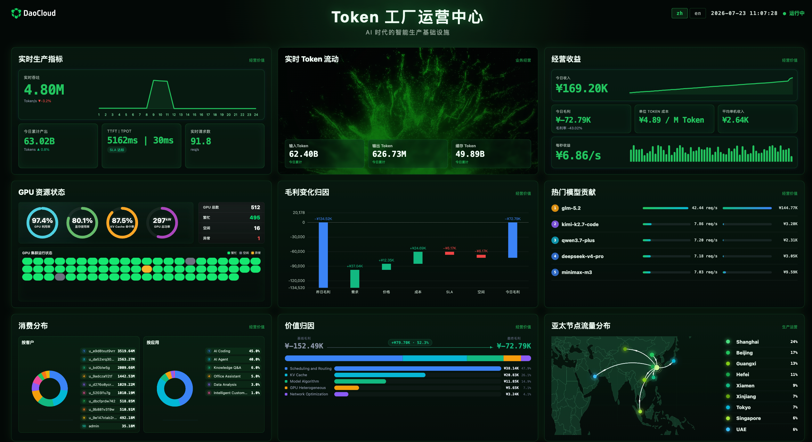
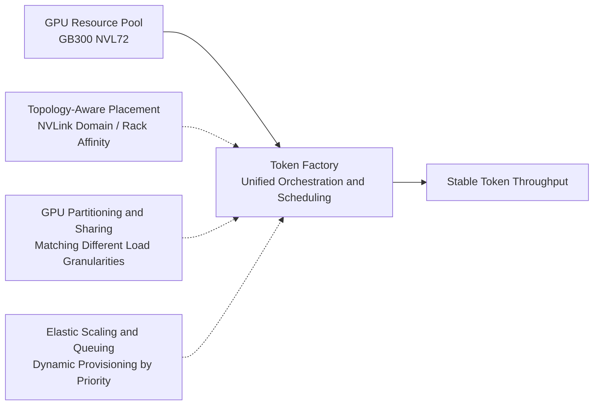
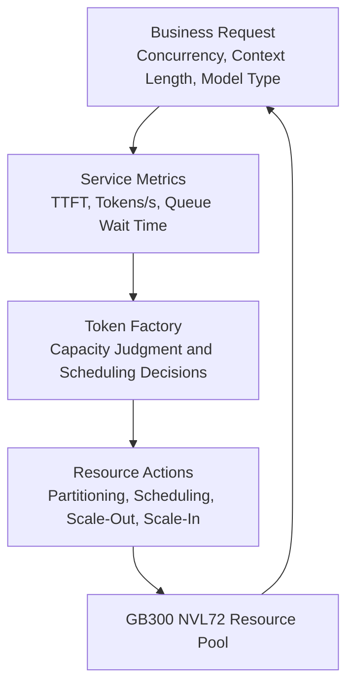

# From GPU Utilization to Token Throughput: DaoCloud's GB300 NVL72 Orchestration Practice

The arrival of [GB300 NVL72](https://www.nvidia.com/en-us/data-center/gb300-nvl72/) gives a single AI rack unprecedented compute density and interconnect bandwidth. But for enterprises, the challenge has never been simply "having more GPUs"—it is how to continuously and stably convert these GPUs into the Token throughput the business needs.

If compute is still used in the manner of "request a few cards, run one task", high-value GPUs easily fall into two kinds of inefficiency: on one side, small models or low-concurrency services exclusively occupy entire cards, leaving VRAM and compute resources idle; on the other side, distributed tasks are randomly scattered across different nodes or even different racks, and communication overhead devours the performance advantage brought by the hardware interconnect.

The value of GB300 NVL72 precisely needs to be unlocked through cloud-native resource orchestration capabilities: transforming the high bandwidth and high density of the hardware into measurable and operable Token throughput.

## NVL72 Is Not Just 72 GPUs Added Together

For large-model training and inference, the number of GPUs is only part of the resource supply. Model parallelism, KV Cache transfer, expert parallelism, and distributed communication are all highly sensitive to compute location and network path.

In strongly interconnected systems such as NVL72, the in-rack NVLink domain provides extremely high bandwidth; when a workload crosses the NVLink domain, rack, or network tier, both latency and bandwidth characteristics change significantly. Therefore, what determines actual efficiency is not just the number of GPUs, but whether a task hits the right NVLink domain, network path, and resource combination. Random scheduling may let a task "run", but it does not necessarily keep the system running in its proper efficiency range.

[NVIDIA's blog on Kubernetes inference practice](https://developer.nvidia.com/blog/streamline-complex-ai-inference-on-kubernetes-with-nvidia-grove/) also emphasizes the importance of topology-aware placement, co-scheduling, and high-speed data paths: for multi-role inference workloads, components with frequent data exchange should be kept within an appropriate topology scope as much as possible.

What the Token Factory does is precisely to transform the underlying hardware topology into resources and constraints that the upper layer can understand and schedule: letting tasks that need close collaboration preferentially obtain adjacent compute and communication resources, so that high-value interconnect is not consumed by ineffective data movement.

## From "Allocating GPUs" to "Matching Workloads"

Different AI tasks have different GPU requirements.

Online inference cares more about time-to-first-token (TTFT), concurrency, and stability; offline batch inference pursues throughput; training and fine-tuning usually require a whole group of GPUs, stable network paths, and coordinated startup. If all tasks are allocated in the manner of whole cards, static assignment, and the same priority, it not only easily forms resource fragmentation, but also leaves high-priority business without protection when resources are tight.

The Token Factory receives GB300 NVL72 compute with a unified resource pool, and orchestrates according to the resource requirements of the workloads and business priorities:

- For lightweight, elastic, or multi-tenant tasks, it provides suitable GPU resource partitioning, sharing, and isolation strategies based on workload characteristics, reducing whole-card idleness.
- For distributed tasks that require strong communication, it uses whole-group resource requests and co-scheduling to avoid situations where only part of a task starts while the rest of the resources wait for a long time.
- For high-priority online business, it provides quotas, queues, and priority control to preferentially guarantee core services when resources are tight.
- For interruptible or batch tasks, it runs them in idle windows, letting low-priority loads absorb fragmented resources without affecting the experience of key business.

This turns GPUs from fixed assets that are merely "handed out" into production resources that can be continuously scheduled and supplied on demand.

The resource combination and measurement methods required by different workloads also differ. The Token Factory does not allocate resources merely by GPU count, but aligns scheduling strategy with business goals:

| Workload | Focus | Orchestration Strategy | Result Metric |
| --- | --- | --- | --- |
| Online inference | TTFT, concurrency, and stability | Priority control, topology affinity, elastic replicas | Time to first token, Tokens/s |
| Batch inference | Throughput and cost | Queue scheduling, idle resource reclamation | Task completion time, cost per Token |
| Training and fine-tuning | Coordinated startup and communication efficiency | Whole-group resource requests, topology-aware placement | GPU utilization, training throughput |

## Scaling Up and Down with Token Demand

Traditional GPU operations often measure scale by "number of cards": how many GPUs there are, how many GPUs are allocated, and what the average GPU utilization is. But for inference business, the real questions to answer are: how many Tokens can the current cluster stably deliver? Is the user experience up to standard? Is the cost controllable?

Therefore, the scheduling target of the Token Factory should go beyond the number of GPU cards and build a feedback loop oriented to Token throughput: identify load characteristics, match suitable GPU and topology resources, execute scheduling and scaling based on service metrics, and then feed resource actions back to business requests.

When requests grow, time-to-first-token approaches the target threshold, or the queue keeps backing up, the system should be able to expand the corresponding inference capacity; when the load falls back, it reclaims idle resources and returns them to other businesses. For different models, different context lengths, and different concurrency patterns, resource sufficiency should also be evaluated by actual throughput rather than static GPU count.

This model upgrades capacity management from "how many cards to reserve" to "how many Tokens to deliver on demand", establishing a more direct link between compute investment and business outcomes.

## Cloud-Native Orchestration Is the Operational Capability of AI Infrastructure

GB300 NVL72 provides the hardware foundation of high-density compute and high-speed interconnect, but hardware capability does not automatically translate into business efficiency. To fully utilize NVL72, GPU, network, topology, queues, priority, and elastic capabilities must be brought into the same cloud-native control system.

DaoCloud's Token Factory is aimed precisely at this process: it receives heterogeneous AI workloads with unified orchestration, improves the efficiency of strongly communicating tasks through topology awareness, improves overall utilization through resource partitioning and sharing, and dynamically aligns compute supply with Token demand through elastic mechanisms.

From GPU utilization to Token throughput, what changes is not just a metric, but an upgrade in the way AI compute is operated: capability is no longer measured by "how many cards you own", but value is defined by "how stably, efficiently, and predictably you can deliver intelligent services". The goal of the Token Factory is not to have GPUs allocated, but to let every bit of compute continuously produce Tokens in a measurable and operable way; facing GB300 NVL72, DaoCloud will continue to explore more efficient cloud-native AI compute orchestration paths.

Further reading: [NVIDIA's practice on disaggregated LLM inference, co-scheduling, and topology-aware placement on Kubernetes](https://developer.nvidia.com/blog/deploying-disaggregated-llm-inference-workloads-on-kubernetes/)
