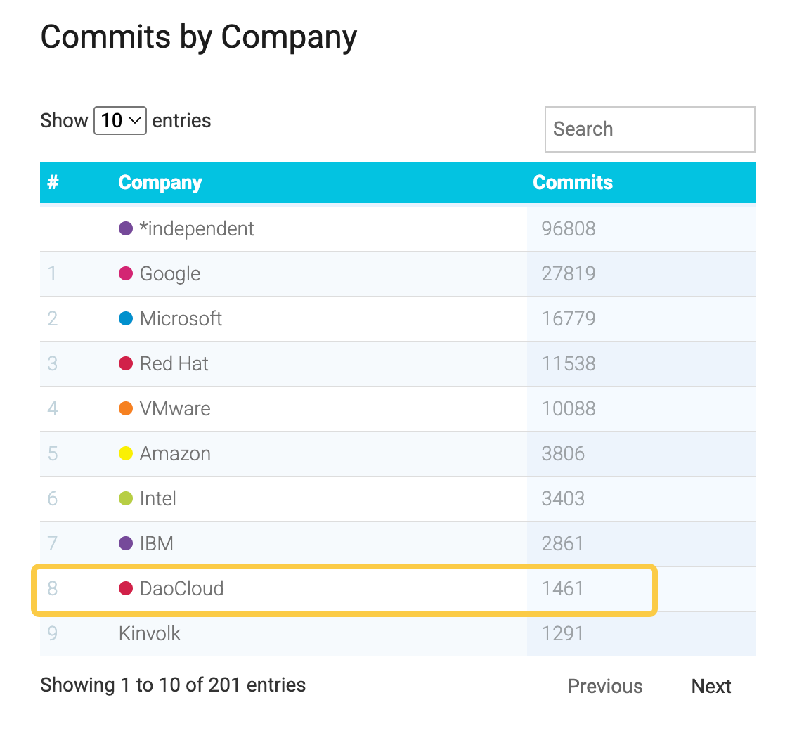

# A Sneak Peek at Kubernetes v1.36

> The original English blog is at [k8s.io/blog/](https://kubernetes.io/blog/2026/03/30/kubernetes-v1-36-sneak-peek/)

Kubernetes v1.36 is expected to be released at the end of April 2026. This release includes several removals and deprecations, as well as a considerable number of feature enhancements. This article will quickly walk you through the most noteworthy changes in this release cycle.

Note that this article is compiled based on the current development state of v1.36, and the final release content may still change.

## Kubernetes API Removal and Deprecation Process

Kubernetes provides a well-established [deprecation policy](https://kubernetes.io/zh-cn/docs/reference/using-api/deprecation-policy/) for APIs and features. The core principles of this policy include:

- A stable (GA) API is only deprecated when a stable replacement version exists
- Each API lifecycle stage has a minimum support period
- A deprecated API is marked in advance and removed in a future release

During the deprecation phase:

- The API can still be used (for at least one year from deprecation)
- Using it produces a warning

Once an API is removed, it becomes unavailable in the current release and must be migrated to an alternative.

The specific rules are as follows:

- GA API: can be deprecated, but will not be removed in the same major version
- Beta API: supported for at least 3 more releases after deprecation
- Alpha API: can be removed in any release without prior notice (in some cases it may also be withdrawn directly)

Whether an API is removed because it successfully graduated or because it failed to advance to a higher stability level, the process strictly follows the above policy. Each time an API is removed, the [deprecation guide](https://kubernetes.io/zh-cn/docs/reference/using-api/deprecation-guide/) provides a clear migration path.

A recent typical example is the retirement of the ingress-nginx project (announced by SIG-Security on March 24, 2026). With the change of maintainership, the community is encouraged to evaluate Ingress controller implementations that better align with current security and maintenance best practices.

This transition reflects Kubernetes' consistent lifecycle management principle: while continuously evolving, it tries to avoid sudden impact on users as much as possible.

## Ingress NGINX Retirement

To prioritize the security of the ecosystem, the Kubernetes SIG Network and the Security Response Committee officially retired Ingress NGINX on March 24, 2026.

From that date:

- No new releases will be published
- No bugs will be fixed
- No new security vulnerabilities will be addressed

However:

- Existing deployments can continue to run
- Installation artifacts such as Helm Charts and container images remain available

For more information, please refer to the [official retirement announcement](https://kubernetes.io/blog/2025/11/11/ingress-nginx-retirement/).

## Deprecations and Removals in Kubernetes v1.36

### Deprecating `.spec.externalIPs` in Service

The Service `spec.externalIPs` field has been officially marked as deprecated. This means that routing arbitrary external IPs to a Service through this field will gradually be phased out.

This field has long posed security risks, potentially leading to man-in-the-middle attack risks (such as [CVE-2020-8554](https://github.com/kubernetes/kubernetes/issues/970760)). Starting from v1.36:

- Using this field will trigger a deprecation warning
- It is planned to be completely removed in v1.43

Suggested alternatives:

- Use a **LoadBalancer** type Service for cloud environment ingress
- Use **NodePort** for basic port exposure
- Use **Gateway API** to build a more flexible and secure traffic management solution

See [KEP-5707: Deprecating service.spec.externalIPs](https://kep.k8s.io/5707) for details

### Removing the `gitRepo` Volume Driver

The `gitRepo` volume type has been deprecated since v1.11. In Kubernetes v1.36, this volume plugin will be **permanently disabled and cannot be re-enabled**.

The core reason for this change is security risk: `gitRepo` could be exploited to allow an attacker to execute code on a node with root privileges.

Although this feature has long been discouraged and alternatives exist, it remained "technically usable" in previous versions. Starting from v1.36, this historical path will be completely closed.

Migration suggestions:

- Use an **init container** to pull code
- Use an external tool such as **git-sync**

See [KEP-5040: Removing the gitRepo volume driver](https://kep.k8s.io/5040) for details

## Key Enhancements in Kubernetes v1.36

The following features are likely to be included in v1.36 (but the final release shall prevail).

### Faster SELinux Volume Labeling (GA)

Kubernetes v1.36 promotes the SELinux volume mount optimization to Generally Available (GA).

Core changes:

- Uses `mount -o context=XYZ`
- Replaces the traditional recursive file relabeling

Benefits:

- More stable performance
- Significantly reduced Pod startup latency (especially when SELinux enforcing mode is enabled)

Evolution path:

- v1.28: Introduced as Beta (applicable to `ReadWriteOncePod`)
- v1.32: Added metrics and fallback options
- v1.36: Officially GA, and extended as the default behavior

How to enable:

- Pod or CSIDriver can explicitly control via `spec.SELinuxMount`

⚠️ Note:
This feature may still introduce compatibility risks in certain scenarios, especially when privileged and non-privileged Pods share volumes.

Developers need to:

- Correctly set `seLinuxChangePolicy`
- Explicitly manage the SELinux labels of volumes

Otherwise, permission conflicts or abnormal operation may result.

See [KEP-1710: Faster Recursive SELinux Label Changes](https://kep.k8s.io/1710) for details

### External Signing of ServiceAccount Tokens

This feature allows delegating the signing process of ServiceAccount Tokens to an external system. Currently in Beta, it is expected to be promoted to GA in v1.36.

Capability improvements include:

- Support for external key management systems (such as cloud KMS)
- Support for Hardware Security Modules (HSM)
- Reduced reliance on the cluster's built-in keys

Implementation:

- `kube-apiserver` delegates signing requests to an external service

Value brought:

- Improved overall security
- Simplified key management system
- More suitable for enterprise-grade centralized signing architecture

See [KEP-740: Supporting External Signing of Service Account Tokens](https://kep.k8s.io/740) for details

### DRA Driver Support for Device Taints and Tolerations

This feature was first introduced in v1.33 and promoted to Beta in v1.36 (enabled by default).

Core capabilities:

- Introduces a node-like "Taint mechanism" for devices
- Controls which workloads can use specific devices

Usage:

- DRA drivers can directly add taints to devices
- Administrators can batch-mark devices via `DeviceTaintRule`

Improvements brought:

- More fine-grained scheduling control
- Prevents general workloads from misusing dedicated hardware

See:

- [Taints and Tolerations](https://kubernetes.io/zh-cn/docs/concepts/scheduling-eviction/taint-and-toleration/)
- [KEP-5055: DRA: Device Taints and Tolerations](https://kep.k8s.io/5055)

### DRA Support for Partitionable Devices {#dra-support-for-partitionable-devices}

v1.36 introduces support for **partitionable devices**, further enhancing DRA capabilities.

Core idea:

- Split a single physical device into multiple logical units
- Support multiple workloads sharing the same device

Typical scenarios:

- High-value resources such as GPUs

Advantages:

- Improved resource utilization
- Avoids waste from whole-card exclusive use
- Balances isolation and sharing

This enables platform teams to:

- Allocate resources on demand
- Improve overall cluster efficiency
- Maximize infrastructure value

See [KEP-4815: DRA Partitionable Devices](https://kep.k8s.io/4815) for details

## Learn More

The Kubernetes release notes will simultaneously provide all new feature and deprecation information. The full content will be officially published in the CHANGELOG:

- [Kubernetes v1.36](https://github.com/kubernetes/kubernetes/blob/master/CHANGELOG/CHANGELOG-1.36.md)

Expected release date: **April 22, 2026 (Wednesday)**

You can also refer to historical versions:

- [Kubernetes v1.35](https://github.com/kubernetes/kubernetes/blob/master/CHANGELOG/CHANGELOG-1.35.md)
- [Kubernetes v1.34](https://github.com/kubernetes/kubernetes/blob/master/CHANGELOG/CHANGELOG-1.34.md)
- [Kubernetes v1.33](https://github.com/kubernetes/kubernetes/blob/master/CHANGELOG/CHANGELOG-1.33.md)
- [Kubernetes v1.32](https://github.com/kubernetes/kubernetes/blob/master/CHANGELOG/CHANGELOG-1.32.md)
- [Kubernetes v1.31](https://github.com/kubernetes/kubernetes/blob/master/CHANGELOG/CHANGELOG-1.31.md)
- [Kubernetes v1.30](https://github.com/kubernetes/kubernetes/blob/master/CHANGELOG/CHANGELOG-1.30.md)

Currently, DaoCloud developers rank 8th globally in code contributions within the Kubernetes ecosystem:

> Contribution data source: [www.stackalytics.io](https://www.stackalytics.io/unaffiliated?project_type=kubernetes-group&date=all)
