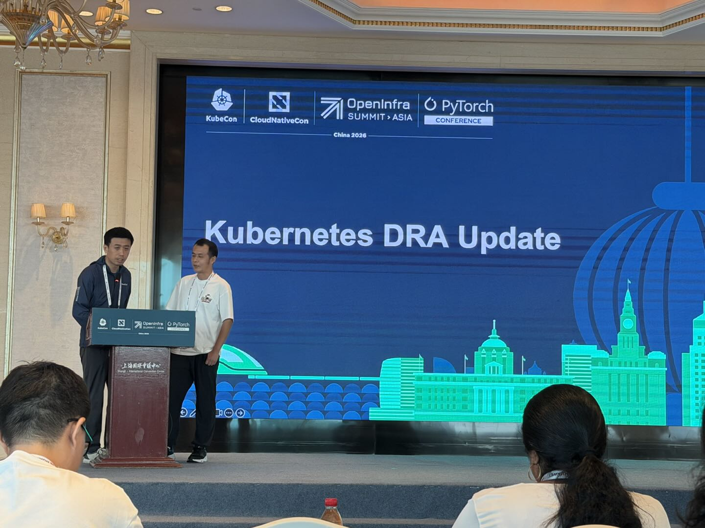
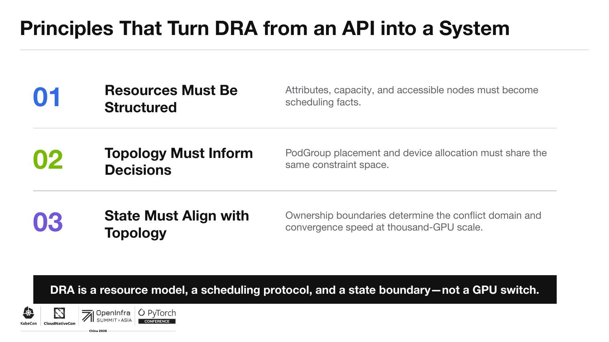
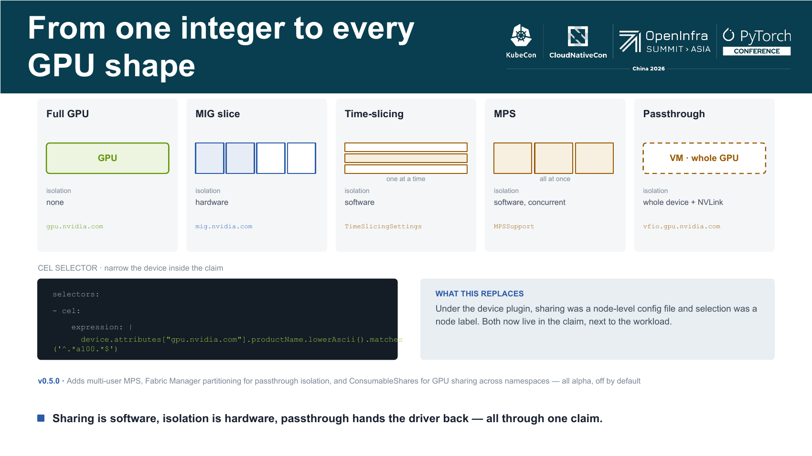
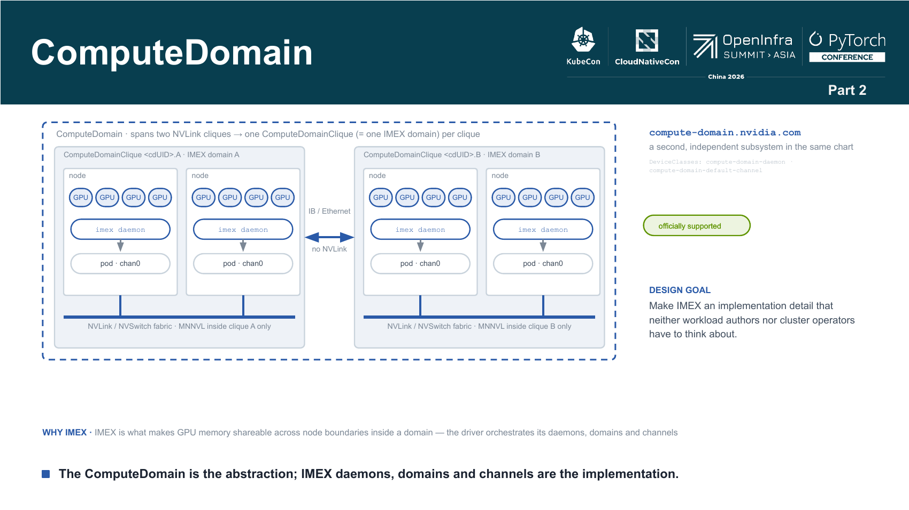
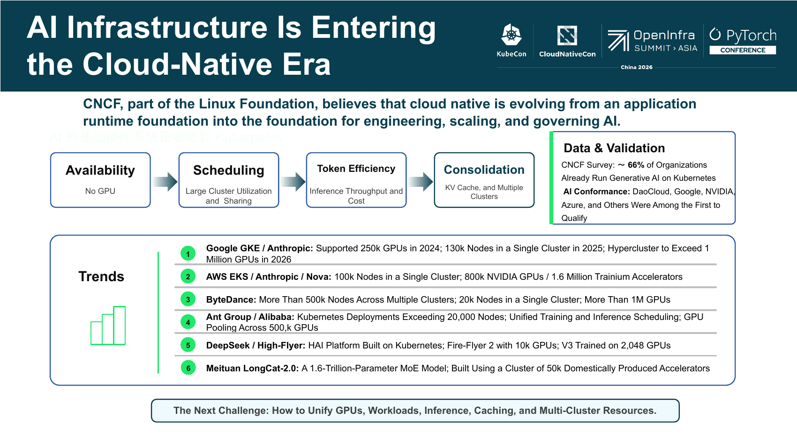

# Kubernetes v1.37 DRA: Six Features for More Flexible Heterogeneous Resource Management

Kubernetes v1.37 brings a wave of major updates to DRA (Dynamic Resource Allocation). If you manage hardware devices such as GPUs, NICs, and FPGAs in your cluster, this release is worth your attention.

Early DRA capabilities were fairly coarse — when a Pod requested a GPU, it could only take the whole device; there was no way to split or share it. v1.37 introduces six new features at once, addressing this problem from multiple angles:

- Can a single GPU be split into multiple shares for different Pods?
- How do we avoid scheduling incompatible device modes together?
- Can network bandwidth be shared on demand like CPU and memory?
- On the security side, can we govern exactly who can change what, and on which node?
- For resources that live purely in the control plane, can we avoid installing a driver on every node?
- How does an application inside a container learn which devices it actually received?

Let's walk through each feature below. Each one is tagged with its corresponding Feature Gate so you can enable it in your cluster as needed.

## Partitionable Devices: Split One Piece of Hardware Into Multiple Shares

### The Problem It Solves

Imagine you have a GPU with 8GB of video memory, but your application only uses 2GB at a time. If you can only allocate the whole device, memory utilization stays low. Could we slice a physical device into multiple logical devices, like cutting a cake, and assign them to different Pods on demand?

**Partitionable Devices** does exactly that. It lets a DRA driver split the consumable resources of an underlying physical device (such as GPU memory or compute units) into multiple shares, exposing them as "logical devices."

### Core Concept: CounterSet

In DRA, the consumable resources of a physical device are recorded using a **CounterSet**. Think of it as a "resource ledger":

- A **CounterSet** is a set of named counters — for example, `gpu-memory` represents the total GPU memory.
- Each logical device declares how many counters it will "consume" (like recording an expense in the ledger).
- The scheduler does the bookkeeping, making sure all logical devices together never exceed the physical total.

To use an analogy: the CounterSet is like the balance on a transit card; each logical device is one ride that deducts a fare, and the scheduler guarantees the balance never goes negative.

> The CounterSet and the devices must be defined in different ResourceSlices, but they must belong to the same pool, so that a device can "spend" resources from that CounterSet.

### An Example

The YAML below shows a GPU with 8Gi of memory, split into two logical devices that each consume 6Gi. Since 6 + 6 > 8, only one of them can be allocated at a time — the scheduler handles this mutual exclusion automatically, and the upper-layer ResourceClaim is completely unaware of it.

```yaml
apiVersion: resource.k8s.io/v1
kind: ResourceSlice
metadata:
  name: resourceslice-with-countersets
spec:
  nodeName: worker-1
  pool:
    name: pool
    generation: 1
    resourceSliceCount: 2
  driver: dra.example.com
  sharedCounters:
  - name: gpu-1-counters
    counters:
      memory:
        value: 8Gi
---
apiVersion: resource.k8s.io/v1
kind: ResourceSlice
metadata:
  name: resourceslice-with-devices
spec:
  nodeName: worker-1
  pool:
    name: pool
    generation: 1
    resourceSliceCount: 2
  driver: dra.example.com
  devices:
  - name: device-1
    consumesCounters:
    - counterSet: gpu-1-counters
      counters:
        memory:
          value: 6Gi
  - name: device-2
    consumesCounters:
    - counterSet: gpu-1-counters
      counters:
        memory:
          value: 6Gi
```

**How to enable:** Partitionable Devices is controlled by the [`DRAPartitionableDevices` feature gate](https://kubernetes.io/zh-cn/docs/reference/command-line-tools-reference/feature-gates/#DRAPartitionableDevices) in `kube-apiserver` and `kube-scheduler`.

## Device Compatibility Groups: Don't Let Incompatible Device Modes "Fight"

### The Problem It Solves

Once devices can be partitioned, a new problem appears: the same GPU may support multiple operating modes (such as NVIDIA's MIG mode and vGPU mode), and these two modes are **mutually exclusive** — the GPU runs either in MIG mode or in vGPU mode, never both at once.

If the scheduler only looks at counters (is there enough memory?), it might place a MIG device and a vGPU device on the same GPU. The result? The conflict is only discovered when the node actually prepares the devices, and the Pod fails to start.

**Device Compatibility Groups** exists to avoid this problem upfront. It lets the driver tell the scheduler "which devices belong together and which cannot coexist," and the scheduler filters out incompatible combinations during the scheduling phase.

> This feature depends on [Partitionable Devices](#partitionable-devices-split-one-piece-of-hardware-into-multiple-shares), because the `compatibilityGroups` field lives on `device.consumesCounters[]`. Both feature gates must be enabled.

### How It Works: Intersection

The rule is actually simple, in one sentence: **multiple devices that draw from the same counter set can only coexist if their compatibility groups have a non-empty intersection.**

Specifically:

- Each `consumesCounters` entry can carry a `compatibilityGroups` list, with at most 2 group names.
- A group name is just a label; Kubernetes doesn't care what it's called, only whether the names match.
- The scheduler checks the group names of all devices pending allocation; if their intersection is empty, it rejects the allocation.

A few more details to note:

- **Ungrouped devices:** A device that declares no group can only be placed with other ungrouped devices; it cannot be mixed with grouped devices.
- **Cross-claim effect:** Even across two different ResourceClaims, as long as they draw devices from the same counter set, the group-intersection rule applies.
- **Isolation per counter set:** Groups on different CounterSets do not affect each other.

### An Example

Still the same 8Gi GPU: the driver publishes two logical devices, one in MIG mode and one in vGPU mode, each consuming 4Gi. Looking only at memory, there's enough for both — but the modes are incompatible.

```yaml
apiVersion: resource.k8s.io/v1
kind: ResourceSlice
metadata:
  name: gpu-counters
spec:
  nodeName: worker-1
  pool:
    name: gpu-pool
    generation: 1
    resourceSliceCount: 2
  driver: gpu.example.com
  sharedCounters:
  - name: gpu-0-memory
    counters:
      memory:
        value: 8Gi
---
apiVersion: resource.k8s.io/v1
kind: ResourceSlice
metadata:
  name: gpu-devices
spec:
  nodeName: worker-1
  pool:
    name: gpu-pool
    generation: 1
    resourceSliceCount: 2
  driver: gpu.example.com
  devices:
  - name: gpu-0-mig
    consumesCounters:
    - counterSet: gpu-0-memory
      counters:
        memory:
          value: 4Gi
      compatibilityGroups:
      - mig
  - name: gpu-0-vgpu
    consumesCounters:
    - counterSet: gpu-0-memory
      counters:
        memory:
          value: 4Gi
      compatibilityGroups:
      - vgpu
```

If a Pod requests two devices, the scheduler finds `{"mig"} ∩ {"vgpu"} = ∅` (empty intersection) and rejects the combination outright. Despite enough memory, the modes are incompatible and cannot be placed together.

### Constraint Quick Reference

- Each `consumesCounters[]` entry may list at most **2** group names.
- Group names within the same entry must not repeat.
- Group names are meaningful only within the resource pool of the same driver.
- Groups on different counter sets do not interfere with each other.

### Version Skew Safety

If you enable this feature and then disable it again (it is off by default in the alpha stage), kube-apiserver strips the `compatibilityGroups` field when creating or updating a ResourceSlice. When the scheduler finds the devices in a pool "incomplete," it skips the entire pool to avoid problems.

Note that both `null` and an empty list `[]` are equivalent to "not set" and will not trigger the skip logic above.

**How to enable:** Controlled by the [`DRADeviceCompatibilityGroups` feature gate](https://kubernetes.io/zh-cn/docs/reference/command-line-tools-reference/feature-gates/#DRADeviceCompatibilityGroups) in kube-apiserver and kube-scheduler, and requires the [`DRAPartitionableDevices` feature gate](https://kubernetes.io/zh-cn/docs/reference/command-line-tools-reference/feature-gates/#DRAPartitionableDevices) as well.

## Consumable Capacity: One Device Shared by Many

### The Problem It Solves

The "Partitionable Devices" described above pre-slices a physical device into multiple logical devices, each Pod taking one complete logical device.

But some scenarios are different. Take a NIC with 10G of total bandwidth — you might want 10 Pods to each use 1G. The total capacity is fixed, but Pods draw on demand, using what they take and leaving the rest for others.

This is what **Consumable Capacity** addresses. Think of it as "CPU/memory-style sharing for devices": just as a node's CPU can be divided among multiple Pods in milli units, a device's bandwidth or compute can be divided among multiple ResourceClaims by capacity.

### Core Concepts

Consumable Capacity involves two key fields:

- **`allowMultipleAllocations`**: Set to `true` on a device in the ResourceSlice, meaning the device allows multiple claims to share it.
- **`capacity`**: Specified in the ResourceClaim request, telling the scheduler how much capacity you want to consume.

The scheduler's job is bookkeeping — making sure the capacity all claims "take" from one device never exceeds the device's total capacity.

A driver can also enforce capacity request rules via `requestPolicy`, such as a minimum request size and the step size for increments. It's like buying bubble tea: the smallest cup is a medium, and a large can only be upgraded in fixed sizes.

### An Example

Below is a NIC with 10G of bandwidth that allows multiple allocations. The bandwidth request has a minimum of 1M, increments by multiples of 8, and defaults to 1M.

```yaml
kind: ResourceSlice
apiVersion: resource.k8s.io/v1
metadata:
  name: resourceslice
spec:
  nodeName: worker-1
  pool:
    name: pool
    generation: 1
    resourceSliceCount: 1
  driver: dra.example.com
  devices:
  - name: eth1
    allowMultipleAllocations: true
    attributes:
      name:
        string: "eth1"
    capacity:
      bandwidth:
        requestPolicy:
          default: "1M"
          validRange:
            min: "1M"
            step: "8"
        value: "10G"
```

The user declares a 1G bandwidth request in a ResourceClaimTemplate:

```yaml
apiVersion: resource.k8s.io/v1
kind: ResourceClaimTemplate
metadata:
  name: bandwidth-claim-template
spec:
  spec:
    devices:
      requests:
      - name: req-0
        exactly:
          deviceClassName: resource.example.com
          capacity:
            requests:
              bandwidth: 1G
```

After a successful allocation, the result tells you the actually consumed capacity, plus a `shareID` identifying this shared allocation:

```yaml
apiVersion: resource.k8s.io/v1
kind: ResourceClaim
...
status:
  allocation:
    devices:
      results:
      - consumedCapacity:
          bandwidth: 1G
        device: eth1
        shareID: "a671734a-e8e5-11e4-8fde-42010af09327"
```

One thing to watch: if a pool contains both "multiple-allocation" devices and "whole-device" devices, the scheduler may pick a whole one. If your workload must use shared mode, add a CEL selection: `device.allowMultipleAllocations == true`.

### DistinctAttribute Constraint

When you request multiple devices in a single ResourceClaim, the **DistinctAttribute** constraint guarantees that the devices you get have different values for a given attribute.

Why is this useful? Two examples:

- You request 4 shareable GPU instances but don't want all 4 on the same physical card — use DistinctAttribute to spread them by the `numa_node` attribute.
- You request multiple NICs and want them to come from different physical NICs rather than multiple shared instances of the same one.

In short, this constraint helps you with "device distribution optimization."

## Fine-Grained Status Authorization: Who Can Change What, Down to the Node

### The Problem It Solves

In Kubernetes, RBAC controls who can perform which operations on which resources. But for a DRA ResourceClaim, coarse-grained control like "can you update the status or not" is not enough.

Why? Because updating a ResourceClaim's status might be done by the scheduler or by a kubelet on some node. From a security standpoint, the ideal is: **each node can only update the portion of status related to itself**, rather than every node having the power to update the status of every ResourceClaim.

Starting with Kubernetes v1.37, DRA introduces **Fine-Grained Status Authorization**, using synthetic subresources and node-aware verbs to make the authorization granularity finer.

What does this mean? In short:

- It's no longer a binary "allow/deny updating ResourceClaim status."
- You can precisely control "who can update which subresources."
- And you can control "on which nodes the update is allowed."

This is an important security hardening for multi-tenant clusters and zero-trust security models.

**To learn more:** Including RBAC examples for the scheduler and the DRA driver, see the official [Hardening Guide - Dynamic Resource Allocation](https://kubernetes.io/zh-cn/docs/concepts/security/hardening-guide/dynamic-resource-allocation/). The cluster-admin procedures are in [Hardening Dynamic Resource Allocation in Your Cluster](https://kubernetes.io/zh-cn/docs/tasks/administer-cluster/hardening-dra/).

## Optional Node Operations: Control-Plane Resources Don't Need a Driver on Every Node

### The Problem It Solves

In the standard DRA flow, every node must have a corresponding driver plugin, and kubelet calls the driver over gRPC to prepare/unprepare devices. This is necessary for hardware like GPUs and FPGAs that genuinely require node-local operations.

But some resources are managed entirely in the control plane — virtual devices, cloud resource quotas, and the like. Deploying an "empty-shell driver" on every node for them wastes resources and adds maintenance cost.

**Optional Node Operations** solves this. A driver can declare "these devices don't need node-local operations," and when kubelet sees that, it skips the gRPC call and doesn't look for a driver.

### How to Configure

Add a `skipNodeOperations` field to the ResourceSlice, listing which operations to skip:

- `"NodePrepareResources"`: Skip the gRPC call to prepare devices (you must also skip `NodeUnprepareResources`, otherwise the Pod may stall at termination).
- `"NodeUnprepareResources"`: Skip the gRPC call to unprepare devices.
- `"*"`: Skip everything.

Here is an example of a control-plane resource, skipping all node operations:

```yaml
apiVersion: resource.k8s.io/v1
kind: ResourceSlice
metadata:
  name: control-plane-resources
spec:
  nodeName: worker-1
  pool:
    name: central-pool
    generation: 1
    resourceSliceCount: 1
  driver: control-plane.example.com
  skipNodeOperations:
  - "*"
  devices:
  - name: virtual-device-1
```

### Execution Flow

When the scheduler allocates a device, it copies `skipNodeOperations` from the ResourceSlice into the ResourceClaim's allocation result:

```yaml
apiVersion: resource.k8s.io/v1
kind: ResourceClaim
...
status:
  allocation:
    devices:
      results:
      - device: virtual-device-1
        driver: control-plane.example.com
        pool: central-pool
        skipNodeOperations:
        - "*"
```

When the Pod runs, kubelet reads the allocation result; if all devices of a driver skip the same operation, kubelet simply doesn't call that gRPC hook.

### Operational Notes

**Be careful when upgrading drivers in place**

Because `skipNodeOperations` is copied at allocation time, already-running Pods keep the setting from then. If you change a driver from "needs node operations" to "doesn't," old claims still follow the old rules.

So before making such a change (especially when decommissioning a node-driver DaemonSet), confirm the driver has no active claims before proceeding, or Pods may stall at termination because the driver can't be found.

**Integration with the Node-Declared Features feature**

Not every kubelet version supports skipping DRA operations. To prevent Pods from being scheduled to unsupported nodes, this feature is integrated with the [Node-Declared Features feature](https://kubernetes.io/zh-cn/docs/concepts/scheduling-eviction/node-declared-features/) — the scheduler first confirms the target node declares `DRAOptionalNodeOperations` support before scheduling a Pod that uses skipped operations.

**How to enable:** Controlled by the [`DRAOptionalNodeOperations`](https://kubernetes.io/zh-cn/docs/reference/command-line-tools-reference/feature-gates/#DRAOptionalNodeOperations) feature gate in `kube-apiserver`, `kube-scheduler`, and `kubelet`.

## Device Metadata: How Containers Know Which Devices They Got

### The Problem It Solves

Imagine: your application runs in a container, and DRA allocates it a GPU. But how does the application learn the GPU's specifics — its UUID, PCI address, driver version?

The old approach was either to have the application call the Kubernetes API to query, or to roll your own sidecar to inject the information. The former adds load on the API server and raises permission-management issues; the latter is both cumbersome and inconsistent.

**DRA Device Metadata** provides a standard solution: the driver writes device information to a JSON file, mounted at a fixed path inside the container. The application just reads the file — no API call, no concern about who provided it.

KEP-5304 defines the standard format of this protocol. If you use the official [DRA kubelet plugin library](https://pkg.go.dev/k8s.io/dynamic-resource-allocation/kubeletplugin), all of this is implemented for you.

> Device metadata follows the same rules as device access: only containers that explicitly request the device in their container spec can see the corresponding metadata file.

### The Protocol's Four Rules

1. Where the file goes

    Metadata files live in the container's `/var/run/kubernetes.io/dra-device-attributes` directory:

    - Direct ResourceClaim reference: `resourceclaims/<claimName>/<requestName>/<driverName>-metadata.json`
    - Created via ResourceClaimTemplate: `resourceclaimtemplates/<podClaimName>/<requestName>/<driverName>-metadata.json`

    The path constants are defined in the [`k8s.io/dynamic-resource-allocation/api/metadata`](https://pkg.go.dev/k8s.io/dynamic-resource-allocation/api/metadata) package.

2. What's in the file

    Each file is a JSON stream of one or more `DeviceMetadata` objects, with standard `apiVersion` and `kind` fields. The same metadata is encoded once per supported API version (newest version first); the application reads the first one it can parse.

    See the [`DeviceMetadata` API docs](https://pkg.go.dev/k8s.io/dynamic-resource-allocation/api/metadata/v1alpha1#DeviceMetadata) for field details.

3. How to detect an update

    Each time the driver updates a metadata file, it must increment `metadata.generation` by 1. The application watches this field to know the data changed.

4. How it gets into the container

    Usually via a CDI (Container Device Interface) bind mount. As long as the file path is correct and read-only inside the container, other means work too.

### How It Works

Device metadata is a driver-side capability; it requires no change to the Kubernetes API and has no dedicated feature gate.

The driver generates the metadata files and the CDI mount configuration while preparing the device for the Pod; the files are already at the agreed location before the container starts. If a request involves multiple drivers, each writes its own metadata file, and the container can discover all devices by enumerating the `*-metadata.json` files in the directory.

If you write Go applications, the official [`k8s.io/dynamic-resource-allocation/devicemetadata`](https://pkg.go.dev/k8s.io/dynamic-resource-allocation/devicemetadata) package provides helper functions for reading these files.

### A Concrete JSON Example

Below is a sample metadata file for a GPU device, showing the driver version, index, model, UUID, and so on:

```json
{
  "kind": "DeviceMetadata",
  "apiVersion": "metadata.resource.k8s.io/v1alpha1",
  "metadata": {
    "name": "pod0-gpu-2kqrd",
    "namespace": "gpu-test1",
    "uid": "c7e7b22e-239b-4498-b27c-7f1344481e14",
    "generation": 1
  },
  "podClaimName": "gpu",
  "requests": [
    {
      "name": "gpu",
      "devices": [
        {
          "driver": "gpu.example.com",
          "pool": "worker-0",
          "name": "gpu-0",
          "attributes": {
            "driverVersion": {
              "version": "1.0.0"
            },
            "index": {
              "int": 0
            },
            "model": {
              "string": "LATEST-GPU-MODEL"
            },
            "uuid": {
              "string": "gpu-18db0e85-99e9-c746-8531-ffeb86328b39"
            }
          }
        }
      ]
    }
  ]
}
```

### Two Delivery Modes: Immediate vs. Delayed

A driver can populate metadata at two different times:

**Immediate mode:** The metadata is written while the device is being prepared on the node, so the file is complete before the container starts. GPU drivers are usually this mode, since device information is available during the prepare phase.

**Delayed mode:** Some devices (network devices, for example) only reveal their information after the Pod sandbox is created. In this case the driver first creates an empty placeholder file, then writes the real metadata into it via an NRI hook before the container starts. Each update must increment `metadata.generation`. This way the application never reads a "half-written" file.

In either mode, the metadata stays available for the container's entire lifetime, and the files are cleaned up once all containers in the Pod have exited.

To learn how applications consume the metadata, see [Accessing DRA Device Metadata](https://kubernetes.io/zh-cn/docs/tasks/configure-pod-container/assign-resources/access-dra-device-metadata/).

### Writing Your Own Driver

If you don't use the official kubelet plugin library but implement a DRA driver yourself, you must implement this metadata protocol on your own. The essentials are three:

1. Put the file at the correct path.
2. Increment `metadata.generation` by 1 on every update.
3. Mount the file read-only into the container via CDI or a similar mechanism.

## Summary

The above are the six new DRA features in Kubernetes v1.37, each filling a gap in heterogeneous resource management from a different dimension. They are not isolated — they build on each other and cooperate:

| Feature | One-line summary | Key API fields |
|---------|-----------------|----------------|
| Partitionable Devices | Split one physical device into multiple logical devices | `sharedCounters`, `consumesCounters` |
| Device Compatibility Groups | Prevent incompatible device modes from being scheduled together | `compatibilityGroups` |
| Consumable Capacity | One device's capacity can be shared by multiple claims | `allowMultipleAllocations`, `capacity` |
| Fine-Grained Status Authorization | Precisely control who can change ResourceClaim status, and on which node | Synthetic subresources + node-aware verbs |
| Optional Node Operations | Pure control-plane resources need no driver on every node | `skipNodeOperations` |
| Device Metadata | Containers read a file directly to learn device information | `DeviceMetadata` JSON |

A few examples of combined usage:

- **Device Compatibility Groups** builds on **Partitionable Devices** — without partitioning there's no compatibility group.
- The **DistinctAttribute** constraint was introduced together with **Consumable Capacity**.
- **Optional Node Operations** works with the **Node-Declared Features** feature to ensure scheduling to supported nodes.

As Kubernetes is used more widely in AI, HPC, and similar scenarios, this batch of DRA features in v1.37 will only grow in importance. If you're planning an upgrade, we recommend enabling the relevant feature gates in a test cluster first, validating driver compatibility, and only then rolling out to production gradually.

## KubeCon China 2026 On-Site Talk: Helping Kubernetes Truly "See" Complex AI Resources

Several of the DRA features covered in this article were exactly the focus of a key talk at this year's KubeCon China 2026.



- **Speaker: Xu Junjie (Paco)** · Head of the Open Source team at DaoCloud · Kubernetes Steering Committee member (kubeadm maintainer, CNCF Ambassador)
- **Co-speaker: Kang Zhang** · Senior Solutions Architect at NVIDIA · Maintainer of Grove / Dynamo

The talk was titled **"Kubernetes DRA Architecture: Scheduling, Status, and Topology at Scale."** The speakers opened with a thesis: DRA is not merely an interface that "hands GPUs to Pods," but a complete **resource model + scheduling protocol + status boundary**. The question it answers is the same ultimate question behind the six problems at the start of this article — not **"how many GPUs are available,"** but **"which one should be used, how it should be used, and is it ready now."**

If the six features above are "parts," this talk ties their **original design intent** together into three main threads.

### Three Design Threads

| Thread | One line | Corresponding feature in this article |
|--------|----------|--------------------------------------|
| 01 Resource Structuring | Attributes, capacity, and accessible nodes become "scheduling facts" | Partitionable Devices, Consumable Capacity |
| 02 Topology Informs Decisions | PodGroup placement and device allocation share one constraint space | Device Compatibility Groups, DistinctAttribute |
| 03 Status Aligns With Topology | Ownership boundaries determine the conflict domain and convergence speed | Fine-Grained Status Authorization |



> One-line summary of the talk's stance: **DRA is a resource model, a scheduling protocol, and a status boundary — not "a GPU switch."**

### A Clear Evolution Path: 1.32 to 1.37 to 1.38

The talk used a KEP evolution table to quickly walk through DRA's pace from 1.32 to 1.37. Beyond the six features detailed here, v1.37 also has a batch of noteworthy "neighbors":

| Feature | Stage | One line |
|---------|-------|----------|
| KEP-5004 Extended Resource Requests | Stable | Pods keep writing `limits`; DeviceClass maps resource names to DRA, auto-generating implicit Claims |
| KEP-4817 Device Status Writeback | Stable | Drivers write runtime status back to `ResourceClaim.status.devices`; you can read Ready and NIC info directly |
| KEP-5055 Device Taint | Stable | Apply NoExecute to a specific device, blocking or evicting existing users before scheduling |
| KEP-6072 Standard numaNode Attribute | Stable | GPUs/NICs share a standard attribute; use one `matchAttribute` for cross-driver NUMA colocation |
| KEP-5729 Workload-Level Sharing | Beta | Multiple Pods in a PodGroup share one templated Claim; Pods hold only a logical name |
| KEP-5517 Node Allocatable Resources | Alpha | Device allocation is counted into node CPU/memory allocatable, avoiding hidden oversell |
| KEP-5677 Capacity Visibility | Alpha | Pool-level capacity summaries for autoscaler decisions |
| KEP-6080 Derived Attributes | Alpha | Use CEL to unify cross-vendor attribute naming for cross-driver colocation |

The v1.38 direction was also shared on site:

| Direction | Feature |
|-----------|---------|
| To Stable | Consumable Capacity · Partitionable Devices · Device Metadata |
| To Beta | Optional Node Operations · Device Compatibility Groups · Derived Attributes · Node Allocatable Resources |
| New capability | Preemption (deferred to 1.38) · Shared Consumable Capacity · Shared Affinity |

### How GPU Requests "Evolve": From a Single Integer to Any Shape

The talk demonstrated what this model looks like in practice using NVIDIA's `dra-driver-nvidia-gpu`. In the Device Plugin era, a Pod could only declare `nvidia.com/gpu: 1` — **a single integer** — with sharing decided by a node-level profile. With DRA, the unit of request changes from a number into a **nameable, shareable, filterable object**:

| Shape | Resource domain | Isolation level | Use case |
|-------|----------------|-----------------|----------|
| Whole card | `gpu.nvidia.com` | None | Exclusive use of an entire GPU |
| MIG slice | `mig.nvidia.com` | Hardware | One card sliced into isolated partitions |
| Time-slicing / MPS | `TimeSlicingSettings` / `MPSSupport` | Software | Share compute; hardware handles physical isolation |
| Pass-through | `vfio.gpu.nvidia.com` | Whole card + NVLink | Delivered directly to a VM |



> And all of this can go into a Claim: sharing style is no longer a cluster policy but declared by the workload itself; selection also happens directly in the Claim via a **CEL selector** by attribute. The talk's punchline: **"Sharing is software, isolation is hardware, pass-through hands the driver back to you — all in a single Claim."**

### Engineering at Thousand-GPU Scale: ComputeDomain and IMEX

For supernodes like GB200, the talk focused on **ComputeDomain and IMEX**. IMEX lets GPU memory be shared across nodes within a domain — a key foundation for AI workloads in hundred- and thousand-GPU clusters. The most stubborn engineering problem is **convergence speed at scale**:

| Stage | Approach | Effect |
|-------|----------|--------|
| Early | All daemons optimistically lock one shared object to grab an index | 409 conflicts + 429 rate limits; a 256-Pod job takes minutes to start |
| ComputeDomainCliques | Index negotiation split inside a single NVLink clique | 300+ nodes converge in **≈3 seconds** |
| v0.5.0 host-managed | Daemon orchestration removed from the job-start path | Allocation latency dropped from **minutes to seconds** |



> This is the most-watched takeaway of the talk — how IMEX allocation latency in thousand-GPU clusters went from minutes down to seconds.

### Ecosystem Synergy: DRA Is Becoming the Unified Entry Point for AI Resource Management

In the bigger picture, Kubernetes is becoming the "base operating system" for AI. The talk cited data showing: Google GKE / Anthropic single clusters have reached 130,000 nodes, and a 2026 Hypercluster may break one million GPUs; the cluster scale and real-world adoption of ByteDance, Ant Group, DeepSeek, Meituan, and other leaders are also growing rapidly.



v1.36's **AI Conformance** puts DRA in a pivotal position — secure accelerator access, high-performance networking (DRANET), driver and runtime validation, static/dynamic GPU sharing, and virtualized accelerators can all be satisfied by DRA. At the ecosystem layer, DRA doesn't fight alone but coordinates with multiple projects:

| Ecosystem role | Representative project | Division of labor |
|----------------|------------------------|------------------|
| Admission and quota | Kueue | Queueing, priority, quota |
| Batch and gang scheduling | KAI / Volcano | Batch, gang, topology-aware scheduling |
| Small-share sharing | HAMi | Fractional sharing + runtime isolation |
| Low-cost simulation | KWOK | Near-zero-cost resource mocking |

DaoCloud's open source vGPU and other capabilities also contribute practice here, "improving network bandwidth utilization and lowering compute operating costs."

> See the [KubeCon session replay](https://www.youtube.com/c/cloudnativefdn/videos).
