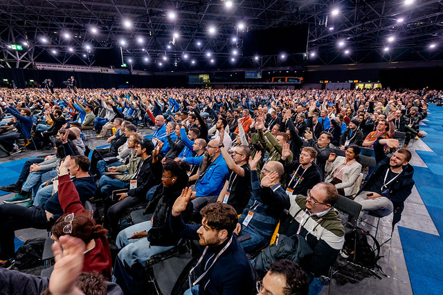
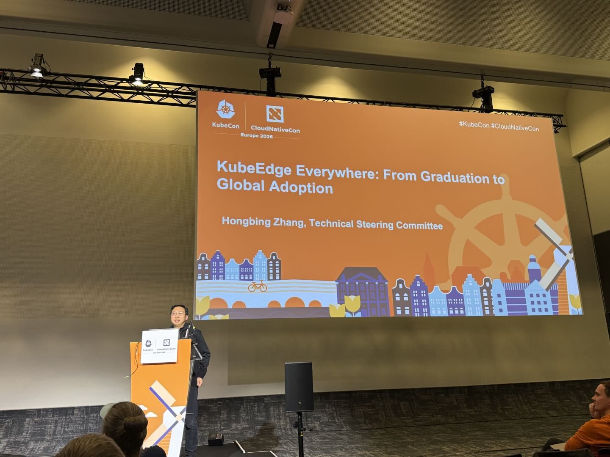
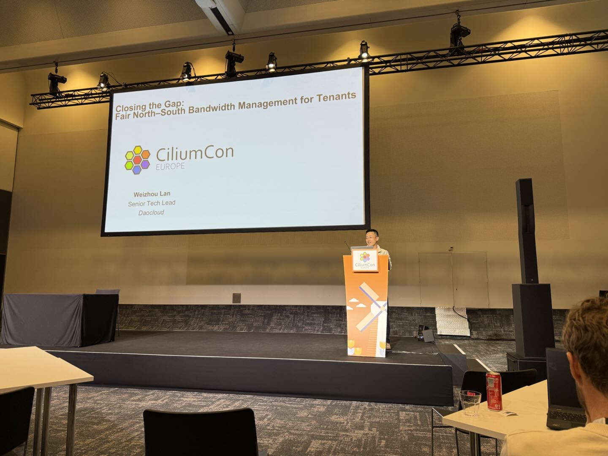
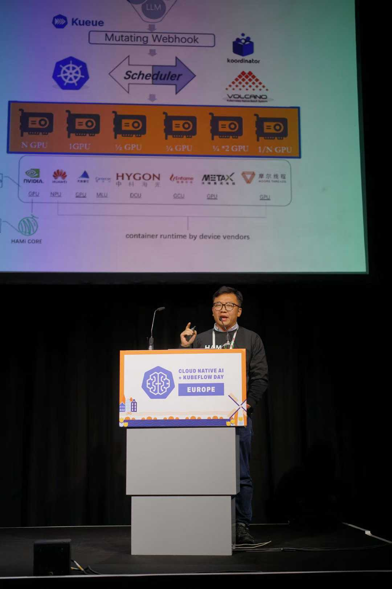
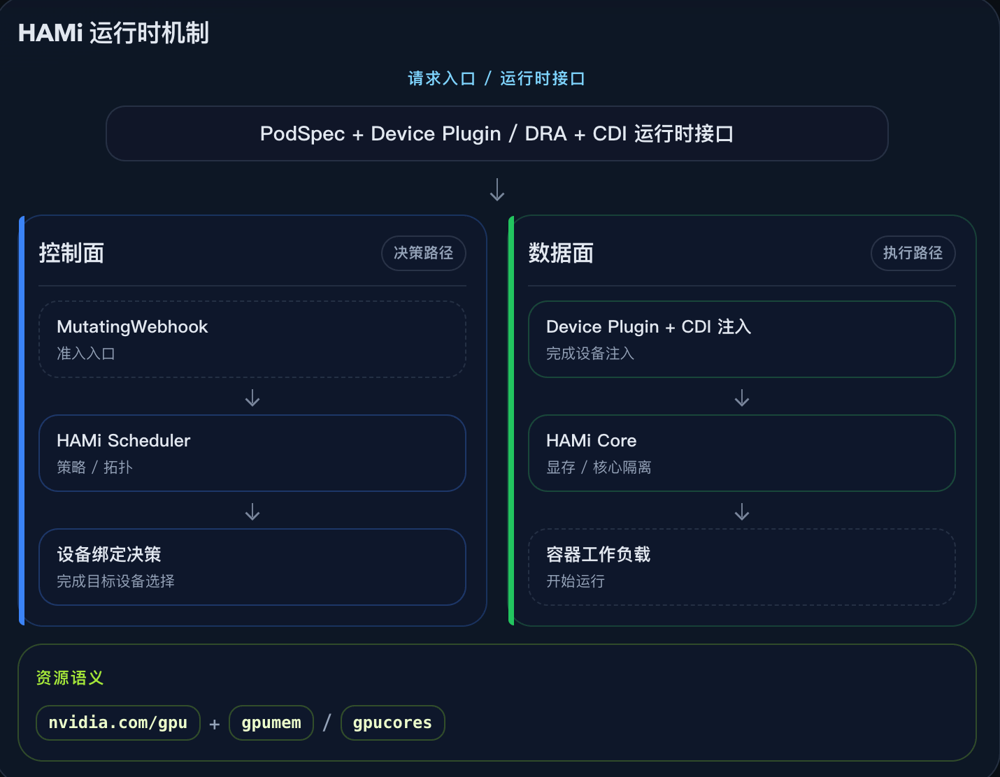
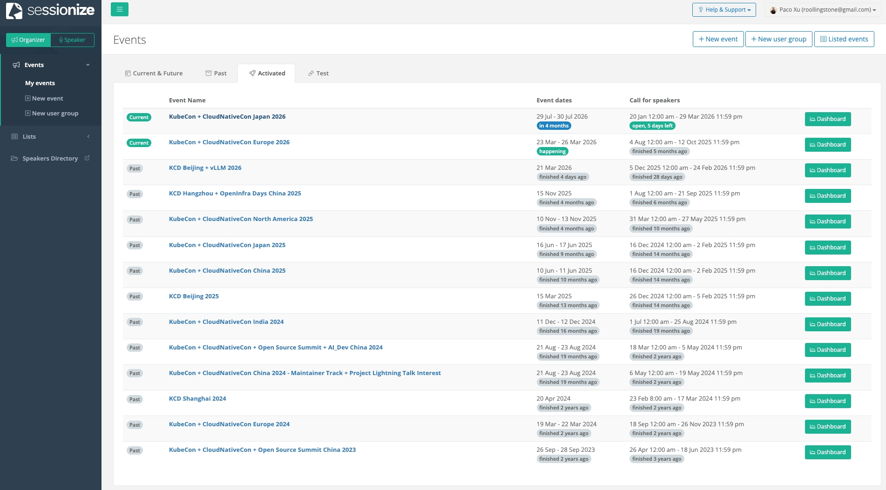
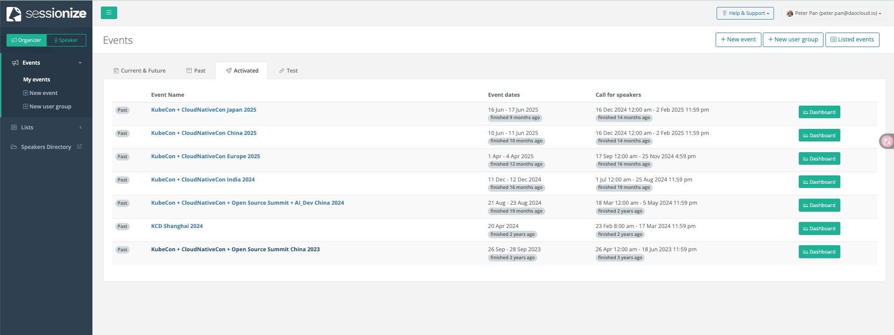
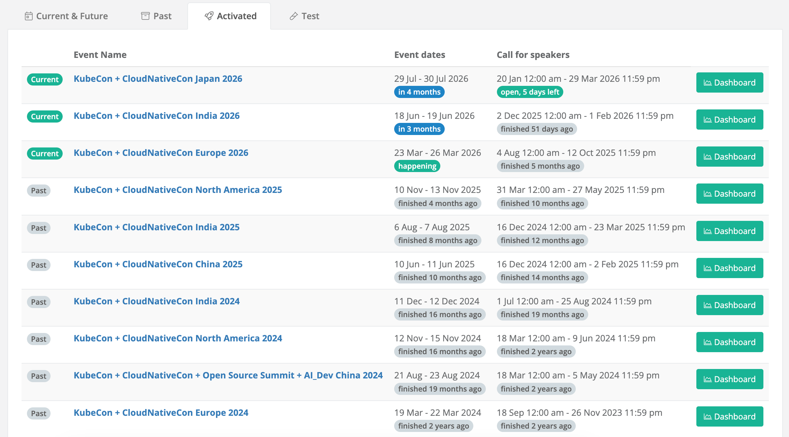

# DaoCloud at KubeCon 2026: Charting the Critical Path for AI Infrastructure

- Date: March 23–26, 2026
- Location: RAI Amsterdam, Netherlands

From what we saw on the ground, this year's KubeCon Europe 2026 drew roughly **about 13,000 attendees**, and will very likely set a new record once again. According to public data, the Linux Foundation's annual report shows that KubeCon + CloudNativeCon Europe 2025 in London attracted over 12,500 attendees, and this year's European edition keeps pushing the ceiling on KubeCon attendance even higher.

But more important than the "headcount" is **the shift in the audience composition**. In the past, the main crowd at KubeCon clustered around:

- Kubernetes
- Platform Engineering
- Service Mesh
- Observability
- Runtime / Container Technologies

This year, a very obvious change is:
**AI infrastructure-related audiences are pouring in at scale.** Including:

- AI Infra
- Model Deployment and Serving
- GPU Scheduling and Resource Management
- Model Inference Platforms
- Agent Runtime

This has significantly changed the overall character of KubeCon: it remains a cloud native conference, but is rapidly evolving into a **"system-level integration arena" that combines Cloud Native + AI**.

This also explains why this year's keynotes drew such high attention — it is not that "AI was deliberately over-emphasized," but that the entire community has genuinely entered this stage.

The core theme of this year's keynotes was not "AI has arrived," but rather "AI is becoming systematized."

## Speakers

DaoCloud sent three speakers to Europe for KubeCon to present cloud native and AI low-level technologies.

### Kay Yan

Kay is one of the co-founders of DaoCloud and leads the company's product R&D center.

His talk was titled: *Perceivable KV-Cache Optimization — Building AI-Aware LLM Routing on Kubernetes* (Tutorial: KV-Cache Wins You Can Feel: Building AI-Aware LLM Routing on Kubernetes)

Every LLM request carries an invisible state: the KV-cache. Hit it, and your response cost drops by 10x while speed improves by 50x; miss it, and you are recomputing work you just did. Yet Kubernetes' default load balancing is "cache-unaware" — it spreads related requests across different Pods, breaking locality. The result? Your AI workloads run slower than they should, and cost rises substantially.

In this hands-on tutorial, we fix that problem.

Participants will deploy a distributed vLLM cluster, benchmark its performance, and visualize how cache-unaware routing wastes GPU compute. Then we replace the default Service with the Kubernetes Gateway API (Inference Extension) and deploy llm-d — a Kubernetes-native distributed LLM inference framework with a built-in AI-aware scheduler. By re-running the same benchmark, you will see how latency and throughput shift once prefix reuse becomes a first-class citizen. In the end, you will leave with a working experimental environment, a visual dashboard, and a mental model for building cache-aware routing into any production-grade AI stack.

As one of the llm-d maintainers, Kay Yan was invited to the Maintainer Summit.

### Hongbing Zhang

Hongbing leads DaoCloud's ecosystem development and IPO efforts.

His talk was titled: *Solving Industrial Challenges With KubeEdge: A Post-Graduation Report*.

With KubeEdge's graduation from CNCF complete, it has firmly established itself as the leading platform for extending Kubernetes to edge scenarios. In this talk, the project maintainers review KubeEdge's evolution and dive into its core architecture, showing how it enables efficient management of edge workloads.

Attendees gain insights from real-world deployments across multiple industries, including smart cities, Industrial IoT (IIoT), edge AI, robotics, and retail. Beyond sharing successful practices, the talk also covers key technical updates — including the newly introduced KubeEdge Certified Conformance Test, the latest technical progress, and the most recent developments in community governance.

### Weizhou Lan

Weizhou is a networking expert and team lead at DaoCloud, and over the past few years has been a regular and active speaker at KubeCon events both in China and abroad.

His talk was titled: *Making Topology-Aware Scheduling Practical for AI Workloads: From Discovery to Simulation at Scale*.

In large-scale AI inference clusters, multi-tenant workloads need both efficient GPU utilization and dynamic RDMA networking. However, heterogeneous GPU interconnect technologies inevitably form multi-tier network topologies, such as scale-up networks and RDMA spine–leaf architectures.

These diverse topologies bring several challenges: first, dynamic topology discovery and health detection across multiple tiers (including scale-up, RDMA spine, and RDMA leaf); second, topology-aware scheduling that must support priority-based resource placement and ensure GPUs can use the optimal communication path; third, large-scale validation — the need to simulate multi-tier, large-scale topologies at low cost, rather than relying on expensive hardware environments.

In this talk, we introduce a practical topology discovery approach that helps Kueue achieve topology-aware scheduling, and show how to use KWOK to simulate thousands of virtual nodes with multi-tier topologies, enabling large-scale validation at zero hardware cost.

With the rapid development of AI, the importance of projects like Kueue has clearly risen. Many people used to see it as a batch queuing tool, but in today's AI scenarios its significance is entirely different. Once you enter an environment with GPU scarcity, fluctuating inference loads, and multi-tenant contention, what Kubernetes needs is not just scheduling, but queuing, fairness, quota, and organization-level governance. From this perspective, Kueue is not a fringe supporting role — it is increasingly becoming one of the key pieces of infrastructure for Kubernetes in the AI era.

Weizhou Lan was also invited on-site to a closed-door GTC meeting organized by NVIDIA.

## Core Projects and Trend Judgments DaoCloud Participates In

DaoCloud has multiple maintainers deeply involved in the following projects, contributing core code and leading the development of the open source community.

### Kubernetes: Evolving Into an AI Operating System

Kubernetes is evolving from a "cloud native application substrate" into a "general-purpose operating system for AI systems and agent systems."

On one side it connects to GPUs, scheduling, resource governance, cluster runtimes, and reproducible delivery; on the other side it connects to inference, agents, platform operations automation, real-device integration, and the organized operation of AI once it enters production.

So after walking out of the keynote, Kay Yan's biggest takeaway was not "I saw another pile of AI talks," but rather a clearer realization:

Over the next few years, the most important increment in cloud native may not come from traditional applications, but very likely from AI. And for AI to truly land in production, the ultimate dependency is not just the models themselves, but the increasingly complex and increasingly critical systems engineering behind them. On this front, Kubernetes is not a bystander — it is becoming the main stage.

Key capability evolution across recent Kubernetes releases:

- v1.30.0 implemented the ProvisionRequest API v1beta1, integrated with Kueue.
- v1.31.0
    - ProvisionRequest API advanced to v1
    - Cluster Autoscaler can anticipate scaling up/down in advance
- v1.32.0 introduced DRA (experimental)
- v1.34.0 implemented the CapacityBuffer API v1alpha1
- v1.35.0
    - Implemented the CapacityBuffer API v1beta1
    - Set CSI volume limits when scaling up/down
    - DRA reached production-ready status

### llm-d: From "Frontier Exploration" to "Main-Stage Problem"

According to Kay Yan's genuine impression on-site: "The strongest feeling from this year's keynote wasn't simply that AI is hot, but that the problem awareness represented by llm-d has truly entered the main stage of the conference. Although the stage may not have repeated the words 'llm-d' every single minute, from shared GPU scheduling, AI optimized and reproducible, AICR, to the shift from inference to agents — what everyone was discussing was really the same thing: once large models enter production, how exactly does cloud native organize, schedule, govern, and stabilize them?"

llm-d is no longer just a frontier direction discussed within a small circle; it is beginning to be understood within a larger cloud native narrative.

Because what llm-d truly cares about has never been just a single component, but the entire production system problem:

- How model requests are routed
- How shared GPUs are scheduled
- How inference workloads elastically scale
- How resources are governed under multi-tenancy
- How the system achieves reproducibility
- How AI workloads plug into higher-level agent runtimes

And almost everything on KubeCon's main stage today can be mapped onto these questions.

So Kay Yan feels that what really mattered in this year's keynote was not which vendor announced a new AI concept, but that the entire community has begun to form a consensus around the "LLM production system." Kubernetes' role here is also no longer just "low-level orchestrator," but is gradually becoming the control plane of AI systems.

This is also why llm-d stands out so much today. It represents not a single-point feature, but a more complete cloud native AI methodology.

### HAMi: Effortlessly Scheduling Heterogeneous GPUs

[HAMi](https://project-hami.io/zh/) is a project DaoCloud co-founded and open-sourced to the CNCF community. It is a cloud native GPU virtualization middleware that provides sharing, isolation, and scheduling capabilities for heterogeneous accelerators for AI workloads.

As one of the CNCF's newer Sandbox projects in the past two years, it had the honor of making an appearance in this KubeCon keynote.

From request to isolated execution, HAMi organizes GPU partitioning and heterogeneous scheduling into a deployable Kubernetes runtime pipeline.

### AI Conformance

Another very important but easily underestimated signal is the **Kubernetes AI Conformance Program**. Launched by CNCF, it is an AI capability certification system positioned similarly to Kubernetes Conformance, but targeted at AI scenarios.

* Built on Kubernetes Conformance
* Coverage:
    * DRA / Accelerators
    * Inference Networking
    * Scheduling and Orchestration
    * Observability / Security
* Introduces KAR (Kubernetes AI Requirements)
    * Similar to KEP
    * Divided into MUST / SHOULD

DaoCloud completed the certification in October 2025, making its DCE:
**the first enterprise-grade platform in China to pass Kubernetes v1.33 AI Conformance**

The significance of this goes beyond "passing a certification" — it means:
**AI infrastructure is entering the "standardization competition phase"**

What will be compared in the future is no longer just functionality, but:

* Whether it conforms to standards
* Whether it is portable
* Whether it has cross-environment consistency

## DaoCloud's Behind-the-Scenes Work

Several DaoCloud developers actively participate in the KubeCon Program Committee, invited to review KubeCon topics. Only a few are highlighted here; this is not an exhaustive list:

- Paco Xu, as the only member from China on the Kubernetes Steering Committee, not only reviews KubeCon topics but has also served multiple times as Co-Chair and Track Chair to lead the final review process.

    

- Peter Pan, as R&D Director at DaoCloud, has been invited multiple times as a senior AI technical expert to review KubeCon topics.

    

- Michael Yao, as a deep contributor to the CNCF community, has also been invited multiple times to review topics in tracks such as KubeCon Emerging + Advanced.

    

## Summary

If we had to summarize this year's KubeCon Europe in one sentence:
**This is no longer a "cloud native conference," but a "cloud native + AI systems engineering conference"**

The essence of the change is not a technology fad, but that the boundaries of AI systems are being redefined.

## Related Links

- [KubeCon CloudNativeCon Europe 2026 Schedule](https://events.linuxfoundation.org/kubecon-cloudnativecon-europe/program/schedule/)
- [llm-d: A Kubernetes-native high-performance, distributed LLM inference framework](https://llm-d.ai/)
- [HAMi: Heterogeneous GPU sharing running on Kubernetes](https://project-hami.io/zh/)
- [Kueue: A job queueing system for Kubernetes, for batch, HPC, AI/ML, and similar applications](https://kueue.sigs.k8s.io/)
- [KWOK: A Kubernetes testing marvel that builds thousands of virtual nodes in seconds](https://kwok.sigs.k8s.io/)
- [ClawWork: Has caught the attention of OpenClaw maintainer Frank Y](https://github.com/clawwork-ai/ClawWork)
