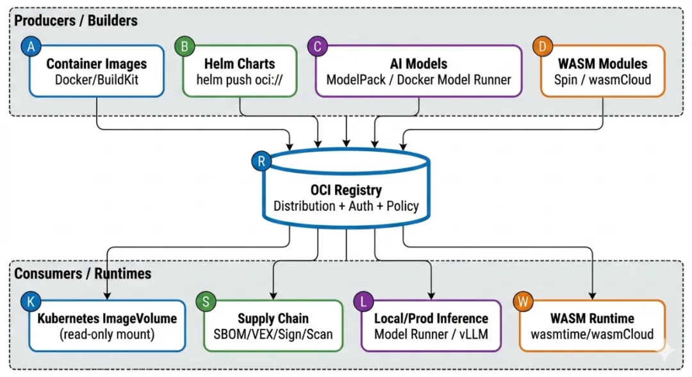
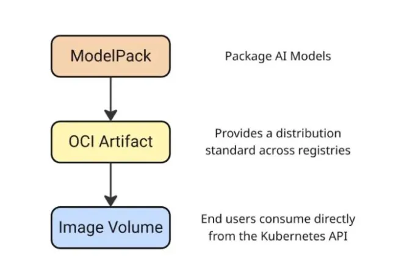

# OCI Is Quietly "Taking Over Everything"

> — From container images to AI models, OCI becomes the unified artifact distribution substrate

At the recently concluded KubeCon + CloudNativeCon Europe 2026 (March 23–26, Amsterdam), topics around AI artifact distribution, model delivery efficiency, and the OCI ecosystem clearly heated up. Looking back at the community's observations after KubeCon North America 2025 (Atlanta), the main thread of OCI "taking over everything" was already clear; and the recent European edition's discussions and practice updates show that this is moving from "the direction is right" to "engineering-ready."

After the North America event, MetalBear published a summary that put it well: OCI is quietly packing all sorts of things into its own system. OCI is no longer just a container image packaging format, but is gradually becoming the de facto default distribution method and repository form in the cloud native ecosystem. Helm Charts, WASM modules, and even AI models are all gravitating toward OCI Registries.

This change did not come from someone suddenly issuing a grand declaration; it is a pragmatic reality forced out step by step in engineering.

The most direct reason is: what needs to be stored in a Registry has changed. In the past it was mainly executable software images; now it is increasingly "non-executable but super-important" assets — model weights, dataset segments, policy files, SBOMs, VEX, plugins, WASM components, and so on. Enterprises already have mature Registry infrastructure: permission management, image scanning, security auditing, and supply-chain governance all in one package. Building a separate dedicated "model repository" protocol stack would be costly, risky, and slow to deploy. Reusing the existing OCI Registry is clearly the easier path.

When Docker itself explained why it chose OCI Artifacts to package AI models, the reasoning was also straightforward: it can directly reuse the existing registry and CI/CD pipeline, and future deep integration with containerd and Kubernetes becomes easier too.

## Why the AI Era Needs OCI Even More: From Image to Artifact Distribution Substrate

AI workloads directly raise the difficulty of "distribution" by several orders of magnitude.

- **Huge size:** A model plus its runtime environment easily runs to tens of GiB. Distribution efficiency directly determines deployment speed and system stability. The newly added Rebase Snapshot in containerd v2.2 is designed to optimize the download experience of oversized images, essentially making fuller use of the chunked download and resumable transfer capabilities of OCI Distribution.

- **High traceability and compliance requirements:** AI systems must be able to answer questions like "Where did this model come from? Who made it? Has it been modified? Does it comply with company policy?" This requires the distribution chain to natively support SBOM, signing, provenance, and policy validation, and to integrate seamlessly with existing container security toolchains. Docker's Hardened Images already treat verifiable builds and provenance attestation as a default security baseline, also pushing in this direction.

- **No desire to maintain multiple repositories:** Few teams are willing to long-term maintain five or six separate systems — "image repository + Helm repository + model repository + plugin repository + WASM repository." Unifying all artifacts into the OCI Registry is currently the most pragmatic and worry-free approach.

So OCI has now gradually abstracted from a concrete "image format" into a general capability: using the same Registry infrastructure to handle the distribution, versioning, and governance of different types of artifacts. The CNCF official blog has also specifically discussed how OCI Artifacts will drive future AI scenarios.

## Kubernetes: OCI Image Volume Is Becoming the Standard Entry Point for Models into the Cluster

To actually get OCI artifacts running at runtime, Kubernetes' path is fairly clear.

Starting from v1.31 (Alpha), it introduced a read-only volume (Image Volume Source) based on OCI Artifacts, which can declaratively pull configs, models, etc. directly from a Registry and mount them into a Pod. v1.33 promoted it to Beta, with more complete docs and examples. By v1.35, although it is not yet formally GA, as long as the underlying runtime supports containerd v2.1+, it is enabled by default.

This feature solves a long-standing pain point. In the past, to give a Pod a model or config, you either stuffed it directly into the application image (making the image bloated, and any change forced a full re-pull) or downloaded it at startup via an initContainer (slow, opaque, hard to audit). Image Volume completely separates "the runtime image" from "the data/models needed to run," unifying the distribution path back under the OCI Registry.

## ModelPack: Giving Models an "ID Card" in the OCI World

Kubernetes provides the "how to mount" mechanism, while ModelPack solves "how models should be packaged as OCI artifacts."

ModelPack's model-spec explicitly states that AI models have entered the era of centralized infrastructure. It is highly compatible with the OCI image spec and artifacts guidelines, and specifically mentions that it can be used directly as a Kubernetes Image Volume Source. In short: Kubernetes provides the entry, ModelPack provides the spec, and the two together build the complete engineering closed loop for OCI distribution in the AI era.

In this flow, the AI model is first packaged into an OCI Artifact according to the ModelPack spec, distributed to a Registry via the standard OCI Distribution protocol, and finally consumed directly by Kubernetes through the Image Volume mechanism.

## Harbor: From Image and Chart Repository to Model Artifact Repository

Harbor's evolution also confirms this trend. In its v2.14.0 release notes, Harbor explicitly mentions enhanced CNAI model integration capabilities and support for the native CNAI model format. This means that models are being formally incorporated into Harbor's artifact system, rather than existing as an isolated "model island."

Combined with the AI Model Processor proposal raised by the Harbor community and related implementation issues, we can see that Harbor is trying to combine models with existing scanning, replication, proxy caching, and permission governance capabilities, providing enterprises with a unified artifact governance experience.

## Docker Model Runner: Soldering Local Inference and OCI Distribution Together

Docker is almost advancing on two fronts in the AI direction.

On one hand, it explicitly chose OCI Artifacts as the base form for model distribution; on the other hand, it provides a unified entry at the inference engine layer. Docker Model Runner supports both llama.cpp and vLLM, and performs intelligent routing based on model format: GGUF models go to llama.cpp, safetensors models go to vLLM. The key point is that both model formats can be pushed and pulled as OCI images, stored in any compatible OCI Registry.

Furthermore, Docker has also connected Model Runner with Hugging Face's local run entry, making the experience from "model discovery to local inference" as close as possible to the `docker pull` workflow familiar to developers.

## ORAS: The Swiss Army Knife of OCI Artifacts

If the OCI Registry is the highway for unified artifact distribution, then ORAS' role is more like a general-purpose transport vehicle that is not limited to a specific vehicle type. Its design intent is very clear: do not assume that everything stored in the Registry is a "container image"; instead, treat the Registry as a general artifact storage and distribution system.

This is especially critical in engineering practice. Assets such as model weights, WASM components, SBOMs, policy files, and plugin packages often do not fit the semantics of traditional images, yet equally need versioning, signature verification, access control, and cross-environment replication. The CLI and multi-language SDK that ORAS provides are precisely built for these "non-image artifacts" — they allow developers to use OCI Distribution as the unified underlying protocol while retaining sufficient semantic freedom at the upper layer.

More importantly, ORAS has gradually become the de facto standard toolchain in the OCI Artifacts ecosystem. Whether for model distribution, WASM component pushing, or the attachment and synchronization of security metadata (such as SBOMs, attestations), many solutions default to choosing ORAS as the implementation foundation. This enables OCI to truly evolve from an "image hub" into an "artifact hub," rather than remaining confined to the container domain.

## Ollama and Ollama-like Specs: Unify Distribution First, Then Formats

The popularity of Ollama is no accident — it precisely hits developers' core demand in the large-model era: the whole flow from acquiring a model to running it must be short and intuitive enough. This experience-first design naturally gives rise to its own set of model organization methods, metadata descriptions, and runtime conventions.

But from an enterprise and cloud native platform perspective, a truly sustainable consensus will rarely land first on "model format unification." The diversity of model formats is almost unavoidable in the short term, and a more realistic and lower-friction entry point is to first unify the distribution protocol and repository compatibility. As long as models can be pulled, cached, and governed through OCI Distribution, the problems caused by format differences are largely compressed into a controllable range.

For this reason, specs like ModelPack were designed not to replace Ollama, but to treat it as a potential ecosystem integration target. First letting models enter the same track at the distribution level, then gradually converging at the metadata and spec level, is the most pragmatic path at the current stage and also the one most in line with how engineering evolves.

## WASM Artifact Repositories: The Next Unifying Piece of the OCI Puzzle

The distribution needs of WASM modules and components are structurally highly similar to model distribution: many artifact types, fast version iteration, heterogeneous runtime environments, and a natural reliance on signature verification and supply-chain governance. This led the WASM community to start looking early for a distribution method that is both general enough and able to fit into existing infrastructure.

Against this backdrop, the OCI Registry became the natural choice for WASM distribution. By packaging WASM modules or components as OCI Artifacts, the ecosystem can directly reuse existing Registries, permission models, replication policies, and security capabilities, without rebuilding a dedicated distribution system. Whether it is wasmCloud, Fermyon Spin, or the related practices of CNCF TAG Runtime and cloud vendors, all are continuously reinforcing this direction.

From a broader perspective, the addition of WASM further proves a fact: OCI was not a specialized technology "born for containers," but is evolving into the general artifact distribution layer of the cloud native world.

## Industry Signal: Distribution Is No Longer a Taken-for-Granted Premise

Some industry events that seem unrelated to OCI are actually continuously reinforcing the consensus that "the distribution substrate must be controllable." Bitnami's adjustment of its free image and Chart distribution policy is a typical example. When the scope, availability, and policy of a public catalog change, dependents often lack sufficient buffer space.

Such events do not mean that the public ecosystem is no longer important, but rather remind us: production-grade systems should not bet key dependencies entirely on a single, uncontrollable external source. Only when artifacts can be synchronized, cached, and hosted into an enterprise's own Registry in OCI form does the team truly gain control over distribution.

At the same time, Docker's launch and opening-up of Docker Hardened Images also sends a clear signal to the industry: distribution, security, and provenance are being treated as foundational capabilities, not optional features. The OCI Registry is one of the core infrastructures that carries these capabilities.

## Performance and the Future: In the Era of Large Models, OCI Is Still Evolving

As oversized models and "super-large images" become the norm, the new challenges OCI faces at the performance level are gradually emerging. The traditional image pulling mechanism is already clearly strained when facing tens-of-GiB artifacts, which is exactly the practical background for containerd v2.2's introduction of mechanisms like Rebase Snapshot.

These optimizations did not appear in isolation; they essentially make fuller use of OCI Distribution's capabilities in chunked download, concurrent transfer, and resumable transfer. At the same time, within the OCI community, discussions on how the image spec and distribution spec can better support oversized distribution objects continue to advance. It can be expected that as AI workloads become widespread, the OCI spec itself will continue to evolve to accommodate larger-scale, higher-frequency artifact distribution needs.

A new signal after KubeCon EU recently is that the community has begun to more systematically fill in the "unified distribution performance layer" beyond the "unified distribution protocol." In a Dragonfly article published by CNCF in April 2026, a very direct engineering practice is given: `dfget` natively supports `hf://` and `modelscope://`, bringing the two mainstream model sources, Hugging Face and ModelScope, into the same P2P distribution plane. For a scenario of distributing about 130 GB of models to a 200-node cluster, the origin traffic can drop from about 26 TB to about 130 GB.

The importance of such updates is that they further extend "OCI unified artifact form and governance" to "scalable reuse of distribution efficiency." When model downloads change from single-origin pulls to in-cluster P2P propagation, OCI's value in AI scenarios is reflected not only in spec unification, but also in observable, controllable, and scalable delivery performance.

## A Pragmatic Adoption Roadmap

In practice, adopting OCI does not require a one-time "tear-down and rebuild"; a more realistic approach is a gradual evolution path. In the short term, the easiest and lowest-risk move is to first fully migrate Helm Chart distribution to the OCI Registry. Helm officially already provides a mature `oci://` workflow — this step barely changes developers' usage habits, yet can immediately reduce dependence on a standalone Chart repository, laying the foundation for subsequent unified artifact distribution.

In the medium term, you can expand the Registry's role from "image and Chart storage" to a "general artifact repository." At this stage, introducing ORAS as a general artifact tool is especially critical. Through ORAS, you can gradually bring SBOMs, policy files, signing materials, and model-related attachments into the OCI Registry for management, so that assets originally scattered across different systems begin to enjoy unified version control, access permissions, and replication policies. This step is often also the stage where platform engineering teams begin deep collaboration with security and compliance teams.

In the medium-to-long term, what truly reflects OCI's value is the integration at the runtime and scheduling level. As the Kubernetes Image Volume becomes enabled by default in new versions, platforms can begin to evaluate mounting models, configs, plugins, and other runtime-needed artifacts into Pods directly through the OCI Registry. This requires the underlying runtime (such as containerd) to be upgraded in sync, but the benefits are significant: application images become lighter, models and configs can evolve independently, and the distribution path becomes auditable and reproducible.

In this process, promoting native support for model specs like ModelPack and enterprise Registries like Harbor will help form a complete governance closed loop. Models are no longer just "downloaded files," but become scannable, replicable, and traceable artifacts, sitting on the same governance plane as images and Charts.

From a broader community perspective, model distribution today remains highly fragmented, but OCI has become the most realistic and most extensible unifying bridge. Building model synchronization, offline distribution, and enterprise intranet deployment tools around OCI will be a very worthwhile engineering direction for some time to come.

## Final Thoughts

OCI did not announce its existence through a high-profile technical "revolution," but rather gradually permeated every corner of the cloud native ecosystem in an extremely engineering-driven, low-friction way. Key assets that were originally scattered across different systems — images, Charts, models, WASM, SBOMs — are being quietly pulled onto the same distribution track.

In the AI era, this unification is not just for architectural elegance, but for scalability, governability, and long-term sustainable evolution. For teams building AI Infra, platform engineering, or cloud native foundations, OCI is very likely no longer a question of "whether to choose it," but of "when to fully embrace it."

## Side Note: MatrixHub Preview

DaoCloud is also recently incubating another cloud native project, [MatrixHub](https://github.com/matrixhub-ai/matrixhub), which fills the gap in unified management and distribution infrastructure for enterprise-grade private large-model assets (models, data, and versions).

MatrixHub will continue to iterate along the directions of OCI artifact distribution, enterprise-grade governance, and inference ecosystem compatibility, with a new minor version to be released soon. Stay tuned!

## References

### KubeCon, CNCF, and Kubernetes

- [KubeCon Atlanta Takeaways](https://metalbear.com/blog/kubecon-atlanta-takeaways/)
- [CNCF Blog - Peer-to-Peer acceleration for AI model distribution with Dragonfly](https://www.cncf.io/blog/2026/04/06/peer-to-peer-acceleration-for-ai-model-distribution-with-dragonfly/)
- [CNCF Blog - OCI Artifacts for AI](https://www.cncf.io/blog/2025/08/27/how-oci-artifacts-will-drive-future-ai-use-cases/)
- [Kubernetes v1.31 Image Volume Source Blog](https://kubernetes.io/blog/2024/08/16/kubernetes-1-31-image-volume-source/)
- [Kubernetes v1.35 Release Blog](https://kubernetes.io/blog/2025/12/17/kubernetes-v1-35-release/)
- [k/website Image Volume Docs](https://kubernetes.io/docs/tasks/configure-pod-container/image-volumes/)

### ModelPack & Harbor

- [ModelPack model-spec](https://github.com/modelpack/model-spec)
- [Harbor v2.14.0 Release Notes](https://github.com/goharbor/harbor/releases/tag/v2.14.0)
- [Harbor Community Proposal](https://github.com/goharbor/community/blob/main/proposals/new/AI-model-processor.md)
- [Harbor AI Model Issue](https://github.com/goharbor/harbor/issues/21229)

### Docker

- [Why Docker Chose OCI Artifacts for AI Model Packaging](https://www.docker.com/blog/oci-artifacts-for-ai-model-packaging/)
- [Docker Model Runner + vLLM](https://www.docker.com/blog/docker-model-runner-integrates-vllm/)
- [Docker Model Runner on Hugging Face](https://www.docker.com/blog/docker-model-runner-on-hugging-face/)
- [Docker Hardened Images](https://docs.docker.com/dhi/)
- [Docker DHI Press Release](https://www.docker.com/press-release/docker-makes-hardened-images-free-open-and-transparent-for-everyone/)
- [Docker Hardened Images Blog](https://www.docker.com/blog/docker-hardened-images-for-every-developer/)

### Others

- [ORAS Official Site](https://oras.land/)
- [Helm OCI Registries](https://helm.sh/docs/topics/registries/)
- [wasmCloud OCI Registries](https://wasmcloud.com/docs/deployment/netconf/registries/)
- [containerd v2.2.0 Rebase Snapshot](https://fuweid.com/post/2025-containerd-220-rebase-snapshot/)
- [OCI Image Spec Issue #1190](https://github.com/opencontainers/image-spec/issues/1190)
- [Industry News: Bitnami Charts Catalog Changes (Aug 28, 2025)](https://github.com/bitnami/charts/issues/35164)
- [Docker Model Runner Integrates vLLM (WeChat article)](https://mp.weixin.qq.com/s/wGBiGjCuLnJHf3Z7hr25yQ)
- [Model Distribution Updates After KubeCon EU (WeChat article)](https://mp.weixin.qq.com/s/Q88PgEVIiir5jw9AJ7Fqyg)
- [How OCI Artifacts Drive Future AI Use Cases (WeChat article)](https://mp.weixin.qq.com/s/E-55ORZfoPWtIur7C9sIPg)
- [OCI and Container Image Building (WeChat article)](https://mp.weixin.qq.com/s/zMBkujlmQXL5yECbP7XSkg)
