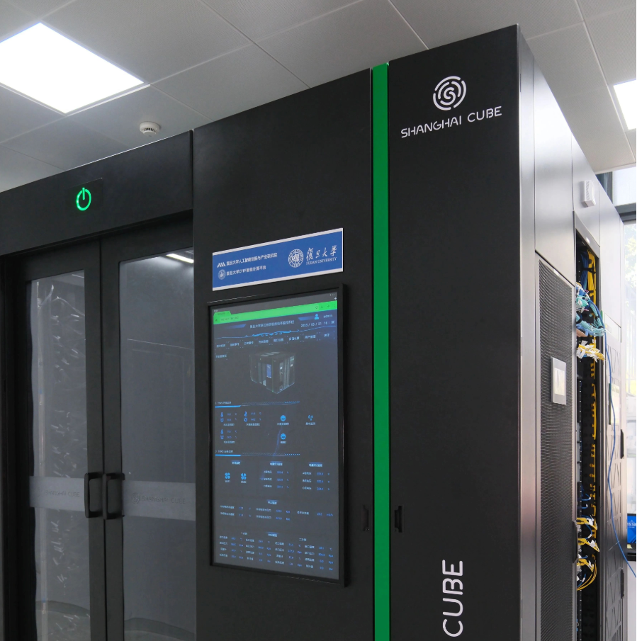

# From "Runs" to "Runs Fast": DaoCloud's Domestic Accelerator Optimization Practice on Heterogeneous GPUs

As large models move from experimental validation to scaled production, AI infrastructure is undergoing a clear shift: GPUs are no longer just a matter of "how many cards," but gradually evolve into a complete systems engineering effort spanning hardware, drivers, compute libraries, AI frameworks, inference engines, scheduling systems, and observability.

For a cloud-native AI platform, supporting a new GPU starts with letting [Kubernetes](https://kubernetes.io/zh-cn/docs/concepts/extend-kubernetes/compute-storage-net/device-plugins/) recognize and allocate GPUs; but what truly determines application value is whether the GPU's compute power can be further unlocked, giving models stable, predictable inference performance. This is also the core challenge domestic GPUs face after entering production:
**Going from "runs" to "runs fast" requires optimizing not just the GPU itself, but the complete technology stack from hardware to software, from a single card to the cluster.**

Using MetaX GPUs as an example, this article introduces the key technologies DaoCloud focuses on in heterogeneous GPU environments around resource management, software-stack adaptation, inference engines, and performance optimization.

## From Device Onboarding to Performance Unleashing

In traditional Kubernetes scenarios, GPU support uses
[Device Plugin](https://kubernetes.io/zh-cn/docs/concepts/extend-kubernetes/compute-storage-net/device-plugins/)
to expose GPUs as schedulable resources, and users allocate GPUs to workloads through resource requests. For basic GPU workloads, this is enough.

But large-model inference is completely different.
Behind a modern large-model inference service sits a complete software stack: GPU Runtime, GPU Software Stack, AI Framework (such as PyTorch), inference engine (such as vLLM), down to Attention/MoE/GEMM operators and the GPU Kernel. For a cloud-native AI platform, Kubernetes delivers these capabilities to workloads in a schedulable, manageable way. A bottleneck at any layer can lead to low GPU utilization, dropped inference throughput, increased Time-to-First-Token (TTFT), excessive memory usage, or reduced multi-GPU communication efficiency.

Therefore, heterogeneous GPU optimization cannot stop at the "can the Device Plugin recognize the device" layer; it requires coordinated optimization across the entire AI software stack.

Taking MetaX GPUs as an example, its C-series GPUs ship with a complete [MXMACA](https://www.metax-tech.com/platform.html?cid=4) software stack, providing the foundational capabilities needed for GPU programming, compute libraries, and the upper-layer AI software ecosystem. The mainstream AI software ecosystem has long formed around CUDA, so domestic GPUs need to bring out their own hardware capabilities while maintaining software-ecosystem compatibility. Currently, MetaX has built the [vLLM-MetaX](https://github.com/MetaX-MACA/vLLM-metax) hardware plugin around [vLLM](https://docs.vllm.ai/), integrating MetaX GPUs into vLLM through its hardware-pluggable mechanism, minimizing intrusive changes to vLLM's core code while continuously tracking upstream vLLM releases. Heterogeneous GPU adaptation is moving from "device-level adaptation" to "AI Framework-level adaptation" —
getting a GPU into Kubernetes is only the first step. To truly unleash hardware performance, coordinated optimization of the GPU Runtime, AI Framework, Inference Engine, and Kernel software stack is still needed; in a cluster environment, Kubernetes must additionally provide resource scheduling, topology awareness, and observability.

## Resource Awareness and Topology-Aware Scheduling

In heterogeneous GPU clusters, GPUs from different vendors and models have different compute power, memory capacity, and interconnect topology. If all GPUs are merely exposed to the scheduler as simple extended resources, the scheduler can perceive resource quantity but struggles to understand finer-grained attributes such as GPU model, memory capacity, and inter-card topology.

For ordinary inference tasks, GPUs may be somewhat interchangeable. But for large-model distributed inference tasks like Tensor Parallel and Expert Parallel, the GPU model, memory, and inter-card communication capability can all affect final performance. The scheduling system needs to answer not "is there a GPU," but "what GPU is this? Where is it? How is it connected to other GPUs? What GPU does this workload actually need?"

As model scale grows, single-GPU inference can no longer satisfy more and more scenarios. When computation is distributed across multiple GPUs via Tensor Parallel, the communication efficiency between GPUs becomes critical. If GPU topology isn't considered during scheduling, selecting different GPU combinations can lead to different communication paths and thus markedly different communication performance.

The scheduling system should not only know "how many GPUs there are," but progressively gain GPU-model awareness, memory awareness, PCIe topology awareness, NUMA awareness, inter-GPU interconnect awareness, Gang Scheduling for multi-GPU tasks, and topology-aware scheduling combined with model-parallelism strategies. The ultimate goal is to turn Kubernetes from a "resource allocator" into a resource optimizer for AI workloads.

In this regard, open source projects like [HAMi](https://project-hami.io/zh/) provide Kubernetes-native heterogeneous GPU scheduling and sharing. As a CNCF incubating project, HAMi supports finely slicing GPU resources by memory and compute, and optimizes multi-GPU task scheduling through topology-aware strategies, already covering various domestic GPU devices including MetaX.

## Operator Optimization: From GPU Utilization to Kernel Utilization

High GPU utilization does not mean GPU performance is fully utilized. GPU utilization is only a coarse-grained metric that cannot directly reflect compute-unit utilization, memory-bandwidth utilization, Kernel execution efficiency, or communication overhead. Therefore, further optimization usually must go down to the operator and Kernel layer.

```text
Memory Access        ███████████████
Kernel Execution     ███████
Compute Utilization  █████
Communication        ████████
```

Further optimization must go down to the operator and Kernel layer.
MetaX's public operator-optimization project has made MLA (Multi-Head Latent Attention), used by DeepSeek V3/R1, and Native Sparse Attention (NSA) key optimization targets, and is carrying out operator performance optimization around the
[TileLang](https://github.com/tile-ai/tilelang) operator programming framework, the MXMACA software stack, and the C500 GPU.
TileLang provides a programming abstraction oriented to GPU Kernels, letting developers optimize for the target hardware around tile partitioning, memory access, and compute scheduling. These operators happen to correspond to several of the most important performance hotspots in current large-model inference.

**MoE and Fused MoE GEMM**. MoE models dynamically assign Tokens to different Experts through a Router; the advantage is activating a larger parameter scale with relatively limited compute. For example, DeepSeek-V4-Pro adopts an ultra-large-scale MoE architecture with a total parameter scale of 1.6T, but only about 49B parameters activated per Token. Sparse activation reduces the per-Token compute, but also raises higher requirements on Expert routing, Grouped GEMM, memory access, and multi-GPU communication. The Router decides routing dynamically at runtime, and each Expert receives a non-fixed number of Tokens; executing an independent GEMM for each Expert would cause significant Kernel Launch overhead, small matrices that can't fully use parallel compute units, and repeated Expert-weight loading that wastes memory bandwidth. Fused MoE GEMM can organize multiple Experts' matrix multiplications into a Grouped GEMM, completing multiple Experts' computation with one or a few Kernel schedules, reducing Kernel Launch and data-access overhead and improving GPU compute-resource utilization. The same model code does not necessarily have the same optimal execution on different GPUs; different hardware characteristics require redesigning Kernels and optimization strategies.

**Attention and Memory Optimization**. As model context length keeps growing, Attention and KV Cache have become important directions in large-model inference performance optimization. Taking the latest DeepSeek-V4 as an example, it adopts a new hybrid Attention architecture, specifically designed for ultra-long contexts and Agent scenarios. Both V4-Pro and V4-Flash support million-Token-level contexts, raising higher requirements on KV Cache capacity, Attention Kernels, memory access, and inference scheduling. For GPU inference, long context is not just a matter of increasing memory capacity. As context length and concurrent requests grow, the storage of KV Cache, Attention computation, and memory access all become performance bottlenecks. Therefore, optimizing Attention Kernels for the specific GPU architecture, improving KV Cache management, and reducing memory-access overhead are important means to boost large-model inference performance. This also means that, facing new-generation large models like DeepSeek-V4, GPU adaptation cannot stop at the "model can run" level, but must further optimize for the new operators and compute patterns in the model architecture.

## End-to-End Optimization and Unified Management

Operator optimization is only one link in end-to-end performance. For a large-model inference platform, [vLLM](https://docs.vllm.ai/) has become one of the important inference engines, but optimizing only vLLM's upper-layer logic does not guarantee the GPU gets the best performance. From a request entering the inference service to finally returning a Token, it must pass through Scheduler, Continuous Batching, KV Cache, Attention, MoE/GEMM, GPU Kernel, and Hardware. Optimizing any single component alone cannot guarantee an end-to-end performance gain —
the Scheduler is optimized but the GPU Kernel is slow; the Kernel is fast but communication efficiency is low; the GPU is fast but KV Cache prevents the Batch Size from going up — the final end-to-end performance may still be suboptimal.

Performance optimization must shift from single-component optimization to end-to-end optimization. At the same time, optimizing for only one kind of GPU easily forms new resource silos. In real environments, different GPUs often correspond to different drivers, Runtimes, Device Plugins, monitoring components, and AI software stacks. Users must relearn drivers, Runtimes, Device Plugins, GPU Operator, monitoring components, AI Framework, inference images, and performance-tuning methods for different hardware. This is inconsistent with the unified resource-management philosophy that cloud-native platforms pursue.

Therefore, the platform layer needs to converge the differences of different GPUs — in drivers, Runtimes, device plugins, and monitoring — into the infrastructure layer as much as possible, providing upper-layer workloads with a unified resource-management and delivery approach.

```text
                 AI Workload
                      │
                      ▼
             ┌────────────────┐
             │    DaoCloud    │
             │  AI Platform   │
             └────────────────┘
                      │
          ┌───────────┼───────────┐
          ▼           ▼           ▼
       NVIDIA       MetaX       Other GPU
          │           │           │
          ▼           ▼           ▼
       Runtime     MXMACA       Runtime
          │           │           │
          └───────────┼───────────┘
                      ▼
                 Kubernetes
```

Users shouldn't need to redesign the entire application-delivery process just because the underlying GPU model changes. Realizing this goal relies on open source community support — for example,
[HAMi](https://project-hami.io/zh/) unifies device onboarding, resource slicing, and monitoring metrics for GPUs from different vendors under the Kubernetes-native framework, so upper-layer workloads don't need to care about underlying hardware differences; scheduling and isolation are done by HAMi at runtime.

DaoCloud currently supports a wide range of GPU/NPU devices, including NVIDIA, Huawei Ascend, Iluvatar CoreX, MetaX, Enflame, Biren, and Cambricon, covering the complete chain of driver installation, device plugins, resource scheduling, and monitoring. See the
[GPU Support Matrix](https://docs.daocloud.io/kpanda/user-guide/gpu/gpu_matrix/) for details.

## Observability and Performance Evaluation

If you don't know where the bottleneck is, it's hard to know what to optimize. A complete heterogeneous GPU platform needs to build observability from hardware to model: from hardware-layer temperature, power, memory, and utilization, to Kernel-layer execution time, memory access, and Occupancy, to inference-engine TTFT, TPOT, Throughput, and Batch Size. The MetaX ecosystem already provides tools including `mx-smi`, performance profiling, and GPU monitoring (see the [MetaX developer documentation](https://developer.metax-tech.com/)), which cover GPU status monitoring, Kubernetes cluster monitoring, and performance profiling at different levels, laying the groundwork for further correlating GPU metrics with AI workloads.

For DaoCloud, what matters more is correlating these low-level metrics with Kubernetes workloads: which Pod uses which GPU? What is the current utilization of that GPU? Which model occupies how much memory? When inference latency rises, is it the Scheduler, KV Cache, Kernel, or GPU communication that became the bottleneck? Only by building this correlation can GPU observability truly serve AI performance optimization.

In performance evaluation, comparing theoretical compute power alone is of limited meaning; an AI platform should focus more on end-to-end metrics:

| Metric | Meaning |
|--------|---------|
| TTFT | Time to First Token |
| TPOT | Time Per Output Token |
| Throughput | Tokens generated per unit time |
| GPU Utilization | GPU utilization |
| KV Cache Usage | KV Cache usage |

## From a Single Card to the Cluster

When GPUs scale from a single machine to a cluster, performance problems become further complicated. The single-card stage mainly concerns Kernel, Memory, and Compute; the multi-card stage needs to consider GPU Topology, Communication, Parallelism, and Scheduling; the multi-node stage additionally introduces Network and Observability. An excellent heterogeneous GPU platform should not merely "connect GPUs to Kubernetes," but should let Kubernetes understand the needs of AI workloads and combine the right GPUs, topology, network, and compute resources.

The development of domestic GPUs is going through an evolution of three stages:

1. **"Runs"** — GPU, Driver, Runtime, Device Plugin, solving how GPUs are recognized and allocated by Kubernetes.
2. **"Runs fast"** — AI Framework, Inference Engine, Kernel Optimization, solving how models fully utilize the GPU.
3. **"Runs fast at scale"** — Scheduling, Topology, Observability, solving how multi-GPU, multi-node, and heterogeneous GPU clusters run efficiently.

This direction is not just talk on paper. In March 2025, DaoCloud, together with MetaX and other enterprises, jointly released the domestic high-density compute cabinet
[Shanghai Cube](https://d.run/news/i80bp6njjsg0yhxat1rgbvb7), using MetaX C550 series GPU chips, with 128 liquid-cooled high-density cards in a single cabinet. DaoCloud designed a customized domestic operating system for Shanghai Cube, providing scheduling-management capability oriented to high-density domestic compute. The system has successfully achieved efficient inference of the full-scale DeepSeek 671B model, a landmark practice of domestic computing power moving from "hardware usable" to "production-grade scaled application."



Domestic accelerators represented by MetaX GPUs are forming an increasingly complete software ecosystem — from [MXMACA](https://www.metax-tech.com/platform.html?cid=4) to [vLLM](https://github.com/vllm-project/vllm), from GPU management to operator optimization, from single-card performance to cluster scheduling, the capability boundary of domestic GPUs is constantly extending from "hardware usable" toward "mature software stack" and "production-grade scaled application."

True heterogeneity should not mean more complexity, but should mean: no matter what GPU is used underneath, developers get a unified cloud-native experience, and the platform is responsible for truly unlocking the capabilities of different hardware.

**DaoCloud will continue to focus on heterogeneous computing power, intelligent scheduling, inference optimization, and AI observability, driving domestic computing power from "usable" to "easy to use," from single-point performance optimization to cluster-level efficiency optimization, providing more open, efficient, and unified cloud-native infrastructure for large-model training and inference.**
