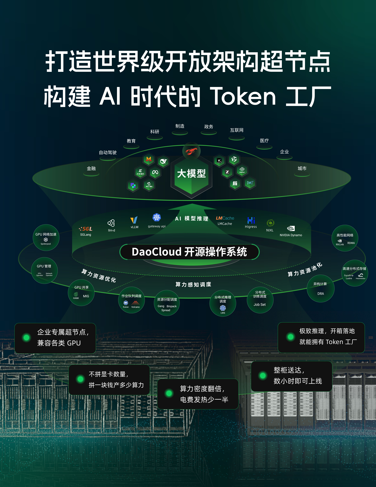
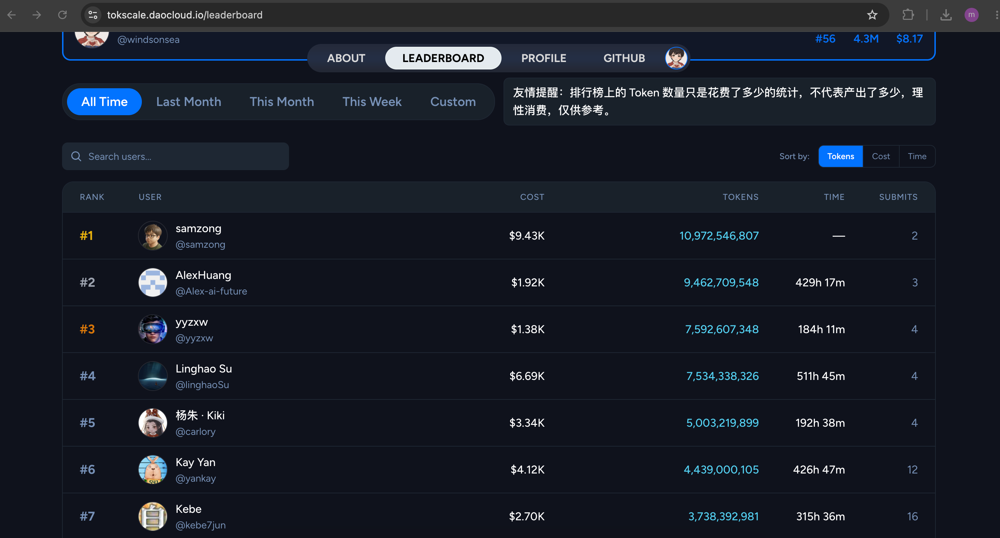
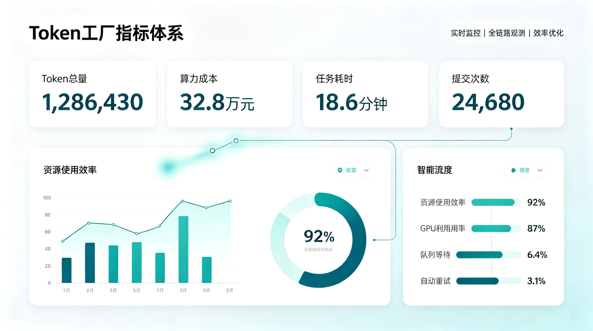
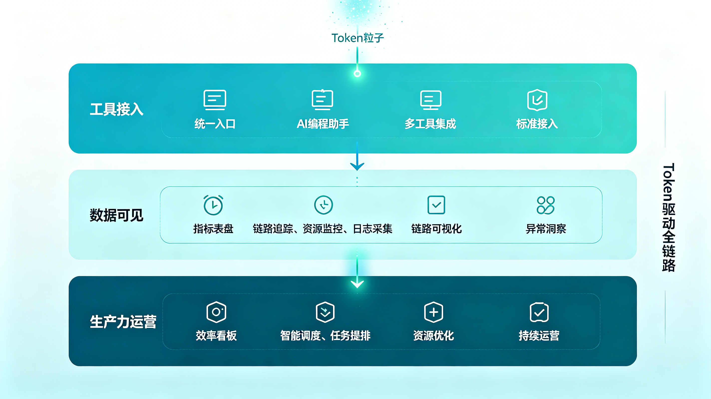

# Token Factory: In the AI Era, How to Measure a Team's Real Productivity?

In the past, when we measured R&D efficiency, we often looked at lines of code, commit count, requirement throughput, delivery cycle, and defect rate.

But after entering the AI coding era, a new factor of production is emerging: **Token**.

Developers no longer just write code themselves; they collaborate with AI to complete design, coding, testing, refactoring, documentation, and troubleshooting. Every prompt, every context input, and every model generation consumes Tokens behind the scenes.

If GPU is the "compute machine" of the AI era, then Token is the "production metering unit" that this machine outputs.

## Why Should Enterprises Care About Tokens?

When AI coding first became popular, enterprises cared more about: "Are employees using AI tools?"

But once AI tools truly enter the daily R&D workflow, the question changes:

| Stage | What enterprises care about |
|---|---|
| Tool trial period | How many people have started using AI coding tools? |
| Scale-up period | Which teams use them more? Which scenarios are most effective? |
| Cost governance period | Is Token consumption controllable? Is there effective output? |
| Efficiency optimization period | How to turn Tokens into higher-quality code, documentation, and delivery? |

Tokens themselves are not the goal.

What really matters is whether the enterprise can see how Tokens are used, and whether they are being converted into R&D productivity.

## From "Using AI" to "Operating AI Productivity"

Many enterprises have purchased AI coding tools, yet find it hard to answer a few basic questions:

- Which teams are using AI at high frequency?
- Which employees have formed stable human-AI collaboration habits?
- Are Tokens mainly consumed on coding, debugging, code explanation, or document generation?
- Has high Token consumption brought faster delivery?
- Which scenarios are worth distilling into best practices?
- Which consumptions are just useless context, repeated questions, or low-quality prompts?

This shows that connecting AI coding tools is only the first step.

The real challenge is upgrading AI usage from "individual behavior" to "organizational capability."

This requires a new perspective: **Token Factory**.

## What Is a Token Factory?

A Token Factory is not simply counting who uses the most; it treats Tokens as a key factor of production in the AI R&D process, and builds a measurement, governance, and optimization system around them.

| Capability module | Problem solved | Organizational value |
|---|---|---|
| Token metering | Not knowing real AI tool usage | Turns invisible AI usage into something measurable |
| Cost attribution | Unclear who and in which scenarios Token cost is generated | Supports cost analysis at team, project, and business-line levels |
| Usage ranking | Lack of internal AI usage atmosphere and benchmarks | Motivates employees to explore AI collaboration, creating positive competition |
| Efficiency analysis | Only knowing consumption, not output | Combines delivery data to analyze the relationship between Tokens and R&D efficiency |
| Best-practice distillation | Efficient usage stays at the individual-experience level | Turns excellent prompts, workflows, and toolchains into organizational assets |
| Risk governance | AI usage may carry privacy, code security, and compliance risks | Establishes enterprise-grade AI usage boundaries and audit mechanisms |

Behind this is not to "grind on Tokens," but to answer a more important question:

**Can an organization actually turn AI consumption into real engineering capacity?**

## DaoCloud's Practice: Making Token Usage Visible

Inside DaoCloud, we have already integrated Tokscale to track and observe employees' Token usage during AI coding.

Tools like Tokscale provide Token usage tracking and leaderboard capabilities for AI developers. Its public Leaderboard page shows metrics such as user count, total Tokens, cost, usage duration, and commit count, and supports sorting by Token, cost, time, and other dimensions.

The value of such tools is not just generating a leaderboard, but helping teams build a shared understanding of AI usage:

| Metric | What it represents |
|---|---|
| Total Tokens | Depth of AI tool usage during R&D |
| Usage cost | Resource investment brought by AI collaboration |
| Usage duration | How continuously employees collaborate with AI tools |
| Commit count | Data reporting and participation activity |
| Leaderboard | Internal AI usage benchmark and learning target |

Through this data, enterprises can better observe the real penetration of AI coding inside the organization: who uses it at high frequency, which teams are more active, which scenarios are more suitable for AI involvement, and which practices are worth promoting further.

## Token Utilization Rate Matters More Than Token Count

Of course, more Tokens do not necessarily mean higher efficiency.

Just as GPU utilization does not equal business value, Token consumption does not equal productivity. What a team should really focus on is not just "how many Tokens were used," but "whether Tokens are used effectively."

In the future, enterprises can further combine Token data with R&D process data:

| Token data | R&D data | Question it can answer |
|---|---|---|
| Token consumption | Requirement delivery cycle | Does AI shorten delivery time? |
| Token consumption | Pull Request count | Does AI increase code output frequency? |
| Token consumption | Defect rate | Does AI affect code quality? |
| Token consumption | Documentation count | Does AI improve knowledge accumulation? |
| Token consumption | Review cycle | Does AI improve collaboration efficiency? |
| Token consumption | Ops incident handling time | Does AI improve problem localization and recovery speed? |

This is where the Token Factory truly adds value:

It is not a leaderboard of "who used the most," but a dashboard for measuring AI productivity.

## From AI Tool Procurement to AI Productivity Operations

After enterprises adopt AI coding tools, it's easy to fall into a misconception: thinking that buying the tool completes the AI transformation.

But real AI engineering requires going through three stages:

| Stage | Characteristic |
|---|---|
| Tool adoption | Employees start using AI tools such as Copilot, Cursor, Claude Code, and Codex |
| Data visibility | The enterprise can see Tokens, cost, usage frequency, and team activity |
| Productivity operations | The enterprise can correlate AI usage data with R&D efficiency, quality, and business outcomes |

DaoCloud cares about Tokens not to pursue consumption scale, but to explore a new operating model for R&D organizations in the AI era.

As AI gradually becomes every engineer's "second workbench," enterprises need a new measurement system to understand this:

Where exactly is value being created by AI? Which practices are worth promoting? Which costs need optimization? Which risks need governance?

## Conclusion: Token Is a New Production Signal of the AI Era

In traditional software engineering, code commits, build counts, deployment frequency, and fault recovery time are important signals for understanding R&D efficiency.

In the AI coding era, Token will also become a new production signal.

It records not just model calls, but the process of human-AI collaboration: asking, thinking, generating, modifying, verifying, and delivering.

In the future, an efficient R&D organization may not just own more AI tools, but be able to operate AI tools better; not just consume more Tokens, but make every Token closer to real output.

From GPU utilization to Token utilization, the question of AI Infra is shifting from "do we have resources" to "can we operate resources."

And this is exactly the new question that must be answered after AI enters enterprise-scale adoption.

## References

- [Tokscale Leaderboard](https://tokscale.ai/leaderboard): AI Token usage tracking and leaderboard
- [Tokscale GitHub](https://github.com/junhoyeo/tokscale): Tokscale CLI project
