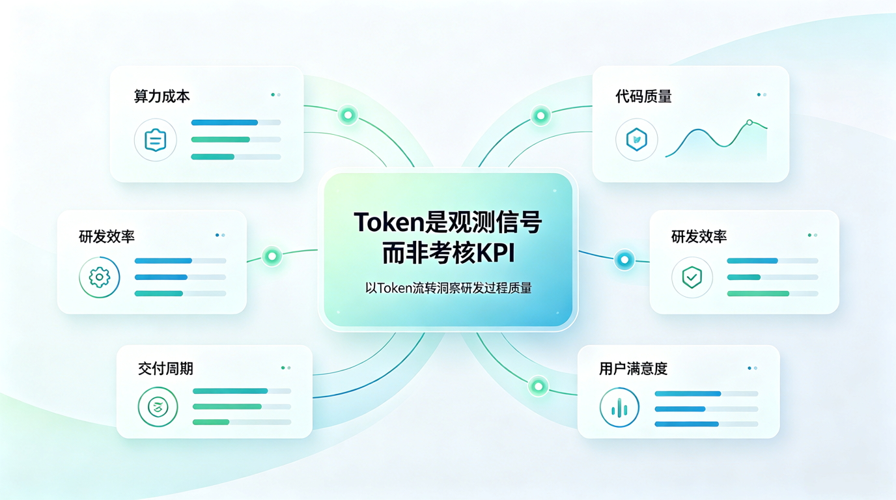
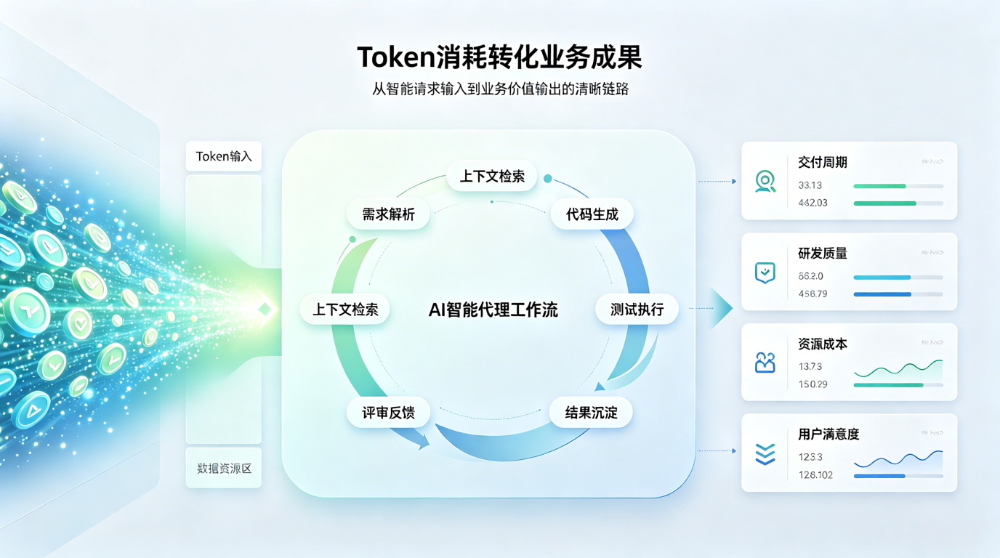
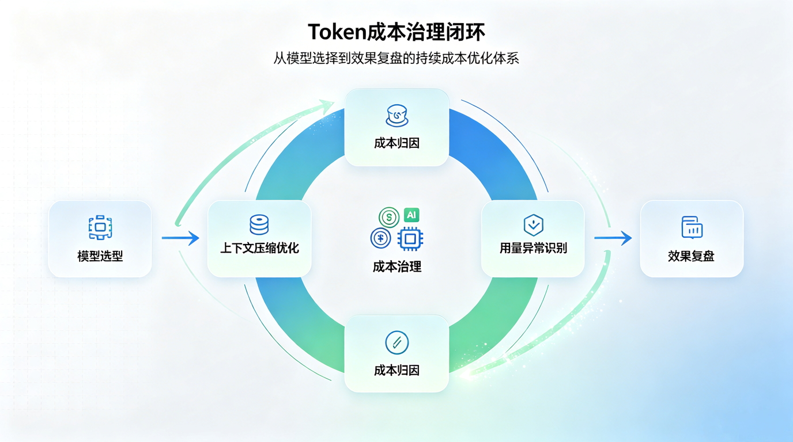

# Don't Let Token Become the New KPI: How Enterprises Measure AI's Real Output

AI tools are entering enterprises' daily workflows.

Engineers write code, product managers organize requirements, marketing generates copy, pre-sales prepare proposals, and ops troubleshoot issues — more and more work is being done with LLM assistance. Along with this comes a new management question:

**How can enterprises tell whether AI is actually delivering real output?**

The most visible metric is Token.

Every prompt input, context read, model inference, and content generation consumes Tokens behind the scenes. Tokens have cost, leave records, and can be counted, so they naturally become the entry point for enterprises to observe AI usage.

But here lies the problem:

**Tokens can serve as a signal, but should not become a KPI.**

If enterprises simply tie Token consumption to individual efficiency, they easily slip into a misconception: whoever uses more looks more "AI-native"; whoever ranks at the top of the leaderboard seems more efficient.

This sounds intuitive, but it is not reliable. Worse, it may create new involution and wrong incentives.

## Why Token Metrics Are Easily Misused?

Token metrics themselves are not wrong.

They help enterprises answer some basic questions: Are AI tools being used? Which business scenarios have higher usage frequency? Which models cost more? Which tasks consume more context? Which calls might be anomalous?

But the limitations of Tokens are also obvious: they only describe **consumption**, not **output** directly.

A person who consumes a lot of Tokens may be efficiently completing a complex task, or may be repeatedly asking, trial-and-erroring inefficiently. A team with low Token usage does not necessarily mean underusing AI; it may have clearer task breakdown, higher-quality prompts, and better context management.

Similar discussions have already appeared in the industry. The criticism around [tokenmaxxing](https://en.wikipedia.org/wiki/Token_maxxing) arises precisely because some enterprises mistake Token consumption for a productivity signal, leading employees to increase AI calls to boost visibility rather than to better complete tasks.

Cognition CEO Scott Wu also mentioned in an interview that Token leaderboards are "directionally somewhat right," but if enterprises use them to rank individuals by personal consumption, they easily go astray; what should really be measured is deliverables, task completion efficiency, and engineering outcomes. See [Business Insider's report on Token usage leaderboards](https://www.businessinsider.com/cognition-ceo-scott-wu-tokenmaxxing-leaderboards-opinion-ai-vibe-coding-2026-6).

This reminds us: what enterprises should do is not create a new Token KPI, but build a more mature AI output evaluation system.

| Misunderstanding | Possible consequence | More reasonable understanding |
|---|---|---|
| The more Tokens, the more efficient | Encourages Token farming, long prompts, useless calls | More Tokens only means more consumption |
| Token leaderboard can measure individual performance | Creates a sense of personal surveillance, triggering resistance and involution | Better to look at team, project, scenario, and model trends |
| Higher AI usage is always better | Runaway cost, low-value tasks crowding out budget | Should focus on the input-output ratio of high-value scenarios |
| Personal usage can be directly used for performance | Metric gets gamed, damaging trust | Should focus on delivery results, quality improvement, and process efficiency |

## Shifting From "How Much Was Used" to "What Was Produced"

What enterprises really care about should not be how many Tokens a person used, but whether AI has improved the work process and business outcomes.

In other words, the key to measuring AI value is not the Token count, but the **Token conversion rate**.

The core of this perspective is to turn Token from a "personal ranking metric" into an "enterprise operating signal."

It doesn't ask "who used the most," but asks:

- Which scenarios most deserve using AI?
- Which tasks truly became faster because of AI?
- Which work has high consumption but low output?
- Which models have high cost but unclear effect?
- Which processes shortened their cycle because of AI involvement?
- Which quality risks need extra governance?

This is where enterprise-grade AI operations truly add value.

## Personal Surveillance Is Not the Answer; Enterprise Observability Is the Direction

After AI tools enter enterprises, managers certainly need visibility. Without observability, you cannot evaluate input-output, nor control cost and risk.

But observability is not the same as personal surveillance.

If employees feel that AI usage data will be directly used for personal ranking, performance comparison, or behavior tracking, it easily breeds distrust. The eventual result may not be higher efficiency, but gamed metrics, tool resistance, and even avoidance of AI processes.

Such controversies are not unfounded. Meta recently sparked controversy by tracking employees' computer activity for an internal AI training project, and suspended the related project after employee pushback and the exposure of data-access issues. See [The Guardian's report: Meta pauses tracking of employees' Token usage over privacy concerns](https://www.theguardian.com/technology/2026/jun/24/meta-pauses-employee-tracker-for-ai-training-amid-privacy-concerns).

A healthier approach is to shift the observation granularity from "personal ranking" to "enterprise governance."

| Observation dimension | Approach to avoid | Recommended approach |
|---|---|---|
| Personnel | Rank by individual Token consumption | Observe team-level adoption trends and training needs |
| Cost | Simply compare who spends more | Attribute by project, model, and task type |
| Efficiency | Use Token volume to represent efficiency | Correlate with delivery cycle, task completion rate, and quality data |
| Quality | Only look at the quantity of generated content | Look at rework rate, adoption rate, defect rate, and satisfaction |
| Governance | Assume all data can be collected by default | Clarify data boundaries, permissions, auditing, and purpose |

Behind this is a basic principle:

**Token data should serve enterprise learning, not personal pressure.**

## Token Cost Needs Governance, Not Unchecked Growth

As AI tools penetrate workflows more deeply, Token cost shifts from a "trial cost" to a "continuous operating cost."

At first, enterprises may only care whether employees use AI.

But as AI usage scales up, the question changes: which models are most expensive? Which scenarios consume the most Tokens? Which tasks can use cheaper models? Which contexts can be compressed? Which calls are actually unnecessary?

Analysis points out that the Token cost of AI coding and AI office work may become a new target for enterprise cost governance; it cannot rely solely on employees' spontaneous restraint. Reference: [TechRadar on AI coding Token cost governance](https://www.techradar.com/pro/token-discipline-will-not-emerge-through-developer-choice-alone-experts-predict-that-ai-coding-costs-will-overtake-developer-salaries-by-2028).

Research also shows that in agentic coding tasks, higher Token consumption does not necessarily bring higher accuracy; Token consumption for the same task can vary enormously. Reference paper: [AI Agents Are Draining Your Wallet](https://arxiv.org/abs/2604.22750).

This shows that enterprises need to build effective Token cost governance capabilities, rather than simply encouraging "use more AI."

| Governance direction | Specific practice |
|---|---|
| Model tiering | Use models of different cost and capability for different tasks |
| Context governance | Reduce irrelevant context and control repeated input |
| Scenario classification | Distinguish high-value tasks from low-value calls |
| Cost attribution | Track cost by team, project, business line, and task type |
| Anomaly detection | Find abnormally high consumption, repeated calls, and failed tasks |
| Effect review | Evaluate cost and output results together |

The goal of Token cost governance is not to suppress AI usage, but to make AI usage more quality-driven.

## Conclusion: Token Is a Signal, Not the Destination

In the AI era, Token will become an important signal for enterprises to understand AI usage.

It helps enterprises see cost, model calls, tool activity, and task consumption. But it alone cannot answer "has AI created value."

Real AI output should be reflected in more complete results: faster delivery, higher quality, less repeated labor, better knowledge accumulation, more stable system operation, and a more controllable cost structure.

So enterprises should not turn Token into a new KPI.

A better direction is to bring Token into the AI observability and governance system, and analyze it together with business output, quality metrics, cost structure, and process efficiency.

As AI moves from individual trial to enterprise-scale application, what enterprises need is not just "more AI usage," but "better AI operations."

In this sense, Token is not the destination.

It is merely a dashboard on the enterprise's journey toward AI productivity operations.

## References

- [Tokenmaxxing Concept Explanation](https://en.wikipedia.org/wiki/Token_maxxing)
- [Business Insider: Cognition CEO on Token Leaderboards and tokenmaxxing](https://www.businessinsider.com/cognition-ceo-scott-wu-tokenmaxxing-leaderboards-opinion-ai-vibe-coding-2026-6)
- [The Guardian: Meta Pauses Employee Computer-Activity Tracking Project](https://www.theguardian.com/technology/2026/jun/24/meta-pauses-employee-tracker-for-ai-training-amid-privacy-concerns)
- [TechRadar: Discussion on AI Coding Token Cost Governance](https://www.techradar.com/pro/token-discipline-will-not-emerge-through-developer-choice-alone-experts-predict-that-ai-coding-costs-will-overtake-developer-salaries-by-2028)
- [arXiv Paper: AI Agents Are Draining Your Wallet](https://arxiv.org/abs/2604.22750)
- [Goodhart's Law: Once a measure becomes a target, it ceases to be a good measure](https://en.wikipedia.org/wiki/Goodhart%27s_law)
