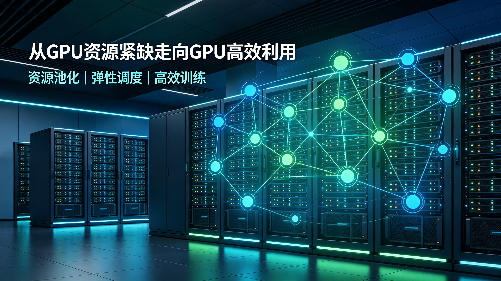
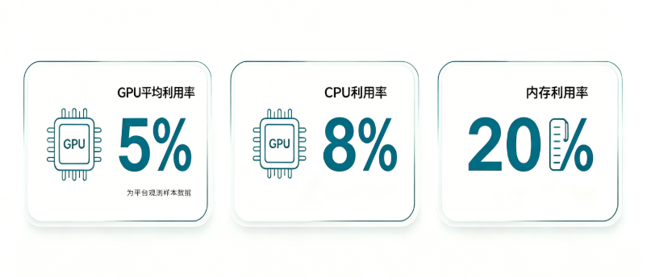
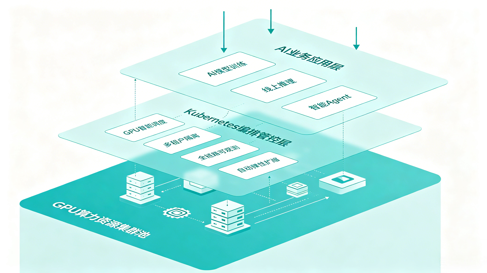
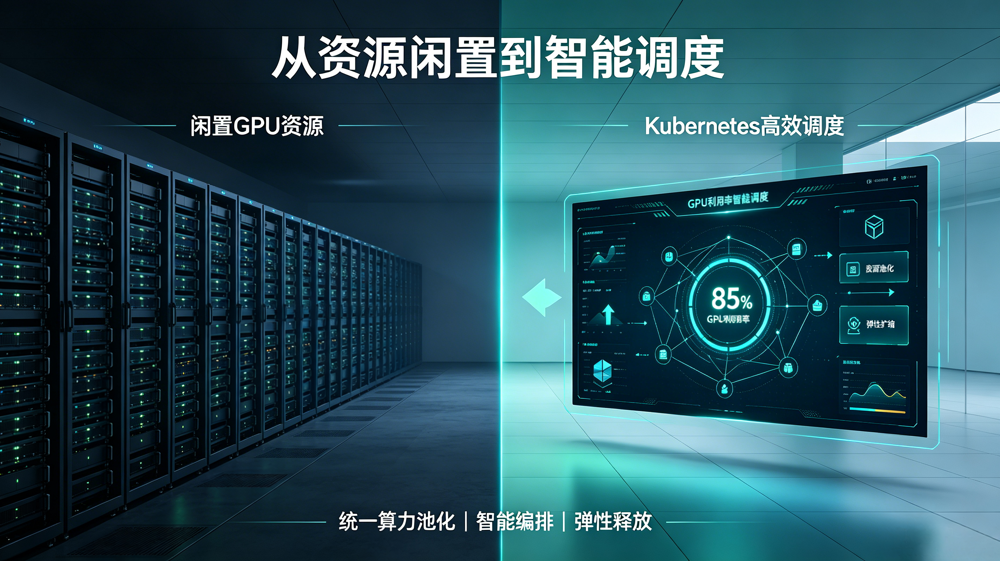
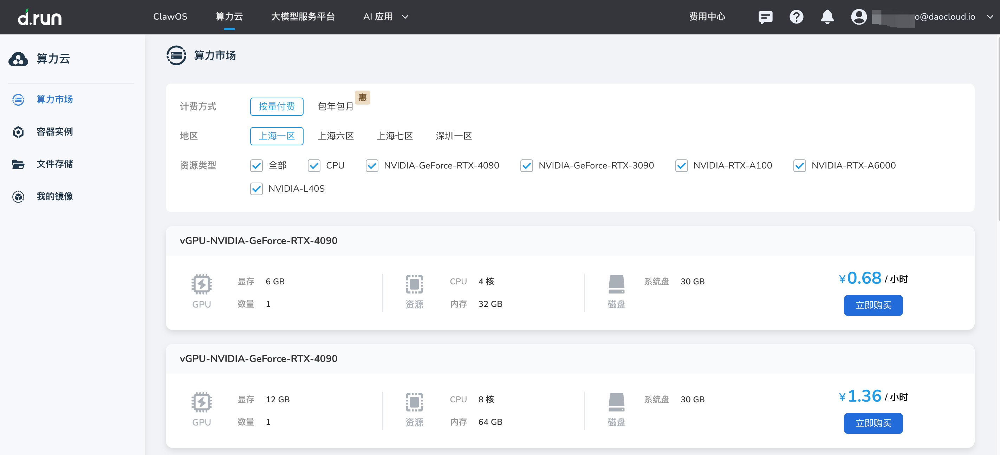

# The Next Hard Battle for AI Infra: Not Buying More GPUs, but Putting 95% of Idle Compute to Use

AI compute is expensive and GPUs are scarce. But a more piercing question is: many GPUs that enterprises have already bought, rented, or reserved are not actually being used fully.

Over the past two years, the keywords of AI Infra have revolved almost entirely around "compute scarcity": GPUs are hard to buy, delivery cycles are long, cloud instances are tight, and inference costs remain high.

But according to related reports on CAST AI's 2026 Kubernetes Optimization Report, another fact is equally worth noting: in its observed samples, enterprise GPU average utilization is only about **5%**. In other words, a large number of GPUs that have already been purchased, reserved, or allocated have not truly been converted into effective compute.

This brings a very practical shift to AI Infra: the next stage of competition is not just "who owns more GPUs", but "who can use GPUs more fully".

## The Other Side of GPU Scarcity Is GPU Waste

When building AI platforms, many enterprises naturally tend to buy a bit more, reserve a bit more, and isolate a bit more.

This is not hard to understand. AI business has obvious uncertainty: model training may suddenly start, inference traffic may surge in a short time, and R&D teams do not want key experiments interrupted due to insufficient resources.

Thus, resource reservation gradually becomes a kind of "sense of security":

- Each team applies for GPUs separately
- Each model type builds its environment separately
- Each business line splits out an independent cluster
- Resources are configured by peak rather than real load
- Rather idle than risk queuing or preemption

In the CPU era, this redundancy could still be masked by cost. But in the GPU era, the cost of idle resources is sharply amplified.

GPU is not only more expensive, it is also the key bottleneck resource for AI workloads. When a node sits idle, what is lost is not just money, but also model iteration speed, inference service capacity, and overall platform throughput.

> The data in the figure above comes from public reports related to the CAST AI report and represents its observed samples.

## Kubernetes Has Become the Foundation of AI Infra, but the Defaults Are Not Enough

Today, more and more AI workloads are running on Kubernetes.

Whether it is model training, fine-tuning, batch tasks, or online inference services, Kubernetes provides a unified foundation for scheduling, deployment, elasticity, observability, and multi-tenancy. It allows AI applications to be managed like cloud-native applications.

But the problem is that Kubernetes was not originally designed for expensive, scarce, and strongly heterogeneous GPU clusters.

The traditional Kubernetes resource model is better at handling relatively general, partitionable, and elastic resources such as CPU and memory. GPUs are far more complex:

- Performance varies greatly across different GPU models
- VRAM size directly determines whether a model can run
- The resource curves of training, fine-tuning, and inference are completely different
- Multi-tenant GPU sharing requires isolation and quotas
- Inference services need to care about latency, throughput, and cold start
- GPU idleness, fragmentation, and overcommitment are hard to govern manually alone

This means that "running AI workloads on Kubernetes" is only the first step. The real difficulty is giving Kubernetes the resource governance capability oriented to AI compute.

## From "Resource Allocation" to "Resource Operations"

The core problem of AI Infra is shifting from a deployment problem to an operational problem.

In the past, platform teams focused on: Can the model service be deployed? Can GPU nodes be recognized? Can the task be scheduled successfully?

Now the questions become: Is the GPU fully utilized? Are resources reasonably shared? Is inference latency stable? Are there clear quotas between different teams? Is cost explainable? Can idle resources be automatically reclaimed?

An AI platform cannot just provide a batch of GPU nodes; it must provide an operable compute system. It should at least have the following core capability modules:

| Capability Module | Problem Solved | Platform Value |
|---|---|---|
| Resource pooling | GPUs are built separately by team and project, thus easily forming resource islands | Incorporate scattered GPUs into a unified resource pool, improve reuse rate, and reduce duplicate procurement and long-term idleness |
| Multi-tenant isolation | When multiple teams share compute, permissions, quotas, and security boundaries are unclear | While sharing resources, guarantee access control, resource quotas, and runtime isolation between different teams |
| Fine-grained scheduling | Different GPU models, VRAM, topology, and task types are hard to match manually | Place resources more precisely based on model and task characteristics, reducing GPU fragmentation and performance waste |
| Elastic scaling | Inference services are long configured by peak, leaving resources idle at low tide | Dynamically scale based on real traffic, reducing cost while guaranteeing service stability |
| Cost visualization | Teams find it hard to see GPU utilization, idleness rate, and per-request cost | Make resource consumption observable and attributable, providing a basis for cost optimization and resource allocation |
| Automated governance | Resource reclamation, migration, compaction, and adjustment rely on manual inspection | Automatically discover and handle inefficient resources through policies, keeping the platform at higher utilization continuously |

Behind this is actually an upgrade in the platform engineering mindset: turning GPUs from "expensive equipment" into "measurable, schedulable, and governable production resources".

## In the Inference Era, GPU Utilization Matters Even More

If the training phase is more like periodic big tasks, then the inference phase is more like continuously running online services.

After enterprises truly deploy AI applications at scale, inference becomes a longer-term, more stable, and more business-cost-proximate part. Especially in scenarios such as intelligent customer service, code assistants, knowledge-base Q&A, and Agent workflows, they all bring continuous model calls.

The inference scenario puts forward new requirements for infrastructure:

- Traffic has peaks and valleys, requiring elasticity
- Requests have latency requirements, requiring stability
- There are many model types, requiring heterogeneous scheduling
- Cost amplifies with calls, requiring fine-grained accounting
- Multiple businesses share models, requiring platform-based governance

This is also why GPU utilization cannot just look at "whether there is a task running", but also at whether the GPU truly serves business goals: per-token cost, P95 latency, throughput, VRAM utilization, queue wait time, and model replica count—these metrics should all enter the daily operational view of AI Infra.

## The Maturity of AI Infra Ultimately Shows Up in Efficiency

In the early days of AI infrastructure construction, many enterprises prioritize solving the "whether we have it" problem: whether there are GPUs, whether there is a model platform, whether there is an inference service, whether there is a vector database.

But as investment grows, what really makes the difference is "whether it is used well".

With the same number of GPUs, some platforms can only support a few teams queuing for use; other platforms, through unified scheduling, multi-tenant sharing, elastic scaling, and cost governance, can run more models, higher-frequency experiments, and more stable inference simultaneously.

This is the key change of AI Infra moving from resource construction to platform engineering.

In the future, when enterprises measure AI infrastructure capability, they may not just look at the number of GPUs, but at these questions:

- What is the average GPU utilization?
- Can idle resources be discovered and reused in time?
- Can different business teams safely share compute?
- Can inference services dynamically balance between cost and latency?
- Is the per-unit cost of AI applications observable, optimizable, and attributable?
- Can the platform support the complete lifecycle from training to inference to Agent?

AI compute remains scarce, but even scarcer is the engineering capability to use compute well.

For enterprises, the next hard battle for AI Infra may not be buying more GPUs, but truly turning the GPUs they already own into schedulable, shareable, observable, and operable productivity.

Note: compressing this into "short paragraphs + table + closing sentence" would be cleaner, and suitable to place at the end of the post:

## DaoCloud: Building AI Infra on a Trustworthy Cloud-Native Foundation

The underlying capability of AI Infra cannot be separated from a stable, open, and sustainably evolving cloud-native infrastructure. DaoCloud has long been deeply involved in the upstream Kubernetes community and has distilled community capabilities into enterprise-grade AI Infra practices.

| Dimension | DaoCloud Practice | Value to AI Infra |
|---|---|---|
| Community governance | [Paco Xu was re-elected as a member of the Kubernetes Steering Committee](../2025/paco-ksc.md), and is also the only Kubernetes Steering Committee member from China | Deeply participate in Kubernetes project governance and grasp the evolution direction of the cloud-native foundation |
| Security response | [In 2024, DaoCloud joined the Kubernetes Security Response Committee](../2024/241219-sec-privacy.md) | Participate in the Kubernetes security vulnerability response and disclosure process, strengthening the security foundation of enterprise-grade AI platforms |
| Upstream contribution | Has a dozen or so Maintainers across various Kubernetes SIGs, ranking in the global top 10 in code contributions | Continuously participate in the construction of core directions such as scheduling, storage, networking, security, documentation, and localization |
| Industry landing | Helped multiple listed companies, universities, and research institutions build GPU compute centers | Support the landing of AI training, inference, scientific computing, and industry large-model applications, achieving multiple-fold market value growth |
| Platform capability | Through the cloud-native foundation, realizes compute pooling, task scheduling, multi-tenant management, resource metering, elastic scaling, and security governance | Upgrade the GPU compute center from "hardware stacking" to "operable AI infrastructure" |

As GPU compute gradually becomes the underlying asset of enterprise AI capability, what enterprises need is not just a platform that can run models, but a cloud-native infrastructure foundation that can carry the model lifecycle, compute governance, and business-scale landing.

What DaoCloud hopes to do is precisely to help enterprises turn AI compute from "expensive resources" into "schedulable, shareable, observable, and governable productivity".

## References

- TechRadar: ["5% utilization is a math fail": Millions of GPUs worth billions are mostly sitting idle, report finds](https://www.techradar.com/pro/5-utilization-is-a-math-fail-millions-of-gpus-worth-billions-are-mostly-sitting-idle-report-finds)
- Business Insider: [Companies are hoarding AI compute because of FOMO, and they're sitting on most of it](https://www.businessinsider.com/companies-hoarding-unused-ai-compute-cast-ai-report-kubernetes-2026-4)
- arXiv paper: [Instant GPU Efficiency Visibility at Fleet Scale](https://arxiv.org/abs/2605.20799)
