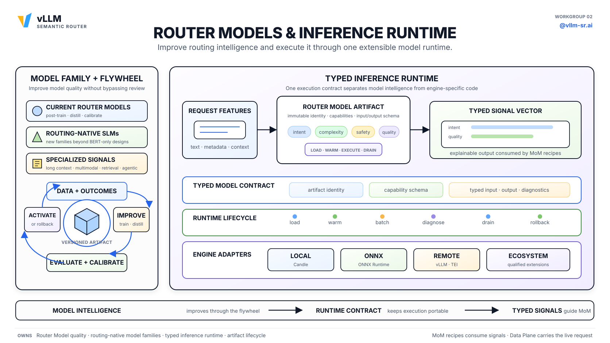
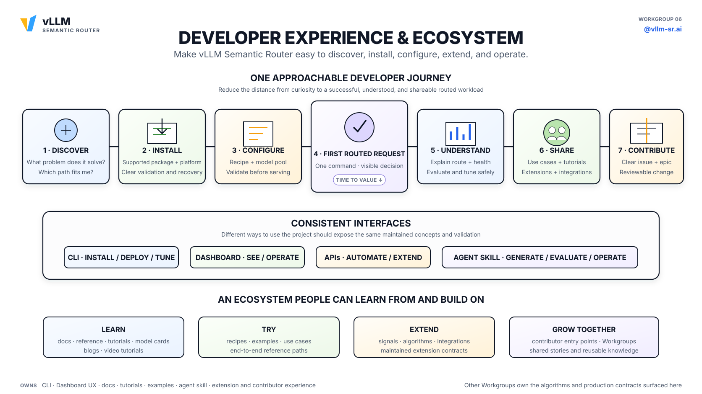
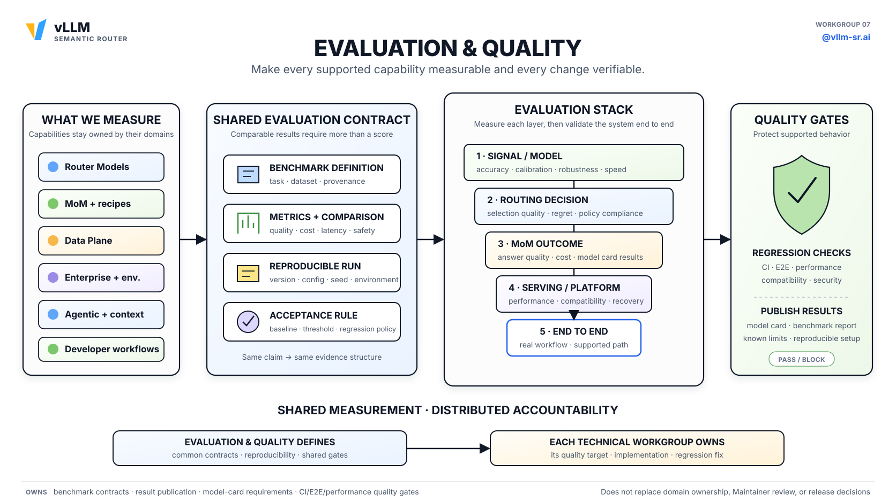

# vLLM Semantic Router's Seven Working Groups: DaoCloud's Continued Deep Collaboration

> Original link: [Find Your Focus and Join a Workgroup](https://vllm-sr.ai/blog/join-vllm-sr-workgroups)

Open source grows when people can see where their work belongs and who they can build with. vLLM Semantic Router (vLLM-SR for short) now has seven working groups, each owning a persistent technical direction.

vLLM-SR sits between AI applications and the model or agent backend: it understands the request, chooses how to handle it, executes the routing, and measures the results. The seven working groups partition the system into clear contribution areas, giving community developers an explicit path to participate.

As an active contributor to the vLLM-SR community, the **DaoCloud team** is deeply involved in several working groups, covering core directions such as the data plane, routing models, and the enterprise environment. This article walks you through the mission and boundaries of the seven working groups, and DaoCloud's contributions within them.

## One System, Seven Clear Homes

A routed request crosses several responsibilities:

1. **Developer Experience & Ecosystem** provides the CLI, Dashboard, API, recipes, and learning paths.
2. **Enterprise & Environment** protects the management plane, owning lifecycle, capacity, and deployment strategy.
3. **Router Models & Inference Runtime** produces the signals used for routing.
4. **MoM & Routing** chooses models and multi-model strategies.
5. **Agentic & Context** manages bounded context, memory, and conversation continuity.
6. **Data Plane & Networking** executes the chosen path.
7. **Evaluation & Quality** measures results and catches regressions.

They form one system, separated by responsibility rather than isolated code ownership. Each Epic has an owning working group, and dependencies on other groups are recorded in the shared interfaces documented in the associated charters.

## [MoM & Routing](https://github.com/vllm-project/semantic-router/issues/2965)

> **Mission:** Make a set of models behave like a measurable, continuously improving MoM (Mixture of Models).

### The Problem It Solves

Users should be able to call a stable model name without choosing the backend for each request. A MoM needs a pool of qualified models and a versioned recipe that can keep improving without making behavior unpredictable.

### The Working Group's Responsibilities

- Model pools, model roles, portable recipes, and their versioned lifecycle.
- Model selection and collaboration through fallback, cascade, judging, synthesis, and bounded workflows.
- Improvements of recipe and pool membership from offline to online, targeting explicit quality, cost, latency, safety, domain, or modality goals.
- Modality-aware pools, approved inference reuse, and cross-model safe reuse of compatible compute.

### What This Working Group Does NOT Own

This working group does not train the lightweight models that produce routing signals, does not build the real-time network path, does not decide how conversation history is compressed, and does not run a hosted service.

### Belonging Epics

> An Epic is a label type for GitHub Issues in this project, used to group related Issues under a working group.

[View all Epics currently under MoM & Routing](https://github.com/vllm-project/semantic-router/issues?q=is%3Aissue+is%3Aopen+label%3Aepic+label%3Awg%2Fmom-routing)

## [Router Models & Inference Runtime](https://github.com/vllm-project/semantic-router/issues/2966)

> **Mission:** Build better routing models and a scalable runtime that executes them across the whole ecosystem.

### The Problem It Solves

Routing depends on signals such as intent, complexity, safety, preference, and expected quality. The models that produce these signals must improve over time, and new models should not scatter engine-specific code throughout the Router.

### The Working Group's Responsibilities

- Improve, calibrate, and release the project's built-in routing models.
- Develop routing-native model families that go beyond pure BERT designs.
- Build reproducible self-improvement, distillation, and fine-tuning pipelines.
- Provide a versioned execution contract across supported engines and hardware, with clear activation, diagnostics, and rollback.

### What This Working Group Does NOT Own

This working group produces routing intelligence; it does not choose the end user's MoM model pool, does not own general gateway forwarding, does not protect the management plane, and does not rebuild the tensor engines and GPU schedulers it integrates with.

### Belonging Epics

[View all Epics currently under Router Models & Inference Runtime](https://github.com/vllm-project/semantic-router/issues?q=is%3Aissue+is%3Aopen+label%3Aepic+label%3Awg%2Frouter-models-inference-runtime)

## [Data Plane & Networking](https://github.com/vllm-project/semantic-router/issues/2967)

> **Mission:** Execute every real-time routing decision through a fast, reliable, and portable request path.

### The Problem It Solves

If the request path is slow, fragile, or different in every deployment, the routing decision is hardly worth anything. Standalone services and gateway integrations need the same behavior and failure semantics.

### The Working Group's Responsibilities

- Standalone OpenAI-compatible service and Envoy or gateway integration.
- Request, response, streaming, dispatch, retry, fallback, error, and telemetry behavior.
- Engine-agnostic backend connections and inference-aware endpoint selection.
- Secure semantic caching, performance optimization, and fault recovery.

### What This Working Group Does NOT Own

This working group executes the request-path network and the access policies provided by deployment, but it does not define management identity and authorization, does not decide which hardware is officially supported, does not train routing models, and does not choose the optimal MoM recipe.

### Belonging Epics

[View all Epics currently under Data Plane & Networking](https://github.com/vllm-project/semantic-router/issues?q=is%3Aissue+is%3Aopen+label%3Aepic+label%3Awg%2Fdata-plane-networking)

## [Enterprise & Environment](https://github.com/vllm-project/semantic-router/issues/2968)

> **Mission:** Make vLLM Semantic Router production-grade on the supported environments and hardware.

### The Problem It Solves

Production operators need clear answers to real questions: which management plane is protected, by which provider-backed identity? What changed? Is the system healthy? Can model, recipe, or router upgrades be safely rolled out and rolled back? Which deployment paths are maintained, and what components do they own? These answers must stay consistent across different deployment environments.

### The Working Group's Responsibilities

- Management authentication, provider-backed identity integration, routing-bound authorization, input and credential boundaries, and persistent auditing.
- Reliability, scalability, monitoring, diagnostics, and the existing Insights and operations plane.
- Activation, rollout, and rollback of models, recipes, configuration, and vLLM-SR.
- Workload simulation and capacity planning, connecting observed traffic, routing behavior, service topology, and calibrated hardware profiles to reviewable deployment proposals.
- Stable deployment and lifecycle APIs, a maintained reference stack, and a tested support matrix across deployment environments and hardware.

### What This Working Group Does NOT Own

This working group does not build organization, team, or project management; it does not build virtual API keys, tenant quotas, token rate limits, budgets, billing, or usage settlement. It also does not plan routing analytics beyond the existing Insights and operations plane.

It does not promise an SLA for a public hosted service, does not expose private infrastructure or credentials, does not define model quality, does not own evaluation criteria, and does not implement network protocols. It provides reusable open source production capability, not a private product plan.

### Belonging Epics

[View all Epics currently under Enterprise & Environment](https://github.com/vllm-project/semantic-router/issues?q=is%3Aissue+is%3Aopen+label%3Aepic+label%3Awg%2Fenterprise-environment)

## [Agentic & Context](https://github.com/vllm-project/semantic-router/issues/2987)

> **Mission:** For long-running workloads, optimize bounded context, memory, conversation continuity, and safe model or workflow switching.

### The Problem It Solves

Long-running work accumulates messages, memory, tool outputs, cost, and risk. Important instructions may be lost, and a model or workflow change may break tool loops or provider state. The Router needs a bounded continuity contract without turning into a general-purpose agent framework.

### The Working Group's Responsibilities

- Context compression, pruning, memory selection, prompt reconstruction, and protection of critical instructions.
- Prompt-visible Router memory with explicit persistence and lifecycle credentials.
- Session budget, state boundaries, retention, tool-loop continuity, recovery, and graceful degradation.
- Safe model or workflow switching as the session evolves.
- Typed tasks consumable by external agent runtimes, context portability, and capability and collaboration credentials.

### What This Working Group Does NOT Own

This working group does not select, invoke, host, or compose agent endpoints within the Router. It does not build an agent endpoint catalog, an unbounded agent orchestrator, a tool platform, or a workflow engine; it does not own general MoM selection; it does not transfer KV cache between models; and it does not allow silent lossy transformations or unbounded online training.

### Belonging Epics

[View all Epics currently under Agentic & Context](https://github.com/vllm-project/semantic-router/issues?q=is%3Aissue+is%3Aopen+label%3Aepic+label%3Awg%2Fagentic-context)

## [Developer Experience & Ecosystem](https://github.com/vllm-project/semantic-router/issues/2970)

> **Mission:** Make vLLM Semantic Router easy to adopt, configure, extend, diagnose, and contribute to.

### The Problem It Solves

When new users can't reach their first request or can't understand what's happening, technical depth has limited impact. The project also needs a clear extension path so contributors, model builders, infrastructure projects, and educators can build without reverse-engineering the repository.

### The Working Group's Responsibilities

- A supported first-run path through CLI, configuration, recipes, errors, and troubleshooting.
- Dashboard configuration and diagnostics built on the spec-based Router and deployment contracts.
- An agent-facing skill for deployment, recipe generation, evaluation, tuning, and reviewed operations.
- Documentation, localization, integration guides, routing-model development guides, technical content, and contributor entry points.
- Clear extension and contribution paths for models, runtimes, gateways, and deployment systems.

### What This Working Group Does NOT Own

This working group does not control repository permissions or promotion, does not run marketing campaigns or internal AMD projects, and does not redefine algorithms, production policies, or quality standards owned by other working groups.

### Belonging Epics

[View all Epics currently under Developer Experience & Ecosystem](https://github.com/vllm-project/semantic-router/issues?q=is%3Aissue+is%3Aopen+label%3Aepic+label%3Awg%2Fdeveloper-experience-ecosystem)

## [Evaluation & Quality](https://github.com/vllm-project/semantic-router/issues/2969)

> **Mission:** Make every supported capability measurable and every change verifiable.

### The Problem It Solves

When routing models, MoM recipes, agent selection strategies, runtime optimizations, or deployments each use different datasets and reporting methods, claims about them are hard to trust. The project needs a shared evaluation contract and regression gate. Each technical working group owns what it builds; this working group makes the results comparable.

### The Working Group's Responsibilities

- Common benchmarks, data provenance, metrics, comparison, reproducibility, and a publishing contract.
- First-class evaluation of each MoM and standalone model, with a common core and goal-specific extensions.
- Shared evaluation across routing, agentic, context, service, platform, and developer workflows.
- CI, E2E, compatibility, security, performance, and operations regression gates.

### What This Working Group Does NOT Own

This working group does not choose quality goals for other directions, does not accept issues, does not make final release decisions, does not replace Maintainer review, and does not own model research itself. It defines the shared metrics and gates.

### Belonging Epics

[View all Epics currently under Evaluation & Quality](https://github.com/vllm-project/semantic-router/issues?q=is%3Aissue+is%3Aopen+label%3Aepic+label%3Awg%2Fevaluation-quality)

## How Working Groups Operate

> A working group is a technical home, not a permission level.

Each working group owns a persistent technical direction and its bounded Epics. It connects contributors, maintains the charter, and helps prepare work for acceptance. The open source team retains the final authority over acceptance, merge, and release.

| Working group | Open source team |
| --- | --- |
| Direction, boundaries, Epics, and contributor focus | Project governance and repository permissions |
| Triage and accept proposals | Final accept, merge, and release permissions |
| Lead and Member roles | Maintainer, Committer, and Contributor roles |

**Lead.** Each active working group has at least one Lead, and may have several. A Lead is a Committer or Maintainer, or a Contributor with merged commits and Committer or Maintainer sponsorship. The Lead maintains the charter and Epic mapping and coordinates triage.

**Member.** A Member has at least one merged repository commit and keeps building in that direction. Anyone may collaborate before meeting the roster requirements, and one person may join multiple working groups.

## DaoCloud and the vLLM-SR Collaboration

In vLLM-SR's CODEOWNERS file, **wilsonwu** (Wilson Wu) from DaoCloud is listed as the Code Owner of several core paths, covering nearly every core directory such as `src/`, `deploy/`, `dashboard/`, `tools/`, and `website/`.

In addition, DaoCloud team members keep contributing in the following directions:

- **Data Plane & Networking:** development and fixes for request-path execution, semantic caching, and Envoy gateway integration.
- **Router Models & Inference Runtime:** building and optimizing inference engines such as Candle bindings, ONNX bindings, and ML bindings.
- **Enterprise & Environment:** Helm deployment, Docker image builds, and production stability fixes.
- **Developer Experience & Ecosystem:** Chinese documentation translation and synchronization, Dashboard UI improvements, and CLI tool enhancements.
- **Evaluation & Quality:** E2E test coverage, classifier similarity computation fixes, and regression test enhancements.
