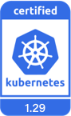

# DaoCloud is a K8s senior certification service provider

There is such a word in the field of cloud native: KCSP, the English full name is Kubernetes Certified Service Provider, which is the Kubernetes service provider officially certified by CNCF.

DaoCloud successfully passed the Kubernetes certification for the first time in 2017, and is the earliest service provider in China to get involved and officially recognized by CNCF.
At the same time, it is also the first manufacturer in China to obtain Kubernetes Training Partner (KTP) certification. The developers of DaoCloud actively participate in CNCF-related community contributions all the year round,
Taking leading the trend of cloud native technology as its own responsibility, it is committed to promoting the development and growth of the cloud native community.

Every time a new version of Kubernetes is released, DaoCloud will take the lead in adapting and enhancing new features, and push them to the actual production environment.
As an official and strictly audited Kubernetes service provider and partner, DaoCloud has profound production experience in helping enterprises successfully deploy large-scale clusters using Kubernetes.

DaoCloud being a certified KCSP means:

- DaoCloud is a [Kubernetes officially recommended senior partner](https://kubernetes.io/partners/)
- DaoCloud is recognized by the CNCF community as an excellent company that has expert qualifications and is fully competent for the professional work of Kubernetes cluster deployment
- When end users choose Kubernetes to deploy clusters, DaoCloud is a brand supplier recognized and recommended by the CNCF cloud native community
- DaoCloud, which has been ranked in the KCSP for many years, has mastered the leading technology in the field of cloud native, and always leads the development direction of the cloud native community

Currently, DaoCloud's certified and perfectly supported Kubernetes versions include:

The currently maintained versions by K8s community:

Historical versions that are no longer maintained by the Kubernetes community, but are being continuously maintained by DaoCloud [KLTS](https://klts.io/):

## Technology Leading

DaoCloud's R&D team advocates technology first, and is widely recognized by the CNCF community. It has served as Member, Reviewer, Approver/Maintainer of many cloud native projects
To help the community prosper and develop, there are also big names joining the Steering Committee to be responsible for promoting the development and expansion of various underlying features.

| Title | Quantity |
| -------------------------------------------------- | ---- |
| Member | 52 |
| Reviewer | 15 |
| Approver/Maintainer | 6 |
| Technical Steering Committee | 1 |
| CNCF Ambassador | 1 |
| Certified Kubernetes Administrator (CKA) | 65 |
| Certified Kubernetes Application Developer (CKAD) | 26 |
| Certified Kubernetes Security Specialist (CKS) | 8 |

by Kubernetes in August 2022
In the officially organized community [contributor interview] (https://kubernetes.io/blog/2022/08/15/meet-our-contributors-china-ep-03/),
We met with 4 outstanding contributors from the Asia-Pacific region, 2 of whom are from DaoCloud, who have made outstanding contributions to the development of Kubernetes.

While promoting the technological evolution of the community, DaoCloud maintains a keen sense of cloud native technologies led by Kubernetes.
Taking Kubernetes 1.25 as an example, the first minor version 1.25.1 was released on 2022-09-14, and DaoCloud released it on 2022-10-25 after more than a month of adaptation and debugging.
Submitted [Conformance Certification Application PR](https://github.com/cncf/k8s-conformance/pull/2240),
With more than 50,000 lines of real E2E test reports, a complete [Chinese-English document site] (https://docs.daocloud.io/), and detailed materials,
Successfully passed the KCSP review for v1.25 on 2022-11-04.

At present, there are no more than 5 **domestic manufacturers** that can perfectly support Kubernetes 1.25 and have been officially certified.
In view of this, HUAWEI CLOUD has established a strategic partnership with DaoCloud in [Metaverse Cloud Edge Collaborative Hyper-Converged All-in-One Machine] (http://blog.daocloud.io/8542.html). There are also deep partnerships.

DaoCloud's open source community projects around the Kubernetes ecosystem include:

- [Clusterpedia](https://github.com/clusterpedia-io): One-stop search encyclopedia for Kubernetes multicluster resources, has been selected into CNCF panorama and CNCF sandbox
- [CloudTTY](https://github.com/cloudtty/cloudtty): The community's first open source Kubernetes web console
- [Ferry](https://github.com/ferryproxy/ferry): Kubernetes multicluster communication component, eliminating the complexity of multicluster, just like managing a single cluster
- [HwameiStor](https://github.com/hwameistor/hwameistor): A highly available local storage solution, which has been selected into the CNCF panorama
- [KLTS](https://github.com/klts-io): Long-term maintenance for Kubernetes 10+ versions
- [Kubean](https://github.com/kubean-io/kubean): A cluster lifecycle management tool based on kubespray
- [kwok](https://github.com/kubernetes-sigs/kwok): Use a notebook to simulate thousands of kubelets with minimal resources
- [Merbridge](https://github.com/merbridge/merbridge): Using eBPF to accelerate the service mesh, has been selected into the CNCF panorama
- [Spiderpool](https://github.com/spidernet-io): cloud native network IPAM automation management software, suitable for Underlay CNI

## CNCF Contribution Ranking

One of the metrics for considering a cloud native enterprise is community contribution. DaoCloud ranks first in the world in the overall contribution of cloud native projects in the CNCF community, and is second to none in China.

DaoCloud's contribution to the **Kubernetes** community in the last 365 days **#3** in the world**

DaoCloud's contributions to the **containerd** community in the last 365 days **#5 in the world**

DaoCloud's contributions to the **Istio** community in the last 365 days **#3 in the world**

Cumulative contribution of DaoCloud to all projects in the **CNCF community** in the past 365 days **ranked 7th in the world**

## Reference link

- https://www.cncf.io/
- https://github.com/cncf/k8s-conformance
- https://kubernetes.io/partners/
- https://www.stackalytics.io/

[Download DCE 5.0](../download/index.md){ .md-button .md-button--primary }
[Install DCE 5.0](../install/index.md){ .md-button .md-button--primary }
[Free Trial](../dce/license0.md){ .md-button .md-button--primary }