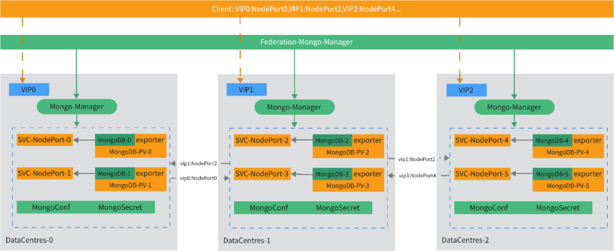

# Cloud Native Federation Middleware -- FedState Officially Open Sourced

In the cloud native scenario, there has been great development of stateful services. Some games are based on YAML packaging for manual installation, some are based on helm charts, and some are wrapped based on operator methods. At present, the community's methods are mainly based on helm chart and operator, especially based on operator, because it is a programming-friendly method and can develop various capabilities according to needs. Currently, there are also many open source middleware and database operators in the community, but they are mainly concentrated in the single-cluster game, which is related to the Operator framework itself. In a multi-cloud/federation environment, how to design and implement the scheduling, deployment, and automated operation and maintenance of stateful services based on multiple clusters, multiple data centers, and hybrid cloud scenarios? The newly open-sourced FedState project is trying to solve such situation problems.

The open-source repository address of FedState is: https://github.com/fedstate/fedstate. Next, we will introduce FedState in conjunction with MongoDB as an example.

## Demand Analysis

First of all, let's roughly analyze what requirements customers have for middleware usage in multi-cloud scenarios.

- Deploy middleware across container clusters/data centers.
- Unified control plane and multi-layer architecture specifications for data plane.
- Resource statistics capability of member container cluster.
- Reasonable scheduling of middleware load according to member container cluster resources.
- Flexibly adapt to different middleware characteristics to complete scheduling.
- Discovery between middleware components across container clusters.
- Unified external access entry of clusters.
- Topology of middleware clusters across multiple clusters.
- Expansion of middleware clusters.
- Contraction of middleware clusters.
- Data replication/disaster recovery capabilities across container clusters.
- Automated operation and maintenance ability of middleware clusters.
- Cloud native service delivery.
- The ability to manage middleware clusters in a page.
- Open API capability for easy construction of upper layer capabilities.
- Openness of storage, compatible with CSI.
- Tenant isolation.
- Support for multiple versions of middleware.
- Monitoring, alarm and other abilities.

## Architecture Introduction

Currently, FedState has implemented the framework of federation middleware, and also built-in the middleware capabilities of federation MongoDB and single-cluster MongoDB. The control plane and data plane are relatively independent. Single-cluster MongoDB Manager can be used directly in the single-cluster scenario, or MongoDB capabilities in the federation scenario can be used. At the same time, the federation MongoDB uses the single-cluster mode MongoDB Manager.

Here, taking the federation MongoDB as an example, the following architecture diagram introduces the overall capabilities provided by FedState around the MongoDB replica set in multi-cloud/multi-cluster environment.


FedState itself contains the following components:

Multicloud-Middleware-Scheduler: is responsible for collecting the resource usage of the working cluster and giving reasonable scheduling methods based on the resource usage. At the same time, different middleware have their own characteristics, and there will be corresponding special scheduling logic for different middleware to help various middleware choose suitable scheduling results. Different types of middleware scheduling strategies and implementations can be extended according to needs.

Federation-Mongo-Manager: can be understood as the operator of MongoDB control plane, which is mainly responsible for on-demand configuration of these middleware services, reasonable scheduling, and distribution through Karmada. Different middleware can be expanded as needed.

Mongo-Manager: can be understood as the operator of MongoDB data plane, which is mainly responsible for the processing of real service loads. Different middleware can be expanded as needed. Here, you can also choose excellent open-source operators, as long as the operator itself meets the requirements of the control plane for data plane operators, as long as expansion is performed in the control plane, this middleware can be supported to make it have the ability of federation middleware.

## Key capabilities



1. The external access method of the federation MongoDB instance: Vip0:NodePort0, Vip1:NodePort1...
2. East-west traffic and service discovery between MongoDB services in each member cluster are used to correspond to the NodePort method corresponding to the VIP+service of the cluster.
3. In addition to supporting the creation and updating of federation MongoDB replica sets, etc., you can also directly use the data plane operator to create and manage MongoDB clusters in single-cluster mode.
4. According to the characteristics of different middleware, nodes with different roles are deployed in different clusters to ensure the high availability requirements of middleware.
5. Support manual adjustment of cluster scale to complete expansion and contraction capabilities.
6. Support fault migration based on Karmada and custom migration strategies.
7. Support monitoring in Prometheus mode to collect metrics data of MongoDB nodes.
8. Custom configuration files can be set according to needs to set various configuration items supported by MongoDB.
9. Support MongoDB cluster authentication to authenticate client connections.
10. Support CSI storage to persist middleware data.
11. Support the topology of MongoDB clusters, and clearly observe the running status of each MongoDB node.
12. Support MongoDB replica set mode to build MongoDB clusters.

## Business Model

Taking MongoDB as an example, some common capabilities provided in the federation and single-cluster modes are introduced:

### MongoDB cluster in federation mode

Creating and managing resource objects of stateful services in federation will distribute stateful services to member clusters according to configuration, set the required storage, turn on monitoring, password configuration, etc. After successful creation, the deployment topology and access address of MongoDB in each member cluster will be displayed in the status. This mode is suitable for installing and managing MongoDB clusters across different clusters using control plane and data plane MongoDB Operators in a federation environment.

??? note "Click to check MultiCloudMongoDB YAML sample"

    ```yaml
    apiVersion: middleware.fedstate.io/v1alpha1
    kind: MultiCloudMongoDB
    metadata:
      name: multicloudmongodb-sample
    spec:
      replicaset: 5 # replicas
      export: # config monitor
        enable: true
        resource:
          limits:
            cpu: "500m"
            memory: 512Mi
          requests:
            cpu: "200m"
            memory: 256Mi
      resource: # stateful service resource config
        limits:
          cpu: "2"
          memory: 512Mi
        requests:
          cpu: "1"
          memory: 512Mi
      storage: # storage config
        storageClass: managed-nfs-storage
        storageSize: 1Gi
      imageSetting: # image settings
        image: mongo:3.6
        imagePullPolicy: Always
        imagePullSecret: "my-image-secret"
      auth: # password settings
        rootPasswd: "mypasswd"
      config: # stateful service config
        arbiter: false
        configRef: "my-custome-configmap"
      scheduler: # scheduling and models
        schedulerMode: Uniform
      spreadConstraints: # scheduling and node selection
        nodeSelect:
          deploy: mongo
    ```

### MongoDB Cluster in Single-Cluster Mode

Creating and managing resource objects for stateful services, this mode is suitable for directly installing and managing MongoDB clusters using the data plane MongoDB Operator in a single-cluster scenario.

??? note "Click to check MongoDB YAML sample"

    ```yaml
    apiVersion: middleware.fedstate.io/v1alpha1
    kind: MongoDB
    metadata:
      name: mongodb-sample
    spec:
      members: 1 # number of replicas
      image: mongo:3.6 # specify a version of MongoDB to deploy, default is MongoDB 6.0
      imagePullSecret: # image pull authentication information
        username: admin
        password: admin
      imagePullPolicy: Always # image pull policy
      config: # fill in according to the configuration of MongoDB
         - name: LOG_LEVEL
           value: info
      customConfigRef: mongo-operator-mongo-default-config # custom MongoDB config, specify cm name, default is mongo-default-config
      rootPassword: "123456" # specify initial password
      resources:
        limits:
          cpu: "1"
          memory: 512Mi
        requests:
          cpu: "1"
          memory: 512Mi
      persistence: # persistence parameters
        storage: 1Gi
        storageClassName: "" # storage type, default is empty, use default sc
      metricsExporterSpec:
        enable: true # whether monitoring is enabled, default is true
        resources:
          limits:
            cpu: "0.1"
            memory: 128Mi
          requests:
            cpu: "0.1"
            memory: 128Mi
      podSpec:
        nodeSelector: # node selector
        securityContext: # pod security context
        topologySpreadConstraints: # topology spread constraints
        affinity: # affinity and anti-affinity
        tolerations: # taint tolerations
    ```

## Case Introduction

Although there are two modes, federation and single-cluster, this case demonstrates an example using the federation mode.

### Deploying a Federation MongoDB Cluster CR on the Control Plane

```yaml
apiVersion: middleware.fedstate.io/v1alpha1
kind: MultiCloudMongoDB
metadata:
  name: multicloudmongodb-sample
spec:
  replicaset: 5
  export:
    enable: false
  resource:
    limits:
      cpu: "2"
      memory: 512Mi
    requests:
      cpu: "1"
      memory: 512Mi
  storage:
    storageClass: managed-nfs-storage
    storageSize: 1Gi
  imageSetting:
    image: mongo:3.6
    imagePullPolicy: Always
```

### Viewing the Status of MongoDB CR Instance on the Control Plane

??? note "Click to check MultiCloudMongoDB YAML sample"

    ```yaml
    apiVersion: middleware.fedstate.io/v1alpha1
    kind: MultiCloudMongoDB
    metadata:
      annotations:
        kubectl.kubernetes.io/last-applied-configuration: |
          {"apiVersion":"middleware.fedstate.io/v1alpha1","kind":"MultiCloudMongoDB","metadata":{"annotations":{},"name":"multicloudmongodb-sample","namespace":"federation-mongo-operator"},"spec":{"export":{"enable":false},"imageSetting":{"image":"mongo:3.6","imagePullPolicy":"Always"},"replicaset":5,"resource":{"limits":{"cpu":"2","memory":"512Mi"},"requests":{"cpu":"1","memory":"512Mi"}},"storage":{"storageClass":"managed-nfs-storage","storageSize":"1Gi"}}}
        schedulerResult: '{"ClusterWithReplicaset":[{"cluster":"10-29-14-21","replicaset":4},{"cluster":"10-29-14-25","replicaset":1}]}'
      creationTimestamp: "2023-05-25T07:06:26Z"
      finalizers:
      - multiCloudMongoDB.finalizers.middleware.fedstate.io
      generation: 1
      name: multicloudmongodb-sample
      namespace: federation-mongo-operator
      resourceVersion: "72770747"
      uid: 56c69f88-6c52-4886-a922-9ebf7c156ba5
    spec:
      auth:
        rootPasswd: 39nZzksAmXE=
      config: {}
      export:
        resource: {}
      imageSetting:
        image: mongo:3.6
        imagePullPolicy: Always
        imagePullSecret: {}
      member: {}
      replicaset: 5
      resource:
        limits:
          cpu: "2"
          memory: 512Mi
        requests:
          cpu: "1"
          memory: 512Mi
      scheduler:
        schedulerMode: Uniform
        schedulerName: multicloud-middleware-scheduler
      spreadConstraints: {}
      storage:
        storageClass: managed-nfs-storage
        storageSize: 1Gi
    status:
      conditions:
      - lastTransitionTime: "2023-05-25T07:07:57Z"
        message: Service Dispatch Successful And Ready For External Service
        reason: ServerReady
        status: "True"
        type: ServerReady
      - lastTransitionTime: "2023-05-25T07:06:26Z"
        message: 'The number of member clusters is the same as the number of control plane
          copies, check, SpecReplicaset: 5'
        reason: CheckSuccess
        status: "True"
        type: ServerCheck
      - lastTransitionTime: "2023-05-25T07:06:26Z"
        message: 'Get Scheduler Result From MultiCloudMongoDB Annotations Success (federation-mongo-operator/multicloudmongodb-sample):
          {"ClusterWithReplicaset":[{"cluster":"10-29-14-21","replicaset":4},{"cluster":"10-29-14-25","replicaset":1}]}'
        reason: GetSchedulerSuccess
        status: "True"
        type: ServerScheduledResult
      externalAddr: 10.29.5.103:33498,10.29.5.103:38640,10.29.5.103:37661,10.29.5.103:35880,10.29.5.107:38640
      result:
      - applied: true
        cluster: 10-29-14-21
        connectAddrWithRole:
          10.29.5.103:33498: SECONDARY
          10.29.5.103:35880: SECONDARY
          10.29.5.103:37661: SECONDARY
          10.29.5.103:38640: PRIMARY
        currentRevision: multicloudmongodb-sample-666cb9cb8
        replicasetSpec: 4
        replicasetStatus: 4
        state: Running
      - applied: true
        cluster: 10-29-14-25
        connectAddrWithRole:
         10.29.5.107:38640: SECONDARY
        currentRevision: multicloudmongodb-sample-866554df84
        replicasetSpec: 1
        replicasetStatus: 1
        state: Running
      state: Health
    ```

### Viewing the MongoDB CR Instance Derived from the Data Plane

??? note "Click to check MongoDB YAML sample"

    ```yaml
    apiVersion: middleware.fedstate.io/v1alpha1
    kind: MongoDB
    metadata:
      annotations:
        resourcebinding.karmada.io/name: multicloudmongodb-sample-mongodb
        resourcebinding.karmada.io/namespace: federation-mongo-operator
        resourcetemplate.karmada.io/uid: 66c5d156-88f7-445f-b068-15dcb327e452
      creationTimestamp: "2023-05-25T07:06:26Z"
      finalizers:
      - mongodb.finalizers.middleware.fedstate.io
      generation: 1
      labels:
        app.kubernetes.io/instance: multicloudmongodb-sample
        app.multicloudmongodb.io/vip: 10.29.5.103
        propagationpolicy.karmada.io/name: multicloudmongodb-sample
        propagationpolicy.karmada.io/namespace: federation-mongo-operator
        resourcebinding.karmada.io/key: 8484fbdb6f
        work.karmada.io/name: multicloudmongodb-sample-8484fbdb6f
        work.karmada.io/namespace: karmada-es-10-29-14-21
      name: multicloudmongodb-sample
      namespace: federation-mongo-operator
      resourceVersion: "232973338"
      selfLink: /apis/middleware.fedstate.io/v1alpha1/namespaces/federation-mongo-operator/mongodbs/multicloudmongodb-sample
      uid: f53b0751-ba6e-4172-b52a-e4ba611b522f
    spec:
      dbUserSpec: {}
      image: mongo:3.6
      imagePullPolicy: IfNotPresent
      imagePullSecret: {}
      memberConfigRef: multicloudmongodb-sample-hostconf
      members: 4
      metricsExporterSpec:
        enable: false
      persistence:
        storage: 1Gi
      resources:
        limits:
          cpu: "2"
          memory: 512Mi
        requests:
          cpu: "1"
          memory: 512Mi
      rootPassword: 39nZzksAmXE=
      rsInit: true
      type: ReplicaSet
    status:
      conditions:
      - lastTransitionTime: "2023-05-25T07:07:25Z"
        message: replset-0
        status: "True"
        type: rsInit
      - lastTransitionTime: "2023-05-25T07:07:38Z"
        message: replset-0
        status: "True"
        type: userRoot
      - lastTransitionTime: "2023-05-25T07:07:38Z"
        message: replset-0
        status: "True"
        type: userClusterAdmin
      currentInfo:
        members: 4
        resources:
          limits:
            cpu: "2"
            memory: 512Mi
          requests:
            cpu: "1"
            memory: 512Mi
      currentRevision: multicloudmongodb-sample-666cb9cb8
      replset:
      - _id: 0
        health: 1
        name: 10.29.5.103:33498
        state: 2
        stateStr: SECONDARY
        syncSourceHost: 10.29.5.107:38640
        syncingTo: 10.29.5.107:38640
      - _id: 1
        health: 1
        name: 10.29.5.103:38640
        state: 1
        stateStr: PRIMARY
        syncSourceHost: ""
        syncingTo: ""
      - _id: 2
        health: 1
        name: 10.29.5.107:38640
        state: 2
        stateStr: SECONDARY
        syncSourceHost: 10.29.5.103:38640
        syncingTo: 10.29.5.103:38640
      - _id: 3
        health: 1
        name: 10.29.5.103:37661
        state: 2
        stateStr: SECONDARY
        syncSourceHost: 10.29.5.107:38640
        syncingTo: 10.29.5.107:38640
      - _id: 4
        health: 1
        name: 10.29.5.103:35880
        state: 2
        stateStr: SECONDARY
        syncSourceHost: 10.29.5.107:38640
        syncingTo: 10.29.5.107:38640
      state: Running
    ```

## Community

With the increasing demand for cross-cloud distribution and automated operation and maintenance capabilities of stateful services, exploring and practicing solutions around this scenario will become more meaningful.

Now, the cloud native federation middleware - FedState project has been open-sourced on Github. Developers who are interested in stateful services in multi-cloud and federation scenarios are welcome to experience and try it out. We also welcome everyone to participate and contribute together.

Repo url: https://github.com/fedstate/fedstate
