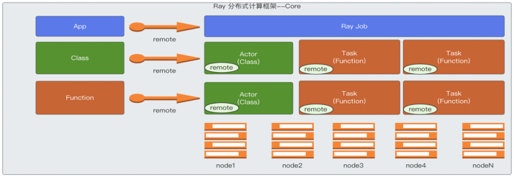
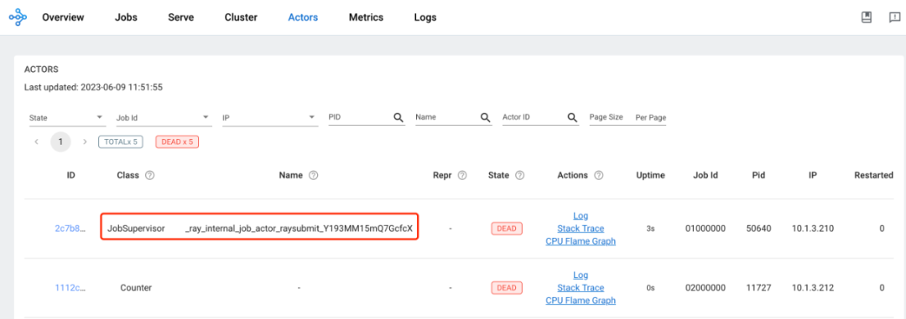
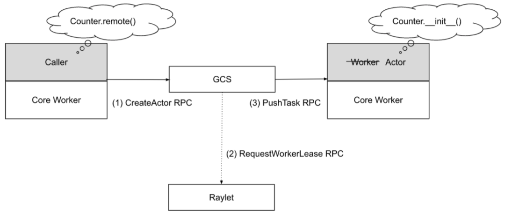
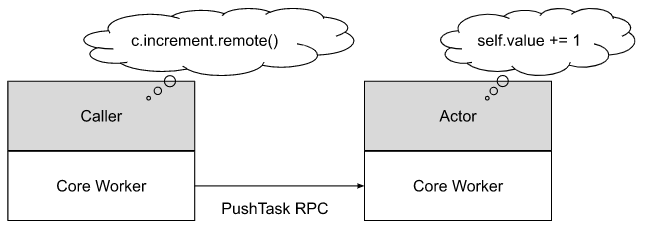
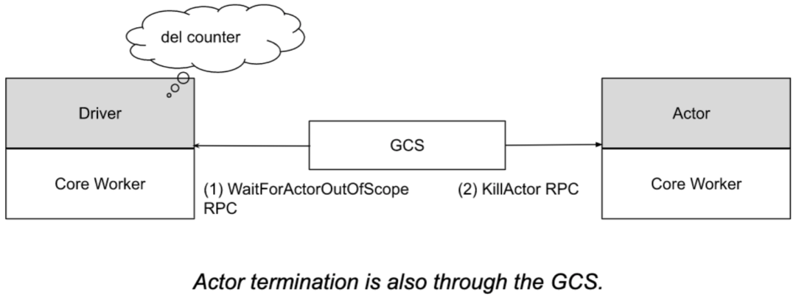
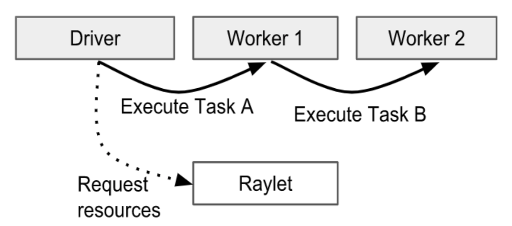
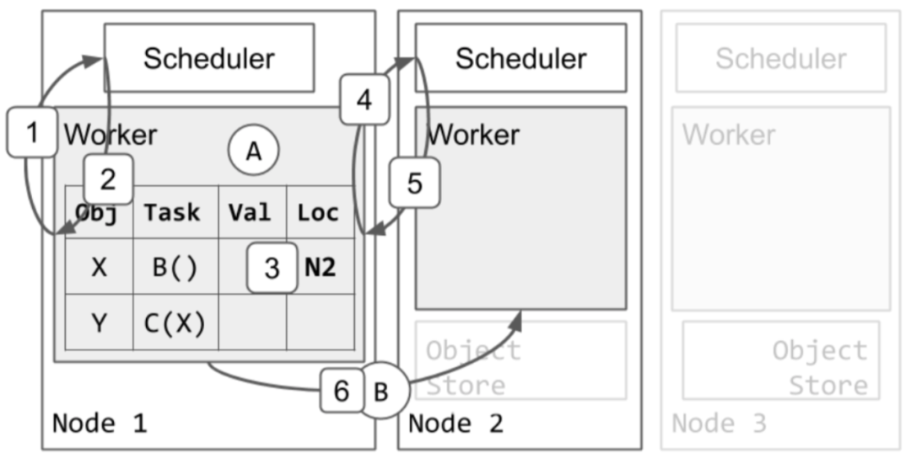
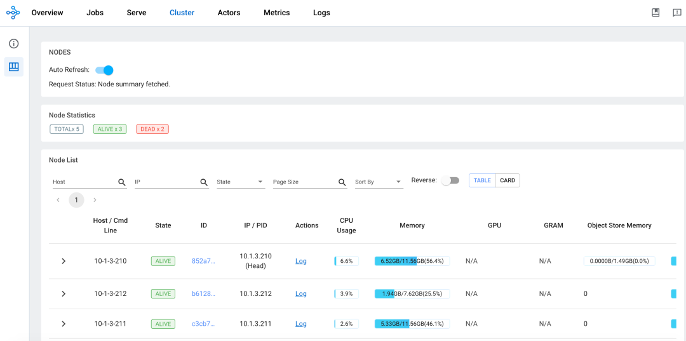
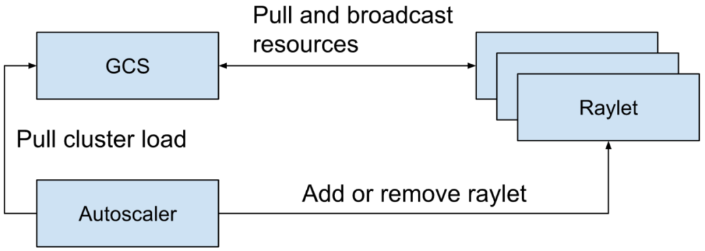

# AIGC's Tool: Ray - Exploring the Cloud-Native Path of Ray Core (I)

This article introduces the foundation of Ray distributed computing: Ray Core,
and explains what kind of distributed computing framework it is.

## Basic Concepts

Ray Core is a distributed computing framework at the foundation of Ray.
It uses an actor model to implement a set of computation frameworks that
can convert a Python class or function into a distributed actor and task.
These tasks/actors run in a distributed manner across all machines, and
they can share and pass objects through distributed object storage capabilities
to complete some distributed collaborations. These capabilities of Ray Core
provide a foundation for other higher-level modules to build on top of for distributed computing.



```go
import ray
import os
import requests

ray.init()

@ray.remote
class Counter:
    def __init__(self):
        # used to verify runtimeEnv
        self.name = os.getenv("counter_name")
        self.counter = 0
    def inc(self):
        self.counter += 1
    def get_counter(self):
        return "{} got {}".format(self.name, self.counter)

counter = Counter.remote()

for _ in range(5):
    ray.get(counter.inc.remote())
    print(ray.get(counter.get_counter.remote()))

print(requests.__version__)
```

Remarks:

- After the __class Counter__ is annotated with the __@ray.remote__ annotation, it can
  be called using remote() method like this: __counter = Counter.remote()__ .
  Here, __counter__ is a handle to the actor, while __Counter__ is the actor.
  The functions defined in the class become tasks when called using remote().
  Actors have states, and for synchronous, single-threaded actors, the order of
  calling class member methods must be maintained to ensure the correctness of
  the results within the same caller, but different callers can process concurrently.
  For asynchronous or threaded actors, even if the same caller is calling member methods,
  the call order does not need to be maintained, and they can be executed asynchronously.
- For general functions (not class member methods) annotated with the @ray.remote annotation,
  they become tasks when called using remote(). Tasks can be distributed across different
  machines and run in parallel in an asynchronous manner. They are also stateless.

## Overall Architecture


**driver process**: The driver is the root of the program, or can be understood as
the main program. Here, it refers to the code that runs the __ray.init()__ method.
The driver process is a special worker process used to execute the driver's process.
It executes top-level applications (such as ____main____ in Python). It can submit tasks,
but it does not execute tasks itself. Driver processes can run on any node, but they are
typically run on the head node. The driver process also handles logs sent by worker
nodes from the log monitor. Additionally, there is a 1:1 relationship between jobs and drivers.

**worker process**: Worker processes are responsible for submitting and executing tasks.
A worker process is a Python process. A worker process can be stateless, and can be used
to repeatedly execute general tasks (tasks that use the __ray.remote__ annotation). Worker
processes can also be used to execute stateful actors (i.e., classes annotated with __ray.remote__ ).
When an actor is instantiated, a corresponding worker process is created specifically for that
actor's execution, as well as for task associated with class member functions within the actor.
Each worker process is related to a specific job, and the default number of initialized workers
is usually the same as the number of CPUs on the machine it runs on.

**Distributed Scheduler**: The Distributed Scheduler is part of the Raylet component and is
responsible for resource management, task placement, and ensuring parameters required for
task execution can be obtained from distributed object storage objects. Each Raylet component
tracks resources on local nodes. Once a resource request is approved, the Raylet reduces the
available local resources. Once a resource has been used up, it is returned, and the Raylet
increases the available local resources again. Therefore, the Raylet has a strong consistency
view of local available resources. Additionally, the Raylet receives information about resource
usage on other nodes from the GCS control plane service. This information is useful for distributed
scheduling, such as balancing task scheduling across all nodes. For example, when a caller schedules
a task, they would first select an appropriate Raylet to send a __RequestWorkerLease__ PRC request to
(usually to the scheduler in the local node's Raylet) to apply for the required resources. Based on
principles of data localization and sticky nodes, the caller might select another node’s Raylet.
After analysis by the scheduler in the Raylet, if the current node is deemed suitable, the task
can be executed locally. If the local Raylet determines that the local node is not suitable,
it will inform the task submitter to apply for resources from a suitable node. The task submitter
will then go to the Raylet scheduler on the recommended node to apply for the resources needed to
run the task. This process continues until a suitable node is found, making this a decentralized
and distributed scheduling method.

**Distributed Object Store**: Responsible for storing and transferring large objects, distributed
object storage is supported in this module. Large objects stored locally can also be referenced
on other nodes. When a task is executed, if the node where the task is scheduled does not have
the corresponding object that it needs, it will fetch the object from the node where the object
is stored and execute the task. In this way, tasks between different nodes can share and reference
these objects.

**Global Control Service**: The GCS is a server that serves as the control plane for Ray. In the
new version of Ray, GCS has strengthened its fault tolerance capabilities, so it can run on any
node, including multiple nodes, not just the head node. The GCS mainly includes the following capabilities:

1. Node Management: Manages the addition and deletion of nodes, while broadcasting this
   information to all Raylets on all nodes, so that all Raylets can be aware of node changes.

2. Resource Management: Broadcasts each Raylet's available resources to the entire cluster, ensuring that each Raylet can update its global view of available resources in a timely manner. This is important for distributed scheduling of tasks. Ray will first automatically detect the node's resource data as a setting for schedulable logical resources.

3. Actor Management: Manages actor creation and deletion requests, and also monitors actor survival, as well as re-creation of actors when they fail. All actors need to be registered with GCS before being scheduled.

4. Placement Group Management: Coordinates the creation and deletion of placement groups. Manages the lifecycle of placement groups and uses a two-phase commit protocol to create them. Placement groups belong to jobs or actors, and when a job or actor is dead, the placement group will be deleted and all actors and tasks that reserved resources using the placement group will be killed and the resources released.

5. Metadata Storage: Provides key-value storage that can be accessed by any worker. Only small metadata is stored here, including the cluster's dashboard address, Remote function definitions (when a worker is designated to run a task, it downloads the definition of the function corresponding to that task from GCS), runtime environment data (by default, the runtime environment's working directory is saved in GCS), and other components that store metadata in GCS, such as Ray Serve, which stores deployment information in GCS.

6. Worker Manager: Handles failed workers reported by Raylet.

7. Runtime Environment: Manages runtime environment packages and also counts their usage and recycles them. Runtime environment packages are shareable and a portion of them will be recycled when resources are scarce.

**API Server**: The API server not only includes the dashboard server, which can be understood as the backend of the dashboard, but also serves as an API entry point for submitting jobs and provides some APIs for cluster status.

**API Agent**: Collects local node metric data to aggregate cluster-level health data. Also responsible for installing runtime environments for tasks and actors to execute tasks and actors.

**Autoscaler**: Based on the usage of cluster resources and job requirements for resources, it increases or removes nodes in the cluster.

**Log Monitor**: When tasks and actors print logs to their stdout or stderr, these outputs are automatically redirected to the corresponding worker's log file. A log monitor runs on each node, periodically reading these log files from the local Ray log files, and then publishing these log messages to the head driver through the GCS pubsub mechanism.

## Job Introduction


Each job is managed by its corresponding dedicated job supervisor actor, which runs on the head node. In the future, job supervisor actors will also be able to run on non-head nodes to reduce the load on the head node. The job supervisor actor runs under the user-specified runtime environment, with the entrypoint command of the job running as its child process and inheriting the environment in which the job supervisor actor runs. This actor can be viewed in Ray's dashboard and is an internal type of actor.

The job manager manages these job supervisor actors and their logs, and the output of the job's entrypoint script is written to the head node. These log files can be accessed through HTTP or viewed in the Ray dashboard.

The job reports its state (e.g., PENDING, RUNNING, SUCCEEDED) and some messages, which are stored in GCS and can be obtained through APIs.

To stop a job, you need to send a stop event to the corresponding job supervisor actor, which is an asynchronous process. The job supervisor actor will be responsible for interrupting the job's child process and updating the job's status.

A job will contain related actors, tasks, objects, and runtime environments. The relationship between jobs and drivers is 1:1.



## Actor Introduction

1. Actor Lifecycle:

    

    - The lifecycle and metadata of an actor are managed by the GCS service. Each actor's client caches this metadata locally, and the metadata contains information related to sending tasks, such as the actor's address. The client can directly send a task to the actor via gRPC using this address, where the task mainly refers to a task corresponding to the actor's member method. Unlike normal task submission, the entire lifecycle of an actor is centrally managed by GCS, including scheduling requests for the actor, which are initiated by GCS rather than the caller. After an actor is instantiated, it creates a worker process that is exclusively dedicated to the actor (unlike workers used by normal tasks, which can be reused by tasks). All calls to the actor's member methods (i.e. tasks) will be scheduled on this specified worker, and these methods can access and modify the state of the worker.

        

    - When creating an actor, the worker responsible for creating the actor will construct a task called an actor creation task, which will run the actor's constructor function. The worker responsible for creating the actor will wait for some external conditions that the actor creation task depends on to be ready, and then asynchronously register the actor with GCS for detached actors. For non-detached actors, the registration process is asynchronous. Then, GCS will schedule the actor creation task to create the actor, as if GCS were the caller of the actor.
    - At the same time, just like a method call, the created actor returns an actor handle to the caller. The caller can use this actor handle to call the actor's methods, which can be understood as sending tasks, because the member methods of an actor are also remote distributed tasks. When the parameter of a task is an actor handle, the task will not be scheduled immediately but will wait until the actor creation task is completed.
    - The execution of an actor's tasks is similar to that of normal tasks, where these actor tasks are submitted directly to the actor process via gRPC, but they will not run directly unless all their dependencies are ready. However, there are two main differences between an actor's tasks and a normal task:
        1. By default, actor tasks do not require resource requests because resources have already been allocated when the actor was created. Actor tasks are just the methods created when the actor's member methods are called.
        2. For each caller of an actor, the methods it calls on the actor (i.e., tasks) are executed in the order of the calls, which ensures the stateful nature of the actor. This type of actor is a Synchronous, Single-Threaded Actor.
        3. There is also an Asynchronous or Threaded Actor in which methods can be executed asynchronously and without order requirements.
    - By default, actors are not restarted when they fail, but to support fault tolerance, relevant parameters can be set to enable them to restart after a failure. The max_restarts and max_task_retries options can be set in ray.remote() and .options(). 

    

2. Execution of Actor Tasks:

    

    - An actor task refers to a task created when an actor's member method is called. An actor may have countless callers, and an actor handle represents a caller, including the RPC address of the actor in the actor handle. This allows callers to connect to the actor and submit actor tasks to the corresponding worker process.

        

    - An actor can concurrently handle many calls, and the above figure only shows one call.
   
        

3. Actor Dead:

    

    - An actor may be detached or non-detached. Detached actors are for synchronous scenarios, while non-detached actors are for asynchronous ones, which are recommended and also the default. When all actor handles of an actor are out of scope (tracked by reference counting), the creator of the actor notifies GCS, and then GCS sends a KillActor RPC to the corresponding actor, and afterwards the actor exits its process and can be automatically garbage-collected. Alternatively, if GCS detects that the creator of the actor has exited, it will interrupt the corresponding actor, which can also be automatically garbage-collected. Another case where the actor can be interrupted is when the corresponding job exits. In any case, tasks submitted to the actor but not yet executed will result in a RayActorError. For detached actors, they need to be manually deleted when no longer needed.

    - During runtime, an actor may encounter unexpected errors and exit, which will also result in a RayActorError for tasks submitted to the actor.

    - In Ray, it is possible to set the number of times an actor can be restarted after failure. If max_restarts is set and the owner of the actor is still alive, GCS will attempt to restart the actor through the actor creation task. During this process, all client callers who want to call the actor will cache their tasks before they are submitted after the actor has successfully restarted. If after a fixed number of restarts, the actor still fails to start, all cached actor tasks that have not yet run will be marked as failed.

    - Additionally, after an actor is successfully restarted, there is a parameter called max_restarts to control the number of times actor tasks can be restarted.

    

## Introduction to Tasks

1. Lifecycle of a Task:

    

    - Here, a task refers to a general task (NORMAL_TASK). The owner of the task is responsible for ensuring that a submitted task is executed. The owner of the task can be understood as a process that calls a function, which will also hold the return value of the function. The owner of the task will communicate with Raylet to request the resources needed to execute the task. Raylet includes a distributed scheduler. In the above figure, Driver is the owner of Task A, and Worker1 is the owner of Task B. Therefore, Driver is responsible for requesting the resources required to execute Task A, while Worker1 is responsible for requesting the resources required to execute Task B.
    - Before requesting resources, task dependencies need to be resolved. Here, task dependencies mainly refer to parameter dependencies of tasks (functions), because parameters can be the return values of other tasks. The distributed scheduler will attempt to request resources and obtain task dependencies (ObjectRef) from the distributed object store to the local node. Once resources and dependencies are ready, the distributed scheduler agrees to the resource request and returns the address of a worker that can execute this task to the task owner.
    - Then, the task owner will submit the task to the worker returned by the distributed scheduler through gRPC. After the task is successfully executed, the worker responsible for executing the task needs to save the return value of the task. If the return value is small, the worker will directly return it to the task owner. If the return value is large, it will be stored in the distributed object store, and the task owner will be given a location to access.

    

2. Distributed Task Scheduling:

    In the following figure, Task A is already running on Worker1, and Task B and Task C have been submitted to Worker1, so X and Y objects are already included in the local relationship table of Worker1. Let's first look at how to schedule Task B.

    

    - Worker1 asks the local scheduler in Raylet to request resources for Task B.
    - The local scheduler tells Worker1 to try node2 to request scheduling.
    - Worker1 updates the local relationship table to indicate that Task B is now blocked on node2.
    - Worker1 asks the scheduler of node2 to request resources for Task B.
    - The scheduler of node2 approves the resource request from Worker1 and returns the address of Worker2 to Worker1. As long as Task B is still occupying Worker2, the scheduler of node2 will ensure that no other tasks will be assigned to Worker2 again.
    - Afterwards, Worker1 sends Task B to Worker2 for execution.

3. Execution of Tasks:

    

    - Dependency resolution: Before a task caller requests resources from the distributed scheduler to execute a task, it waits for all dependencies required by the task to be ready. Often, the task caller is also the owner of other tasks, such as foo.remote(bar.remote()). In this example, the task caller is the process that executes the foo.remote method, and foo.remote() depends on the return value of bar.remote, which is also owned by the caller of foo.remote. Therefore, in this case, foo is not scheduled directly until bar has completed. The return value of bar is stored locally and passed as a parameter to run foo. If the parameters required by foo are not local, such as large objects stored in the distributed object store, they will be pulled to the local node before scheduling foo.
    - Resource satisfaction: A task caller sends a resource request to a more appropriate Raylet, which is a more suitable distributed scheduler. How to choose the more appropriate Raylet is considered from the following three aspects:
        1. By data localization priority, if a task depends on many object parameters, those nodes that can contain most of the parameter objects will be chosen first because there is no need to read many parameter objects from other nodes as most of them are already on one node. Then, this node will be scheduled. For the few remaining parameter objects, they need to be read from the distributed object store.
        2. By node affinity, if the target Raylet is specified by NodeAffinitySchedulingStrategy, then go directly to the corresponding node's Raylet.
        3. It is also the default way, which is to consider the local Raylet as the most suitable scheduler at first, although it may not necessarily be scheduled locally in the end.
    - After selecting the appropriate Raylet, the Raylet first puts the resource request in a queue. If this Raylet agrees to the resource request, it returns the address of its own worker to the task caller.

## Introduction to Objects


An Object is a value in an application that is returned by a task or created through __ray.put()__ . The value of an Object is immutable and cannot be modified once created. It can be stored and referenced as long as it is within the Ray cluster.

A task (function) can have a return value, which is an Object. When a process calls a function, which will create a task, and then requests resources from a worker to execute this task, the return value of this task belongs to the worker where the task is executed. Therefore, in this case, the owner of the Object is the worker that submits the request to create the initial ObjectRef. At the same time, this worker will save the reference count of this Object.

 __ray.put(obj)__ can also create an Object. When a worker calls __ray.put()__ , the owner of the Object is the worker that creates the initial ObjectRef through calling __ray.put()__ . At the same time, this worker will save the reference count of this Object.

Currently, a worker can use ObjectRef to reference an object. The lifecycle of an Object is managed by its owner. Ray guarantees that if the owner of the Object is alive, the Object may eventually be resolved to its value (or throw an error when the worker fails). If the owner fails, attempting to get the value of the Object will throw an exception, even if the Object still exists physically.

Objects can be stored in the owner's in-process memory store and distributed object store. The in-process memory store is allocated in the heap memory of the owner and does not limit the size of memory. However, in Ray, only small Objects are stored in the worker's in-process memory store. If there are too many small Objects, it may cause the worker to be killed due to out-of-memory errors. Large Objects stored in the distributed object store will be saved in the shared memory object store first. The shared memory object store forces a user-specified capacity limit (default is 30% of machine memory), and when the capacity limit is reached, it will be saved to local disk. This is done to reduce the memory footprint and resolution time of each Object.

There are two ways to get the value of an ObjectRef corresponding to an Object. One way is to call __ray.get()__ on an ObjectRef(s). Another way is to pass an ObjectRef as a parameter to a task. When the worker executes this task, it will resolve the ObjectRef and replace the task's parameter with the resolved value.

For a small Object, it can be directly resolved from the owner's in-process store. If it is a large Object stored in the distributed object store, it must be resolved through a distributed protocol.

When the return value of task A is a large Object, it will be saved in the local shared memory store of node A where task A is executed. When task B on node B needs to use the return value of task A as its parameter, it will first look up the object directory from the caller of task B, which is the owner of task B. From the object directory, it knows the location where the return value of task A, the large Object, is saved, which can be simply understood as node A. Then, the Raylet on node B where task B is located will read the return value object of task A from the distributed object store in the Raylet on node A. This requires the use of distributed protocols to copy the required object to the local node. Here, object directory is mentioned, which saves the location information of the object. In previous versions, it was saved in GCS, but now it is saved in owners. When task C on node A needs to use the return value of task B, it will directly access it from the local shared memory store on node A. 


## Placement Group Management

Description: Placement Groups are mainly used to reserve some resources for running actors or tasks. Actors or tasks can specify the __PlacementGroupSchedulingStrategy__ at runtime. When reserving resources, Placement Groups use Bundles to represent a collection of resources. For example, bundle 0 is __{"CPU": 1}__ , and bundle 1 is __{"CPU": 1, "GPU": 4}__ . A Placement Group can contain multiple bundles. It should be noted that the bundle is the smallest unit in Placement Groups, and a bundle can only be reserved if the resource request does not exceed the remaining resources of a single machine. For example, suppose there are machines in the cluster with the most abundant resources, and they have 5 CPUs and 5 GPUs left. If a Placement Group is defined, and the Placement Group defines a bundle that requires __{"CPU": 5, "GPU": 9}__ , then this bundle cannot be scheduled, and it can be understood that this Placement Group cannot be satisfied or scheduled. Resource reservation by Placement Group can also be cross-machine. For example, if there are three machines in the cluster, each machine can reserve __{"CPU": 1, "GPU": 1}__ , and then tasks are distributed across these three machines. Through the ability of Placement Groups, actors or tasks can be run in a gang scheduling manner (either all together or not at all).

```go
# Create an actor and use placement group
actor = Actor.options(
    scheduling_strategy=PlacementGroupSchedulingStrategy(
        placement_group=pg,
    )
).remote()
```

Create Placement Group:


## Placement Group Management

When an application requests to create a Placement Group, the worker on which the application is running sends a synchronous request based on RPC to GCS. GCS saves the request and queues it up. Because resource requests for Placement Groups may span nodes, Ray uses two-phase commit to ensure atomicity. If any raylet fails during this process, the creation process will roll back, and the request will be requeued. Unlike tasks, actors, and objects, Placement Groups do not require reference counting. This is because the owner of the Placement Group is the job or detached actor, and when the job or detached actor that owns the Placement Group is in a dead state, the Placement Group will be automatically deleted. Therefore, there is no need for reference counting because garbage collection is automatic. Users can also directly call APIs to delete a Placement Group. Placement Groups can also have Detached Placement Groups, which need to be manually created and deleted. For example, if a task uses a Detached Placement Group, the Placement Group will not be automatically deleted when the task is destroyed, and the lifecycle of the Detached Placement Group exceeds its owner's. When a Placement Group is destroyed, all actors and tasks that use this Placement Group will be killed, and the resources reserved by the Placement Group will be released.

In cloud native solutions, there are also components similar to Placement Groups that can replace them, such as Kueue, to achieve group scheduling capabilities.

## Node Management

When a raylet starts up, it registers with GCS. GCS saves the registration information of the registered raylet in storage. Once the raylet is successfully registered with GCS, this registration information is broadcasted to all raylets.


After the node is registered, GCS periodically monitors the health of the raylet on this node through periodic monitoring. At the same time, GCS pulls the resource view of this raylet and broadcasts this information to other raylets. If the raylet fails, GCS will also broadcast the failure message to other raylets. Once the raylet receives these messages, they begin to clean up related states. At the same time, the raylet will also count which processes in its local node are dead and inform GCS, which will then broadcast this information to other raylets. This helps to clean up inconsistent states in the system and better assist in submitting tasks.



## Resource Management



GCS is responsible for ensuring that all raylets have the latest view of cluster resource usage. This enables the distributed scheduler to more effectively complete scheduling. If this view is not up-to-date, it may cause scheduling inaccuracies for the distributed scheduler, resulting in actors/tasks not being scheduled properly. By default, GCS retrieves the latest resource usage view from all raylets registered with GCS every 100ms and broadcasts it to other raylets at intervals of 100ms. GCS also provides Autoscaler components with data on the current cluster load to help them determine when to add or remove machines from the cluster.

## Conclusion

From the above analysis, we can see the overall architecture, key capabilities, and basic working methods of Ray Core. The above is a partial analysis of Ray Core, and another part of the analysis will be included in the next article, which will also include practical content to provide a more intuitive understanding of Ray Core.

Reference links:

- [Ray Documentation](https://docs.ray.io/en/latest/)
- [Ray v2 Architecture](https://docs.google.com/document/d/1tBw9A4j62ruI5omIJbMxly-la5w4q_TjyJgJL_jN2fI/preview#)
