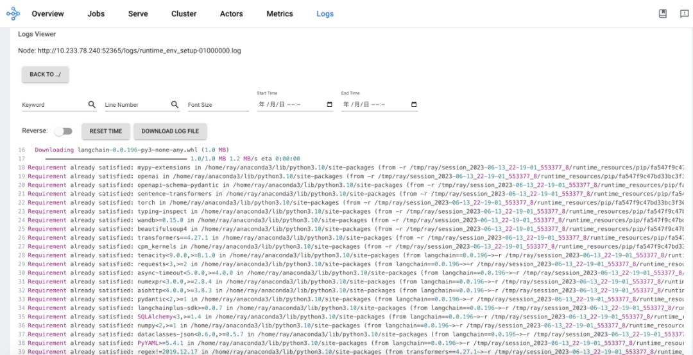
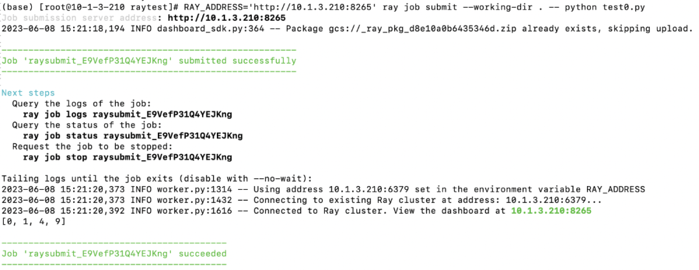
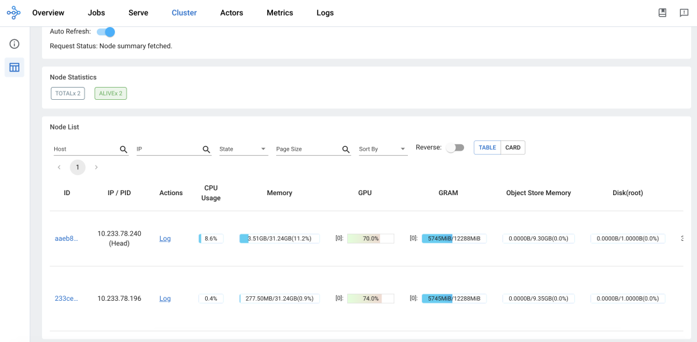
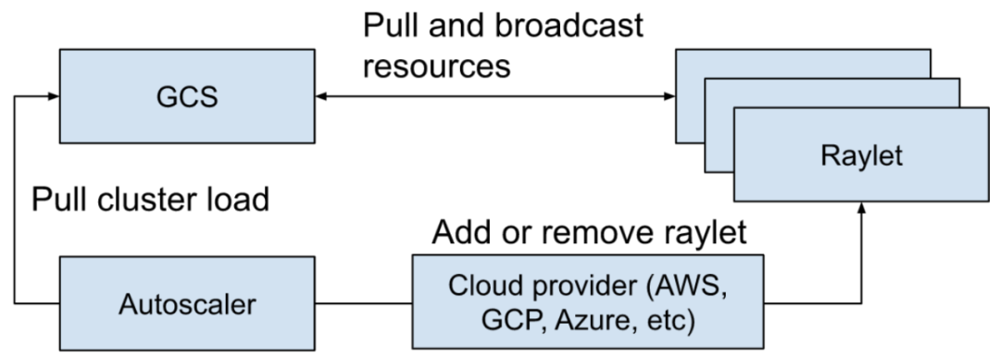
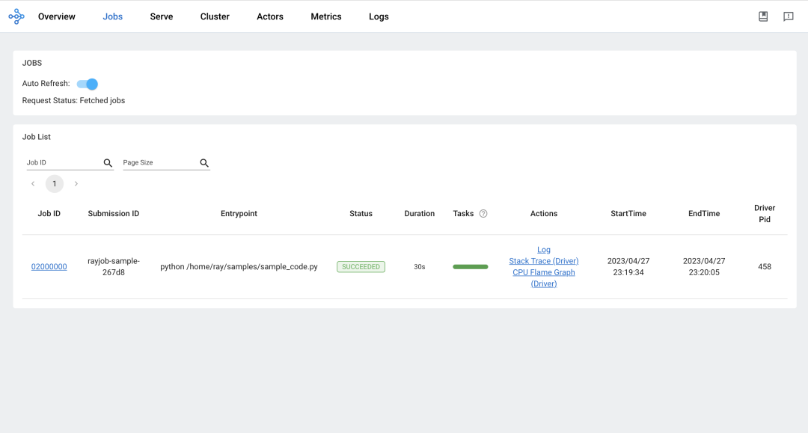
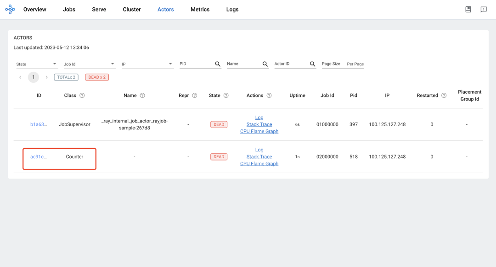
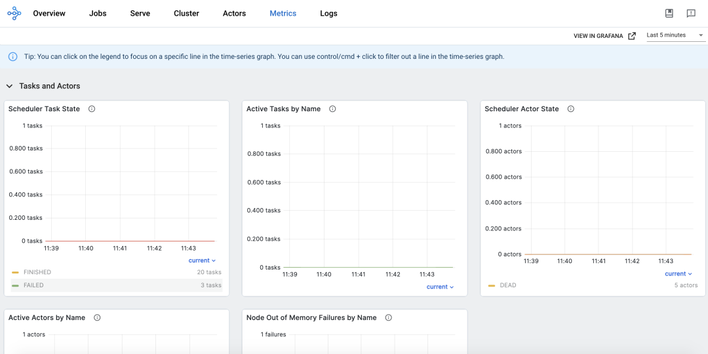
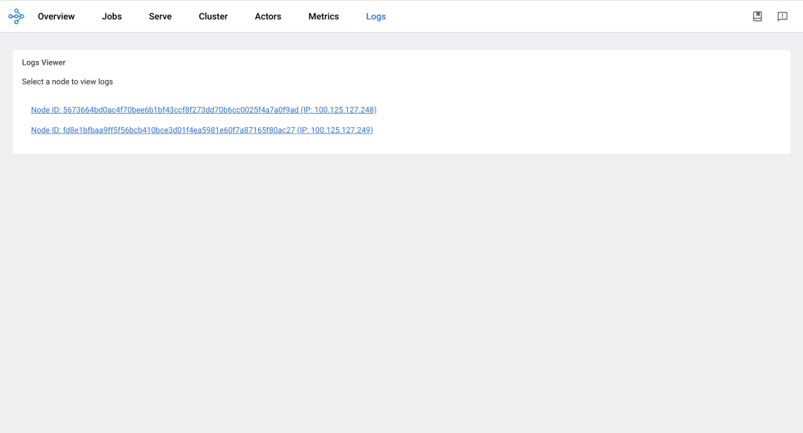

# AIGC Powerful Tool: Exploring Ray's Cloud-Native Journey - Ray Core (II)

In the previous article, "[AIGC Powerful Tool: Exploring Ray's Cloud-Native Journey - Ray Core (Part 1)](./230612-ray.md)," we provided an overview of Ray Core's architecture and key concepts. Here, we will continue to supplement the remaining parts and provide practical operations to aid understanding.

## Scheduling Capability


Once a resource request (i.e., RequestWorkerLease PRC) is accepted by the raylet, the entire process follows the state machine shown in the diagram above, consisting of three main states:

- Granted: In this state, the client can utilize the requested resources and the corresponding workers returned by the raylet to execute actors and tasks.

- Reschedule: If a more suitable node becomes available than the local node, rescheduling is necessary. This process involves transferring the task to another node. During rescheduling, the local node can observe the resource usage of all nodes from a cluster perspective.

- Canceled: When the requested resources cannot be fulfilled, the local scheduling is canceled. For example, if a client requests a specific machine that crashes or if the allocated execution environment for a task cannot be created successfully, preventing the raylet from starting a worker to run the task, the scheduling request will be canceled.

The scheduling policies mainly include:

- Hybrid Policy: If no specific scheduling policy is specified, this is the default policy. The hybrid policy first attempts to run tasks locally on its own node. However, when the resource usage on the local node exceeds the configured threshold (default is 50%), the task is allocated to other machines. The allocation process follows the order of machine IDs (ensuring consistent ordering). It starts with the first remote node, then the second remote node, and so on until the critical resource utilization on all nodes exceeds the threshold. It selects the node with the lowest resource utilization. This policy balances between bin-packing and load-balancing. Bin-packing focuses on filling up the first machine and then moves to the next one when it becomes unavailable. This approach can lead to high load on machines with tasks, causing unpredictable issues. Load-balancing, on the other hand, spreads tasks evenly among available machines, which can result in resource fragmentation.

- Spread Policy: This policy distributes tasks among nodes with available resources in a round-robin manner, ensuring a relatively balanced distribution of tasks across the entire cluster. It prevents high load on certain machines while others remain idle. However, this scheduling policy may lead to resource fragmentation.

- Node Affinity Policy: With this policy, users can explicitly specify the target node for running a task or actor. If the target node is active, the task or actor will only run there. If the target node is offline, it depends on whether the affinity is a soft constraint. The task or actor may either be scheduled to other nodes or remain unscheduled.

- Data Locality Policy: Simply put, tasks are scheduled to nodes where the required parameter objects are distributed. This avoids unnecessary movement of dependent parameter objects. It ensures data locality by scheduling tasks closer to the data they rely on.

- Placement Group Policy: Tasks and actors run in the location where the placement group is established.

## Runtime Environment


The runtime environment (Runtime Env) defines the dependencies required for running Python scripts, including package files and environment variables. It is dynamically installed at runtime and can be provided to a Ray job, actors, or tasks for execution.

The installation and removal of the runtime environment are handled by the RuntimeEnvAgent gRPC server service running on each node. The RuntimeEnvAgent component plays a crucial role in scheduling tasks and actors.

When an actor or task needs a runtime environment, the raylet sends a gRPC request to the RuntimeEnvAgent to create the runtime environment if it doesn't already exist. Creating an environment involves tasks such as downloading and installing packages using pip install, setting environment variables for the worker process, activating conda before launching a worker process, and downloading files from remote cloud storage.

Some resources within the runtime environment, such as downloaded files and installed conda environments, are cached on each node. This allows sharing of these resources between different jobs, actors, and tasks. When the size of the cache exceeds a certain threshold, unused resources that are not currently being utilized by any jobs, actors, or tasks can be removed from the cache.

You can specify the runtime environment within your program or set it when submitting a job. Additionally, it is possible to specify a specific runtime environment for actors or tasks.

```go
# Option 1: Starting a single-node local Ray cluster or connecting to existing local cluster
ray.init(runtime_env=runtime_env)
 
# Option 2: Using Ray Jobs API (Python SDK)
from ray.job_submission import JobSubmissionClient
 
client = JobSubmissionClient("http://<head-node-ip>:8265")
job_id = client.submit_job(
    entrypoint="python my_ray_script.py",
    runtime_env=runtime_env,
)
 
# Option 3: Using Ray Jobs API (CLI). (Note: can use --runtime-env to pass a YAML file instead of an inline JSON string.)
$ ray job submit --address="http://<head-node-ip>:8265" --runtime-env-json='{"working_dir": "/data/my_files", "pip": ["emoji"]}' -- python my_ray_script.py
```




## Logging Capability

When an actor or task prints logs to stdout or stderr, these outputs are automatically redirected to the corresponding worker's log files because actors and tasks run within a worker process. The log monitor component runs on each node and periodically reads these local log files of Ray. It then publishes the log messages to the driver program through the GCS (Google Cloud Storage) pubsub mechanism. The driver program is responsible for aggregating and printing all the logs from actors and tasks.





## Metrics Capability

Ray natively integrates with OpenCensus and supports exporting metrics data to Prometheus by default. All Ray components, including GCS, raylet, and workers, push their own metrics data to the local Ray agent process on each node. Then, the Ray agent on each node exposes the metrics data using OpenCensus as a Prometheus exporter, allowing Prometheus to pull the data into its own system.


## GPU Capability

By default, Ray automatically detects the number of GPU devices on the host and sets it for itself. However, this can be overridden by manual configuration. When an actor or task requires GPU resources to execute, you can specify the desired resource request by using `@ray.remote(num_gpus=1)` for actors or tasks. In this case, Ray will schedule the actor or task on a machine that has available GPUs to fulfill the resource requirement. Before running the actor or task, the CUDA_VISIBLE_DEVICES environment variable is set to assign the specific GPUs to the actor or task. The following example illustrates this process:

```go
ray.init(num_gpus=2)
 
@ray.remote(num_gpus=1)
class GPUActor:
    def ping(self):
        print("ray.get_gpu_ids(): {}".format(ray.get_gpu_ids()))
        print("CUDA_VISIBLE_DEVICES: {}".format(os.environ["CUDA_VISIBLE_DEVICES"]))
 
@ray.remote(num_gpus=1)
def use_gpu():
    print("ray.get_gpu_ids(): {}".format(ray.get_gpu_ids()))
    print("CUDA_VISIBLE_DEVICES: {}".format(os.environ["CUDA_VISIBLE_DEVICES"]))

gpu_actor = GPUActor.remote()
ray.get(gpu_actor.ping.remote())
 
// Because the actor (`gpu_actor`) is using the first GPU,
// the task (`use_gpu`) will use the second GPU.
ray.get(use_gpu.remote())
 
# (GPUActor pid=52420) ray.get_gpu_ids(): [0]
# (GPUActor pid=52420) CUDA_VISIBLE_DEVICES: 0
# (use_gpu pid=51830) ray.get_gpu_ids(): [1]
# (use_gpu pid=51830) CUDA_VISIBLE_DEVICES: 1
```

In a cloud native scenario, it is necessary to enable containers to recognize GPU devices and pass the device information to the Ray framework. The official Docker image versions of Ray provide GPU-enabled images. When using these images, you need to specify resource requests in the RayJob definition, such as __"nvidia.com/gpu: 1"__ , to allocate GPU resources. Additionally, you can specify the desired GPU request for actors or tasks, for example:

```go
@ray.remote(num_gpus=1)
class GPUActor:
    def say_hello(self):
        print("I live in a pod with GPU access.")
```



## Autoscaling Capability



The Ray Autoscaler is responsible for adding and removing nodes from the cluster. It examines the logical resource requirements exposed by the distributed scheduler, the current nodes in the cluster, and the node configuration of the cluster. Based on this information, it calculates the desired cluster configuration and performs the necessary operations to move the cluster to the desired state. The Autoscaler pulls the current cluster's workload information from the GCS (Global Control Store) and uses the cloud provider's implementation to add or remove nodes accordingly.

The main tasks of autoscaling include:

1. When applications submit actors, tasks, or placement groups to request resources such as CPU or GPU.

2. The scheduler examines the resource requirements and available resources and decides where to place tasks or blocks if the resources are not available. This information is stored as a snapshot in the GCS.

3. The Autoscaler runs as an independent process, periodically fetching the snapshot mentioned in step 2 from the GCS. It examines the available resources in the cluster, requested resources, blocked tasks, and the worker node configurations. Then, it uses the bin-packing algorithm (mentioned in the scheduling section) to calculate how many nodes are needed to ensure sufficient resources for running tasks/actors/placement groups and unblocking the blocked ones.

4. The Autoscaler uses the node provider interface to add or remove nodes. Various cloud providers can implement their own node provider interface, such as AWS, GCP, Azure, Kubernetes, and on-premises data centers.

5. Once new nodes are launched and registered with the Ray cluster, they can start accepting workloads from applications.

## Practice


Install KubeRay:

```sh
helm repo add kuberay https://ray-project.github.io/kuberay-helm/
 
# Install both CRDs and KubeRay operator v0.5.0.
helm install kuberay-operator kuberay/kuberay-operator --version 0.5.0
 
# Check the KubeRay operator Pod in default namespace
kubectl get pods
# NAME                                READY   STATUS    RESTARTS   AGE
# kuberay-operator-7fc785cbbd-9jcpv   1/1     Running   0          14d
```

Create RayJob:

```yaml
apiVersion: ray.io/v1alpha1
kind: RayJob
metadata:
  name: rayjob-sample
spec:
  entrypoint: python /home/ray/samples/sample_code.py
  # runtimeEnv decoded to '{
  #    "pip": [
  #        "requests==2.26.0",
  #        "pendulum==2.1.2"
  #    ],
  #    "env_vars": {
  #        "counter_name": "test_counter"
  #    }
  #}'
  runtimeEnv: ewogICAgInBpcCI6IFsKICAgICAgICAicmVxdWVzdHM9PTIuMjYuMCIsCiAgICAgICAgInBlbmR1bHVtPT0yLjEuMiIKICAgIF0sCiAgICAiZW52X3ZhcnMiOiB7ImNvdW50ZXJfbmFtZSI6ICJ0ZXN0X2NvdW50ZXIifQp9Cg==
  rayClusterSpec:
    rayVersion: '2.4.0' # should match the Ray version in the image of the containers
    # Ray head pod template
    headGroupSpec:
      # the following params are used to complete the ray start: ray start --head --block --redis-port=6379 ...
      rayStartParams:
        dashboard-host: '0.0.0.0'
        num-cpus: '1' # can be auto-completed from the limits
      #pod template
      template:
        spec:
          containers:
            - name: ray-head
              image: rayproject/ray:2.4.0
              ports:
                - containerPort: 6379
                  name: gcs-server
                - containerPort: 8265 # Ray dashboard
                  name: dashboard
                - containerPort: 10001
                  name: client
                - containerPort: 8000
                  name: serve
              resources:
                limits:
                  cpu: "1"
                requests:
                  cpu: "200m"
              volumeMounts:
                - mountPath: /home/ray/samples
                  name: code-sample
          volumes:
            # You set volumes at the Pod level, then mount them into containers inside that Pod
            - name: code-sample
              configMap:
                # Provide the name of the ConfigMap you want to mount.
                name: ray-job-code-sample
                # An array of keys from the ConfigMap to create as files
                items:
                  - key: sample_code.py
                    path: sample_code.py
    workerGroupSpecs:
      # the pod replicas in this group typed worker
      - replicas: 1
        minReplicas: 1
        maxReplicas: 5
        # logical group name, for this called small-group, also can be functional
        groupName: small-group
        rayStartParams: {}
        #pod template
        template:
          spec:
            containers:
              - name: ray-worker # must consist of lower case alphanumeric characters or '-', and must start and end with an alphanumeric character (e.g. 'my-name',  or '123-abc'
                image: rayproject/ray:2.4.0
                lifecycle:
                  preStop:
                    exec:
                      command: [ "/bin/sh","-c","ray stop" ]
                resources:
                  limits:
                    cpu: "1"
                  requests:
                    cpu: "200m"
######################Ray code sample#################################
# this sample is from https://docs.ray.io/en/latest/cluster/job-submission.html#quick-start-example
# it is mounted into the container and executed to show the Ray job at work
---
apiVersion: v1
kind: ConfigMap
metadata:
  name: ray-job-code-sample
data:
  sample_code.py: |
    import ray
    import os
    import requests
 
    ray.init()
 
    @ray.remote
    class Counter:
        def __init__(self):
            # Used to verify runtimeEnv
            self.name = os.getenv("counter_name")
            self.counter = 0
 
        def inc(self):
            self.counter += 1
 
        def get_counter(self):
            return "{} got {}".format(self.name, self.counter)
 
    counter = Counter.remote()
 
    for _ in range(5):
        ray.get(counter.inc.remote())
        print(ray.get(counter.get_counter.remote()))
 
    print(requests.__version__)
```

View RayJob:

```sh
$ kubectl get rayjob
NAME            AGE
rayjob-sample   14d
 
$ kubectl get raycluster
NAME                             DESIRED WORKERS   AVAILABLE WORKERS   STATUS   AGE
rayjob-sample-raycluster-25mkr   1                 1                   ready    14d
```

Accessing the Ray Dashboard:

- Global View:

    

- Job View:

    

- Cluster View:

    

- Actor View:

    

- Metrics View:

    

- Log View:

    

## Summary

The above information provides an overview of Ray Core and showcases its capabilities through practical examples, including the integration with Kubernetes using the community solution Kuberay.

Reference link:

- [Ray Documentation](https://docs.ray.io/en/latest/)
- [Ray v2 Architecture](https://docs.google.com/document/d/1tBw9A4j62ruI5omIJbMxly-la5w4q_TjyJgJL_jN2fI/preview#)
