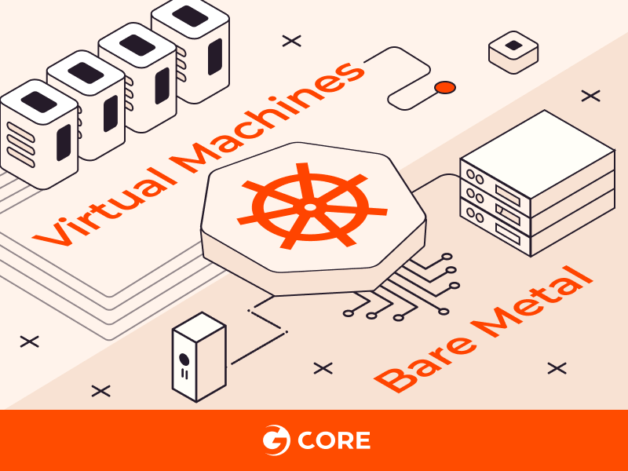
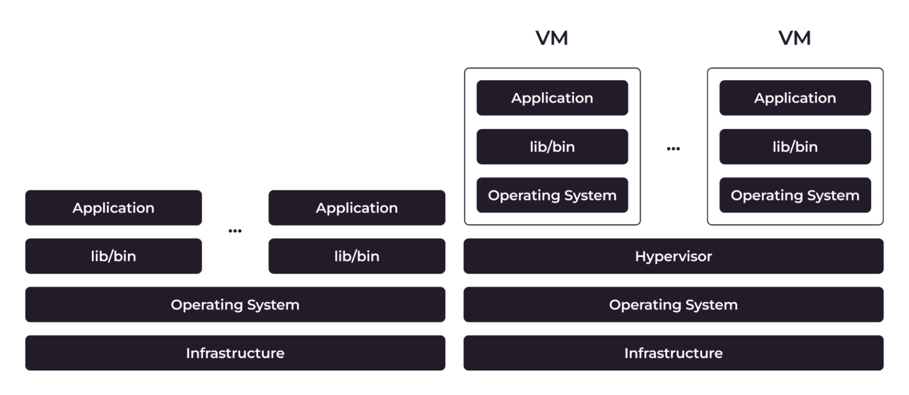
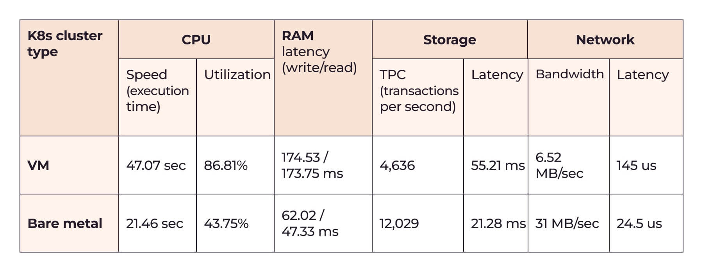
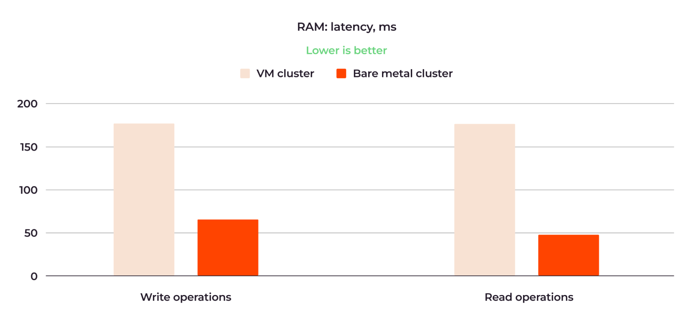
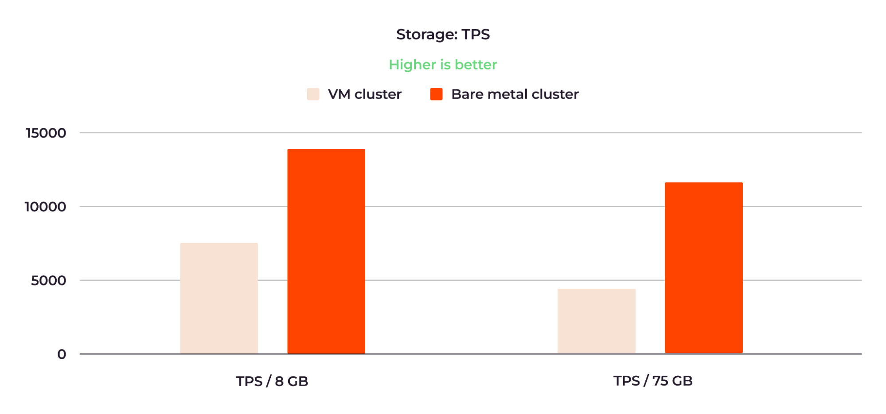

# Does Kubernetes Really Perform Better on Bare Metal vs. VMs?

A detailed comparison of CPU, RAM, storage and network performance between Kubernetes clusters on virtual machines and bare metal.

Nov 24th, 2023 6:30am by [Oleg Zinovyev](https://thenewstack.io/author/oleg-zinovyev/)

Many people presume that a Kubernetes cluster deployed on bare metal performs better than one deployed on virtual machines,
but until now there hasn’t been any proof of that assumption. At Gcore, we only provide our customers with information grounded
in solid evidence, so we decided to test for ourselves whether K8s on bare metal really outperform K8s on VMs, and if so,
to what extent. I’ll share the results of our internal testing.

I’m deliberately not discussing other aspects of the bare metal worker nodes vs. virtual nodes competition,
such as cost efficiency or the level of infrastructure control. That would go beyond the scope of this article,
which focuses only on the performance comparison.

## The Difference Between VM and Bare Metal Kubernetes

When you deploy a Kubernetes cluster on VMs, you get additional layers of infrastructure compared to bare metal (BM) —
a hypervisor and a guest operating system.

*Figure 1: The difference between bare metal and VM architecture.*

These layers consume physical CPU and RAM to run, taking some of the compute capacity away from workloads.
Virtualization also affects network and storage performance: virtual networks and storages are slower than physical ones.

By comparison, when you deploy a [Kubernetes cluster on a bare metal server](https://thenewstack.io/provision-bare-metal-kubernetes-with-the-cluster-api/),
you don’t have any additional infrastructure layers and virtualization.
The server’s physical resources are fully dedicated to your workloads, and containerized applications directly access those resources.

## How We Compared VMs and Bare Metal K8s Performance

To get a complete picture of how a VM and bare metal cluster performance compare, we measured the following:

- **CPU:** Speed and utilization
- **RAM:** Latency
- **Storage:** Transactions per second (TPS) and latency
- **Network:** Bandwidth and latency

For the purity of the experiment, all test applications were containerized and deployed on the worker nodes under comparison.

### Our Test Conditions

For the test, we used K8s clusters running on [Gcore Managed Kubernetes](https://gcore.com/cloud/managed-kubernetes).
However, the results are also relevant to vanilla Kubernetes, since managed Kubernetes doesn’t add any overhead to worker node performance.

To keep the same conditions for workloads, we chose similar configurations of VMs and bare metal worker nodes.
Here’s an example of such comparative configurations:

- **A bare metal worker node:** 1x Intel Xeon E-2388 8C/16T 3.2 GHz / 64 GB / Ubuntu 22.04
- **A virtual machine worker node:** 16 vCPU / 64 GiB Memory / Ubuntu 22.04

## Test Results Summary

In the test, we compared two Kubernetes clusters, one deployed on virtual machines (VMs) and the other on bare metal.
Their configurations were similar. As test workloads, we ran:

- CPU benchmark for the CPU test
- Sysbench for the RAM test
- Pgbench for the storage test
- Netperf for the network test

Here is the table summarizing the most important test results:

Evidently, the bare metal cluster was more efficient in all cases.

Let’s examine the results in detail and determine what better bare metal performance means for your workloads.

## Detailed Test Results

Now let’s look in detail at the performance of bare metal and VM clusters for each assessment criterion.

## CPU Speed and Utilization

For the CPU speed comparison, we used Alex Dedyura’s [CPU benchmark](https://github.com/alexdedyura/cpu-benchmark).
This is a script that calculates pi to 10,000 decimal places. The time spent on the calculation in seconds,
averaged over 10 tests, is taken as the test result. Calculating pi is a CPU-intensive task, so the benchmark
gives a clear indication of the tested CPU’s performance.

Here are the CPU speed comparison results:

*Figure 3: The bare metal cluster CPU was more than twice as fast as the VM cluster CPU.*

The average time for 10 retries for the VM cluster was 47.07 seconds; for the bare metal cluster,
it was 21.46 seconds. So, the bare metal cluster was more than twice as fast.

Here is the CPU utilization test result for the VM cluster:

*Figure 4: The VM cluster CPU was utilized at 86.81% on average.*

*Figure 5: Per core usage information for the VM cluster CPU.*

In Figure 4 above, the red dots are the maximum CPU core load* and the green represents the total CPU load
across all cores.** Most of the time, the core was running at 100% utilization during the execution of the
script; the average was 86.81%. There was also a small spike in steal time around 15:16 (see Figure 4),
a common situation when one virtual machine isn’t performing because it’s waiting for the physical CPU to share its compute resources.

**Maximum CPU core load:** This metric typically refers to the highest utilization percentage observed on
a single CPU core within a VM or across all VMs on a host. It indicates how heavily one specific CPU core is being utilized at a given moment.

**Total CPU load across all cores:** This metric represents the overall CPU utilization across all available CPU cores
on a host machine. It takes into account the combined usage of all CPU cores and provides a holistic view of how much CPU
capacity is being utilized by all VMs running on that host.

Here is the CPU utilization test result for the bare metal cluster:

*Figure 6: The bare metal cluster’s CPU was utilized at 43.75% on average.*

The average CPU load was about 43.75%, the maximum was 62.57%, and there was no steal time. So, regarding CPU performance,
the test showed that the bare metal cluster was about twice as efficient as the VM cluster.

## RAM Latency

For the RAM test, [we used sysbench](https://github.com/akopytov/sysbench) and transferred 6400 GB of data through RAM.
Here are the key results for the write and read operations performed:

*Figure 7: The bare metal cluster RAM was about three times faster than the VM cluster RAM.*

The VM cluster performed writes for an average of 174.53 ms, while the bare metal cluster took 62.02 ms for
the same operation. Read operations were performed in 173.75 and 47.33 ms, respectively.

This means that the RAM of the bare metal cluster was about three times faster than the RAM of the VM cluster.

## Storage TPS and Latency

To test storage performance, we ran a PostgreSQL cluster and used the
[pgbench benchmark](https://www.postgresql.org/docs/current/pgbench.html).
We measured TPS (transactions per second) and latency. We also varied workloads,
testing 8 GB and 75 GB databases on the same cluster configurations.

Here are the instances’ configurations:

*Figure 8: The bare metal and VM cluster configurations for the storage test.*

### Storage TPS Results

Here are the average results of the TPS comparison:

*Figure 9: The bare metal cluster storage TPS values were around twice as good as those of the VM cluster.*

When running the 8 GB database, the VM cluster showed 7,359 TPS, compared to 14,087 TPS for the bare metal cluster.
The performance results for the 75 GB database were 4,636 and 12,029 TPS, respectively.

### Storage Latency Results

Here are the averaged results of the latency tests:

*Figure 10: Bare metal outperforms VM in storage latency.*

When running the 8 GB database, the VM cluster had a latency of 34.78 ms, while the bare metal cluster had
a latency of 18.17 ms. For the 75 GB database, the latency was 55.21 ms and 21.28 ms, respectively.

The storage performance of the bare metal cluster with the 8 GB database was about double that of the VM cluster.
For the 75 GB database, the superiority of the bare metal cluster over the VM cluster was even more significant.

## Network Bandwidth and Latency

To test network performance, we used the [netperf benchmark](https://github.com/kubernetes/perf-tests/tree/master/network/benchmarks/netperf)
with different MSS (maximum segment size) ranging from 1 to 65,536. The “segment” element in MSS is a type of IP packet
bundle transmitted over a network. So, the larger the MSS, the more traffic is transmitted.

We deployed three worker nodes on two physical nodes: Worker 1 and Worker 2 were on the first node, and Worker 3
was on the second node. We then tested the network performance between all three workers. The resulting trend
was similar in all cases — bare metal outperformed VMs.

The most interesting test was the one where the physical distance between workers was the largest, namely,
the distance between Worker 1/Worker 2 (on the first node) and Worker 3 (on the second node) when the traffic
went between the first and the second physical nodes. We can think of this as the most challenging condition
out of all the tests. Figures 10 and 11 show the results of this test.
Figure 10 shows the network bandwidth comparison with MSS values of 1, 2, 4 and 8:

*Figure 11: The bare metal cluster network bandwidth was five times greater than that of the VM cluster.*

The VM cluster bandwidth ranged from 862 KB/sec with MSS=1 to 6.52 MB/sec with MSS=8, while the bare metal
cluster bandwidth ranged from 4.17 MB/sec to 31 MB/sec across the same MSS values. On average, the bandwidth
of the bare metal cluster was five times greater than that of the VM cluster.

Figure 12 shows the network latency comparison using the same MSS values:

*Figure 12: The BM cluster network latency is up to six times lower than that of the VM cluster.*

As we can see, the latency of the VM cluster was about six times higher when measured with MSS=8,
at 145 us (microseconds) versus bare metal’s 24.5 us. Also, in the case of the bare metal cluster,
the latency grew more slowly as the MSS increased.

For all tests, note that we are reporting the network performance comparison of the *internal* cluster network.
We measured bandwidth and latency between nodes within one network, in one location. If we used nodes in
different locations, this would add internet latency, which is unstable and can vary by provider. We kept
the conditions synthetically pure; they might not be replicated in a real-world environment. However,
the general trends can be expected to be reproduced.

## What Bare Metal Performance Superiority Means

Better bare metal performance offers two simple but critical advantages over VMs:

- [Applications deployed on BM worker nodes run](https://thenewstack.io/how-do-applications-run-on-kubernetes/)
  and respond faster than those deployed on VMs.
- As a result, customers will have a better experience using your products when you opt for bare metal.

Our test results demonstrate the commonly held expectation that bare metal is better for compute-intensive
workloads that require high performance and low latency, such as databases, AI/ML models, and other types
of real-time applications. VMs are a good fit for workloads that aren’t compute- and latency-sensitive,
such as web servers, websites and development environments. If high performance and low latency are critical
to your users and directly impact your business, you should consider using bare metal for your Kubernetes clusters.

## Conclusion

Our tests confirmed the hypothesis of the superiority of bare metal worker nodes over VM worker nodes.
We also produced concrete data regarding how much better bare metal workers really are, namely:

- Two times better in CPU speed and utilization
- Three times better in RAM latency
- More than two times better in storage performance
- More than five times better in network latency

If you’d like to try Kubernetes on bare metal worker nodes, check out
[Gcore’s Managed Kubernetes](https://gcore.com/cloud/managed-kubernetes).
We offer several types of worker node flavors, including NVIDIA GPUs
[for accelerating AI/ML workloads](https://thenewstack.io/managed-k8s-with-gpu-worker-nodes-for-faster-ai-ml-inference/).

*I would like to thank my colleagues from Gcore for conducting the tests and helping with the article: Sergey Kalinin, Sergey Mikhalev and Andrei Novoselov.*
