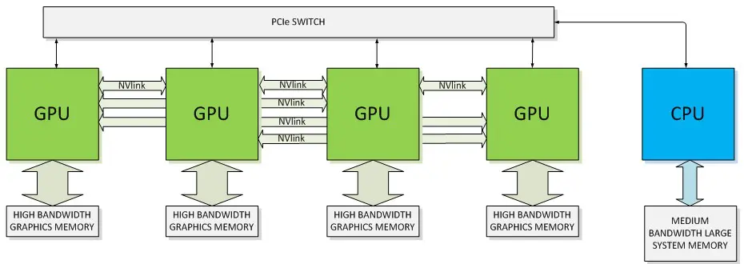

# Accelerated Computing: What is it? and How Does it Work?

> By Mary Zhang from [dgtlinfra.com](https://dgtlinfra.com/accelerated-computing/)

Accelerated computing, with its unprecedented processing power, has taken a central role in cloud infrastructure,
as it helps manage vast amounts of information in data centers more efficiently and effectively. Furthermore,
accelerated computing provides the necessary computational power and memory to train and implement advanced
generative AI models, such as GPT-4, more efficiently. This capability enables faster training times, the handling
of large datasets, and the development of increasingly complex models.

**Accelerated computing utilizes specialized hardware like GPUs, ASICs, TPUs, and FPGAs to execute computations
more efficiently than CPUs, enhancing speed and performance. It is especially beneficial for tasks that can be
parallelized, such as in high-performance computing, deep learning, ML, and AI.**

The world of accelerated computing is vast and ever-evolving, packed with diverse hardware and software solutions
such as GPUs, ASICs, TPUs, FPGAs, CUDA, OpenCL, and various networking technologies. Dgtl Infra delves into the
practical implementations of these solutions in the cloud with major providers like Amazon Web Services (AWS),
Google Cloud, and Microsoft Azure. We also explore their impact on AI-driven applications, including generative AI
and data centers. Continue reading to understand the massive implications that accelerated computing can have in
reshaping our technological future.

## What is Accelerated Computing?

Accelerated computing refers to the use of specialized hardware to perform certain types of computations more efficiently
than is possible with general-purpose central processing units (CPUs) alone. This concept leverages the power of devices
such as graphics processing units (GPUs), application-specific integrated circuits (ASICs) – including
tensor processing units (TPUs) – and field-programmable gate arrays (FPGAs) to perform calculations at significantly
higher speeds, thereby accelerating the process.

These accelerators are particularly well-suited for tasks that can be broken down into smaller, parallel tasks, such as
those often found in high-performance computing (HPC), deep learning, machine learning (ML), artificial intelligence (AI),
and big data analytics. By offloading certain types of workloads to these specialized hardware devices, accelerated computing
greatly enhances the performance and efficiency of these systems.

### Importance of Accelerated Computing

The end of **Moore’s Law**, which posits that computing power roughly doubles every two years at constant cost, has marked
a slowdown in CPU performance growth. This has sparked a shift towards **accelerated computing** and raised questions about
the long-term viability of the current $1 trillion market for CPU-only servers. With increasing demand for more powerful
applications and systems, traditional CPU methods struggle to compete with accelerated computing, which offers faster and
more cost-efficient performance upgrades.

Accelerated computing is vital due to its ability to process massive volumes of data efficiently, thereby driving advancements
in ML, AI, real-time analytics, and scientific research. Its increasing influence in graphics, gaming, edge computing, and
cloud computing forms the backbone of the digital infrastructure, like **data centers**, necessary for our increasingly
data-driven and interconnected world.

## Accelerated Computing Solutions – Hardware, Software, and Networking

Accelerated computing solutions involve a combination of **hardware**, **software**, and **networking**. These solutions
are specifically designed to enhance the speed and efficiency of complex computational tasks, primarily by performing
them in **parallel**.

### Hardware Accelerators

Hardware accelerators are fundamental to accelerated computing, significantly outperforming what traditional
central processing units (CPUs) alone can achieve. These accelerators include graphics processing units (GPUs),
application-specific integrated circuits (ASICs), and field-programmable gate arrays (FPGAs).

| **—** | **GPUs** | **ASICs** | **FPGAs** |
| ----- | -------- | --------- | --------- |
| *Purpose* | General-purpose computing | Specific tasks only; fully customized | Programmable for various tasks |
| *Speed* | High | Highest | Lower than GPUs and ASICs |
| *Flexibility* | Low | Lowest (single task) | High (fully reconfigurable) |
| *Cost* | >$10,000 | $5,000 or below; Depends on volume | $3,000 to $10,000 |
| *Development Time* | Low | Highest (requires custom design) | Moderate (requires programming) |
| *Power Efficiency* | Moderate | Highest | Moderate to high |
| *Software and APIs* | CUDA, OpenCL | Customized for individual processors | Verilog, VHDL, OpenCL, HLS |
| *Typical Use Cases* | Gaming, AI/ML, graphics | Cryptocurrency mining, specific computations | Prototyping, adaptable computations |

#### Graphics Processing Units (GPUs)

Graphics processing units (GPUs) are specialized processors widely used for a variety of computationally intensive tasks.
They are especially proficient at performing many complex calculations simultaneously, making them well-suited for tasks
such as high-performance computing (HPC) and training neural networks in machine learning.

In the context of application, the term **general-purpose graphics processing unit (GPGPU)** is often used to describe
the use of a GPU for computations that are traditionally handled by the central processing unit (CPU), in fields
**beyond** graphics rendering.

**NVIDIA** leads the market in GPUs used for data centers and compute-intensive tasks such as machine learning and AI.
The company’s primary GPU architectures for data centers include Hopper (H100) and Ampere (A100). Notably, the H100 GPUs
are well-suited for accelerating applications involving large language models (LLMs), deep recommender systems, genomics,
and complex digital twins.

#### Application-Specific Integrated Circuits (ASICs)

Application-specific integrated circuits (ASICs) are **custom** chips designed to perform a specific task, unlike
general-purpose CPUs which are engineered to handle a wide variety of applications. Given that ASICs are custom-tailored
for a particular function, they execute that task **more efficiently** than a general-purpose processor. This results
in advantages in terms of speed, power consumption, and overall performance.

Neural processing unit (NPU) and deep learning processor (DLP) are terms often used to refer to specific types of ASICs,
that are designed to accelerate AI workloads. A prominent example of an ASIC in the context of accelerated computing is
Google’s **tensor processing unit (TPU)**. TPUs are designed specifically for accelerating machine learning workloads.
They are used extensively in Google’s data centers for tasks such as language translation, voice recognition in
Google Assistant, and programmatic advertisement ranking workloads.

#### Field-Programmable Gate Arrays (FPGAs)

Field-programmable gate arrays (FPGAs) are semiconductor integrated circuits that can be reprogrammed to perform
specific tasks more efficiently than general-purpose CPUs. Unlike the fixed architectures found in ASICs, GPUs,
and CPUs, FPGA hardware includes configurable logic blocks and programmable interconnects. This allows for
functionality updates even after the chip has been shipped and deployed.

FPGAs are growing increasingly popular in data centers for high-performance computing (HPC) and AI/ML acceleration,
given their flexibility and parallel computing capabilities. However, they are slower than GPUs and custom ASIC solutions,
and their software ecosystem is not as developed. The sluggish adoption of FPGAs for AI workloads is primarily attributable
to their programming complexity, which has resulted in a limited number of specialized engineers.

### Software and APIs

Accelerated computing utilizes application programming interfaces (APIs) and programming models such as **CUDA** and
**OpenCL** to interface with both software and hardware accelerators. This optimizes data flow for better performance,
power efficiency, cost-effectiveness, and accuracy. APIs and programming models enable developers to write code that
runs on GPUs and utilize software libraries for efficient algorithm implementation.

#### CUDA (Compute Unified Device Architecture)

CUDA (Compute Unified Device Architecture) is a **proprietary** parallel computing platform and application programming interface (API)
model developed by **NVIDIA**. It enables the use of NVIDIA GPUs for general-purpose processing, resulting in a significant acceleration
of computational tasks. The platform includes deep learning libraries like cuDNN, TensorRT, and DeepStream to enhance
AI training and inference tasks.

Since its introduction in 2006, CUDA has been downloaded 40 million times, boasting a user base of 4 million developers worldwide.
This wide adoption provides new applications developed using the CUDA platform with a substantial developer community.
As CUDA is a proprietary platform with a vast developer base, NVIDIA holds a significant advantage in the data center hardware
and software market. Consequently, smaller vendors often find themselves at a disadvantage as they must rely on the
OpenCL platform, which does **not** deliver performance on-par with CUDA.

#### OpenCL (Open Computing Language)

OpenCL (Open Computing Language) is an **open-source** platform designed for parallel computing. It supports a wide range
of computing hardware, including CPUs, GPUs, FPGAs, and other types of processors. This broad compatibility enables developers
to harness the power of these diverse hardware components, accelerating computing tasks. A particularly notable feature of
OpenCL is its portability across different hardware types.

### Networking

Networking plays a crucial role in accelerated computing as it facilitates communication among tens of thousands of
processing units, such as GPUs, as well as memory and storage devices. Various networking technologies are utilized to
enable communication between these computing devices and the rest of the system, and to share data among multiple devices
within a network. These include:

- **PCI Express (PCIe):** this high-speed serial computer expansion bus standard provides a direct connection between the
  computing devices and the CPU/memory. In accelerated computing, PCIe is commonly used to connect GPUs or other accelerators
  to the main system
- **NVLink:** NVIDIA’s proprietary high-bandwidth, energy-efficient interconnect technology provides significantly higher
  bandwidth than PCIe. It is designed to facilitate more efficient data sharing between GPUs, and also between GPUs and CPUs
- **Infinity Fabric:** AMD’s proprietary interconnect technology is used to connect various components within their chips,
  including CPUs, GPUs, and memory
- **Compute Express Link (CXL):** an open interconnect standard, CXL helps in reducing latency and increasing bandwidth
  between CPUs and accelerators. It consolidates multiple interfaces into one PCIe connection to the host processor
- **InfiniBand:** a high-speed, low-latency interconnect technology that is often used in high-performance computing (HPC)
  setups. It enables high-speed interconnection between clusters of servers and storage devices
- **Ethernet:** this widespread, cost-effective, and flexible networking technology is used to transfer large amounts of
  data between servers in a data center, which is crucial for many accelerated computing tasks. However, it does **not**
  provide the same level of performance as NVLink or InfiniBand

The following is a diagram illustrating the architecture of GPUs interfaced with a CPU using NVLink and PCIe connectivity methods.

## Accelerated Computing Instances in the Cloud

In the context of cloud computing, accelerated computing instances refer to virtual machine (VM) instances that utilize
hardware accelerators, or co-processors, to perform tasks such as floating-point number calculations, graphics processing,
and data pattern matching more efficiently than what is achievable with only CPU-run software.

These accelerated computing instances come equipped with various **types** of hardware accelerators like
graphics processing units (GPUs), application-specific integrated circuits (ASICs), or field-programmable gate arrays (FPGAs),
which are housed in cloud data centers.

Cloud service providers (CSPs) such as Amazon Web Services (AWS), Google Cloud Platform (GCP), and Microsoft Azure offer
a variety of accelerated computing instances tailored to handle different types of workloads. The primary advantage of
using these cloud-based accelerated computing instances is that end users can access powerful, hardware-accelerated computing
capabilities on-demand, operating on a pay-as-you-go basis, eliminating the need for large upfront capital investments in hardware.

### Amazon Web Services (AWS)

Amazon Web Services (AWS), through Amazon Elastic Compute Cloud (EC2), provides **GPU** instances, such as the P3, P4, G3, G4,
and G5 instance types. These instances utilize NVIDIA GPUs and are well-suited for machine learning (e.g., training new models),
high-performance computing (HPC), and graphics-intensive applications. AWS, via Amazon EC2, also offers F1 instances that use
**FPGAs** to enable the delivery of custom hardware accelerations for workloads like genomics, search/analytics, image and
video processing, network security, and big data analytics.

In addition, AWS, through Amazon EC2, offers its own custom **ASIC** accelerators, known as
[AWS Inferentia](https://aws.amazon.com/machine-learning/inferentia/) and
[AWS Trainium](https://aws.amazon.com/machine-learning/trainium/), which are designed for machine learning workloads,
specifically inference and training, respectively.

- **AWS Inferentia (Inf1):** offers the lowest cost of inference in the cloud for running deep learning models,
  providing up to 70% lower cost per inference than comparable GPU instances
- **AWS Trainium (Trn1):** the most cost-efficient high-performance deep learning training instance in the cloud,
  offering up to 50% cost-to-train savings over comparable GPU instances

While AWS’ custom ASIC accelerators cannot replace the advanced functionality of cutting-edge NVIDIA GPUs,
they have the potential to deliver performance levels comparable to certain models of NVIDIA GPUs, but at a reduced cost.

### Google Cloud

Google’s Cloud TPU instances provide access to **tensor processing units (TPUs)** – a particular type of application-specific
integrated circuit (ASIC) – for machine learning workloads. The company’s
[latest](https://cloud.google.com/blog/topics/systems/tpu-v4-enables-performance-energy-and-co2e-efficiency-gains)
custom-developed tensor processing unit is known as **TPU v4**.

Google Cloud’s TPU v4 delivers exascale machine learning (ML) performance, boasting a 10 times increase in ML system performance
over its predecessor, the TPU v3. This development significantly enhances energy efficiency, approximately 2-3 times more compared
to contemporary ML domain-specific accelerators (DSAs), while reducing carbon dioxide equivalent (CO2e) emissions by roughly 20 times.

Google runs over 90% of its internal AI training on its custom TPUs, with the remaining 10% run on merchant silicon such as
NVIDIA GPUs. As transformer workloads increase, they account for a larger proportion of Google’s training mix. For instance,
LLMs running on TPUs already constitute over 30% of Google’s **training** needs. Notably, 100% of Google’s **inference**
workloads are run on TPUs.

In a separate offering, Google Cloud provides Accelerator-Optimized (A2) instances that are equipped with NVIDIA A100 GPUs.
These instances are designed for high-performance computing (HPC), data analytics, and machine learning workloads.

### Microsoft Azure

Microsoft Azure [provides](https://learn.microsoft.com/en-us/azure/virtual-machines/sizes-gpu) GPU-optimized virtual machine (VM)
sizes for compute-intensive, graphics-intensive, and visualization workloads, featuring various GPUs and CPUs from NVIDIA and AMD.
The company’s offerings include NCv3-series and NC T4_v3-series for compute-intensive applications, ND A100 v4-series for
deep learning and accelerated HPC applications, NV-series and NVv3-series for remote visualization, and NVv4-series for
VDI and remote visualization with partitioned GPUs.

## Accelerated Computing and Generative AI

Accelerated computing is a critical enabler for the development and implementation of advanced generative artificial intelligence (AI)
models. Generative AI involves using algorithms to create new data that is similar in statistical characteristics to the training set,
with notable examples in the domains of images, text, and voice.

In the field of [generative AI](https://dgtlinfra.com/generative-ai-landscape/), models like Generative Adversarial Networks (GANs),
Variational Autoencoders (VAEs), and Transformers – which include large language models (LLMs) from OpenAI’s ChatGPT – are used.
These involve complex mathematical operations, training on large datasets, and require a high amount of computational power and memory.
More specifically, model size, complexity per layer, sequence length, and diversification are factors driving up computational needs.

Accelerated computing plays a particularly important role in addressing generative AI’s computational power and memory requirements.
Its capabilities can speed up training times, handle large datasets, enable complex models, facilitate real-time generations, and
ensure efficient gradient calculations.

1. Speed Up Training Times

    The most significant role that accelerated computing plays in generative AI is in reducing the time it takes to train GANs,
    VAEs, and Transformer models. These models often take days, weeks, or even months to train on traditional CPU-based architectures.

    Accelerated computing platforms, such as graphics processing units (GPUs) and tensor processing units (TPUs), are designed
    for **parallel processing**. This makes them capable of handling multiple computations simultaneously, drastically reducing
    training times.

2. Handle Large Datasets

    Generative AI models are typically trained on **massive datasets**. Accelerated computing hardware can process these
    larger datasets much more efficiently than traditional CPUs. Furthermore, the use of advanced memory architectures,
    like the High Bandwidth Memory found in some GPUs, allows for the efficient handling of these large datasets during
    the training process.

3. Enable Complex Models

    The increase in computational power enabled by accelerated computing allows for the creation of more **complex and larger models**,
    leading to better results. For instance, larger transformer models like GPT-4, which have 170 trillion parameters, are only
    possible due to accelerated computing.

4. Real-Time Generations

    For certain applications, AI models need to generate output in **real-time** (or near real-time). This is particularly
    important for interactive applications such as AI in video games and real-time translations. Accelerated computing
    ensures that these operations are performed swiftly, thereby enabling real-time functionality.

5. Efficient Gradient Calculations

    Deep learning models learn by using **gradient-based optimization** techniques, like backpropagation. These are computational
    methods that iteratively adjust the parameters of a model, in the direction that minimizes the error or loss function.
    These calculations are matrix-based and thus are highly parallelizable, making them well-suited for accelerated computing solutions.

## Accelerated Computing and AI-Driven Data Centers

The aim of accelerated computing platforms is to speed up compute-intensive workloads, including AI, data analytics, graphics,
and scientific computing, across various [types of data centers](https://dgtlinfra.com/types-of-data-centers/). These encompass
enterprise, colocation, hyperscale/cloud, edge, and modular facilities. The primary objective is to enhance workload performance
while reducing power consumption and cost per query.

The rise of generative AI and large language models (LLMs) among consumers, internet companies, enterprises, and startups has
led to a significant moment in AI adoption. This surge has resulted in a considerable increase in inference deployment in
data centers and cloud platforms. Currently, most inference workloads run on CPUs and basic network interface cards (NICs)
equipped with processing capabilities. However, due to growing focus on performance, energy efficiency, cost-effectiveness,
and power constraints, the industry is shifting towards accelerated computing, utilizing specialized hardware such as GPUs and ASICs.

One vision for the future of modern data centers involves a continuously operating “AI factory” that processes and converts data
into intelligence. These facilities would employ AI models such as LLMs, recommender systems, and eventually, reasoning models.
Furthermore, they will feature an inference fleet to support a range of workloads, including video processing, text generation,
image generation, and 3D graphics for virtual worlds and simulations.

## Accelerated Computing vs Compute-Optimized

The choice between **accelerated computing** and **compute-optimized computing** is relevant when designing and managing
data centers or selecting cloud computing resources. Tasks that can be **parallelized**, such as machine learning,
AI algorithms, graphics rendering, and large-scale simulations, benefit more from accelerated computing. In contrast,
tasks that require strong single-threaded performance, like serving web content, databases, or running business applications,
perform better on compute-optimized systems.

*Below, we compare the key differences between accelerated computing and compute-optimized computing:*

| — | **Accelerated Computing** | **Compute-Optimized Computing** |
| - | ------------------------- | ------------------------------- |
| *Definition* | Uses specialized hardware (e.g., GPUs) | Uses high-performance CPUs |
| *Use Cases* | Graphic-intensive, machine learning tasks | High computations, server workloads |
| *Speed* | Extremely fast with suitable tasks (using parallel processing) | Fast but general-purpose (single-threaded tasks) |
| *Cost* | Can be expensive due to specialized hardware | Typically less expensive than accelerated |
| *Hardware* | Dependent on specific hardware, such as GPUs, TPUs, or FPGAs | Less hardware-dependent; primarily uses high-performance, multi-core CPUs |
