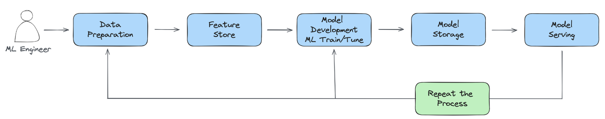

# Cloud Native AI Whitepapaer

This whitepaper is authored by CNCF AI Working Group.

> [This whitepaper was released](https://www.cncf.io/reports/cloud-native-artificial-intelligence-whitepaper/) on March 19, 2024.

## EXECUTIVE SUMMARY

Cloud Native (CN) and Artificial Intelligence (AI) are the most critical technology trends today. Cloud Native1 technology provides a scalable and reliable platform for running applications. Given recent advances in AI and Machine Learning (ML), it is steadily rising as a dominant cloud workload. While CN technologies readily support certain aspects of AI/ML workloads, challenges and gaps remain, presenting opportunities to innovate and better accommodate.

This paper presents a brief overview of the state-of-the-art AI/ML techniques, followed by what CN technologies offer, covering the next challenges and gaps before discussing evolving solutions. The paper will equip engineers and business personnel with the knowledge to understand the changing Cloud Native Artificial Intelligence (CNAI) ecosystem and its opportunities.

We suggest a reading path depending on the reader’s background and interest. Exposure to microservices2 and CN technologies3 such as Kubernetes (K8s) is assumed. For those without experience in engineering AI systems, we recommend reading from start to finish. For those further along in their AI/ML adoption or delivery journey, per their user persona4 we suggest diving into the sections pertinent to the challenges they are grappling with or are interested in solving. We also share where society needs to invest in this context.

## INTRODUCTION TO CLOUD NATIVE ARTIFICIAL INTELLIGENCE (CNAI)

Before we get into CNAI, the coming together of Cloud Native and AI technologies, let us examine briefly the evolution of each.

### The Emergence of Cloud Native

Widely known and used since 2013,5 the term Cloud Native (CN) saw an increase in popularity with the rise of container technology from LXC6 to Docker7 to Kubernetes (K8s)8 Today, Cloud Native is more broadly an aspirational target of well-balanced systems built using the microservice design pattern that promotes modular design and development with a high degree of re-usability, which also lends itself to deployability, scalability, and resilience.

!!! tip

    **The Cloud Native Computing Foundation defines Cloud Native as:**

    Cloud Native technologies empower organizations to build and run scalable applications in modern, dynamic environments such as public, private, and hybrid clouds. Containers, service meshes, microservices, immutable infrastructure, and declarative APIs exemplify this approach.

    These techniques enable loosely coupled systems that are resilient, manageable, and observable. Combined with robust automation, they allow engineers to make high-impact changes frequently and predictably with minimal toil.

    The Cloud Native Computing Foundation seeks to drive the adoption of this paradigm by fostering and sustaining an ecosystem of open source, vendor-neutral projects. We democratize state-of-the-art patterns to make these innovations accessible to everyone.

!!! note

    Cloud Native Artificial Intelligence is an evolving extension of Cloud Native.

    Cloud Native Artificial Intelligence (CNAI) refers to approaches and patterns for building and deploying AI applications and workloads using the principles of Cloud Native. Enabling repeatable and scalable AI-focused workflows allows AI practitioners to focus on their domain.

Kubernetes has evolved to become the de facto cloud operating system, with private, public, and hybrid cloud offerings. It implements a distributed orchestrator that handles network, storage, and compute resources of multiple types. Further, K8s offers an interface that enables DevOps10 best practices such as GitOps.11 Every Cloud Service Provider (CSP) has some flavor of Kubernetes as a service, facilitating access to infrastructure and a slew of support services to run various workloads, including AI/ML.

### Evolution of Artificial Intelligence

Artificial Intelligence, first introduced as a term in 1956,12 is the ability of machines to simulate human intelligence. Over the decades, it has been used in applications such as speech recognition, machine translation, image processing, game playing, and even excelling as a Jeopardy player.13 But, AI has exploded in mindshare more recently thanks to innovations in artificial neural networks and deep learning, mainly applied to natural language understanding. There are two primary classifications of AI: discriminative and generative.

**Discriminative AI** seeks to learn decision boundaries or classifications, with the knowledge captured as a “model,” which is used to predict new data. For example, classifying email as spam or not, distinguishing between images of cats and dogs, and much more. Discriminative AI is typically used for tasks where the desired output is known (e.g., via Supervised Learning, a form of machine learning). AI excels in sequence prediction, for example, guessing with a high probability what we will type next by analyzing large bodies of existing text, including our personal writing styles.

**Generative AI** learns latent structures or representations within data. It enables synthesizing new data using these structures or representations, such as creating stories, music, and visual art
from word prompts. Generative AI is used for tasks where the desired output is unknown, or the “correct” output is ill-defined. With Generative AI, AI has transcended into what humans consider creative, original, and sublime. Let us take a closer look at some of AI’s spectacular breakthroughs.

**Convolutional Neural Networks14 (CNNs)** were first developed in the 1980s but were only widely used in the early 2000s. In recent years, CNNs have become increasingly popular thanks to their ability to learn from large datasets of images and perform well on various image processing tasks, such as object detection, image classification, and segmentation.

**Transformers** were developed by researchers from the University of Toronto and Google in 2017. Transformers use a specialized mechanism called scaled dot-product attention, which imbues them with a memory-like structure.15 Transformer-based models are very effective for natural language processing tasks, such as answering questions, summarizing text, and translation. Consequently, they are vital in most Large Language Models (LLM). The most well-known LLM is GPT, the model that powers the popular ChatGPT service.16

LLMs are trained on massive datasets. They take sequences of prompts, that can be long, to generate context-sensitive responses in addition to being able to be fine-tuned for specialized domains with additional data, be it current affairs, medicine, law, or others. Novel techniques for fine-tuning, such as Reinforcement Learning from Human Feedback (RLHF) and Direct Preference Optimization (DPO), have been developed to make LLMs even more compelling.

Research and innovation have enabled end-user interactions that are faster, more creative, and more accurate than ever before. Just as significant as the innovations in data science and software is the evolution of infrastructure to power model inference (the process of computing results from AI models) and model training (the process of building an AI model from data). With AI accelerator
technology, AI practitioners can iterate faster to deliver higher-quality models in days and weeks versus months. Further, several traditional techniques employed by data scientists and statisticians are being re-evaluated to take advantage of the capabilities of CN systems.

### Merging of Cloud Native and Artificial Intelligence

As mentioned in the previous section, AI is the broader concept that aims to create systems that can perform tasks akin to humans. Machine learning is a way to learn from and make informed predictions and decisions based on data. It can be thought of as yet another form of automation that involves using algorithms to learn and improve over time without explicit programming. Finally, Data Science, as a multidisciplinary field, melds techniques from statistics, mathematics, and computer science to enact
a wide range of activities, from data analysis and interpretation to the application of machine learning algorithms.

Thinking about it broadly, we could divide applications for AI, ML, and data science into two broad categories: namely **Predictive AI** and **Generative AI** . Predictive AI aims at predicting and analyzing existing patterns or outcomes (e.g., classification, clustering, regression, object detection, etc.). In contrast, generative AI aims at generating new and original content (e.g., LLMs, RAG17,etc.). As such, the algorithms and techniques underpinning predictive and generative AI can vary widely.

> Figure 1 Cloud Native AI

Below is a sample set of areas where predictive and generative AI have distinct needs across computing, networking, and storage:

| **Challenges/Need**  | **Generative AI** | **Predictive AI** |
| -------------------- | ----------------- | ----------------- |
| **Computational Power**  | Extremely high. Requires specialized hardware. | Moderate to high. General-purpose hardware can suffice. |
| **Data Volume and Diversity** | Massive, diverse datasets for training. | Specific historical data for prediction.  |
| **Model Training and Fine-tuning** | Complex, iterative training with specialized compute. | Moderate training. |
| **Scalability and Elasticity**  | Highly scalable and elastic infrastructure (variable and intensive computational demands) | Scalability is necessary but lower elasticity demands. Batch processing or event-driven tasks. |
| **Storage and** **Throughput**  | High-performance storage with excellent throughput. Diverse data types. Requires high throughput and low- latency access to data. | Efficient storage with moderate throughput. It focuses more on data analysis and less on data generation; data is mostly structured. |
| **Networking** | High bandwidth and low latency for data transfer and model synchronization (e.g., during distributed training).  | Consistent and reliable connectivity for data access. |

In the coming sections, we will explore how to meet the needs that arise from either form, the challenges that come with it, and potential recommendations to employ when faced with such challenges.

## What is Cloud Native Artificial Intelligence?

Cloud Native Artificial Intelligence allows the construction of practical systems to deploy, run, and scale AI workloads. CNAI solutions address challenges AI application scientists, developers, and deployers face in developing, deploying, running, scaling, and monitoring AI workloads on cloud infrastructure. By leveraging the underlying cloud infrastructure’s computing (e.g., CPUs and GPUs), network, and storage capabilities, as well as providing isolation and controlled sharing mechanisms, it accelerates AI application performance and reduces costs.

Figure 2 (below) maps these enabling mechanisms between tooling and techniques.

> Figure 2 Tooling and Techniques

### Running AI On Cloud Native Infrastructure

The value of Cloud Native for AI is highlighted by articles in the media published by cloud service providers and/or AI companies.19 20 The emergence of AI-related offerings by cloud providers and emerging start-ups in this space are crucial indicators of how Cloud Native principles can shape the systems necessary for the AI evolution.

  
OPENAI

  
Scaling Kubernetes to 7,500 nodes

  
HUGGING FACE

  
Hugging Face Collaborates with Microsoft to launch Hugging Face Model Catalog on Azure

!!! tip

    Cloud Native Artificial Intelligence is an evolving extension of Cloud Native.

    Kubernetes is an orchestration platform that can be used to deploy and manage containers, which are lightweight, portable, self-contained software units. AI models can be packaged into containers and then deployed to K8s clusters. Containerization is especially crucial for AI models because different models typically require different and often conflicting dependencies. Isolating these dependencies within containers allows for far greater flexibility in model deployments. CN tooling allows for the efficient and scalable deployment of AI models, with ongoing efforts to tailor these for AI workloads specifically.

The Kubernetes Scheduler21 continues to evolve,22 23 particularly to better integrate and support sharing Graphics Processing Units (GPUs) that have become highly popular in speeding AI workloads. Beyond supporting applications sharing a GPU and handling multi-tenancy, efforts are underway to support leveraging remote pools of resources outside of Kubernetes.

High-quality data is needed to train and test AI models to obtain superior inference. Cloud Native infrastructure can access data through various methods, such as data lakes and warehouses. Many cloud providers offer block, object, and file storage systems that are perfect for providing low-cost, scalable storage. For example, the size of models can run into gigabytes. During the training phase, pulling the model’s checkpoints each time can cause a severe load on networking and storage bandwidth. Treating models as containerized artifacts opens the door for hosting them in OCI24 registries and enables caching. It further allows applying **software supply chain** best practices to models such as artifact signing, validation, attestation, and data provenance. Additionally, containerizing models/artifacts facilitate bundling in WebAssembly (WASM) binaries. WASM is a platform-independent, efficient CN approach to inference.

!!! tip

    **Why Cloud Native Artificial Intelligence?**

    With its elastic, always-on infrastructure, the cloud has allowed enterprises, startups, and developers to prototype quickly, offer new services, scale solutions, and much more. It also does so cost-effectively through resource sharing. The average user no longer has to worry about ordering hardware or dealing with logistics like space, power, network connectivity, cooling, software licensing, and installation. AI has similar concerns – rapid prototyping, accessing storage, networking, and computing resources to tackle small and large-scale training and inference tasks.

    **Using AI to Improve Cloud Native Systems**

    Whether packaged as observability tooling or leveraging LLM capabilities for natural language processing (NLP) of logs, AI-powered solutions/projects are entering the hands of operators and end-users to enhance their productivity and make their lives easier. One such open source Cloud Native Computing Foundation (CNCF) project is K8sGPT,25 which leverages the pattern recognition and language capabilities of LLM, such as Bedrock, Cohere, and others, to aid K8s operators in their
    daily work. More significantly though, the symbiosis of CN and AI opens up the ecosystem to new and unforeseen opportunities. For example, we expect a rise in less technical users able to operate and manage complex systems.

## CHALLENGES FOR CLOUD NATIVE ARTIFICIAL INTELLIGENCE

It’s important to note that CNAI challenges will vary between the different personas.26 And, while Cloud Native’s flexible, scalable platform is a promising fit for AI workloads, AI’s scale and latency needs pose challenges and expose gaps in CN technologies while also presenting opportunities. We tease these out in the context of an end-to-end ML pipeline.27 also referred to in the literature as MLOps.28 Issues with the traditional trade-offs of time and space, parallelism, and synchronization all surface, exposing ease-of- use gaps. To summarize, the ML Lifecycle looks as follows:

> Figure 3 ML Lifecycle

**The typical ML pipeline is comprised of:**

- Data Preparation (collection, cleaning/pre-processing, feature engineering)
- Model Training (model selection, architecture, hyperparameter tuning)
- CI/CD, Model Registry (storage)
- Model Serving
- Observability (usage load, model drift, security)

The data volumes involved in training, similarity search, and model size, particularly with LLMs, each drive memory and performance considerations. While CN handles access control and scheduling for CPUs, GPU allocation with adequate sharing is still evolving. The ML training phase is all about search, requiring tracking the performance of intermediate models to determine which to keep and how to tune model parameters further to obtain even greater accuracy. Security is more critical given the sensitivity of the handled data and the models’ intrinsic value. Observability is vital to detect model drift, usage load, and more. Let us dive a little deeper into the challenges in each pipeline stage. The reader is encouraged to consider additional challenges related to their domain and add to the conversation.

### Data Preparation

As the first phase in an AI/ML pipeline, data preparation can present various challenges. These can be broadly grouped into three main categories: managing large data sizes, ensuring data synchronization during development and deployment, and adhering to data governance policies.

#### Data Size

The demand for data to build better AI/ML models is increasing faster than Moore’s Law, doubling every 18 months.30 Whether it’s data management/handling, data processing, or data analysis, there is a rapid escalation in data demands for building AI/ML models. Therefore, distributed Cloud Native

computing and efficient data movement and storage become essential to bridge the gap between these computational demands and hardware capabilities.

#### Data Synchronization

Data may need to be sourced from multiple disparate locations in different formats; the developer and production environments, more often than not, are different, and all this is in addition to handling the increased complexity arising from distributed computing, such as partitioning and synchronization. Let us take a closer look at the latter.

In data processing systems like Spark, the industry-standard interface, SQL, plays a crucial role in providing users with a familiar uniform experience, whether they are prototyping locally or running large workloads in a distributed manner. However, ML workloads don’t have an industry-standard interface. Consequently, data scientists develop their ML Python scripts with small datasets locally, and then distributed systems engineers rewrite these scripts for distributed execution. If the distributed ML workloads do not function as expected, data scientists might need to debug the issues using their local Python scripts. This process is inefficient and often ineffective. This is true despite the availability of better observability tools and the reproducibility afforded by container technology.

Potentially viable solutions exist for resolving this inconsistency between local development and production environments. The first is using an industry-standard interface to support the end-to-end ML lifecycle. For example, users can leverage APIs of native ML frameworks like PyTorch or TensorFlow to create training code and validate it by running it locally in a Python runtime. Then, users can easily

reuse the same code and leverage the Python SDK from Kubeflow to run this code locally in a distributed fashion via Kind/Minikube or just as easily scale their training code by deploying it to a remote, large- scale Kubernetes cluster using the same Python SDK. Another option is to use a general-purpose distributed computing engine such as Ray, whose computational abstractions also enable users to run the same Ray scripts seamlessly in local and production environments.

Data volume is a cross-cutting issue. It also manifests in the training stage.

#### Data Governance

Data governance is crucial to building trust and ensuring responsible AI development. One should consider three critical pillars regarding data governance.

1. **Privacy and Security:** It is essential to navigate the complex landscape of data privacy regulations such as GDPR31 and CCPA32. Robust security measures should be implemented to safeguard sensitive data used in AI models. Encryption, access controls, and regular vulnerability assessments should be used to protect valuable information.

2. **Ownership and Lineage:** It is imperative to clearly define who owns and has access to the data throughout the AI lifecycle, from collection to use. Data lineage tracking tools should be utilized to understand how data flows through the system, ensuring transparency and accountability. Doing so helps to prevent unauthorized access and misuse of sensitive information.

3. **Mitigating Bias:** AI models are only as good as the data they are trained on. Hence, it is essential to actively monitor and address potential biases in the data and algorithms. This includes using diverse datasets, employing fairness metrics, and continuously evaluating the model to ensure it delivers fair and ethical outcomes, including capturing its limitations. Model Cards33 are evolving to capture these.

Data privacy and security is a cross-cutting issue that requires consideration at every stage.

### Model Training

Model training data volumes have risen exponentially, resulting in a need for distributed processing and accelerators to achieve even more parallelism. Further training is an iterative multi-step process, which makes scaling a complex multi-component coordinated task. We review these aspects in greater detail in this section.

#### Rising Processing Demands

LLMs are rapidly pushing the boundaries to meet the growing AI/ML training and inference computing demands, and accelerators are becoming popular. These range from GPUs from multiple vendors with different capabilities to Google’s tensor processing units (TPUs), Intel’s Gaudi, and even field- programmable gate arrays (FPGAs). These varied compute resources need virtualization support, drivers, the ability to configure and share them, and CN scheduler enhancements. Further, these accelerators’ limited availability and cost have prompted the exploration of multi-cloud resource banding, and even sky34 computing.

Using CN technology for AI can be complex regarding GPU virtualization and dynamic allocation. Technologies, such as vGPUs, MIG, MPS ([see glossary](#glossary)), and Dynamic Resource Allocation (DRA),35 enable multiple users to share a single GPU while providing isolation and sharing between containers in a pod. They can increase GPU utilization, which in turn reduces costs, in addition to allowing multiple

workloads to benefit simultaneously from them. However, implementation requires careful orchestration and management, especially when allocating and deallocating resources dynamically. Close collaboration between the AI and CN engineering teams is necessary to ensure smooth and efficient integration.

#### Cost Efficiency

The elasticity and scalability inherent in Cloud Native environments allow organizations to provision and scale resources dynamically based on fluctuating demands. This aspect also applies to AI tasks.

However, resource proper sizing and reactive scheduling to meet varying workload demands are even more compelling in the context of accelerators such as GPUs, which are expensive and limited in supply. It drives the need to be able to **fractionalize GPUs** to utilize them better.

Reducing the carbon footprint during model serving can be achieved using an autoscaling serving framework, which dynamically adjusts resources based on demand.36 KServe,37 an LF AI&Data Foundation project, provides such functionality. Sustainability 38 can be significantly improved by various means, such as using smaller, more specialized models, using a mixture of experts, and techniques such as compression and distillation. Distributing ML serving into geographical regions powered by renewable or cleaner energy sources can significantly reduce carbon footprint.39

Responsible development of ML models can include metadata on carbon footprints to aid in tracking and reporting the impact of model emissions on the environment. Additional tooling, such as _mlco240_ and *codecarbon*41 exists, with limitations, to help predict the carbon footprint of new neural networks before physical training.

#### Scalability

AI/ML workflows are complex and characterized by diverse components that run in a distributed environment. In the context of training, this complexity is particularly exacerbated by the data volumes being handled and the need to support multiple rounds of training until model convergence. Coordinating the scaling of various microservices, with each encapsulating specific AI functionalities,

demands intricate orchestration to ensure seamless communication and synchronization. Furthermore, the heterogeneity of AI models and frameworks complicates standardization, making creating generic scaling solutions applicable across various applications challenging.

#### Orchestration/Scheduling

As alluded to earlier, Cloud Native tools and projects simplify the orchestration and scheduling of AI workloads by leveraging the inherent features of containerization, microservices, and scalable cloud infrastructure. Complex AI workflows can be decomposed into modular components, making it easier to manage and scale specific functions independently.

However, as mentioned earlier, GPUs are a precious and in-demand resource, and the ability to more efficiently manage their sharing and scheduling for GPU-based AI workloads is critical to the success of AI development teams. Well-tested tools for addressing advanced scheduling needs like bin packing, placement, resource contention, and pre-emption will be essential and foundational for cloud native AI to thrive. Better scheduling support is evolving in Kubernetes through efforts such as Yunikorn,42 Volcano,43 and Kueue,44 the latter two addressing batch scheduling, which is particularly valuable for efficient AI/ML training. Training jobs benefit from gang (or group) scheduling,45 as the container replicas belonging to the job need an all-or-nothing placement policy to function correctly, and those jobs are not easily scaled up or down. Gang scheduling support is an area of opportunity.

#### Custom Dependencies

AI applications often rely on specific frameworks and versions of libraries, and these dependencies may not be readily available or compatible with standard container images.

Since many AI workloads benefit from GPU acceleration, having the necessary GPU drivers and libraries to support running workloads on GPUs can be challenging, especially when dealing with different vendors and GPU architectures. For example, when running distributed training on NVIDIA devices, one can use NVIDIA Collective Communications Library (NCCL), to take advantage of optimized multi- GPU and multi-node communication primitives. Different versions of the library might lead to different performance. Reproducible builds, a good build hygiene practice for all software, require using versioned dependencies to avoid runtime incompatibilities and performance surprises.

### Model Serving

Model serving differs chiefly from data processing and training because of load variability and often latency requirements. Further, there are considerations of service resiliency in addition to sharing infrastructure to reduce costs. Also, AI model characteristics are distinct, varying significantly across classical ML, Deep Learning (DL), Generative AI (GAI) LLMs, and, more recently, the multi-modal approaches (e.g., text to video). Different workloads necessitate varied support from ML infrastructure. For example, before the emergence of LLMs, model serving typically required only a single GPU. Some users opted for CPU-based inference if the workloads were not latency-sensitive. However, when serving LLMs, the performance bottleneck shifts from being compute-bound to memory-bound due to the autoregressive nature of the Transformer decoder.46

This section explores how CN supports these facets and what challenges remain.

#### Microservice Architecture and Developer Experience

CN is based on microservice architecture. However, this may pose a challenge for AI, dealing with each stage in the ML pipeline as a separate microservice. Many components may make maintaining and synchronizing their outputs and hand-offs challenging. Even if users only want to play with these solutions on their laptops, they might still need to create tens of Pods. The complexity makes the infrastructure lack the flexibility to adapt to versatile ML workloads.

Second, the microservice-based ML infrastructure leads to a fragmented user experience. For example, in their daily workflows, AI Practitioners may need to build container images, write custom resource YAML files, use workflow orchestrators, and so on instead of focusing solely on their ML Python scripts. This complexity also manifests as a steeper learning curve, requiring users to learn many systems outside their expertise and/or interest.

Third, the cost increases significantly when integrating each stage from different systems in the ML model lifecycle. The [Samsara engineering blog](https://www.samsara.com/blog/building-a-modern-machine-learning-platform-with-ray)47 mentions that its ML production pipelines were hosted across several microservices with separate data processing, model inference, and business logic steps. Split infrastructure involved complex management to synchronize resources, slowing the speed of development and model releases. Then, using Ray, Samsara built a unified ML platform that

enhanced their production ML pipeline performance, delivering nearly a 50% reduction in total yearly ML inferencing costs for the company, stemming chiefly from resource sharing and eliminating serialization and deserialization across stages.

These issues highlight the need for a unified ML infrastructure based on a general-purpose distributed computation engine like Ray. Ray can supplement the existing Cloud Native ecosystem, focusing on computation, allowing the Cloud Native ecosystem to concentrate on deployment and delivery. The Ray/KubeRay community has collaborated extensively with multiple Cloud Native communities, such as Kubeflow,48 Kueue,49 Google GKE,50 and OpenShift.

#### Model Placement

Users ideally like to deploy multiple, possibly unrelated, models for inference in a single cluster while also seeking to share the inference framework to reduce costs and obtain model isolation. Further, for resiliency, they want replicas in different failure zones. Kubernetes provides affinity and anti-affinity mechanisms to schedule workloads in different topology domains (e.g., zone, node),52 but usability improvements can help users take advantage of these features.

#### Resource Allocation

Model serving requires handling, chiefly, the model parameters. The number of parameters and the representation size indicate the memory needed. Unless dealing with a trillion parameter LLM, these typically require only a portion of a GPU. This highlights the need to be able to fractionalize expensive accelerators like GPUs. The DRA project,53 which is still in alpha, seeks to make GPU scheduling more flexible.

Another consideration is response latency, which depends significantly on the use case. For instance, the response latency desired to detect objects on the road in an autonomous driving context is several orders lower than tolerable while creating an image or writing a poem. Additional serving instances may need to be launched for low-latency applications under high-load conditions. These could land on a CPU, GPU, or other computing resource if the desired latency can be honored. Support for such cascading opportunistic scheduling on available resources is still evolving in Kubernetes.

Further, event-driven hosting is ideal for not wasting resources and keeping costs down. The Kubernetes Event Driven Autoscaling (KEDA)54 project is well-suited here, provided the model loading latency is tolerable to still deliver on the end-to-end service latency. An opportunity here is to provide better support for model sharing by delivering models in an Open Container Initiative55 (OCI) format, an immutable file system that lends itself to sharing. Another solution is to use AI for CN, in particular, to predict use and proactively float or shut down serving instances to handle the expected load.

### User Experience

The hallmark of CN, aka containers, allows portability and reproducibility, while Kubernetes’ APIs and operators, like Kubeflow, simplify the deployment of the AI workloads, making them “write once and run (virtually) anywhere’’ in an easily scalable fashion. Once users transition from traditional batch systems on bare metal or virtualized environments to containers and Kubernetes, they appreciate the benefits of cloud technologies despite their initial adoption challenges. The learning curve, however, can be steep.

Let’s consider AI training workloads. Configuring the runtime environment can be time-consuming, particularly when highly customizable libraries are used. The user has the option to use default settings for a plethora of environment variables, but these may yield inferior performance. Once optimized on a given Kubernetes platform for a particular training workload, there are no guarantees it will perform likewise on another platform or training task or container bundle with different libraries included. This affects workload portability and ease of use.

The previous paragraph looked at just one stage in an AI pipeline, typically multi-stage, spanning data preparation, training, tuning, serving, and fine-tuning. How can one provide a seamless user experience for AI practitioners who aren’t necessarily savvy with systems or cloud concepts and provide them with a streamlined product experience that eliminates friction in AI development? Giving AI practitioners user- friendly and well known SDKs written in Python that abstract away the complex details of Kubernetes can help increase the adoption of Cloud Native AI tools. Users would like to build ML models using PyTorch and TensorFlow and then quickly and easily deploy them to Kubernetes infrastructure by using simple Python SDKs without worrying about details such as packaging, building Docker images, creating Kubernetes custom resources (e.g., PyTorchJob, TFJob), and scaling those models using complex cloud native tools. A strong product development focus will be required to invent an open source product experience for the MLOps lifecycle, which is much more user friendly.

Integrating tools like JupyterLab, which contains space for an IDE-like experience with useful APIs that may exist in AI/ML tools available today (ex., Kubeflow Katib API), would allow ML practitioners to more quickly iterate on their AI development with fewer context switches across multiple user interfaces.

JupyterLab’s extensible nature gives ML practitioners a workspace to build, deploy, and monitor AI/ ML workloads within a familiar tool without learning new tools and interfaces. It is even possible to use

JupyterLab to schedule workflows of code developed in individual AI/ML Notebooks using GUI workflow building tools like Elyra56 coupled with Kubeflow Pipelines.

Big Data, inside and outside the enterprise, is a mainstay of AI. It is essential to consider how to bridge the gap between the Big Data and ML ecosystems. For example, modern Generative AI models require large amounts of data for training. Still, the tools for loading large amounts of data from formats like Iceberg into training frameworks like PyTorch require enhancement, with tools like TorchArrow57 and PyIceberg58 demonstrating early promise. Tools used for large-scale data preparation, like Spark, aren’t well connected to the tools in the ML ecosystem. Extra overhead is required to prepare data, build features, store features to disk, and then read those features back into memory for use in training workloads. Solutions like RayData59 or a data caching microservice built upon Arrow Flight RPC may significantly improve the Input/Output overhead involved with the first phases of training workloads.

ML tools are complex, and users typically need help to deploy them on Kubernetes. It is nontrivial to identify and deploy appropriate drivers for GPUs and make them compatible with a user’s AI/ML workloads. The upgrade path for existing ML workloads should be simplified and improved, similar to other Kubernetes control plane components. Users should get clear guidelines on how to keep their AI workloads resilient to Kubernetes upgrades and cluster downtime.

Another aspect that affects the ease of use is multi-tenancy, using quotas and namespaces. Non-admin users need help to figure out the system resources available to them. Typically, administrators provide tools (e.g., Grafana dashboards) for observability; when these are lacking, non-expert/non-admin users are left in the lurch.

Finally, debugging is challenging, made more so in distributed environments and even more so when the processing pipeline comprises multiple complex services. Hardware and software failure might be more or less explicit and easy to identify to a cloud user, but an AI practitioner may need help to see the complete picture of failure. For example, NCCL termination errors can be vague with any of a multitude of possible causes, each requiring investigation. The user may need to parlay the error message to an administrator for further assistance.

### Cross-Cutting Concerns

In the previous sections, we addressed challenges specific to a stage in the AI pipeline. But others are common to all stages and all software applications, spanning reference implementations, observability, security, and more. For instance, right-sizing resources are valid for processing data, training, or serving. It has resource utilization, cost, and sustainability ramifications. Let us dive a little deeper into them.

#### Reference Implementation

Neither cloud nor AI are easy studies, and getting them to work together after making choices from many tools and projects is non-trivial. Adoption needs to be improved by requiring a reference implementation that meets a majority of simple use cases. Kind for Kubernetes did wonders to help developers get started on their laptops. Jupyter Notebook did likewise for the budding AI/ML developer. We need something similar for an AI/ML pipeline that runs in the cloud.

#### Right-sizing Resource Provisioning

AI/ML workloads are resource intensive, especially with LLMs with their billions or trillions of parameters. As discussed earlier, accelerators like GPUs are expensive and in short supply, and it is essential to use the proper size allocation to save resources and control costs. We need to be able to not only timeslice GPUs but also slice or partition them into fractional sections and allocate them judiciously as required by different workloads. In conjunction with the above back-end effort, there is a need for front-end support to request GPU sub-units and configure them while launching workloads.

To address this need, Kubernetes introduced a new API, **Dynamic Resource Allocation (DRA)** , as alpha in v1.26. The API provides more flexibility to manage specialized hardware resources, in particular:

- Network-attached resources
- Arbitrary parameters for resource requests
- Arbitrary, resource-specific setup and cleanup actions
- Custom matching resource requests with available resources, including handling optional requests.
- The DRA API offers several advantages compared to existing approaches:
    - Custom hardware can be added by developing and deploying DRA drivers without needing to modify the core Kubernetes codebase
    - Vendors can define resource parameters
    - Resources can be shared between containers and pods

#### Cost Control

AI/ML can quickly become a budget black hole. Automating resource allocation and scaling processes to optimize AI cloud costs is essential. Microservices can be scaled individually as needed. Further, it lends itself well to using the Kubernetes auto-scaling feature that will further help right sizing the number of active instances and thus the infrastructure costs. Last, **Spot Instances** can be leveraged with policies that capture balancing risk with meeting Service Level Agreements (SLAs).

#### Observability

Observability is valuable across the AI/ML pipeline. CN offers tools like OpenTelemetry62 and Prometheus63 that can monitor load, number of accesses, response latency, and more. It is vital to monitor model performance and health in production environments. It is crucial to keep track of model drift to ensure the accuracy and reliability of your AI system. For example, facial recognition systems may experience degradation as more people wore masks during the COVID-19 pandemic. Similarly, a housing price predictor model may diverge from reality due to external factors such as natural disasters or changes in interest rates. Therefore, monitoring your AI models continuously is essential to detect any performance issues and make necessary adjustments.

Infrastructure monitoring is essential, especially with long running workloads. As AI training workloads run, anomalies in GPUs and networking may happen at times. Examples are errors in the GPU memory or unreachable nodes, which may result in the job crashing.

However, issues that are not immediately identifiable may arise: for instance, training performance may start to degrade without any apparent hardware fault being reported. In these cases, only deep diagnostics could identify the issues. Current metrics do not expose results from deep diagnostics. Therefore, providing tools to detect, avoid, and handle infrastructure issues before, during, and after running AI training jobs becomes crucial.

#### Disaster Recovery and Business Continuity

All production services must be resilient, with backups. AI services are no different. Failed or slow to respond services can cause reputational damage and loss of revenue. Developing a comprehensive disaster recovery plan is essential, which may include data backup, running instances in multiple availability zones, and running multiple instances. Policies can help with these.

#### Security and Compliance Audits

All outward facing services, particularly Model Serving instances, need firewall protection, access control, and more. And like any other service, your AI/ML workloads must follow security best practices. These include penetration testing, vulnerability scanning, and compliance checks of the workload domain, such as health care, finance, etc.

Tools like Grype64 and Trivy65 can scan containerized workloads for vulnerabilities. Kyverno66 and policy enforcement services can ensure containerized workloads are running at the lowest privilege necessary with minor capabilities needed.

An additional layer of security is possible using confidential computing67 or Trusted Execution Environments (TEE). These hardware-supported environments provide encrypted memory, data integrity protection, and testability. TEEs protect the data and workload from other infrastructure users while in use. AMD, Intel, NVIDIA, and IBM have TEE offerings, and they are becoming available in public clouds. Protecting sensitive data such as health care and financial information and ML models are prime use cases.

#### Sustainability

AI/ML model training has always been resource intensive, especially with Large Language Models like GPT-3. Training emissions are comparable to multiple transcontinental flights, while inference emissions add up due to high query volumes.68 The industry’s trend towards oversized models for market dominance leads to inefficiencies, contributing to energy and resource consumption.69 More transparency and standardization in reporting the environmental impacts of a model are challenges.

Recently, there have been efforts to increase transparency with LLama,70 while some insights are becoming available concerning water usage for cooling servers running LLMs, like ChatGPT. ChatGPT’s carbon footprint is significant, given its millions of users.

The drive for sustainability presents opportunities for innovation. DeepMind’s BCOOLER and smaller, more efficient models like DistilBERT and FlexGen show promise in reducing AI/ML energy

consumption.71 Adopting best practices like efficient ML architectures, optimized processors, and locating cloud computing infrastructure in energy-efficient locations can curb the carbon footprint of ML training. Google has been successful in controlling the energy consumption of its machine learning systems.

#### Education for Kids

Today, technology education mainly focuses on traditional programming languages without AI or computer assistance. Schools typically don’t use modern IDEs that support refactoring, templating, or API assistance and will have students code on a contained website for ease of setup. They also don’t teach the use of AI coding assistance technologies like Github’s Copilot, even though this will become the standard mode of development in the future. Most students aren’t even aware this technology exists.

Schools actively dissuade students from using AI technologies like ChatGPT and Copilot due to concerns about cheating. This prevents students from learning how to use AI technologies to augment their work and excel effectively. Because schools paint AI technology in a negative light, studious students get scared off from using it, and the students looking for a way to avoid doing their homework are more likely to use AI.

The challenges mentioned above provided us insight into areas of concern when it comes to implementing CNAI systems. Fortunately, CN tooling is facing many challenges head-on. We next consider opportunities that stem from these challenges.

## PATH FORWARD WITH CLOUD NATIVE ARTIFICIAL INTELLIGENCE

This section provides a forward looking approach to taking the initiative to implement CNAI. We begin with recommendations (or actions), then enumerate existing yet evolving solutions (i.e., CNAI software), and finally consider opportunities for further development.

### Recommendations

#### Flexibility

Sometimes, the variety of options regarding AI can become overwhelming. Fortunately, thanks to many, popular tools and techniques remain valid in this new world. From REST interfaces for interface to cloud based resources and services, CN technologies work well today and will continue to work well as new offerings evolve.

#### Sustainability

Improving the accountability of AI workload environmental impact is crucial for ecological sustainability, particularly in the cloud native landscape. This can be achieved by supporting projects, methodologies, and taxonomy that help clarify, classify, and catalyze AI workload on ecological sustainability.

Additionally, integrating cloud native technologies to optimize AI workload scheduling, autoscaling, and tuning is necessary. Furthermore, advocating for adopting standardized methodologies in environmental impact assessments is vital. It is also important to promote the development and use of energy-efficient AI models and foster transparency in model development and usage, primarily through cloud native stacks such as Kubeflow. Finally, emphasizing the importance of purposeful and efficient AI usage will help minimize unnecessary computational loads.

#### Custom Platform Dependencies

We recommend ensuring the Cloud Native environment has the required GPU drivers and supports GPU acceleration for AI workloads. This is crucial as AI applications often depend on specific frameworks and library versions that may not be easily accessible or compatible with standard container images. This will help with the challenge of having various vendors and GPU architectures.

#### Reference Implementation

Given the number and complexity of the tools involved in AI development, it may be advisable to consider the value of a Cloud Native, OpenTofu-based reference implementation of a user-friendly combination of various tools that can provide a product-like experience for any team around the world to get started doing AI/ML in the Cloud quickly. Combining the best available open source tools for data preparation, feature store, training, tuning, model registry, and serving can help teams get started doing machine learning quickly and scale up their work efficiently using the power of the Cloud. Consider the value/power of combining a sophisticated set of technologies into a functional and scalable distribution to serve such a purpose. (e.g. JupyterLab, Kubeflow, PyTorch, Spark/Ray/Trino, Iceberg, Feast, MLFlow, Yunikorn, EKS/GKE, S3/GCS, etc.). Such a reference implementation may be extremely valuable for advancing open and responsible AIML development powered by Cloud-based technologies.

#### Industry Acceptance of Terminology

As AI becomes ubiquitous, it becomes increasingly complex in some dimensions but simpler in others. For example, terminology evolves, providing businesses with more effortless conversations about AI (e.g., terms such as “repurpose” to reuse existing content). This also applies to more technical terms, such as RAG, Reason, and Refinement.

### Evolving Solutions for AI/ML

The following are just a few examples of specific tools or technologies that have become options to enable AI, including CNAI.

#### Orchestration - Kubeflow

Kubeflow is an example of a CNAI tool supporting ML Operations (MLOps). Using technologies such as Kubernetes, stateless architectures, and distributed systems, Kubeflow helps AI/ML communities

adopt Cloud Native tools more efficiently. The successful adoption of Kubeflow highlights the successful integration of Cloud Native technologies for AI/ML/DL. Kubeflow has been highly progressive in its ability to apply machine learning concepts to elastic substrates provided by Kubernetes, with many other projects following suit.72 Kubeflow follows Kubernetes best practices and applies them to the AI/ ML space, such as declarative APIs, composability, and portability. Kubeflow implements individual microservices for every stage of the ML lifecycle. For example, Kubeflow Training Operator is used for distributed training, Katib is used for hyperparameter tuning fine-tuning, and Kubeflow KServe is used for model serving. That allows users to integrate individual Kubeflow components into their ML infrastructure or use Kubeflow as an end-to-end ML platform.

#### Context - Vector Databases

LLMs are trained with vast volumes of, typically, publicly available data at a point in time. We interact with them via prompts. But to make the responses more valuable without the user having to enter longer or multiple prompts and possibly retrieve more domain-specific responses, it is helpful to “enrich” the prompt. This is where vector databases come in. They are giant, indexed stores of vectors, a mathematical representation of data in numerical form. Embeddings are a specific vector representation of each additional piece of data, often proprietary, domain specific, or newer, that aims to capture relationships and similarities **(context)** between the data they represent. The user-provided LLM prompt is transformed using the same embedding used by the vector database, and the resulting vector is then used to find similar vectors in the database. They are then merged to provide additional **context** before feeding into the LLM to generate a response. Multi-modal GenAI systems would handle prompts that might be text, images, audio, or other, with the embedding ability to handle diverse input.

Vector databases can be purpose-built or traditional databases with extensions to handle vectors more specifically. Instances may vary in their choice of indexing scheme, distance metric used to compute similarity, and whether and what data compression technique they employ. Some offerings include Redis,73 Milvus,74 Faiss,75 and Weaviate.76

#### Observability - OpenLLMetry

OpenLLMetry77 is a project that builds on top of OpenTelemetry78 to enable thorough and vendor-neutral instrumentation for LLM Observability. Because Generative AI is not debuggable in the traditional sense (i.e., you can’t “just step through the code”), developers must turn towards Observability tools and practices to improve their use of Generative AI over time. This data is also often the source of evaluations and fine-tuning workflows.

### Opportunities

#### CNCF Project Landscape

Several Linux Foundation (LF) groups, including CNCF, LF AI79 & Data, along with partners such as the AI Alliance,80 and more, provide a hub for AI projects that both AI and cloud engineers can use. Existing tools, such as the Cloud Native Landscape,81 give a bird’s eye view into the CN ecosystem. The following figure lists established and evolving projects grouped by their functional area.

> Figure 4 ML Tool to Task Mind Map

#### CNAI for Kids and Students

Kids already use AI assistive technologies like ChatGPT daily and have no idea how they work. The underpinnings of modern AI, like discriminative and generative AI algorithms, are a black box that kids and even technology savvy parents don’t understand, so it is difficult to take an interest in it. Rather than just taking LLMs like ChatGPT for granted, students’ education should include the basics of neural networks and machine learning algorithms to explain how AI technologies work and how to use them better in their future careers.

The Cloud Native community and successful programs like CNCF Kids Day82 at KubeCon provide educational opportunities on Cloud Native and AI technologies. Introducing kids to AI technologies early will also prevent the diversity, equity, and inclusion issues plaguing computer science. AI is an equalizing technology because people of every race, sexual orientation, and socioeconomic status can experience AI/ML daily and help improve this technology with the proper training and education.

The AI/ML revolution is analogous to the dot-com era, where web technology became ubiquitous, and even ordinary workers embraced this technology to improve their business. As AI/ML technology becomes ubiquitous in society, we must ensure that students keep pace with the advances in AI and Cloud Native technologies.

#### Participation

As AI grows, more opportunities for education and involvement happen. There is room for AI specialists (e.g., Ph.D. in ML to Data Scientists) and AI generalists (e.g., operators and end-users). Educational programs such as MOOCs83 and certifications have emerged to focus on AI tooling and techniques on all fronts. Professional societies (e.g., ACM84 and IEEE85) and meetups provide chances to meet in person to learn and discuss challenges. Industry groups such as the CNCF,86 along with Linux Foundation AI, AI Alliance,87 and others, provide the ability to coordinate projects and protocols at scale.

#### Trust and Safety / Safety By Design

As we build AI and Cloud Native technology, there is a significant risk of unintended consequences and negative impacts. These can be due to unintentional design issues causing adverse impacts on vulnerable groups, for example, recommending algorithms that inadvertently promote hate-based, violent, extremist material. They can also be due to individuals or groups’ malicious use of systems and/or tools to harm deliberately, such as using Generative AI tools to create misinformation and disinformation campaigns or individuals purposely fine-turning LLMs to produce child sexual abuse material.88

AI and Cloud Native technology are also at the core of the tooling used by Trust and Safety: “The field and practices employed by digital services to manage content and conduct scans for risks to users and others, mitigate online or other forms of technology-facilitated abuse, advocate for user rights, and protect brand safety.”89 Systems have been built to deliver every part of the Trust and Safety cycle90 including identifying and assessing potentially violent behavior, triaging and prioritizing cases, making and recording enforcement decisions, selecting and applying interventions, and gathering threat intelligence. Apart from being central to the safety and health of the internet, these systems can have significant negative impacts if designed without due consideration.

Responsible technology is about reducing harm from technology, diversifying the tech pipeline, and ensuring that technology aligns with the public interest. It explores and actively considers tech’s values, unintended consequences, and negative impacts to manage and mitigate risk and harm. As we build AI and Cloud Native technology, we must consider these potential ethical and human rights impacts,optimizing freedom of expression, the right to privacy, the right to life, liberty, and the security of person,91 and other fundamental universal human rights.

The World Economic Forum states: “Safety by Design puts user safety and rights at the center of the design and development of online products and services”.92 This proactive and preventative approach focuses on embedding safety into the culture and leadership of an organization. It emphasizes accountability and aims to foster more positive, civil, and rewarding online experiences for everyone.

There is a growing field of experts to help with these development best practices, such as the Global Internet Forum to Counter Terrorism (GIFCT),93 The Tech Coalition,94 and the Internet Society. 95 All Tech is Human curated list of experts in this sector and can provide links to critical resources.96 The AI Alliance 97 initiative (IBM, Meta, and 50+ institutions) focuses on advancing open innovation and science in AI to propose alternatives to closed AI systems and advance the field of responsible AI (ethics, trust, safety). OpenAI,98 the organization behind ChatGPT, was initially founded as a non-profit focusing on guaranteeing safety and fairness in AI.

#### The Emergence of a New Engineering Discipline

In the last two decades, we have seen how the tech industry has been creating and changing engineering job roles rapidly, depending on their responsibilities. We have witnessed the rise of roles such as DevOps Engineer, SRE Engineer, and Infrastructure Engineer. We foresee the MLDevOps or AI engineer becoming the glue between Data Science, Infrastructure and Development in the next few months or years. It’s important to know that this industry area is developing, and the role titles can fluctuate; only time will tell. Different terms may also become a reality. In the future, that role will need to focus more on AI tooling, infra, and deploying AI chains and agents.

## ARTIFICIAL INTELLIGENCE FOR CLOUD NATIVE

This paper has focused mainly on Cloud Native supporting AI development and usage. But AI can enhance Cloud Native in many ways – from anticipating load and better resource scheduling, particularly with multiple optimization criteria involved, such as power conservation, increased resource utilization, reducing latency, honoring priorities, enhancing security, understanding logs and traces, and much more.

#### Natural Language Interface for Cluster Control

At Cloud Native AI + HPC Day in Chicago in 202399 Kubernetes Controllers with a natural language interface were demonstrated to tackle cluster-related tasks. It used an LLM in that back-end that comprehended user requests and translated them to Kubernetes API calls. It further supported launching chaos tests to ascertain service resiliency, scan for CVEs, and more. It is a precursor to more intuitive orchestration and management of Kubernetes clusters and, in time, lowers the learning curve for administrators and site reliability engineers.

#### Security

Machine learning can analyze massive datasets to rapidly identify patterns and predict potential threats or weaknesses in the system. Integrating AI in red teaming100 accelerates identifying security gaps and allows organizations to strengthen their defenses against emerging cyber threats. ML models that detect anomalous network behavior can just as easily be used in clusters to protect workloads or across a fleet of clusters for edge deployments.

#### Smarter Orchestration/Scheduling

AI can analyze historical cluster usage over the day/week/month to identify workload patterns and resource availability, to understand when and how to deploy workloads, whether to scale them horizontally or vertically, when to consolidate workloads on a few nodes to put others into quiescence for power savings or even drop them from the cluster to reduce costs.

ML-driven models can optimize task sequencing, automate decision-making processes, and enhance the overall efficiency of workload management. A natural language interface facilitates the whole orchestration and scheduling process. These enhancements would make it easier for organizations to manage and schedule complex workflows in dynamic cloud environments. Processor power models are being built to help plan and optimize for reduced power consumption.

#### AI Integration Efforts in Flight and Under Exploration

- Fine-tuned custom LLMs to analyze logs.
- MLOps pipeline to capture and maintain data provenance.
- AI semantic conventions to CNCF projects like OpenTelemetry.
- AI-powered development environments (IDEs) are used to develop and deploy AI applications.

We expect to report on advances in this space in the not-too-distant future.

## CONCLUSION

Combining Artificial Intelligence (AI) and Cloud Native (CN) technologies offers an excellent opportunity for organizations to develop unprecedented capabilities. With the scalability, resilience, and ease of use of Cloud Native infrastructure, AI models can be trained and deployed more efficiently and at a grander scale. This white paper delves into the intersection of these two areas, discussing the current state of play, the challenges, the opportunities, and potential solutions for organizations to take advantage of this potent combination.

While several challenges remain, including managing resource demands for complex AI workloads, ensuring reproducibility and interpretability of AI models, and simplifying user experience for non- technical practitioners, the Cloud Native ecosystem is continually evolving to address these concerns. Projects like Kubeflow, Ray, and KubeRay pave the way for a more unified and user-friendly experience for running AI workloads in the cloud. Additionally, ongoing research into GPU scheduling, vector databases, and sustainability offers promising solutions for overcoming limitations.

As AI and Cloud Native technologies mature, organizations embracing this synergy will be well- positioned to unlock significant competitive advantages. The possibilities are endless, from automating complex tasks and analyzing vast datasets to generating creative content and personalizing user experiences. By investing in the right talent, tools, and infrastructure, organizations can leverage the power of AI and Cloud Native technologies to drive innovation, optimize operations, and deliver exceptional customer experiences.

This paper brought to you by the CNCF AI Working Group.

## Glossary

| Term  | Definition  |
|------------------|----------------------|
| AI Practitioners | In the context of this paper, it refers to (not limited to) ML Engineers, Data Scientists, Data Engineers, roles whose primary responsibilities include manipulating relevant data, creating, and optimizing machine learning models.  |
| Developers | In the context of this paper, it refers to (not limited to), Software Engineers, Frontend Engineers, Backend Engineers, Full Stack Engineers, Software Architects, and Software Testers. The roles whose primary responsibility include writing and testing software including user interfaces, microservices, and backend software. |
| Deployers  | In the context of this paper, it refers to (not limited to), DevOps Engineers, Site Reliability Engineers, Infrastructure Engineers, Infrastructure Architects, Application Administrators, Cluster Administrators. The roles whose primary responsibility include deploying software and cloud infrastructure to multiple environments including development, staging and production. |
| DRA | DRA stands for Dynamic Resource Allocation. It is an API abstraction of general resource claim and provisioning for Pods, allowing 3rd party vendors to provide HW/SW resources on demand without having to rewrite the Kubernetes core API. |
| LLM | "LLM" stands for "Large Language Model." Large language models are artificial intelligence models trained on vast amounts of text data to understand and generate human-like text. LLMs are a subset of machine learning models specifically designed for natural language processing (NLP) tasks.  |
| LLMOps  | LLMOps, which stands for Large Language Model Operations, encompasses the operational aspects tailored specifically for Large Language Models (LLMs). In essence, LLMOps is the adaptation of MLOps principles and tools to the unique requirements of LLM-powered applications, encompassing their entire lifecycle from development to deployment and maintenance.  |
| MIG | Multi-Instance GPU technology is an innovation that allows a single physical GPU (Graphics Processing Unit) to be partitioned into multiple more minor instances, each operating as an independent GPU with its own resources and capabilities. This technology enhances GPU utilization and flexibility in data center and cloud computing environments.  |
| MLOps | MLOps, short for machine learning operations, refers to the practices, methodologies, and tools used to streamline and automate machine learning models' deployment, monitoring, and management in production environments. MLOps aims to bridge the gap between machine learning development and operations, ensuring that ML models are deployed efficiently, reliably, and at scale. It involves a combination of software engineering principles, DevOps practices, and specialized tools to automate the end-to-end ML lifecycle, including data preparation, model training, model deployment, monitoring, and maintenance. MLOps helps organizations accelerate their ML projects, improve model performance, and maintain consistency and reliability across the ML pipeline. |
| MPS | MPS stands for Multi-Process Service in the context of GPU computing. MPS technology allows multiple GPU-accelerated applications or processes to share a single physical GPU while maintaining isolation and efficient resource utilization. |
| RAG | In the context of AI, RAG stands for "Retrieval-Augmented Generation." It's a model architecture combining retrieval-based and generative models to produce text. RAG's generation process is augmented with a retrieval mechanism that helps the model access relevant information from an extensive database or knowledge base. This retrieval component allows the model to incorporate external knowledge into the generation process, improving the quality and relevance of the generated text. |
| vGPU  | vGPU, or Virtual Graphics Processing Unit, technology enables multiple virtual machines (VMs) to share a single physical GPU (Graphics Processing Unit). This technology efficiently utilizes GPU resources in virtualized environments such as cloud computing, data centers, and virtual desktop infrastructure (VDI). |
