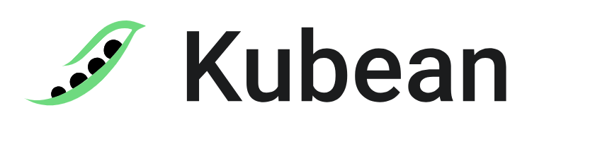

# Kubean Enters CNCF Sandbox

In April 2024, the CNCF community welcomed a vibrant green pod (Kubean) into the Sandbox.

Over the past few years, several developers from DaoCloud have been maintaining code in the Kubespray community. On the occasion of May Day 2022, inspired by Uncle Kai and Brother Xiao, they casually sowed a green pod [Kubean](https://kubean-io.github.io/kubean/zh/) in the CNCF community. This young pod, after nearly two years of diligent nurturing, began to crackle and grow, and now serves as the initial spark for the [DCE 5.0](../dce/index.md) production cluster, capable of creating hundreds to thousands of clusters on demand.

On April 15, 2024, after [an 11-member CNCF TAG committee vote](https://github.com/cncf/sandbox/issues/49), with 8 in favor and 3 not voting, the results exceeded the 66% threshold, successfully entering the well-known Sandbox for further incubation.

## What Can This Pod Do?

At its core, Kubean is an Operator, providing CR resources for containerized clusters, capable of deploying clusters and more as Jobs. Like the legendary generals who could conjure soldiers from beans, as long as you have an underlying cluster, you can deploy numerous new clusters in various environments using Kubean.

- Supports declarative deployment of clusters from scratch using Operator and Helm Chart, supports D1, D2 for efficient operations (scaling, upgrading, uninstalling, etc.)
- Capable of deploying K8s clusters on bare metal, virtual machines, cloud platforms, and more
- Supports almost all Linux distributions
- Supports log tracing for convenient cluster operations (upgrades, scaling, uninstallation), and also facilitates rolling back clusters to a specific job state
- Supports engines like Kubespray
- Supports offline installation and upgrading

Here is the overall architecture diagram of Kubean:

Kubean operates on an existing Kubernetes cluster, using standard CRD resources and Kubernetes built-in resources to control and manage the lifecycle of clusters (installation, uninstallation, upgrading, scaling, etc.). Kubean uses Kubespray as its underlying technology dependency, simplifying the cluster deployment process and lowering the barrier for users. Additionally, it builds on Kubespray's capabilities by adding new features like operation records and offline version tracking.

This pod consists of four beans:

- Big Bean Cluster Controller: Monitors the Cluster object.
  Uniquely identifies a cluster, possesses access information, type information, deployment parameters of the cluster nodes, and associates all operations (ClusterOperation objects) on this cluster;
- Second Bean ClusterOperation Controller: Monitors ClusterOperation objects.
  When a ClusterOperation Object is created, the controller assembles a Job to execute the operation defined in the CRD object;
- Third Bean Manifest Controller: Monitors Manifest objects.
  Used to record and maintain the current version of components, packages, and versions used and compatible with Kubean;
- Fourth Bean LocalArtifactSet Controller: Monitors LocalArtifactSet objects.
  Used to record the supported components and versions of offline packages.

## Comparison with Similar Products

Kubean currently defaults to the Kubespray underlying engine, but plans to support more engines in the future, such as switching to newer engines like Kops and KubeKey.

Kubespray is part of the kubernetes-sigs ecosystem, designed for deploying production clusters as an open-source project. Kubean was initially developed based on Kubespray, but has since added several new features. Below is a simple comparison between Kubean, Kubespray, Kops, and KubeKey:

<table>
    <thead>
        <tr>
            <th></th>
            <th><strong>Kubean</strong></th>
            <th><strong>Kubespray</strong></th>
            <th><strong>Kops</strong></th>
            <th><strong>KubeKey</strong></th>
        </tr>
    </thead>
    <tbody>
        <tr>
            <td>Applicable Scenarios</td>
            <td>Suitable for cloud-native declarative API cluster management scenarios</td>
            <td>Suitable for complex scenarios with varying deployment platforms</td>
            <td>Suitable for fixed infrastructure platform management</td>
            <td>Suitable for lightweight dependency deployment scenarios</td>
        </tr>
        <tr>
            <td>Containerization Support</td>
            <td>Supported</td>
            <td>Supported</td>
            <td>Not Supported</td>
            <td>Not Supported</td>
        </tr>
        <tr>
            <td>CLI Support</td>
            <td>Not Supported</td>
            <td>Supported</td>
            <td>Supported</td>
            <td>Supported</td>
        </tr>
        <tr>
            <td>Declarative API</td>
            <td>Supported</td>
            <td>Not Supported</td>
            <td>Not Supported</td>
            <td>Not Supported</td>
        </tr>
        <tr>
            <td>Supported Deployment Platforms</td>
            <td>
                <ul>
                    <li>GCE</li>
                    <li>Azure</li>
                    <li>OpenStack</li>
                    <li>vSphere</li>
                    <li>EquinixMetal</li>
                    <li>OracleCloud</li>
                    <li>Baremetal</li>
                </ul>
            </td>
            <td>
                <ul>
                    <li>GCE</li>
                    <li>Azure</li>
                    <li>OpenStack</li>
                    <li>vSphere</li>
                    <li>EquinixMetal</li>
                    <li>OracleCloud</li>
                    <li>Baremetal</li>
                </ul>
            </td>
            <td>
                <ul>
                    <li>AWS</li>
                    <li>GCE</li>
                    <li>DigitalOcean (Alpha)</li>
                    <li>Hetzner (Alpha)</li>
                    <li>OpenStack (Alpha)</li>
                    <li>Azure (Alpha)</li>
                </ul>
            </td>
            <td>Unknown</td>
        </tr>
        <tr>
            <td>Mixed Architecture Support</td>
            <td>Supported</td>
            <td>Supported</td>
            <td>Not Supported</td>
            <td>Not Supported</td>
        </tr>
        <tr>
            <td>Offline Deployment</td>
            <td>Supported</td>
            <td>Supported</td>
            <td>Not Supported</td>
            <td>Supported</td>
        </tr>
        <tr>
            <td>Implementation Method</td>
            <td>
                <ul>
                    <li>Kubespray</li>
                    <li>Operator</li>
                    <li>CRD</li>
                </ul>
            </td>
            <td>
                <ul>
                    <li>Ansible</li>
                    <li>kubeadm</li>
                </ul>
            </td>
            <td>
                <ul>
                    <li>Cloud Provider API</li>
                    <li>Nodeup</li>
                </ul>
            </td>
            <td>
                <ul>
                    <li>Golang</li>
                    <li>SSH</li>
                    <li>SFTP</li>
                    <li>Kubeadm</li>
                </ul>
            </td>
        </tr>
        <tr>
            <td>Operating System Support</td>
            <td>
                <ul>
                    <li>Flatcar</li>
                    <li>Debian</li>
                    <li>Ubuntu</li>
                    <li>CentOS</li>
                    <li>Fedora</li>
                    <li>OpenSUSE</li>
                    <li>Oracle Linux</li>
                    <li>Almalinux</li>
                    <li>Rocky Linux</li>
                    <li>Kylin</li>
                    <li>Amazon Linux</li>
                    <li>UOS Linux</li>
                    <li>OpenEuler</li>
                </ul>
            </td>
            <td>
                <ul>
                    <li>Flatcar</li>
                    <li>Debian</li>
                    <li>Ubuntu</li>
                    <li>CentOS</li>
                    <li>Fedora</li>
                    <li>OpenSUSE</li>
                    <li>Oracle Linux</li>
                    <li>Almalinux</li>
                    <li>Rocky Linux</li>
                    <li>Kylin</li>
                    <li>Amazon Linux</li>
                    <li>UOS Linux</li>
                    <li>OpenEuler</li>
                </ul>
            </td>
            <td>Depends on infrastructure support</td>
            <td>
                <ul>
                    <li>Ubuntu</li>
                    <li>Debian</li>
                    <li>CentOS</li>
                    <li>Almalinux</li>
                    <li>SUSE</li>
                </ul>
            </td>
        </tr>
        <tr>
            <td>Runtime Support</td>
            <td>
                <ul>
                    <li>Docker</li>
                    <li>containerd</li>
                    <li>CRI-O</li>
                </ul>
            </td>
            <td>
                <ul>
                    <li>Docker</li>
                    <li>containerd</li>
                    <li>CRI-O</li>
                </ul>
            </td>
            <td>
                <ul>
                    <li>Docker</li>
                    <li>containerd</li>
                </ul>
            </td>
            <td>
                <ul>
                    <li>Docker</li>
                    <li>containerd</li>
                    <li>CRI-O</li>
                    <li>iSula</li>
                </ul>
            </td>
        </tr>
        <tr>
            <td>Upgrading</td>
            <td>Supported</td>
            <td>Supported</td>
            <td>Supported</td>
            <td>Supported</td>
        </tr>
    </tbody>
</table>

## Sandbox Journey

Kubean was selected for the CNCF Landscape in late July 2023 and immediately applied to join the Sandbox.

At the end of August, [ErikJiang](https://github.com/ErikJiang), the main maintainer of Kubean, presented a PPT online to CNCF TAG-Runtime members during a regular hearing, introducing the origins, functional features, and future plans of Kubean.

In the following months, he answered many questions raised by TAG members, such as the differences from [Cluster API](https://github.com/kubernetes-sigs/cluster-api), enhancing the persuasiveness of Kubean's ease of use. Subsequently, TAG committee members [jberkus](https://github.com/jberkus), [caniszczyk](https://github.com/caniszczyk), [rochaporto](https://github.com/rochaporto), and others proposed new schemes regarding Kubean's affiliation:

- A subproject under kubernetes-sigs/kubespray
- Or as an independent Sandbox project

Open source progresses through exchange and collision, and so does Kubean. This pod was originally born on the branches of Kubespray, but now it has been found to be capable of further development based on more engines, alleviating the TAG committee's concerns. In fact, it is not only an extension of Kubespray but can also be an expansion of more cluster lifecycle engines; it is a new product running on old-era engine technologies, endowed with a new mission.

In early April 2024, [raravena80](https://github.com/raravena80) on behalf of TAG decided to accept Kubean into the sandbox, initiating the voting process.

On April 15, 2024, the TAG votes exceeded the 66% threshold, and Kubean began the [Sandbox Onboarding process](https://github.com/cncf/toc/issues/1301).

## Behind the Scenes

One small incident worth mentioning is that in early 2024, Jiang Hang, a code maintainer of Kubean, opened GitHub during a weekend to routinely review open-source code and incidentally discovered a runc container escape vulnerability. He raised an issue, discussed it with several community developers, and then submitted a PR to fix this CVE vulnerability. Later, this vulnerability, identified as CVE-2024-21626, scored a high 8.6 points, claimed to be the most severe vulnerability in runc history. See [K8s runc discloses 8.6 point highest historical security vulnerability](https://mp.weixin.qq.com/s/sx0XbdiiR9CRjoUNAeHSYA).

It was after the Kubean project team members deeply participated in and fixed this most severe vulnerability that the TAG committee's attitude softened, recognizing the value of Kubean and its team.

In summary, the open-source community always rewards effort, whether it's project recognition or personal skill and insight growth. On this global stage, efforts will be remembered. Today, there's the remarkable presence of the green pod, and perhaps tomorrow, the song of the blue sprite will be sung far and wide.

More developers are welcome to contribute and build a thriving community. GitHub project address: <https://github.com/kubean-io>

!!! tip "In Conclusion"

    In this world, no method can fully satisfy both the Buddha and your beloved.
