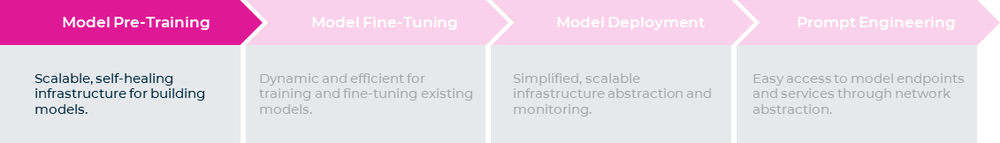
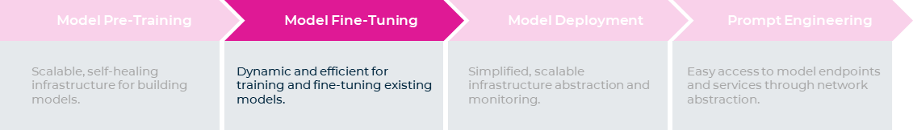
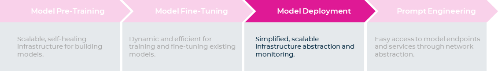
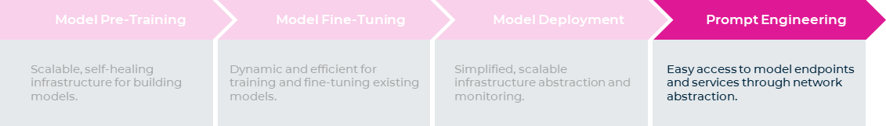

# Why Kubernetes is THE platform for GenAI

> Source from [run.ai/blog](https://www.run.ai/blog/why-kubernetes-is-the-platform-for-genai)

Kubernetes is no longer just a tool for running workloads, like web applications and microservices; it's _the_ ideal platform
for supporting the end-to-end lifecycle of large artificial intelligence (AI) and machine learning (ML) workloads, like LLMs.

In 2021, a [report from Run:ai](https://pages.run.ai/ai-infrastructure-survey-report-2021) discovered that 42%
of respondents said they used Kubernetes for AI/ML workflows. And, last year
[Red Hat](https://www.altoros.com/blog/machine-learning-constitutes-65-percent-of-kubernetes-workloads)
found that that number had increased to 65%, with this year expected to be even higher.

This widespread adoption spans industries: from innovative, state-of-the-art companies like
[OpenAI](https://kubernetes.io/case-studies/openai/), to AI cloud providers like
[CoreWeave](https://www.coreweave.com/blog/serverless-kubernetes-what-it-is-and-how-it-works),
to big established brands, like [Shell](https://www.altoros.com/blog/shell-builds-10000-ai-models-on-kubernetes-in-less-than-a-day/)
and [Spotify](https://www.youtube.com/watch?v=KUyEuY5ZSqI). All of these organizations rely on
K8s to support their AI/ML distributed workloads.

In this post, we’ll explore why Kubernetes uniquely supports AI/ML research and engineering at each stage of the life cycle.

## Introduction

Kubernetes is most well-known as a highly-effective platform for container orchestration and management
in a distributed computing environment. It was initially developed by Google as an open-source project to
manage their internal applications. Since then, it has become the de facto standard for deploying,
scaling, and managing containerized applications across various environments.

But more recently, Kubernetes has proven to be extremely useful for a new set of use cases: it has been
leveraged by organizations seeking to develop, train, and deploy large language models (LLMs)
efficiently and effectively. Its comprehensive support throughout the entire lifecycle of LLMs
offers numerous advantages, eliminating the need for complex framework integration across different
technology stacks, and it can be used at each stage of the LLM lifecycle,
from pre-training to deployment to experimentation and app-building.

## The advantages at each stage

### Model pre-training

During the model pre-training phase, Kubernetes provides a robust foundation by offering unparalleled scalability and elasticity.
This ability to scale up and down automatically based on resource demand is one of the biggest advantages, especially
for AI/ML workloads requiring massive compute power. K8s achieves this by automating the lifecycle of pods;
if a pod has an error it will be automatically terminated and restarted. In other words, it’s self-healing.

Kubernetes also enables dynamic scaling by effortlessly adding or reducing pods and nodes as needed, catering to
the evolving workload demands. Its declarative infrastructure approach allows users to communicate their requirements,
simplifying the management process. These are powerful development features that are not available when using
other tools like Slurm. They mean you can have higher throughput and train models more efficiently,
without manually dealing with infrastructure limitations.

Tools like Jupyter notebooks and VS Code are necessary for experimentation with LLMs and prompt engineering,
and K8s networking abstraction enables data scientists to create development environments very easily,
complete with connections to these tools. Furthermore, port forwarding and managing configurations are automated,
which simplifies the provisioning of workspaces for end users and the management of environments and networking for cluster administrators.

### Model fine-tuning

While K8s has all the necessary tools for developing LLMs, today many enterprises are not building them from scratch,
but taking existing models and customizing and fine-tuning them to their specific contexts. In this scenario,
when you want to do fine-tuning with an existing model, K8s is also ideal because it is very dynamic.
Unlike Slurm, K8s can handle multiple workloads concurrently, which makes the training process much more efficient.
Another advantage is around the rich ecosystem of tools that integrate with K8s for training models.
Kubeflow (with operators for Pytorch, Tensorflow, and MPI), KubeRay Operator, and MLflow are some examples.

### Model deployment

When it comes to deploying the LLM itself, or model services for inference, Kubernetes offers a simplified process:
you just need an endpoint to present to data scientists. The networking stack simplifies publishing models to the outside world,
making them easily consumable. K8s provides a comprehensive toolset and a rich ecosystem for model deployment with load balancers,
ingress controllers, network policies, and more. This facilitates the seamless deployments of LLM endpoints and
their integration into services and applications.

Infrastructure abstraction further streamlines the deployment process, ensuring scalability and auto-scaling capabilities.
K8s abstracts all underlying infrastructure, streamlining to a common API for managing containers so you can use the same tools
and processes regardless of where your workloads are running. This greatly simplifies management and monitoring for production environments.

### Prompt engineering

And the advantages don’t end there. Once you’ve deployed your LLM model, Kubernetes offers an enhanced user experience
when it comes to building applications or letting users experiment with models. For example, hosting apps on platforms
like Gradio or Streamlit is nearly effortless with Kubernetes because there’s an entire toolset dedicated to doing just this.
This simplifies the deployment process, while services endpoints and auto-scaling capabilities ensure smooth and scalable experimentation.

### Security

And throughout every phase, Kubernetes has robust security to keep your data and IP safe.
For example, role-based access control (RBAC) enables fine-grained access control,
granting appropriate privileges to users or service accounts; Pod Security Contexts allow you
to set security attributes at the pod level, reducing the attack surface within the cluster.
These features ensure a secure environment for containers, models, and datasets across the AI/ML lifecycle.
Read more about securing AI/ML environments on Kubernetes
[here](https://www.run.ai/guides/kubernetes-architecture/securing-your-ai-ml-kubernetes-environment).

## Real-world success stories

It’s not just theoretical—the most innovative state-of-the-art companies are running their entire LLM lifecycle on Kubernetes,
including leading tech companies that operate on a huge scale (e.g. OpenAI), as well as new AI cloud providers (Core Weave, Lambda cloud).

For example, [OpenAI’s cluster comprises over 7,500 nodes](https://openai.com/research/scaling-kubernetes-to-7500-nodes),
supports their large language models and distributed machine learning workloads. Despite alternatives like Slurm,
K8s offers them a more favorable developer experience and cloud-native integrations. It also provides
flexibility and ease of deploying containers, managing heterogeneous nodes, and handling dynamic infrastructure elements.

!!! quote "Christopher Berner, Head of Infrastructure at OpenAI"

    Research teams can now take advantage of the frameworks we've built on top of Kubernetes,
    which make it easy to launch experiments, scale them by 10x or 50x, and take little effort to manage.

Running Kubernetes on different data centers of Azure, OpenAI benefits from cluster-wide MPI communicators that enable
parallel jobs and batch operations across nodes. Kubernetes serves as a batch scheduling system, and its autoscaler
ensures dynamic scaling, reducing idle node costs while maintaining low latency. Plus it’s very fast.
Researchers working on distributed training systems are able to spin up and scale experiments in days rather than months.

By adopting Kubernetes, OpenAI enjoys enhanced portability, enabling easy movement of research experiments
between clusters. The consistent API provided by Kubernetes simplifies this process. Furthermore, OpenAI
can leverage their own data centers in conjunction with Azure, resulting in cost savings and increased availability.

But you don’t have to be a company on the same scale as OpenAI to benefit: Kubernetes has emerged as _the_ dominant platform
for building, training, and deploying language models, revolutionizing the AI landscape (you can see the huge impact it's had with
[this diagram](https://mattturck.com/landscape/mad2023.pdf)). Hosting AI/ML workloads in Kubernetes offers several advantages:
scalability, flexibility, network abstraction, and a better user experience when it comes to experimentation.
With Kubernetes, you can easily build, train, and deploy your AI/ML workloads, using the best tools and techniques for your needs.
