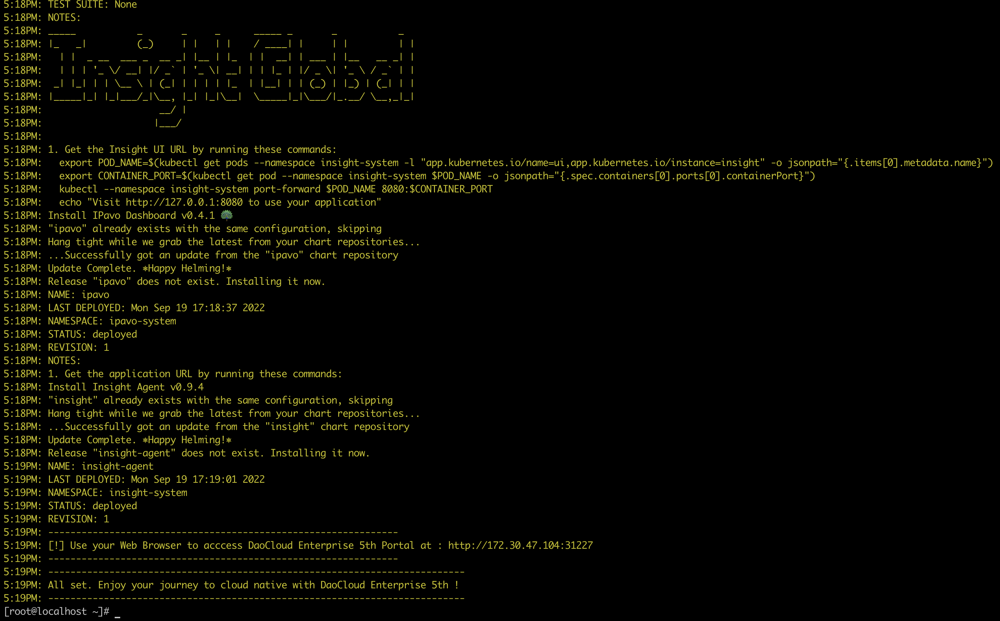
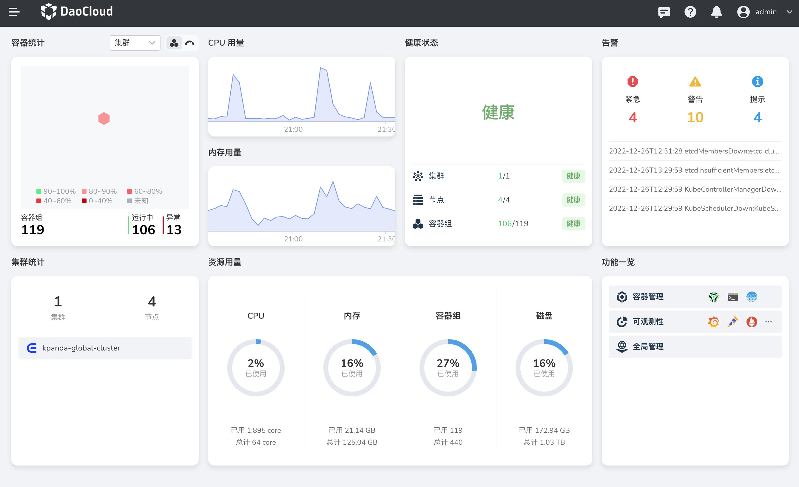

# Step-by-step install DCE 5.0 Community Edition

Author: [SAMZONG](https://github.com/SAMZONG)

This article completes the installation of DCE 5.0 Community Edition from 0 to 1, including K8s cluster, dependencies, network, storage and other details and more considerations.

## Cluster planning

It is planned to use 3 UCloud VMs, all configured with 8-core 16G.

| Role   | Hostname       | Operating System | IP            | Configuration     |
| ------ | -------------- | ---------------- | ------------- | ----------------- |
| master | master-k8s-com | CentOS 7.9       | 10.23.245.63  | 8 cores 16G 300GB |
| node01 | node01-k8s-com | CentOS 7.9       | 10.23.104.173 | 8 cores 16G 300GB |
| node02 | node02-k8s-com | CentOS 7.9       | 10.23.112.244 | 8 cores 16G 300GB |

The planned cluster components are:

- Kubernetes 1.24.8
- CRI containerd
- CNI Calico
- StorageClass HwameiStior

## Node system optimization

Do some optimizations on 3 nodes before installation.

1. Configure the hostname

     ```bash
     hostnamctl set-hostname master-k8s-com
     ```

1. Add /etc/hosts configuration

     ```bash
     cat <<EOF | tee /etc/hosts
     10.23.245.63 master-k8s-com
     10.23.104.173 node01-k8s-com
     10.23.112.244 node02-k8s-com
     EOF
     ```

1. Disable Swap

     ```bash
     swapoff -a
     sed -i '/swap/s/^/#/' /etc/fstab
     ```

1. Disable SElinux

     ```bash
     setenforce 0
     sed -i 's/^SELINUX=enforcing$/SELINUX=permissive/' /etc/selinux/config
     ```

1. Turn off the firewall

     ```bash
     systemctl stop firewalld
     systemctl disable firewalld
     ```

1. Allow iptables to inspect bridged traffic

     Load the `br_netfilter` module:

     ```bash linenums="1"
     cat <<EOF | tee /etc/modules-load.d/kubernetes.conf
     br_netfilter
     EOF

     # load the module
     modprobe br_netfilter
     ```

     Modify the `net.bridge.bridge-nf-call-iptables` setting to 1:

     ```bash linenums="1"
     cat <<EOF | tee /etc/sysctl.d/kubernetes.conf
     net.bridge.bridge-nf-call-ip6tables=1
     net.bridge.bridge-nf-call-iptables=1
     EOF

     # Refresh configuration
     sysctl --system
     ```

## Install K8s

Start installing the container runtime and K8s system components, initialize the Master node, join the Worker node, and install the network CNI.

### Install the container runtime

In this example, Docker and containerd are installed at the same time for the convenience of pulling the image later. DCE 5.0 actually uses containerd.

1. Install Docker's software source

     ```bash
     sudo yum install -y yum-utils
     sudo yum-config-manager \
         --add-repo \
         https://download.docker.com/linux/centos/docker-ce.repo
     ```

1. Install Docker and containerd

     ```bash
     sudo yum -y install docker-ce docker-ce-cli containerd.io
     ```

1. Modify the configuration of Docker

     ```bash linenums="1"
     sudo touch /etc/docker/daemon.json

     cat <<EOF | tee /etc/docker/daemon.json
     {
       "exec-opts": ["native.cgroupdriver=systemd"]
     }
     EOF
     ```

1. Modify the configuration of containerd

     ```bash linenums="1"
     # Clean up configuration files
     sudo rm -f /etc/containerd/config.toml

     # Initialize configuration
     sudo containerd config default | sudo tee /etc/containerd/config.toml

     # Update configuration file content
     sed -i 's/SystemdCgroup\ =\ false /SystemdCgroup\ =\ true/' /etc/containerd/config.toml
     sed -i 's/k8s.gcr.io\/pause/registry.cn-hangzhou.aliyuncs.com\/google_containers\/pause/g' /etc/containerd/config.toml
     ```

1. Start service configuration

     ```bash linenums="1"
     sudo systemctl daemon-reload
     sudo systemctl enable --now docker
     sudo systemctl enable --now containerd
     ```

1. Check that the configuration is successful

    ```bash
    sudo systemctl status docker containerd
    sudo docker info
    ```

### Install K8s system components

1. Install the Kubernetes repository

     The source of domestic Alibaba Cloud is used here, which has an acceleration effect.

    ```bash linenums="1"
    cat <<EOF | sudo tee /etc/yum.repos.d/kubernetes.repo
    [kubernetes]
    name=Kubernetes
    baseurl=https://mirrors.aliyun.com/kubernetes/yum/repos/kubernetes-el7-x86_64/
    enabled=1
    gpgcheck=1
    repo_gpgcheck=1
    gpgkey=https://mirrors.aliyun.com/kubernetes/yum/doc/yum-key.gpg https://mirrors.aliyun.com/kubernetes/yum/doc/rpm-package-key.gpg
    EOF
    ```

1. Install Kubernetes components

    ```bash linenums="1"
    export K8sVersion=1.24.8
    sudo yum install -y kubelet-$K8sVersion kubeadm-$K8sVersion
    sudo yum install -y kubectl-$K8sVersion  # 可以仅在 Master 节点安装
    ```

1. Start the `kubelet` system service

    ```bash
    sudo systemctl enable --now kubelet
    ```

At this time, after starting, the service status is found to be abnormal, and the cluster configuration will be checked. Because there is no configuration, it will continue to restart without affecting subsequent operations.

### Initialize the Master node

Pay attention to planning the configuration of the master node of the cluster, and plan the network configuration when initializing the master node.

Specify the corresponding K8s version, and pay attention to keep it consistent with the configuration during installation:

```bash
sudo kubeadm init --kubernetes-version=v1.24.8 \
 --image-repository=registry.cn-hangzhou.aliyuncs.com/google_containers \
 --pod-network-cidr 10.11.0.0/16 \
```

The output is similar to:

??? note "Click to view the content of the console output"

    ```console
    [init] Using Kubernetes version: v1.24.8
    [preflight] Running pre-flight checks
    [preflight] Pulling images required for setting up a Kubernetes cluster
    [preflight] This might take a minute or two, depending on the speed of your internet connection
    [preflight] You can also perform this action in beforehand using 'kubeadm config images pull'
    [certs] Using certificateDir folder "/etc/kubernetes/pki"
    [certs] Generating "ca" certificate and key
    [certs] Generating "apiserver" certificate and key
    [certs] Generating "apiserver-kubelet-client" certificate and key
    [certs] Generating "front-proxy-ca" certificate and key
    [certs] Generating "front-proxy-client" certificate and key
    [certs] Generating "etcd/ca" certificate and key
    [certs] Generating "etcd/server" certificate and key
    [certs] Generating "etcd/peer" certificate and key
    [certs] Generating "etcd/healthcheck-client" certificate and key
    [certs] Generating "apiserver-etcd-client" certificate and key
    [certs] Generating "sa" key and public key
    [kubeconfig] Using kubeconfig folder "/etc/kubernetes"
    [kubeconfig] Writing "admin.conf" kubeconfig file
    [kubeconfig] Writing "kubelet.conf" kubeconfig file
    [kubeconfig] Writing "controller-manager.conf" kubeconfig file
    [kubeconfig] Writing "scheduler.conf" kubeconfig file
    [kubelet-start] Writing kubelet environment file with flags to file "/var/lib/kubelet/kubeadm-flags.env"
    [kubelet-start] Writing kubelet configuration to file "/var/lib/kubelet/config.yaml"
    [kubelet-start] Starting the kubelet
    [control-plane] Using manifest folder "/etc/kubernetes/manifests"
    [control-plane] Creating static Pod manifest for "kube-apiserver"
    [control-plane] Creating static Pod manifest for "kube-controller-manager"
    [control-plane] Creating static Pod manifest for "kube-scheduler"
    [etcd] Creating static Pod manifest for local etcd in "/etc/kubernetes/manifests"
    [wait-control-plane] Waiting for the kubelet to boot up the control plane as static Pods from directory "/etc/kubernetes/manifests". This can take up to 4m0s
    [apiclient] All control plane components are healthy after 6.503693 seconds
    [upload-config] Storing the configuration used in ConfigMap "kubeadm-config" in the "kube-system" Namespace
    [kubelet] Creating a ConfigMap "kubelet-config-1.24.8" in namespace kube-system with the configuration for the kubelets in the cluster
    NOTE: The "kubelet-config-1.24.8" naming of the kubelet ConfigMap is deprecated. Once the UnversionedKubeletConfigMap feature gate graduates to Beta the default name will become just "kubelet-config". Kubeadm upgrade will handle this transition transparently.
    [upload-certs] Skipping phase. Please see --upload-certs
    [mark-control-plane] Marking the node node1.k8s.com as control-plane by adding the labels: [node-role.kubernetes.io/master(deprecated) node-role.kubernetes.io/control-plane node.kubernetes.io/exclude-from-external-load-balancers]
    [mark-control-plane] Marking the node node1.k8s.com as control-plane by adding the taints [node-role.kubernetes.io/master:NoSchedule]
    [bootstrap-token] Using token: c0wcm5.0yu9szfktsxvurza
    [bootstrap-token] Configuring bootstrap tokens, cluster-info ConfigMap, RBAC Roles
    [bootstrap-token] configured RBAC rules to allow Node Bootstrap tokens to get nodes
    [bootstrap-token] configured RBAC rules to allow Node Bootstrap tokens to post CSRs in order for nodes to get long term certificate credentials
    [bootstrap-token] configured RBAC rules to allow the csrapprover controller automatically approve CSRs from a Node Bootstrap Token
    [bootstrap-token] configured RBAC rules to allow certificate rotation for all node client certificates in the cluster
    [bootstrap-token] Creating the "cluster-info" ConfigMap in the "kube-public" namespace
    [kubelet-finalize] Updating "/etc/kubernetes/kubelet.conf" to point to a rotatable kubelet client certificate and key
    [addons] Applied essential addon: CoreDNS
    [addons] Applied essential addon: kube-proxy

    Your Kubernetes control-plane has initialized successfully!

    To start using your cluster, you need to run the following as a regular user:

      mkdir -p $HOME/.kube
      sudo cp -i /etc/kubernetes/admin.conf $HOME/.kube/config
      sudo chown $(id -u):$(id -g) $HOME/.kube/config

    Alternatively, if you are the root user, you can run:

      export KUBECONFIG=/etc/kubernetes/admin.conf

    You should now deploy a pod network to the cluster.
    Run "kubectl apply -f [podnetwork].yaml" with one of the options listed at:
      https://kubernetes.io/docs/concepts/cluster-administration/addons/

    Then you can join any number of worker nodes by running the following on each as root:

    kubeadm join 10.23.245.63:6443 --token djdsj2.sj23js90213j323 \
            --discovery-token-ca-cert-hash sha256:ewuosdjk2390rjertw32p32j43p25a70298db818ajsdjk1293jk23k23201934h
    ```

### Join the Worker node

Make sure that the above steps are completed: node system optimization, container runtime installation, K8s system components installation, and master node initialization successfully.

Run the following command to join the Worker node:

```bash
kubeadm join 10.23.245.63:6443 --token djdsj2.sj23js90213j323 \
  --discovery-token-ca-cert-hash sha256:ewuosdjk2390rjertw32p32j43p25a70298db818ajsdjk1293jk23k23201934h
```

View the newly added Worker node:

```bash
kubectl get nodes
```

The output is similar to:

```none
NAME               STATUS   ROLES           AGE   VERSION
master01-k8s-com   Ready    control-plane   9h    v1.24.8
node01-k8s-com     Ready    <none>          9h    v1.24.8
node02-k8s-com     Ready    <none>          9h    v1.24.8
```

### Install CNI Calico

Save the following YAML as `calico.yaml`.

??? note "Click to view the contents of calico.yaml"

    ```yaml
    ---
    # Source: calico/templates/calico-config.yaml
    # This ConfigMap is used to configure a self-hosted Calico installation.
    kind: ConfigMap
    apiVersion: v1
    metadata:
      name: calico-config
      namespace: kube-system
    data:
      # Typha is disabled.
      typha_service_name: "none"
      # Configure the backend to use.
      calico_backend: "bird"

      # Configure the MTU to use for workload interfaces and tunnels.
      # By default, MTU is auto-detected, and explicitly setting this field should not be required.
      # You can override auto-detection by providing a non-zero value.
      veth_mtu: "0"

      # The CNI network configuration to install on each node. The special
      # values in this config will be automatically populated.
      cni_network_config: |-
        {
          "name": "k8s-pod-network",
          "cniVersion": "0.3.1",
          "plugins": [
            {
              "type": "calico",
              "log_level": "info",
              "log_file_path": "/var/log/calico/cni/cni.log",
              "datastore_type": "kubernetes",
              "nodename": "__KUBERNETES_NODE_NAME__",
              "mtu": __CNI_MTU__,
              "ipam": {
                  "type": "calico-ipam"
              },
              "policy": {
                  "type": "k8s"
              },
              "kubernetes": {
                  "kubeconfig": "__KUBECONFIG_FILEPATH__"
              }
            },
            {
              "type": "portmap",
              "snat": true,
              "capabilities": {"portMappings": true}
            },
            {
              "type": "bandwidth",
              "capabilities": {"bandwidth": true}
            }
          ]
        }

    ---
    # Source: calico/templates/kdd-crds.yaml

    apiVersion: apiextensions.k8s.io/v1
    kind: CustomResourceDefinition
    metadata:
      name: bgpconfigurations.crd.projectcalico.org
    spec:
      group: crd.projectcalico.org
      names:
        kind: BGPConfiguration
        listKind: BGPConfigurationList
        plural: bgpconfigurations
        singular: bgpconfiguration
      scope: Cluster
      versions:
      - name: v1
        schema:
          openAPIV3Schema:
            description: BGPConfiguration contains the configuration for any BGP routing.
            properties:
              apiVersion:
                description: 'APIVersion defines the versioned schema of this representation
                  of an object. Servers should convert recognized schemas to the latest
                  internal value, and may reject unrecognized values. More info: https://git.k8s.io/community/contributors/devel/sig-architecture/api-conventions.md#resources'
                type: string
              kind:
                description: 'Kind is a string value representing the REST resource this
                  object represents. Servers may infer this from the endpoint the client
                  submits requests to. Cannot be updated. In CamelCase. More info: https://git.k8s.io/community/contributors/devel/sig-architecture/api-conventions.md#types-kinds'
                type: string
              metadata:
                type: object
              spec:
                description: BGPConfigurationSpec contains the values of the BGP configuration.
                properties:
                  asNumber:
                    description: 'ASNumber is the default AS number used by a node. [Default:
                      64512]'
                    format: int32
                    type: integer
                  communities:
                    description: Communities is a list of BGP community values and their
                      arbitrary names for tagging routes.
                    items:
                      description: Community contains standard or large community value
                        and its name.
                      properties:
                        name:
                          description: Name given to community value.
                          type: string
                        value:
                          description: Value must be of format `aa:nn` or `aa:nn:mm`.
                            For standard community use `aa:nn` format, where `aa` and
                            `nn` are 16 bit number. For large community use `aa:nn:mm`
                            format, where `aa`, `nn` and `mm` are 32 bit number. Where,
                            `aa` is an AS Number, `nn` and `mm` are per-AS identifier.
                          pattern: ^(\d+):(\d+)$|^(\d+):(\d+):(\d+)$
                          type: string
                      type: object
                    type: array
                  listenPort:
                    description: ListenPort is the port where BGP protocol should listen.
                      Defaults to 179
                    maximum: 65535
                    minimum: 1
                    type: integer
                  logSeverityScreen:
                    description: 'LogSeverityScreen is the log severity above which logs
                      are sent to the stdout. [Default: INFO]'
                    type: string
                  nodeToNodeMeshEnabled:
                    description: 'NodeToNodeMeshEnabled sets whether full node to node
                      BGP mesh is enabled. [Default: true]'
                    type: boolean
                  prefixAdvertisements:
                    description: PrefixAdvertisements contains per-prefix advertisement
                      configuration.
                    items:
                      description: PrefixAdvertisement configures advertisement properties
                        for the specified CIDR.
                      properties:
                        cidr:
                          description: CIDR for which properties should be advertised.
                          type: string
                        communities:
                          description: Communities can be list of either community names
                            already defined in `Specs.Communities` or community value
                            of format `aa:nn` or `aa:nn:mm`. For standard community use
                            `aa:nn` format, where `aa` and `nn` are 16 bit number. For
                            large community use `aa:nn:mm` format, where `aa`, `nn` and
                            `mm` are 32 bit number. Where,`aa` is an AS Number, `nn` and
                            `mm` are per-AS identifier.
                          items:
                            type: string
                          type: array
                      type: object
                    type: array
                  serviceClusterIPs:
                    description: ServiceClusterIPs are the CIDR blocks from which service
                      cluster IPs are allocated. If specified, Calico will advertise these
                      blocks, as well as any cluster IPs within them.
                    items:
                      description: ServiceClusterIPBlock represents a single allowed ClusterIP
                        CIDR block.
                      properties:
                        cidr:
                          type: string
                      type: object
                    type: array
                  serviceExternalIPs:
                    description: ServiceExternalIPs are the CIDR blocks for Kubernetes
                      Service External IPs. Kubernetes Service ExternalIPs will only be
                      advertised if they are within one of these blocks.
                    items:
                      description: ServiceExternalIPBlock represents a single allowed
                        External IP CIDR block.
                      properties:
                        cidr:
                          type: string
                      type: object
                    type: array
                  serviceLoadBalancerIPs:
                    description: ServiceLoadBalancerIPs are the CIDR blocks for Kubernetes
                      Service LoadBalancer IPs. Kubernetes Service status.LoadBalancer.Ingress
                      IPs will only be advertised if they are within one of these blocks.
                    items:
                      description: ServiceLoadBalancerIPBlock represents a single allowed
                        LoadBalancer IP CIDR block.
                      properties:
                        cidr:
                          type: string
                      type: object
                    type: array
                type: object
            type: object
        served: true
        storage: true
    status:
      acceptedNames:
        kind: ""
        plural: ""
      conditions: []
      storedVersions: []

    ---
    apiVersion: apiextensions.k8s.io/v1
    kind: CustomResourceDefinition
    metadata:
      name: bgppeers.crd.projectcalico.org
    spec:
      group: crd.projectcalico.org
      names:
        kind: BGPPeer
        listKind: BGPPeerList
        plural: bgppeers
        singular: bgppeer
      scope: Cluster
      versions:
      - name: v1
        schema:
          openAPIV3Schema:
            properties:
              apiVersion:
                description: 'APIVersion defines the versioned schema of this representation
                  of an object. Servers should convert recognized schemas to the latest
                  internal value, and may reject unrecognized values. More info: https://git.k8s.io/community/contributors/devel/sig-architecture/api-conventions.md#resources'
                type: string
              kind:
                description: 'Kind is a string value representing the REST resource this
                  object represents. Servers may infer this from the endpoint the client
                  submits requests to. Cannot be updated. In CamelCase. More info: https://git.k8s.io/community/contributors/devel/sig-architecture/api-conventions.md#types-kinds'
                type: string
              metadata:
                type: object
              spec:
                description: BGPPeerSpec contains the specification for a BGPPeer resource.
                properties:
                  asNumber:
                    description: The AS Number of the peer.
                    format: int32
                    type: integer
                  keepOriginalNextHop:
                    description: Option to keep the original nexthop field when routes
                      are sent to a BGP Peer. Setting "true" configures the selected BGP
                      Peers node to use the "next hop keep;" instead of "next hop self;"(default)
                      in the specific branch of the Node on "bird.cfg".
                    type: boolean
                  node:
                    description: The node name identifying the Calico node instance that
                      is targeted by this peer. If this is not set, and no nodeSelector
                      is specified, then this BGP peer selects all nodes in the cluster.
                    type: string
                  nodeSelector:
                    description: Selector for the nodes that should have this peering.  When
                      this is set, the Node field must be empty.
                    type: string
                  password:
                    description: Optional BGP password for the peerings generated by this
                      BGPPeer resource.
                    properties:
                      secretKeyRef:
                        description: Selects a key of a secret in the node pod's namespace.
                        properties:
                          key:
                            description: The key of the secret to select from.  Must be
                              a valid secret key.
                            type: string
                          name:
                            description: 'Name of the referent. More info: https://kubernetes.io/docs/concepts/overview/working-with-objects/names/#names
                              TODO: Add other useful fields. apiVersion, kind, uid?'
                            type: string
                          optional:
                            description: Specify whether the Secret or its key must be
                              defined
                            type: boolean
                        required:
                        - key
                        type: object
                    type: object
                  peerIP:
                    description: The IP address of the peer followed by an optional port
                      number to peer with. If port number is given, format should be `[<IPv6>]:port`
                      or `<IPv4>:<port>` for IPv4. If optional port number is not set,
                      and this peer IP and ASNumber belongs to a calico/node with ListenPort
                      set in BGPConfiguration, then we use that port to peer.
                    type: string
                  peerSelector:
                    description: Selector for the remote nodes to peer with.  When this
                      is set, the PeerIP and ASNumber fields must be empty.  For each
                      peering between the local node and selected remote nodes, we configure
                      an IPv4 peering if both ends have NodeBGPSpec.IPv4Address specified,
                      and an IPv6 peering if both ends have NodeBGPSpec.IPv6Address specified.  The
                      remote AS number comes from the remote node's NodeBGPSpec.ASNumber,
                      or the global default if that is not set.
                    type: string
                  sourceAddress:
                    description: Specifies whether and how to configure a source address
                      for the peerings generated by this BGPPeer resource.  Default value
                      "UseNodeIP" means to configure the node IP as the source address.  "None"
                      means not to configure a source address.
                    type: string
                type: object
            type: object
        served: true
        storage: true
    status:
      acceptedNames:
        kind: ""
        plural: ""
      conditions: []
      storedVersions: []

    ---
    apiVersion: apiextensions.k8s.io/v1
    kind: CustomResourceDefinition
    metadata:
      name: blockaffinities.crd.projectcalico.org
    spec:
      group: crd.projectcalico.org
      names:
        kind: BlockAffinity
        listKind: BlockAffinityList
        plural: blockaffinities
        singular: blockaffinity
      scope: Cluster
      versions:
      - name: v1
        schema:
          openAPIV3Schema:
            properties:
              apiVersion:
                description: 'APIVersion defines the versioned schema of this representation
                  of an object. Servers should convert recognized schemas to the latest
                  internal value, and may reject unrecognized values. More info: https://git.k8s.io/community/contributors/devel/sig-architecture/api-conventions.md#resources'
                type: string
              kind:
                description: 'Kind is a string value representing the REST resource this
                  object represents. Servers may infer this from the endpoint the client
                  submits requests to. Cannot be updated. In CamelCase. More info: https://git.k8s.io/community/contributors/devel/sig-architecture/api-conventions.md#types-kinds'
                type: string
              metadata:
                type: object
              spec:
                description: BlockAffinitySpec contains the specification for a BlockAffinity
                  resource.
                properties:
                  cidr:
                    type: string
                  deleted:
                    description: Deleted indicates that this block affinity is being deleted.
                      This field is a string for compatibility with older releases that
                      mistakenly treat this field as a string.
                    type: string
                  node:
                    type: string
                  state:
                    type: string
                required:
                - cidr
                - deleted
                - node
                - state
                type: object
            type: object
        served: true
        storage: true
    status:
      acceptedNames:
        kind: ""
        plural: ""
      conditions: []
      storedVersions: []

    ---
    apiVersion: apiextensions.k8s.io/v1
    kind: CustomResourceDefinition
    metadata:
      name: clusterinformations.crd.projectcalico.org
    spec:
      group: crd.projectcalico.org
      names:
        kind: ClusterInformation
        listKind: ClusterInformationList
        plural: clusterinformations
        singular: clusterinformation
      scope: Cluster
      versions:
      - name: v1
        schema:
          openAPIV3Schema:
            description: ClusterInformation contains the cluster specific information.
            properties:
              apiVersion:
                description: 'APIVersion defines the versioned schema of this representation
                  of an object. Servers should convert recognized schemas to the latest
                  internal value, and may reject unrecognized values. More info: https://git.k8s.io/community/contributors/devel/sig-architecture/api-conventions.md#resources'
                type: string
              kind:
                description: 'Kind is a string value representing the REST resource this
                  object represents. Servers may infer this from the endpoint the client
                  submits requests to. Cannot be updated. In CamelCase. More info: https://git.k8s.io/community/contributors/devel/sig-architecture/api-conventions.md#types-kinds'
                type: string
              metadata:
                type: object
              spec:
                description: ClusterInformationSpec contains the values of describing
                  the cluster.
                properties:
                  calicoVersion:
                    description: CalicoVersion is the version of Calico that the cluster
                      is running
                    type: string
                  clusterGUID:
                    description: ClusterGUID is the GUID of the cluster
                    type: string
                  clusterType:
                    description: ClusterType describes the type of the cluster
                    type: string
                  datastoreReady:
                    description: DatastoreReady is used during significant datastore migrations
                      to signal to components such as Felix that it should wait before
                      accessing the datastore.
                    type: boolean
                  variant:
                    description: Variant declares which variant of Calico should be active.
                    type: string
                type: object
            type: object
        served: true
        storage: true
    status:
      acceptedNames:
        kind: ""
        plural: ""
      conditions: []
      storedVersions: []

    ---
    apiVersion: apiextensions.k8s.io/v1
    kind: CustomResourceDefinition
    metadata:
      name: felixconfigurations.crd.projectcalico.org
    spec:
      group: crd.projectcalico.org
      names:
        kind: FelixConfiguration
        listKind: FelixConfigurationList
        plural: felixconfigurations
        singular: felixconfiguration
      scope: Cluster
      versions:
      - name: v1
        schema:
          openAPIV3Schema:
            description: Felix Configuration contains the configuration for Felix.
            properties:
              apiVersion:
                description: 'APIVersion defines the versioned schema of this representation
                  of an object. Servers should convert recognized schemas to the latest
                  internal value, and may reject unrecognized values. More info: https://git.k8s.io/community/contributors/devel/sig-architecture/api-conventions.md#resources'
                type: string
              kind:
                description: 'Kind is a string value representing the REST resource this
                  object represents. Servers may infer this from the endpoint the client
                  submits requests to. Cannot be updated. In CamelCase. More info: https://git.k8s.io/community/contributors/devel/sig-architecture/api-conventions.md#types-kinds'
                type: string
              metadata:
                type: object
              spec:
                description: FelixConfigurationSpec contains the values of the Felix configuration.
                properties:
                  allowIPIPPacketsFromWorkloads:
                    description: 'AllowIPIPPacketsFromWorkloads controls whether Felix
                      will add a rule to drop IPIP encapsulated traffic from workloads
                      [Default: false]'
                    type: boolean
                  allowVXLANPacketsFromWorkloads:
                    description: 'AllowVXLANPacketsFromWorkloads controls whether Felix
                      will add a rule to drop VXLAN encapsulated traffic from workloads
                      [Default: false]'
                    type: boolean
                  awsSrcDstCheck:
                    description: 'Set source-destination-check on AWS EC2 instances. Accepted
                      value must be one of "DoNothing", "Enabled" or "Disabled". [Default:
                      DoNothing]'
                    enum:
                    - DoNothing
                    - Enable
                    - Disable
                    type: string
                  bpfConnectTimeLoadBalancingEnabled:
                    description: 'BPFConnectTimeLoadBalancingEnabled when in BPF mode,
                      controls whether Felix installs the connection-time load balancer.  The
                      connect-time load balancer is required for the host to be able to
                      reach Kubernetes services and it improves the performance of pod-to-service
                      connections.  The only reason to disable it is for debugging purposes.  [Default:
                      true]'
                    type: boolean
                  bpfDataIfacePattern:
                    description: BPFDataIfacePattern is a regular expression that controls
                      which interfaces Felix should attach BPF programs to in order to
                      catch traffic to/from the network.  This needs to match the interfaces
                      that Calico workload traffic flows over as well as any interfaces
                      that handle incoming traffic to nodeports and services from outside
                      the cluster.  It should not match the workload interfaces (usually
                      named cali...).
                    type: string
                  bpfDisableUnprivileged:
                    description: 'BPFDisableUnprivileged, if enabled, Felix sets the kernel.unprivileged_bpf_disabled
                      sysctl to disable unprivileged use of BPF.  This ensures that unprivileged
                      users cannot access Calico''s BPF maps and cannot insert their own
                      BPF programs to interfere with Calico''s. [Default: true]'
                    type: boolean
                  bpfEnabled:
                    description: 'BPFEnabled, if enabled Felix will use the BPF dataplane.
                      [Default: false]'
                    type: boolean
                  bpfExtToServiceConnmark:
                    description: 'BPFExtToServiceConnmark in BPF mode, control a 32bit
                      mark that is set on connections from an external client to a local
                      service. This mark allows us to control how packets of that connection
                      are routed within the host and how is routing intepreted by RPF
                      check. [Default: 0]'
                    type: integer
                  bpfExternalServiceMode:
                    description: 'BPFExternalServiceMode in BPF mode, controls how connections
                      from outside the cluster to services (node ports and cluster IPs)
                      are forwarded to remote workloads.  If set to "Tunnel" then both
                      request and response traffic is tunneled to the remote node.  If
                      set to "DSR", the request traffic is tunneled but the response traffic
                      is sent directly from the remote node.  In "DSR" mode, the remote
                      node appears to use the IP of the ingress node; this requires a
                      permissive L2 network.  [Default: Tunnel]'
                    type: string
                  bpfKubeProxyEndpointSlicesEnabled:
                    description: BPFKubeProxyEndpointSlicesEnabled in BPF mode, controls
                      whether Felix's embedded kube-proxy accepts EndpointSlices or not.
                    type: boolean
                  bpfKubeProxyIptablesCleanupEnabled:
                    description: 'BPFKubeProxyIptablesCleanupEnabled, if enabled in BPF
                      mode, Felix will proactively clean up the upstream Kubernetes kube-proxy''s
                      iptables chains.  Should only be enabled if kube-proxy is not running.  [Default:
                      true]'
                    type: boolean
                  bpfKubeProxyMinSyncPeriod:
                    description: 'BPFKubeProxyMinSyncPeriod, in BPF mode, controls the
                      minimum time between updates to the dataplane for Felix''s embedded
                      kube-proxy.  Lower values give reduced set-up latency.  Higher values
                      reduce Felix CPU usage by batching up more work.  [Default: 1s]'
                    type: string
                  bpfLogLevel:
                    description: 'BPFLogLevel controls the log level of the BPF programs
                      when in BPF dataplane mode.  One of "Off", "Info", or "Debug".  The
                      logs are emitted to the BPF trace pipe, accessible with the command
                      `tc exec bpf debug`. [Default: Off].'
                    type: string
                  chainInsertMode:
                    description: 'ChainInsertMode controls whether Felix hooks the kernel''s
                      top-level iptables chains by inserting a rule at the top of the
                      chain or by appending a rule at the bottom. insert is the safe default
                      since it prevents Calico''s rules from being bypassed. If you switch
                      to append mode, be sure that the other rules in the chains signal
                      acceptance by falling through to the Calico rules, otherwise the
                      Calico policy will be bypassed. [Default: insert]'
                    type: string
                  dataplaneDriver:
                    type: string
                  debugDisableLogDropping:
                    type: boolean
                  debugMemoryProfilePath:
                    type: string
                  debugSimulateCalcGraphHangAfter:
                    type: string
                  debugSimulateDataplaneHangAfter:
                    type: string
                  defaultEndpointToHostAction:
                    description: 'DefaultEndpointToHostAction controls what happens to
                      traffic that goes from a workload endpoint to the host itself (after
                      the traffic hits the endpoint egress policy). By default Calico
                      blocks traffic from workload endpoints to the host itself with an
                      iptables "DROP" action. If you want to allow some or all traffic
                      from endpoint to host, set this parameter to RETURN or ACCEPT. Use
                      RETURN if you have your own rules in the iptables "INPUT" chain;
                      Calico will insert its rules at the top of that chain, then "RETURN"
                      packets to the "INPUT" chain once it has completed processing workload
                      endpoint egress policy. Use ACCEPT to unconditionally accept packets
                      from workloads after processing workload endpoint egress policy.
                      [Default: Drop]'
                    type: string
                  deviceRouteProtocol:
                    description: This defines the route protocol added to programmed device
                      routes, by default this will be RTPROT_BOOT when left blank.
                    type: integer
                  deviceRouteSourceAddress:
                    description: This is the source address to use on programmed device
                      routes. By default the source address is left blank, leaving the
                      kernel to choose the source address used.
                    type: string
                  disableConntrackInvalidCheck:
                    type: boolean
                  endpointReportingDelay:
                    type: string
                  endpointReportingEnabled:
                    type: boolean
                  externalNodesList:
                    description: ExternalNodesCIDRList is a list of CIDR's of external-non-calico-nodes
                      which may source tunnel traffic and have the tunneled traffic be
                      accepted at calico nodes.
                    items:
                      type: string
                    type: array
                  failsafeInboundHostPorts:
                    description: 'FailsafeInboundHostPorts is a list of UDP/TCP ports
                      and CIDRs that Felix will allow incoming traffic to host endpoints
                      on irrespective of the security policy. This is useful to avoid
                      accidentally cutting off a host with incorrect configuration. For
                      back-compatibility, if the protocol is not specified, it defaults
                      to "tcp". If a CIDR is not specified, it will allow traffic from
                      all addresses. To disable all inbound host ports, use the value
                      none. The default value allows ssh access and DHCP. [Default: tcp:22,
                      udp:68, tcp:179, tcp:2379, tcp:2380, tcp:6443, tcp:6666, tcp:6667]'
                    items:
                      description: ProtoPort is combination of protocol, port, and CIDR.
                        Protocol and port must be specified.
                      properties:
                        net:
                          type: string
                        port:
                          type: integer
                        protocol:
                          type: string
                      required:
                      - port
                      - protocol
                      type: object
                    type: array
                  failsafeOutboundHostPorts:
                    description: 'FailsafeOutboundHostPorts is a list of UDP/TCP ports
                      and CIDRs that Felix will allow outgoing traffic from host endpoints
                      to irrespective of the security policy. This is useful to avoid
                      accidentally cutting off a host with incorrect configuration. For
                      back-compatibility, if the protocol is not specified, it defaults
                      to "tcp". If a CIDR is not specified, it will allow traffic from
                      all addresses. To disable all outbound host ports, use the value
                      none. The default value opens etcd''s standard ports to ensure that
                      Felix does not get cut off from etcd as well as allowing DHCP and
                      DNS. [Default: tcp:179, tcp:2379, tcp:2380, tcp:6443, tcp:6666,
                      tcp:6667, udp:53, udp:67]'
                    items:
                      description: ProtoPort is combination of protocol, port, and CIDR.
                        Protocol and port must be specified.
                      properties:
                        net:
                          type: string
                        port:
                          type: integer
                        protocol:
                          type: string
                      required:
                      - port
                      - protocol
                      type: object
                    type: array
                  featureDetectOverride:
                    description: FeatureDetectOverride is used to override the feature
                      detection. Values are specified in a comma separated list with no
                      spaces, example; "SNATFullyRandom=true,MASQFullyRandom=false,RestoreSupportsLock=".
                      "true" or "false" will force the feature, empty or omitted values
                      are auto-detected.
                    type: string
                  genericXDPEnabled:
                    description: 'GenericXDPEnabled enables Generic XDP so network cards
                      that don''t support XDP offload or driver modes can use XDP. This
                      is not recommended since it doesn''t provide better performance
                      than iptables. [Default: false]'
                    type: boolean
                  healthEnabled:
                    type: boolean
                  healthHost:
                    type: string
                  healthPort:
                    type: integer
                  interfaceExclude:
                    description: 'InterfaceExclude is a comma-separated list of interfaces
                      that Felix should exclude when monitoring for host endpoints. The
                      default value ensures that Felix ignores Kubernetes'' IPVS dummy
                      interface, which is used internally by kube-proxy. If you want to
                      exclude multiple interface names using a single value, the list
                      supports regular expressions. For regular expressions you must wrap
                      the value with ''/''. For example having values ''/^kube/,veth1''
                      will exclude all interfaces that begin with ''kube'' and also the
                      interface ''veth1''. [Default: kube-ipvs0]'
                    type: string
                  interfacePrefix:
                    description: 'InterfacePrefix is the interface name prefix that identifies
                      workload endpoints and so distinguishes them from host endpoint
                      interfaces. Note: in environments other than bare metal, the orchestrators
                      configure this appropriately. For example our Kubernetes and Docker
                      integrations set the ''cali'' value, and our OpenStack integration
                      sets the ''tap'' value. [Default: cali]'
                    type: string
                  interfaceRefreshInterval:
                    description: InterfaceRefreshInterval is the period at which Felix
                      rescans local interfaces to verify their state. The rescan can be
                      disabled by setting the interval to 0.
                    type: string
                  ipipEnabled:
                    type: boolean
                  ipipMTU:
                    description: 'IPIPMTU is the MTU to set on the tunnel device. See
                      Configuring MTU [Default: 1440]'
                    type: integer
                  ipsetsRefreshInterval:
                    description: 'IpsetsRefreshInterval is the period at which Felix re-checks
                      all iptables state to ensure that no other process has accidentally
                      broken Calico''s rules. Set to 0 to disable iptables refresh. [Default:
                      90s]'
                    type: string
                  iptablesBackend:
                    description: IptablesBackend specifies which backend of iptables will
                      be used. The default is legacy.
                    type: string
                  iptablesFilterAllowAction:
                    type: string
                  iptablesLockFilePath:
                    description: 'IptablesLockFilePath is the location of the iptables
                      lock file. You may need to change this if the lock file is not in
                      its standard location (for example if you have mapped it into Felix''s
                      container at a different path). [Default: /run/xtables.lock]'
                    type: string
                  iptablesLockProbeInterval:
                    description: 'IptablesLockProbeInterval is the time that Felix will
                      wait between attempts to acquire the iptables lock if it is not
                      available. Lower values make Felix more responsive when the lock
                      is contended, but use more CPU. [Default: 50ms]'
                    type: string
                  iptablesLockTimeout:
                    description: 'IptablesLockTimeout is the time that Felix will wait
                      for the iptables lock, or 0, to disable. To use this feature, Felix
                      must share the iptables lock file with all other processes that
                      also take the lock. When running Felix inside a container, this
                      requires the /run directory of the host to be mounted into the calico/node
                      or calico/felix container. [Default: 0s disabled]'
                    type: string
                  iptablesMangleAllowAction:
                    type: string
                  iptablesMarkMask:
                    description: 'IptablesMarkMask is the mask that Felix selects its
                      IPTables Mark bits from. Should be a 32 bit hexadecimal number with
                      at least 8 bits set, none of which clash with any other mark bits
                      in use on the system. [Default: 0xff000000]'
                    format: int32
                    type: integer
                  iptablesNATOutgoingInterfaceFilter:
                    type: string
                  iptablesPostWriteCheckInterval:
                    description: 'IptablesPostWriteCheckInterval is the period after Felix
                      has done a write to the dataplane that it schedules an extra read
                      back in order to check the write was not clobbered by another process.
                      This should only occur if another application on the system doesn''t
                      respect the iptables lock. [Default: 1s]'
                    type: string
                  iptablesRefreshInterval:
                    description: 'IptablesRefreshInterval is the period at which Felix
                      re-checks the IP sets in the dataplane to ensure that no other process
                      has accidentally broken Calico''s rules. Set to 0 to disable IP
                      sets refresh. Note: the default for this value is lower than the
                      other refresh intervals as a workaround for a Linux kernel bug that
                      was fixed in kernel version 4.11. If you are using v4.11 or greater
                      you may want to set this to, a higher value to reduce Felix CPU
                      usage. [Default: 10s]'
                    type: string
                  ipv6Support:
                    type: boolean
                  kubeNodePortRanges:
                    description: 'KubeNodePortRanges holds list of port ranges used for
                      service node ports. Only used if felix detects kube-proxy running
                      in ipvs mode. Felix uses these ranges to separate host and workload
                      traffic. [Default: 30000:32767].'
                    items:
                      anyOf:
                      - type: integer
                      - type: string
                      pattern: ^.*
                      x-kubernetes-int-or-string: true
                    type: array
                  logFilePath:
                    description: 'LogFilePath is the full path to the Felix log. Set to
                      none to disable file logging. [Default: /var/log/calico/felix.log]'
                    type: string
                  logPrefix:
                    description: 'LogPrefix is the log prefix that Felix uses when rendering
                      LOG rules. [Default: calico-packet]'
                    type: string
                  logSeverityFile:
                    description: 'LogSeverityFile is the log severity above which logs
                      are sent to the log file. [Default: Info]'
                    type: string
                  logSeverityScreen:
                    description: 'LogSeverityScreen is the log severity above which logs
                      are sent to the stdout. [Default: Info]'
                    type: string
                  logSeveritySys:
                    description: 'LogSeveritySys is the log severity above which logs
                      are sent to the syslog. Set to None for no logging to syslog. [Default:
                      Info]'
                    type: string
                  maxIpsetSize:
                    type: integer
                  metadataAddr:
                    description: 'MetadataAddr is the IP address or domain name of the
                      server that can answer VM queries for cloud-init metadata. In OpenStack,
                      this corresponds to the machine running nova-api (or in Ubuntu,
                      nova-api-metadata). A value of none (case insensitive) means that
                      Felix should not set up any NAT rule for the metadata path. [Default:
                      127.0.0.1]'
                    type: string
                  metadataPort:
                    description: 'MetadataPort is the port of the metadata server. This,
                      combined with global.MetadataAddr (if not ''None''), is used to
                      set up a NAT rule, from 169.254.169.254:80 to MetadataAddr:MetadataPort.
                      In most cases this should not need to be changed [Default: 8775].'
                    type: integer
                  mtuIfacePattern:
                    description: MTUIfacePattern is a regular expression that controls
                      which interfaces Felix should scan in order to calculate the host's
                      MTU. This should not match workload interfaces (usually named cali...).
                    type: string
                  natOutgoingAddress:
                    description: NATOutgoingAddress specifies an address to use when performing
                      source NAT for traffic in a natOutgoing pool that is leaving the
                      network. By default the address used is an address on the interface
                      the traffic is leaving on (ie it uses the iptables MASQUERADE target)
                    type: string
                  natPortRange:
                    anyOf:
                    - type: integer
                    - type: string
                    description: NATPortRange specifies the range of ports that is used
                      for port mapping when doing outgoing NAT. When unset the default
                      behavior of the network stack is used.
                    pattern: ^.*
                    x-kubernetes-int-or-string: true
                  netlinkTimeout:
                    type: string
                  openstackRegion:
                    description: 'OpenstackRegion is the name of the region that a particular
                      Felix belongs to. In a multi-region Calico/OpenStack deployment,
                      this must be configured somehow for each Felix (here in the datamodel,
                      or in felix.cfg or the environment on each compute node), and must
                      match the [calico] openstack_region value configured in neutron.conf
                      on each node. [Default: Empty]'
                    type: string
                  policySyncPathPrefix:
                    description: 'PolicySyncPathPrefix is used to by Felix to communicate
                      policy changes to external services, like Application layer policy.
                      [Default: Empty]'
                    type: string
                  prometheusGoMetricsEnabled:
                    description: 'PrometheusGoMetricsEnabled disables Go runtime metrics
                      collection, which the Prometheus client does by default, when set
                      to false. This reduces the number of metrics reported, reducing
                      Prometheus load. [Default: true]'
                    type: boolean
                  prometheusMetricsEnabled:
                    description: 'PrometheusMetricsEnabled enables the Prometheus metrics
                      server in Felix if set to true. [Default: false]'
                    type: boolean
                  prometheusMetricsHost:
                    description: 'PrometheusMetricsHost is the host that the Prometheus
                      metrics server should bind to. [Default: empty]'
                    type: string
                  prometheusMetricsPort:
                    description: 'PrometheusMetricsPort is the TCP port that the Prometheus
                      metrics server should bind to. [Default: 9091]'
                    type: integer
                  prometheusProcessMetricsEnabled:
                    description: 'PrometheusProcessMetricsEnabled disables process metrics
                      collection, which the Prometheus client does by default, when set
                      to false. This reduces the number of metrics reported, reducing
                      Prometheus load. [Default: true]'
                    type: boolean
                  removeExternalRoutes:
                    description: Whether or not to remove device routes that have not
                      been programmed by Felix. Disabling this will allow external applications
                      to also add device routes. This is enabled by default which means
                      we will remove externally added routes.
                    type: boolean
                  reportingInterval:
                    description: 'ReportingInterval is the interval at which Felix reports
                      its status into the datastore or 0 to disable. Must be non-zero
                      in OpenStack deployments. [Default: 30s]'
                    type: string
                  reportingTTL:
                    description: 'ReportingTTL is the time-to-live setting for process-wide
                      status reports. [Default: 90s]'
                    type: string
                  routeRefreshInterval:
                    description: 'RouteRefreshInterval is the period at which Felix re-checks
                      the routes in the dataplane to ensure that no other process has
                      accidentally broken Calico''s rules. Set to 0 to disable route refresh.
                      [Default: 90s]'
                    type: string
                  routeSource:
                    description: 'RouteSource configures where Felix gets its routing
                      information. - WorkloadIPs: use workload endpoints to construct
                      routes. - CalicoIPAM: the default - use IPAM data to construct routes.'
                    type: string
                  routeTableRange:
                    description: Calico programs additional Linux route tables for various
                      purposes.  RouteTableRange specifies the indices of the route tables
                      that Calico should use.
                    properties:
                      max:
                        type: integer
                      min:
                        type: integer
                    required:
                    - max
                    - min
                    type: object
                  serviceLoopPrevention:
                    description: 'When service IP advertisement is enabled, prevent routing
                      loops to service IPs that are not in use, by dropping or rejecting
                      packets that do not get DNAT''d by kube-proxy. Unless set to "Disabled",
                      in which case such routing loops continue to be allowed. [Default:
                      Drop]'
                    type: string
                  sidecarAccelerationEnabled:
                    description: 'SidecarAccelerationEnabled enables experimental sidecar
                      acceleration [Default: false]'
                    type: boolean
                  usageReportingEnabled:
                    description: 'UsageReportingEnabled reports anonymous Calico version
                      number and cluster size to projectcalico.org. Logs warnings returned
                      by the usage server. For example, if a significant security vulnerability
                      has been discovered in the version of Calico being used. [Default:
                      true]'
                    type: boolean
                  usageReportingInitialDelay:
                    description: 'UsageReportingInitialDelay controls the minimum delay
                      before Felix makes a report. [Default: 300s]'
                    type: string
                  usageReportingInterval:
                    description: 'UsageReportingInterval controls the interval at which
                      Felix makes reports. [Default: 86400s]'
                    type: string
                  useInternalDataplaneDriver:
                    type: boolean
                  vxlanEnabled:
                    type: boolean
                  vxlanMTU:
                    description: 'VXLANMTU is the MTU to set on the tunnel device. See
                      Configuring MTU [Default: 1440]'
                    type: integer
                  vxlanPort:
                    type: integer
                  vxlanVNI:
                    type: integer
                  wireguardEnabled:
                    description: 'WireguardEnabled controls whether Wireguard is enabled.
                      [Default: false]'
                    type: boolean
                  wireguardInterfaceName:
                    description: 'WireguardInterfaceName specifies the name to use for
                      the Wireguard interface. [Default: wg.calico]'
                    type: string
                  wireguardListeningPort:
                    description: 'WireguardListeningPort controls the listening port used
                      by Wireguard. [Default: 51820]'
                    type: integer
                  wireguardMTU:
                    description: 'WireguardMTU controls the MTU on the Wireguard interface.
                      See Configuring MTU [Default: 1420]'
                    type: integer
                  wireguardRoutingRulePriority:
                    description: 'WireguardRoutingRulePriority controls the priority value
                      to use for the Wireguard routing rule. [Default: 99]'
                    type: integer
                  xdpEnabled:
                    description: 'XDPEnabled enables XDP acceleration for suitable untracked
                      incoming deny rules. [Default: true]'
                    type: boolean
                  xdpRefreshInterval:
                    description: 'XDPRefreshInterval is the period at which Felix re-checks
                      all XDP state to ensure that no other process has accidentally broken
                      Calico''s BPF maps or attached programs. Set to 0 to disable XDP
                      refresh. [Default: 90s]'
                    type: string
                type: object
            type: object
        served: true
        storage: true
    status:
      acceptedNames:
        kind: ""
        plural: ""
      conditions: []
      storedVersions: []

    ---
    apiVersion: apiextensions.k8s.io/v1
    kind: CustomResourceDefinition
    metadata:
      name: globalnetworkpolicies.crd.projectcalico.org
    spec:
      group: crd.projectcalico.org
      names:
        kind: GlobalNetworkPolicy
        listKind: GlobalNetworkPolicyList
        plural: globalnetworkpolicies
        singular: globalnetworkpolicy
      scope: Cluster
      versions:
      - name: v1
        schema:
          openAPIV3Schema:
            properties:
              apiVersion:
                description: 'APIVersion defines the versioned schema of this representation
                  of an object. Servers should convert recognized schemas to the latest
                  internal value, and may reject unrecognized values. More info: https://git.k8s.io/community/contributors/devel/sig-architecture/api-conventions.md#resources'
                type: string
              kind:
                description: 'Kind is a string value representing the REST resource this
                  object represents. Servers may infer this from the endpoint the client
                  submits requests to. Cannot be updated. In CamelCase. More info: https://git.k8s.io/community/contributors/devel/sig-architecture/api-conventions.md#types-kinds'
                type: string
              metadata:
                type: object
              spec:
                properties:
                  applyOnForward:
                    description: ApplyOnForward indicates to apply the rules in this policy
                      on forward traffic.
                    type: boolean
                  doNotTrack:
                    description: DoNotTrack indicates whether packets matched by the rules
                      in this policy should go through the data plane's connection tracking,
                      such as Linux conntrack.  If True, the rules in this policy are
                      applied before any data plane connection tracking, and packets allowed
                      by this policy are marked as not to be tracked.
                    type: boolean
                  egress:
                    description: The ordered set of egress rules.  Each rule contains
                      a set of packet match criteria and a corresponding action to apply.
                    items:
                      description: "A Rule encapsulates a set of match criteria and an
                        action.  Both selector-based security Policy and security Profiles
                        reference rules - separated out as a list of rules for both ingress
                        and egress packet matching. \n Each positive match criteria has
                        a negated version, prefixed with \"Not\". All the match criteria
                        within a rule must be satisfied for a packet to match. A single
                        rule can contain the positive and negative version of a match
                        and both must be satisfied for the rule to match."
                      properties:
                        action:
                          type: string
                        destination:
                          description: Destination contains the match criteria that apply
                            to destination entity.
                          properties:
                            namespaceSelector:
                              description: "NamespaceSelector is an optional field that
                                contains a selector expression. Only traffic that originates
                                from (or terminates at) endpoints within the selected
                                namespaces will be matched. When both NamespaceSelector
                                and Selector are defined on the same rule, then only workload
                                endpoints that are matched by both selectors will be selected
                                by the rule. \n For NetworkPolicy, an empty NamespaceSelector
                                implies that the Selector is limited to selecting only
                                workload endpoints in the same namespace as the NetworkPolicy.
                                \n For NetworkPolicy, `global()` NamespaceSelector implies
                                that the Selector is limited to selecting only GlobalNetworkSet
                                or HostEndpoint. \n For GlobalNetworkPolicy, an empty
                                NamespaceSelector implies the Selector applies to workload
                                endpoints across all namespaces."
                              type: string
                            nets:
                              description: Nets is an optional field that restricts the
                                rule to only apply to traffic that originates from (or
                                terminates at) IP addresses in any of the given subnets.
                              items:
                                type: string
                              type: array
                            notNets:
                              description: NotNets is the negated version of the Nets
                                field.
                              items:
                                type: string
                              type: array
                            notPorts:
                              description: NotPorts is the negated version of the Ports
                                field. Since only some protocols have ports, if any ports
                                are specified it requires the Protocol match in the Rule
                                to be set to "TCP" or "UDP".
                              items:
                                anyOf:
                                - type: integer
                                - type: string
                                pattern: ^.*
                                x-kubernetes-int-or-string: true
                              type: array
                            notSelector:
                              description: NotSelector is the negated version of the Selector
                                field.  See Selector field for subtleties with negated
                                selectors.
                              type: string
                            ports:
                              description: "Ports is an optional field that restricts
                                the rule to only apply to traffic that has a source (destination)
                                port that matches one of these ranges/values. This value
                                is a list of integers or strings that represent ranges
                                of ports. \n Since only some protocols have ports, if
                                any ports are specified it requires the Protocol match
                                in the Rule to be set to \"TCP\" or \"UDP\"."
                              items:
                                anyOf:
                                - type: integer
                                - type: string
                                pattern: ^.*
                                x-kubernetes-int-or-string: true
                              type: array
                            selector:
                              description: "Selector is an optional field that contains
                                a selector expression (see Policy for sample syntax).
                                \ Only traffic that originates from (terminates at) endpoints
                                matching the selector will be matched. \n Note that: in
                                addition to the negated version of the Selector (see NotSelector
                                below), the selector expression syntax itself supports
                                negation.  The two types of negation are subtly different.
                                One negates the set of matched endpoints, the other negates
                                the whole match: \n \tSelector = \"!has(my_label)\" matches
                                packets that are from other Calico-controlled \tendpoints
                                that do not have the label \"my_label\". \n \tNotSelector
                                = \"has(my_label)\" matches packets that are not from
                                Calico-controlled \tendpoints that do have the label \"my_label\".
                                \n The effect is that the latter will accept packets from
                                non-Calico sources whereas the former is limited to packets
                                from Calico-controlled endpoints."
                              type: string
                            serviceAccounts:
                              description: ServiceAccounts is an optional field that restricts
                                the rule to only apply to traffic that originates from
                                (or terminates at) a pod running as a matching service
                                account.
                              properties:
                                names:
                                  description: Names is an optional field that restricts
                                    the rule to only apply to traffic that originates
                                    from (or terminates at) a pod running as a service
                                    account whose name is in the list.
                                  items:
                                    type: string
                                  type: array
                                selector:
                                  description: Selector is an optional field that restricts
                                    the rule to only apply to traffic that originates
                                    from (or terminates at) a pod running as a service
                                    account that matches the given label selector. If
                                    both Names and Selector are specified then they are
                                    AND'ed.
                                  type: string
                              type: object
                          type: object
                        http:
                          description: HTTP contains match criteria that apply to HTTP
                            requests.
                          properties:
                            methods:
                              description: Methods is an optional field that restricts
                                the rule to apply only to HTTP requests that use one of
                                the listed HTTP Methods (e.g. GET, PUT, etc.) Multiple
                                methods are OR'd together.
                              items:
                                type: string
                              type: array
                            paths:
                              description: 'Paths is an optional field that restricts
                                the rule to apply to HTTP requests that use one of the
                                listed HTTP Paths. Multiple paths are OR''d together.
                                e.g: - exact: /foo - prefix: /bar NOTE: Each entry may
                                ONLY specify either a `exact` or a `prefix` match. The
                                validator will check for it.'
                              items:
                                description: 'HTTPPath specifies an HTTP path to match.
                                  It may be either of the form: exact: <path>: which matches
                                  the path exactly or prefix: <path-prefix>: which matches
                                  the path prefix'
                                properties:
                                  exact:
                                    type: string
                                  prefix:
                                    type: string
                                type: object
                              type: array
                          type: object
                        icmp:
                          description: ICMP is an optional field that restricts the rule
                            to apply to a specific type and code of ICMP traffic.  This
                            should only be specified if the Protocol field is set to "ICMP"
                            or "ICMPv6".
                          properties:
                            code:
                              description: Match on a specific ICMP code.  If specified,
                                the Type value must also be specified. This is a technical
                                limitation imposed by the kernel's iptables firewall,
                                which Calico uses to enforce the rule.
                              type: integer
                            type:
                              description: Match on a specific ICMP type.  For example
                                a value of 8```
    ```

Run the command to initialize `Calico`:

```bash
kubectl apply -f calico.yaml
```

## Install Helm

This example uses Helm 3, note that the installation script will download the latest version:

```bash
curl -fsSL -o get_helm.sh https://raw.githubusercontent.com/helm/helm/main/scripts/get-helm-3
chmod 700 get_helm.sh
./get_helm.sh
```

## Install StorageClass

K8s localdisk is used as the default storage when installed by default. This example uses an open source project
[HwameiStor](https://hwameistor.io/cn/docs/quick_start/install/deploy) is used for local disk management.

1. Download and unzip HwameiStor Repo

    ```bash linenums="1"
    helm repo add hwameistor http://hwameistor.io/hwameistor
    helm repo update hwameistor
    helm pull hwameistor/hwameistor --untar
    ```

1. Install HwameiStor

    Install using a container registry. To switch the image of the container registry, use --set to change the values of these two parameters:
    `global.k8sImageRegistry` and `global.hwameistorImageRegistry`

    > Note the default registries quay.io and ghcr.io. If you can't access it, you can try to use the image sources quay.m.daocloud.io and ghcr.m.daocloud.io provided by DaoCloud

    ```bash linenums="1"
    helm install hwameistor ./hwameistor \
      -n hwameistor --create-namespace \
      --set global.k8sImageRegistry=k8s-gcr.m.daocloud.io \
      --set global.hwameistorImageRegistry=ghcr.m.daocloud.io
    ```

1. Check the status of all Pods of HwameiStor

    ```bash
    kubectl -n hwameistor get pod
    ```

    The output is similar to:

    ```none
    NAME                                                       READY   STATUS
    hwameistor-local-disk-csi-controller-665bb7f47d-6227f      2/2     Running
    hwameistor-local-disk-manager-5ph2d                        2/2     Running
    hwameistor-local-disk-manager-jhj59                        2/2     Running
    hwameistor-local-disk-manager-k9cvj                        2/2     Running
    hwameistor-local-disk-manager-kxwww                        2/2     Running
    hwameistor-local-storage-csi-controller-667d949fbb-k488w   3/3     Running
    hwameistor-local-storage-csqqv                             2/2     Running
    hwameistor-local-storage-gcrzm                             2/2     Running
    hwameistor-local-storage-v8g7t                             2/2     Running
    hwameistor-local-storage-zkwmn                             2/2     Running
    hwameistor-scheduler-58dfcf79f5-lswkt                      1/1     Running
    hwameistor-webhook-986479678-278cr                         1/1     Running
    ```

    Both local-disk-manager and local-storage are DaemonSets. There should be a DaemonSet Pod on each K8s node.

    After all the statuses are normal, follow-up operations can be performed to check `StorageClass`:

    ```bash
    kubectl get storageclass hwameistor-storage-lvm-hdd
    ```

    The output is similar to:

    ```none
    NAME                                   PROVISIONER         RECLAIMPOLICY
    hwameistor-storage-lvm-hdd (default)   lvm.hwameistor.io   Delete
    ```

1. Check `localdisknodes`, the default disk `PHASE` in use is `Bound`.

    ```bash
    kubectl get localdisknodes
    ```

    The output is similar to:

    ```none
    NAME               NODEMATCH          PHASE
    master01-k8s-com   master01-k8s-com   Bound
    node01-k8s-com     node01-k8s-com     Bound
    node02-k8s-com     node02-k8s-com     Bound
    ```

1. Check `localdisks`, the default disk `PHASE` in use is `Bound`.

    ```bash
    kubectl get localdisks
    ```

    The output is similar to:

    ```none
    NAME                   NODEMATCH          CLAIM              PHASE
    master01-k8s-com-vda   master01-k8s-com                      Bound
    master01-k8s-com-vdb   master01-k8s-com   master01-k8s-com   Bound
    node01-k8s-com-vda     node01-k8s-com                        Bound
    node01-k8s-com-vdb     node01-k8s-com     node01-k8s-com     Bound
    node02-k8s-com-vda     node02-k8s-com                        Bound
    node02-k8s-com-vdb     node02-k8s-com     node02-k8s-com     Bound
    ```

1. Set the default `StorageClass`

    Added default `annotations` for `storageclasses`.

    ```bash
    kubectl patch storageclasses.storage.k8s.io hwameistor-storage-lvm-hdd -p '{"metadata": {"annotations":{"storageclass.kubernetes.io/is-default-class":"true"}}}'
    ```

1. Create a storage pool, pay attention to replace the corresponding `nodeName`

    ```bash linenums="1"
    helm template ./hwameistor \
      -s templates/post-install-claim-disks.yaml \
      --set storageNodes='{master01-k8s-com,node01-k8s-com,node02-k8s-com}' \
      | kubectl apply -f -
    ```

    After the creation is successful, check the `ldc` of the local disk, it should all be `Bound`.

    ```bash
    kubectl get ldc
    ```

## Install `Metrics server`

Next, you need to install `metrics-server` for subsequent use of the Insight observability module.
Save the following YAML as `metrics-server.yaml`.

??? note "Click to view the content of metrics-server.yaml"

    ```yaml
    apiVersion: v1
    kind: ServiceAccount
    metadata:
      labels:
        k8s-app: metrics-server
      name: metrics-server
      namespace: kube-system
    ---
    apiVersion: rbac.authorization.k8s.io/v1
    kind: ClusterRole
    metadata:
      labels:
        k8s-app: metrics-server
        rbac.authorization.k8s.io/aggregate-to-admin: "true"
        rbac.authorization.k8s.io/aggregate-to-edit: "true"
        rbac.authorization.k8s.io/aggregate-to-view: "true"
      name: system:aggregated-metrics-reader
    rules:
    - apiGroups:
      - metrics.k8s.io
      resources:
      - pods
      - nodes
      verbs:
      - get
      - list
      - watch
    ---
    apiVersion: rbac.authorization.k8s.io/v1
    kind: ClusterRole
    metadata:
      labels:
        k8s-app: metrics-server
      name: system:metrics-server
    rules:
    - apiGroups:
      - ""
      resources:
      - nodes/metrics
      verbs:
      - get
    - apiGroups:
      - ""
      resources:
      - pods
      - nodes
      verbs:
      - get
      - list
      - watch
    ---
    apiVersion: rbac.authorization.k8s.io/v1
    kind: RoleBinding
    metadata:
      labels:
        k8s-app: metrics-server
      name: metrics-server-auth-reader
      namespace: kube-system
    roleRef:
      apiGroup: rbac.authorization.k8s.io
      kind: Role
      name: extension-apiserver-authentication-reader
    subjects:
    - kind: ServiceAccount
      name: metrics-server
      namespace: kube-system
    ---
    apiVersion: rbac.authorization.k8s.io/v1
    kind: ClusterRoleBinding
    metadata:
      labels:
        k8s-app: metrics-server
      name: metrics-server:system:auth-delegator
    roleRef:
      apiGroup: rbac.authorization.k8s.io
      kind: ClusterRole
      name: system:auth-delegator
    subjects:
    - kind: ServiceAccount
      name: metrics-server
      namespace: kube-system
    ---
    apiVersion: rbac.authorization.k8s.io/v1
    kind: ClusterRoleBinding
    metadata:
      labels:
        k8s-app: metrics-server
      name: system:metrics-server
    roleRef:
      apiGroup: rbac.authorization.k8s.io
      kind: ClusterRole
      name: system:metrics-server
    subjects:
    - kind: ServiceAccount
      name: metrics-server
      namespace: kube-system
    ---
    apiVersion: v1
    kind: Service
    metadata:
      labels:
        k8s-app: metrics-server
      name: metrics-server
      namespace: kube-system
    spec:
      ports:
      - name: https
        port: 443
        protocol: TCP
        targetPort: https
      selector:
        k8s-app: metrics-server
    ---
    apiVersion: apps/v1
    kind: Deployment
    metadata:
      labels:
        k8s-app: metrics-server
      name: metrics-server
      namespace: kube-system
    spec:
      selector:
        matchLabels:
          k8s-app: metrics-server
      strategy:
        rollingUpdate:
          maxUnavailable: 0
      template:
        metadata:
          labels:
            k8s-app: metrics-server
        spec:
          containers:
          - args:
            - --cert-dir=/tmp
            - --secure-port=4443
            - --kubelet-preferred-address-types=InternalIP,ExternalIP,Hostname
            - --kubelet-use-node-status-port
            - --metric-resolution=15s
            - --kubelet-insecure-tls
            image: registry.cn-hangzhou.aliyuncs.com/chenby/metrics-server:v0.6.2
            imagePullPolicy: IfNotPresent
            livenessProbe:
              failureThreshold: 3
              httpGet:
                path: /livez
                port: https
                scheme: HTTPS
              periodSeconds: 10
            name: metrics-server
            ports:
            - containerPort: 4443
              name: https
              protocol: TCP
            readinessProbe:
              failureThreshold: 3
              httpGet:
                path: /readyz
                port: https
                scheme: HTTPS
              initialDelaySeconds: 20
              periodSeconds: 10
            resources:
              requests:
                cpu: 100m
                memory: 200Mi
            securityContext:
              allowPrivilegeEscalation: false
              readOnlyRootFilesystem: true
              runAsNonRoot: true
              runAsUser: 1000
            volumeMounts:
            - mountPath: /tmp
              name: tmp-dir
          nodeSelector:
            kubernetes.io/os: linux
          priorityClassName: system-cluster-critical
          serviceAccountName: metrics-server
          volumes:
          - emptyDir: {}
            name: tmp-dir
    ---
    apiVersion: apiregistration.k8s.io/v1
    kind: APIService
    metadata:
      labels:
        k8s-app: metrics-server
      name: v1beta1.metrics.k8s.io
    spec:
      group: metrics.k8s.io
      groupPriorityMinimum: 100
      insecureSkipTLSVerify: true
      service:
        name: metrics-server
        namespace: kube-system
      version: v1beta1
      versionPriority: 100
    ```

1. Execute the installation command:

    ```bash
    kubectl apply -f metrics-server.yaml
    ```

1. After the installation is successful, run the following command to check the resource usage of node

    ```bash
    kubectl top node
    ```

    The output is similar to:

    ```none
    NAME               CPU(cores)   CPU%   MEMORY(bytes)   MEMORY%
    master01-k8s-com   218m         5%     5610Mi          35%
    node01-k8s-com     445m         11%    9279Mi          59%
    node02-k8s-com     464m         11%    9484Mi          60%
    ```

## Install DCE 5.0 Community Edition

Now everything is ready to install DCE 5.0 Community Edition.

### Install basic dependencies

DCE has provided a one-click installation offline tool dependency package, which has been tested to run relatively stably on `CentOS 7` and `CentOS 8`.
If you are also the two operating systems, you can directly run the following command.

```bash linenums="1"
curl -LO https://proxy-qiniu-download-public.daocloud.io/DaoCloud_Enterprise/dce5/install_prerequisite.sh
chmod +x install_prerequisite.sh
sudo bash install_prerequisite.sh online community
```

Of course, you can also choose to install these dependencies manually:

- podman
- helm ≥ 3.9.4
- skopeo ≥ 1.9.2
- kind
- kubectl ≥ 1.22.0
- yq ≥ 4.27.5
- minio client

### Download dce5-installer

Note that the installation of dce5-installer needs to be performed on the Master node. It is recommended to [download this installer directly](https://docs.daocloud.io/download/dce5/#_1).

After downloading and unpacking the tar package, assuming `VERSION` is v0.3.28:

```bash linenums="1"
export VERSION=v0.3.28
curl -Lo ./dce5-installer  https://proxy-qiniu-download-public.daocloud.io/DaoCloud_Enterprise/dce5/dce5-installer-$VERSION
chmod +x dce5-installer
```

> If `proxy-qiniu-download-public.daocloud.io` link fails, use `qiniu-download-public.daocloud.io`

### Set configuration file [optional]

Save the content of the following configuration file as `clusterConfig.yaml`, if you use `NodePort` to install, you don't need to specify the configuration file.

```yaml linenums="1"
apiVersion: provision.daocloud.io/v1alpha1
kind: ClusterConfig
spec:
 loadBalancer: metallb
 istioGatewayVip: 10.6.229.10/32  # 这是 Istio gateway 的 VIP，也是 DCE 5.0 控制台的浏览器访问 IP
 insightVip: 10.6.229.11/32  # 这是全局服务集群的 Insight-Server 采集子集群监控指标的网络路径用的 VIP
```

> If you use configuration files, please note that `MetaLB` needs to be installed in advance, this part needs to be done by yourself.

### Execute the installation

Depending on the actual situation, run one of the following commands:

- when there is no configuration file

    ```bash
    ./dce5-installer install-app
    ```

- when specifying configuration file and loadBalancer

    ```
    ./dce5-installer install-app -c clusterConfig.yaml
    ```

### The installation is complete

If you see the page below, the installation is successful; the default account password is: `admin/changeme`



## Redirect Portal reverse proxy

Usually the cluster access address after installation is an intranet address.
When the cluster page needs to be opened to public network access, you will find that the login page will automatically redirect to the internal network address. This is because the DCE 5.0 reverse proxy server address is configured by default during installation, and the following modifications are required.

1. Set environment variables

    ```bash
    # Reverse proxy address
    export DCE_PROXY="https://domain:port"

    # helm --set parameter backup file
    export GHIPPO_VALUES_BAK="ghippo-values-bak.yaml"

    # Get the version number of the current ghippo global management
    export GHIPPO_HELM_VERSION=$(helm get notes ghippo -n ghippo-system | grep "Chart Version" | awk -F ': ' '{ print $2 }')
    ```

1. Update the Helm repo

    ```bash
    helm repo update ghippo
    ```

1. Back up `--set` parameter

    ```bash
    helm get values ghippo -n ghippo-system -o yaml > ${GHIPPO_VALUES_BAK}
    ```

1. Use vim command to edit and save

    ```bash
    vim ${GHIPPO_VALUES_BAK}
    ```

    You only need to modify a row:

    ```yaml
    USER-SUPPLIED VALUES:
    ...
    global:
      ...
      reverseProxy: ${DCE_PROXY} # You only need to modify this row
    ```

    Note that you need to replace `${DCE_PROXY}` with the actual access address; configure a complete path, including https or http, IP or domain name, and port; if it is the default 80/443, you can omit it.

1. Use heml upgrade to update the configuration

    ```bash
    helm upgrade ghippo ghippo/ghippo \
      -n ghippo-system \
      -f ${GHIPPO_VALUES_BAK} \
      --version ${GHIPPO_HELM_VERSION}
    ```

1. Use kubectl to restart the global management Pod to make the configuration take effect

    ```bash
    kubectl rollout restart deploy/ghippo-apiserver -n ghippo-system
    kubectl rollout restart statefulset/ghippo-keycloak -n ghippo-system
    ```

1. Log in to DCE

    

1. DCE login is successful

    

[Download DCE 5.0](../download/dce5.md){ .md-button .md-button--primary }
[Install DCE 5.0](../install/intro.md){ .md-button .md-button--primary }
[Free Trial](../dce/license0.md){ .md-button .md-button--primary }
