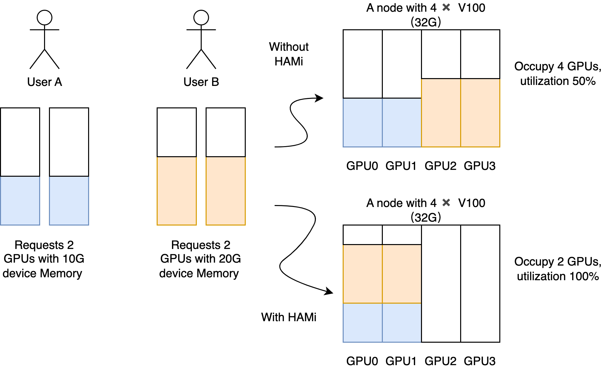
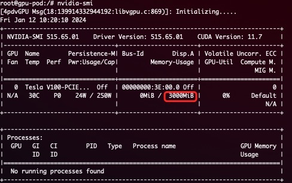

# HAMi - Heterogeneous Computing Virtualization Middleware

**HAMi is already a project in the [Cloud Native Computing Foundation](https://cncf.io/) landscape. HAMi is applying to join the Sandbox and has currently [passed the voting stage](https://github.com/cncf/sandbox/issues/97), exceeding the 66% qualified score threshold. See [related post news](https://mp.weixin.qq.com/s/6Ze2i3-CQSFANhn8b7oNjA).**

Supported Devices:
[](https://github.com/Project-HAMi/HAMi#preparing-your-gpu-nodes)
[](https://github.com/Project-HAMi/HAMi/blob/master/docs/cambricon-mlu-support_cn.md)
[](https://github.com/Project-HAMi/HAMi/blob/master/docs/hygon-dcu-support.md)
[](https://github.com/Project-HAMi/HAMi/blob/master/docs/iluvatar-gpu-support_cn.md)



The heterogeneous computing virtualization middleware HAMi meets all the capabilities you need to manage heterogeneous computing clusters, including:

- **Device Reuse**: Each task can occupy only a portion of the GPU, and multiple tasks can share a single GPU.
- **Restrictable Memory Allocation**: You can now allocate GPUs using memory values (e.g., 3000M) or memory ratios (e.g., 50%), ensuring that the memory used by tasks does not exceed the allocated value.
- **Specify Device Models**: The current task can choose to use or not use specific models of devices by setting `annotation`.
- **Device UUID Specification**: The current task can choose to use or not use specified devices by setting `annotation`, such as "nvidia.com/use-gpuuuid" or "nvidia.com/nouse-gpuuuid".
- **Non-Intrusive**: The vGPU scheduler is compatible with the official NVIDIA plugin's GPU allocation method, so after installation, you do not need to modify existing task files to use vGPU features. You can also customize resource names.
- **Scheduling Policies**: The vGPU scheduler supports various scheduling policies, including node and GPU card dimension scheduling policies, which can be set as defaults through scheduler parameters or based on application scenarios by setting Pod's `annotation`, such as "hami.io/node-scheduler-policy" or "hami.io/gpu-scheduler-policy". Both dimensions support `binpack` and `spread` strategies.

## Use Cases

- Scenarios where computing devices need to be reused in a cloud-native environment.
- Custom requests for heterogeneous computing, such as requesting virtual GPUs with specific memory sizes, with each virtual GPU using a specific proportion of computing.
- In a cluster composed of multiple heterogeneous computing nodes, tasks need to be allocated to suitable nodes based on their GPU requirements.
- Situations where memory and computing unit utilization is low, such as running 10 tf-serving instances on a single GPU.
- Scenarios requiring many small GPUs, such as providing a single GPU for multiple students in an educational setting or cloud platforms offering small GPU instances.

## Product Design


HAMi includes several components: a unified mutating webhook, a unified scheduler, and device plugins and control components for various heterogeneous computing devices. The overall architectural features are shown in the diagram above.

## Product Features

HAMi can achieve hard isolation of memory resources.

A simple demonstration of hard isolation: After submitting tasks defined in the following way

```yaml
resources:
  limits:
    nvidia.com/gpu: 1 # requesting 1 vGPU
    nvidia.com/gpumem: 3000 # Each vGPU contains 3000m device memory
```

Only 3G of visible memory will be available:



- Allows requesting computing devices by specifying memory.
- Hard isolation of computing resources.
- Allows requesting computing devices by specifying utilization ratios.
- Zero modification required for existing programs.

## Installation Requirements

- NVIDIA drivers >= 440
- nvidia-docker version > 2.0
- docker/containerd/cri-o configured with nvidia as the default runtime
- Kubernetes version >= 1.16
- glibc >= 2.17 & glibc < 2.3.0
- kernel version >= 3.10
- helm > 3.0

## Quick Start

### Choose Your Cluster Scheduler

[](https://github.com/Project-HAMi/HAMi#quick-start)
[](https://github.com/Project-HAMi/HAMi/blob/master/docs/how-to-use-volcano-vgpu.md)

### GPU Node Preparation

The following steps need to be performed on all GPU nodes. This README assumes that the GPU nodes have NVIDIA drivers installed. It also assumes you have docker or containerd installed and need to configure nvidia-container-runtime as the default low-level runtime to use.

#### Example Installation Steps

```bash
# Add the package repository
distribution=$(. /etc/os-release;echo $ID$VERSION_ID)
curl -s -L https://nvidia.github.io/libnvidia-container/gpgkey | sudo apt-key add -
curl -s -L https://nvidia.github.io/libnvidia-container/$distribution/libnvidia-container.list | sudo tee /etc/apt/sources.list.d/libnvidia-container.list

sudo apt-get update && sudo apt-get install -y nvidia-container-toolkit
```

##### Configure Docker

You need to set the nvidia runtime as your default docker runtime on the nodes. We will edit the docker daemon configuration file, usually located at `/etc/docker/daemon.json`:

```json
{
  "default-runtime": "nvidia",
  "runtimes": {
    "nvidia": {
      "path": "/usr/bin/nvidia-container-runtime",
      "runtimeArgs": []
    }
  }
}
```

```bash
systemctl daemon-reload && systemctl restart docker
```

##### Configure containerd

You need to set the nvidia runtime as your default containerd runtime on the nodes. We will edit the containerd daemon configuration file, usually located at `/etc/containerd/config.toml`:

```toml
version = 2
[plugins]
  [plugins."io.containerd.grpc.v1.cri"]
    [plugins."io.containerd.grpc.v1.cri".containerd]
      default_runtime_name = "nvidia"

      [plugins."io.containerd.grpc.v1.cri".containerd.runtimes]
        [plugins."io.containerd.grpc.v1.cri".containerd.runtimes.nvidia]
          privileged_without_host_devices = false
          runtime_engine = ""
          runtime_root = ""
          runtime_type = "io.containerd.runc.v2"
          [plugins."io.containerd.grpc.v1.cri".containerd.runtimes.nvidia.options]
            BinaryName = "/usr/bin/nvidia-container-runtime"
```

```bash
systemctl daemon-reload && systemctl restart containerd
```

Finally, you need to label all GPU nodes with `gpu=on`, otherwise, the nodes will not be scheduled:

```bash
kubectl label nodes {nodeid} gpu=on
```

### Install, Update, and Uninstall

First, add the HAMi repo using helm:

```bash
helm repo add hami-charts https://project-hami.github.io/HAMi/
```

Then, use the following command to get the cluster server version:

```bash
kubectl version
```

During installation, specify the scheduler image version based on your cluster server version (the result from the previous command). For example, if the cluster server version is 1.16.8, you can use the following command to install:

```bash
helm install hami hami-charts/hami --set scheduler.kubeScheduler.imageTag=v1.16.8 -n kube-system
```

You can modify the [configuration](https://github.com/Project-HAMi/HAMi/blob/master/docs/config_cn.md) here to customize the installation.

If you see the `vgpu-device-plugin` and `vgpu-scheduler` pods in the *Running* state using the `kubectl get pods` command, the installation is successful.

```bash
kubectl get pods -n kube-system
```

**Update**

You just need to update the helm repo and restart the entire Chart to automatically complete the update; the latest images will be downloaded automatically:

```bash
helm uninstall hami -n kube-system
helm repo update
helm install hami hami-charts/hami -n kube-system
```

> **Note:** If you perform a hot update without cleaning up tasks, running tasks may encounter segmentation faults or other errors.

**Uninstall**

```bash
helm uninstall hami -n kube-system
```

> **Note:** Uninstalling the components will not cause running tasks to fail.

### Submit Tasks

NVIDIA vGPUs can now be requested through the resource type `nvidia.com/gpu`:

```yaml
apiVersion: v1
kind: Pod
metadata:
  name: gpu-pod
spec:
  containers:
    - name: ubuntu-container
      image: ubuntu:18.04
      command: ["bash", "-c", "sleep 86400"]
      resources:
        limits:
          nvidia.com/gpu: 2 # Requesting 2 vGPUs
          nvidia.com/gpumem: 3000 # Each vGPU requests 3000m memory (optional, integer type)
          nvidia.com/gpucores: 30 # Each vGPU's computing is 30% of the actual GPU's computing (optional, integer type)
```

If your task cannot run on any node (for example, if the task's `nvidia.com/gpu` is greater than the actual GPU count on any GPU node in the cluster), the task will be stuck in a `pending` state.

Now you can execute the `nvidia-smi` command in the container and compare the differences between vGPU and actual GPU memory sizes.

> **Note:**
>
> 1. If you use the privileged field, this task will not be scheduled because it can see all GPUs and may affect other tasks.
> 2. Do not set the nodeName field; for similar requirements, use nodeSelector.

#### More Examples

See [more examples](https://github.com/Project-HAMi/HAMi/tree/master/examples/nvidia).

### Monitoring

Monitoring is automatically enabled by default after the scheduler is successfully deployed. You can access monitoring data via:

```http
http://{nodeip}:{monitorPort}/metrics
```

Where `monitorPort` can be configured in Values, defaulting to 31992.

Refer to the Grafana dashboard [example](https://github.com/Project-HAMi/HAMi/blob/master/docs/dashboard_cn.md).

> **Note:** The vGPU status on the node will only be counted after it has been used.

Refer to the complete [performance testing documentation](https://github.com/Project-HAMi/HAMi/blob/master/docs/benchmark_cn.md).

## Known Issues

- Currently supports only computing tasks, not video encoding/decoding processing.
- Temporarily only supports MIG's "none" and "mixed" modes, single mode is not supported yet.
- Tasks with the "nodeName" field may encounter scheduling issues; for similar requirements, please use "nodeSelector".
- We modified the `device-plugin` component's environment variable from `NodeName` to `NODE_NAME`. If you are using the image version `v2.3.9`, `device-plugin` may fail to start. There are currently two suggested fixes:
    - Manually execute `kubectl edit daemonset` to change the `device-plugin` environment variable from `NodeName` to `NODE_NAME`.
    - Upgrade to the latest version using helm; the latest version of the `device-plugin` image is `v2.3.10`. Execute `helm upgrade hami hami/hami -n kube-system` to automatically fix it.

## Development Plans

The currently supported heterogeneous computing devices and their corresponding reuse features are shown in the table below:

| Product   | Manufacturer | Memory Isolation | computing Isolation | Multi-GPU Support |
|-----------|--------------|------------------|---------------------------|-------------------|
| GPU       | NVIDIA       | ✅                | ✅                         | ✅                 |
| MLU       | Cambricon    | ✅                | ❌                         | ❌                 |
| DCU       | Hygon        | ✅                | ✅                         | ❌                 |
| Ascend    | Huawei       | In Development    | In Development             | ❌                 |
| GPU       | Iluvatar     | In Development    | In Development             | ❌                 |
| DPU       | Taihu        | In Development    | In Development             | ❌                 |

- [ ] Support video encoding/decoding processing.
- [ ] Support Multi-Instance GPUs (MIG).
- [ ] Support more flexible scheduling policies.
    - [ ] binpack
    - [ ] spread
    - [ ] NUMA affinity
- [ ] Integration with NVIDIA GPU Operator.
- [ ] Support for richer observability capabilities.
- [ ] Support DRA.
- [ ] Support Intel GPU devices.
- [ ] Support AMD GPU devices.

## Contribution

If you want to become a contributor to HAMi, refer to the [contributor guidelines](https://github.com/Project-HAMi/HAMi/blob/master/CONTRIBUTING.md), which contains detailed contribution processes.

- [HAMi Official Website](http://project-hami.io/)
- [HAMi Repository](https://github.com/Project-HAMi/HAMi)
