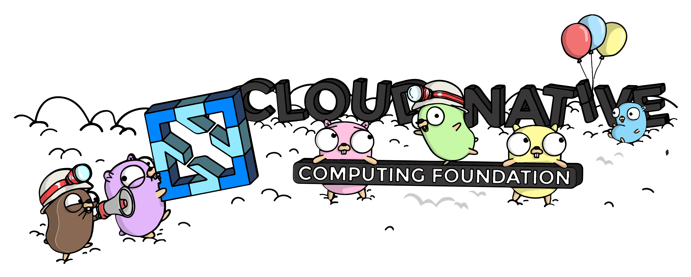

---
hide:
  - toc
---

# Kubean

Kubean is a cluster lifecycle management tool built on top of Kubespray.

- Easy to use: Deploy Kubean and manage Kubernetes clusters' robust lifecycles through declarative APIs.
- Offline support: Each version includes offline packages (OS packages, images, binaries) so you don't have to worry about gathering the required resources.
- Compatibility: Supports multi-architecture delivery including AMD, ARM, common Linux distributions, and the Kylin operating system based on Kunpeng architecture.
- Scalability: Allows customization of clusters using native Kubespray features.

**Kubean is part of the [CNCF](https://cncf.io/) Landscape projects.**

Installation demo:

See the [Kubean installation video demo](https://asciinema.org/a/511386).

[Kubean releases](https://github.com/kubean-io/kubean/releases){ .md-button }
[Explore Kubean community](https://github.com/kubean-io/kubean){ .md-button }

Kubean is listed in the <a href="https://landscape.cncf.io/?selected=kubean">CNCF Cloud Native Landscape</a>.

