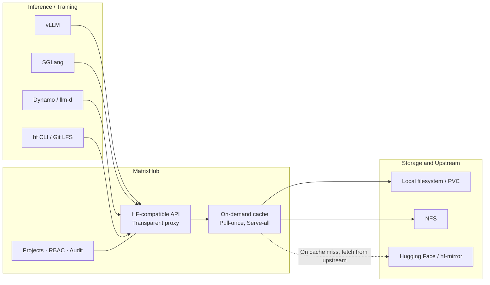

# MatrixHub

MatrixHub is an open-source **self-hosted AI model registry** (Model Registry) created and continuously incubated by DaoCloud, designed for enterprise-scale inference scenarios.
It provides a Hugging Face-compatible API, serving as a private alternative to Hugging Face, and accelerates model loading for mainstream inference engines such as vLLM and SGLang.

> **MatrixHub is to Hugging Face what Harbor is to Docker Hub.**
>
> Free your critical business from the public internet: own your model assets and accelerate the distribution pipeline.

MatrixHub is written in Go and open-sourced under the [Apache License 2.0](https://github.com/matrixhub-ai/matrixhub/blob/main/LICENSE).
It has achieved the **Passing** level of [OpenSSF Best Practices](https://www.bestpractices.dev/projects/13641).

[Join the MatrixHub GitHub community](https://github.com/matrixhub-ai/matrixhub){ .md-button }
[Visit the MatrixHub website](https://matrixhub.ai/){ .md-button }

## Why MatrixHub

As large models move from experimentation to production at scale, model weights themselves become a core asset that must be governed. However, the traditional approach often relies on direct public internet access to Hugging Face, which exposes clear weaknesses when scaling GPU clusters, delivering to offline environments, and tracking versions:

| Typical Challenge | How MatrixHub Addresses It |
| --- | --- |
| Every GPU cluster scale-out re-pulls tens of GB of weights from the public internet, making bandwidth the bottleneck | Transparent proxy + on-demand caching: pull once, serve the whole cluster (Pull-once, Serve-all) |
| Production environments are not allowed to connect to the public internet, so models must be delivered securely into isolated networks | Air-gapped delivery that preserves the native `HF_ENDPOINT` experience inside isolated networks |
| Fine-tuned weights are scattered across nodes, and versions and releases are not traceable | A centralized private registry with tag locking, a promotion workflow, and CI/CD integration |
| Multiple data centers each download repeatedly, causing high cross-region access latency | Policy-driven asynchronous replication with chunked transfer and resumable downloads |
| Lack of permission isolation, audit records, and compliance controls | Project-level isolation, RBAC, full audit logs, integrity verification, and malicious content scanning |

## Core Capabilities

### High-Performance Distribution

- **Transparent HF proxy**: Point the `HF_ENDPOINT` of a client or inference engine to MatrixHub to switch to private hosting, **without modifying any business code**.
- **On-demand caching**: On the first request, public models are automatically pulled from upstream and localized. Subsequent requests hit the cache directly, greatly reducing repeated egress traffic.
- **Inference-native acceleration**: Native support for **P2P distribution**, OCI artifacts, and **NetLoader** streaming weight loading straight to the GPU, reducing model loading wait time.

### Enterprise Governance and Security

- **RBAC and multi-tenancy**: Project-based isolation and fine-grained access control, with LDAP / SSO integration.
- **Audit and compliance**: Complete logs are retained for every upload, download, and configuration change, providing end-to-end traceability.
- **Integrity protection**: Built-in malicious content scanning and content signing ensure that models are not tampered with in transit.

### Scalable Infrastructure

- **Flexible storage**: Currently supports local file systems mounted on PVCs and NFS; S3-compatible object storage is on the roadmap.
- **Reliable replication**: Policy-driven chunked transfer guarantees data consistency even over unstable cross-region networks.
- **Cloud native by design**: Optimized for Kubernetes with an official **Helm chart** and horizontal scalability.

## How It Works

MatrixHub sits between the inference side and model storage, shielding upstream model sources from the layers above while uniformly managing storage and replication below.



A typical model distribution flow looks like this:

1. Create a **proxy project** in MatrixHub and configure a **target registry** pointing to Hugging Face (or a mirror site such as hf-mirror).
2. Inference nodes request models from MatrixHub through `HF_ENDPOINT`. On a cache miss, MatrixHub downloads from upstream and writes the cache to disk, a process that is completely transparent to the client.
3. Subsequent nodes in the same cluster requesting the same model hit the cache directly, naturally achieving "fetch once from upstream, reuse across the whole cluster".
4. Once cached, replication policies can synchronize models asynchronously to other data centers or offline environments, with audit records preserved throughout.

## Typical Use Cases

- **Zero-wait distribution**: Eliminates bandwidth bottlenecks with a "pull once, serve all" caching mechanism, supporting 100+ GPU nodes pulling models at over 10 Gbps simultaneously.
- **Air-gapped delivery**: Delivers models securely into isolated networks with integrity protection, malicious content scanning, and audit trails.
- **Private model registry**: Centrally manages fine-tuned weights and ensures version consistency from development to production through tag locking and CI/CD integration.
- **Multi-region active-active sync**: Automatically performs asynchronous, resumable replication across data centers for nearby access and high availability.

## Integration with the Inference Ecosystem

MatrixHub integrates with mainstream inference engines and scheduling frameworks. In every case, the core step is pointing `HF_ENDPOINT` to the MatrixHub address:

```bash
# Point the model download entry point to your self-hosted MatrixHub
export HF_ENDPOINT=https://hub.matrix.internal

# Engines such as vLLM / SGLang need no other changes; models load directly from the MatrixHub cache
vllm serve "deepseek-ai/deepseek-coder-33b"
```

- **vLLM**: Set `HF_ENDPOINT` in the runtime environment to load models through MatrixHub.
- **SGLang**: Likewise loads models from the MatrixHub cache through `HF_ENDPOINT`, speeding up cluster startup.
- **llm-d**: Inject `HF_ENDPOINT` into llm-d model services to distribute models uniformly across the cluster.
- **Dynamo**: Set `HF_ENDPOINT` in a Dynamo deployment and let MatrixHub serve as the model source.
- **ModelExpress**: Use MatrixHub as the model source so that ModelExpress can reuse cached or already-loaded weights across Dynamo workers (supporting P2P transports such as NIXL, UCX, and RDMA).

Beyond inference engines, MatrixHub also supports accessing model repositories over **Git, Git LFS, and HTTP**, and provides SSH key and access token management.
For detailed integration steps, see the [official integration documentation](https://matrixhub.ai/docs/integrations/).

## Getting Started

MatrixHub offers two official installation methods: **Docker Compose** (for a single machine) and **Helm chart** (for Kubernetes clusters).

### Deploy with Docker Compose

```bash
export MATRIXHUB_VERSION=v0.1.1

mkdir -p matrixhub && cd matrixhub

curl -fL \
  "https://raw.githubusercontent.com/matrixhub-ai/matrixhub/$MATRIXHUB_VERSION/deploy/docker-compose.yml" \
  -o docker-compose.yml
curl -fL \
  "https://raw.githubusercontent.com/matrixhub-ai/matrixhub/$MATRIXHUB_VERSION/deploy/config.yaml" \
  -o config.yaml

MATRIXHUB_IMAGE_TAG="$MATRIXHUB_VERSION" docker compose up -d
```

When the command completes, visit `http://127.0.0.1:3001` to open the web console. The default username is `admin` and the password is `changeme`.
**Change the default password before exposing the instance externally.**

### Deploy with Helm

Make sure the cluster has a default StorageClass:

```bash
export CHART_VERSION=0.1.1
export NAMESPACE=matrixhub

helm install matrixhub oci://ghcr.io/matrixhub-ai/matrixhub \
  --version "$CHART_VERSION" \
  --namespace "$NAMESPACE" --create-namespace \
  --set apiserver.service.type=NodePort
```

With the default installation, the MatrixHub data PVC is `50Gi` and the built-in MySQL PVC is `8Gi`. You can adjust them with
`--set apiserver.storage.pvc.size=100Gi` and `--set mysql.persistence.size=20Gi`.
After installation, access the console at `http://<node-ip>:30001`.

For more parameters and storage configuration, see the [official installation documentation](https://matrixhub.ai/docs/installation/).

## Online Demo

Try it without any deployment: [demo.matrixhub.ai](https://demo.matrixhub.ai/)

| Username | Password |
| --- | --- |
| `admin` | `changeme` |

!!! note

    This demo environment is for evaluation only. It is reset automatically every 6 hours and may also be reset during maintenance.

## Releases and Roadmap

The latest version is [v0.1.1](https://github.com/matrixhub-ai/matrixhub/releases), corresponding to Helm chart version `0.1.1`, and it supports Kubernetes 1.23 - 1.32. DaoCloud Enterprise 5.0 has integrated MatrixHub as a **Model Accelerator** component.

The project advances in three phases. For the complete plan, see [ROADMAP.md](https://github.com/matrixhub-ai/matrixhub/blob/main/ROADMAP.md):

- **Phase 1**: Establish the baseline of key workflows and enterprise features, including the HF-compatible API, proxy caching, projects and model registries, users/roles/access keys, push and pull replication, Git access, multi-backend large file storage, and Docker Compose / Helm / Kubernetes deployment methods.
- **Phase 2**: Inference-native acceleration and ecosystem integration, including an S3-compatible backend, XET large file downloads, Dragonfly-based P2P preheating, deep integration with vLLM, SGLang, llm-d, Dynamo, and ModelExpress, and Run:ai Model Streamer support.
- **Phase 3**: Enterprise feature expansion and production-grade governance, including dataset support, audit logs, finer-grained RBAC, LDAP / OIDC / SSO, storage quotas, cleanup policies, access statistics, security scanning, model signing, and an artifact promotion workflow.

## Community and Support

MatrixHub is an open open-source project. Contributions through issues, pull requests, and discussions are welcome.

- [GitHub Repository](https://github.com/matrixhub-ai/matrixhub)
- [Documentation Site](https://matrixhub.ai/docs/overview/)
- [GitHub Discussions](https://github.com/matrixhub-ai/matrixhub/discussions)
- [CNCF Slack `#matrixhub`](https://cloud-native.slack.com/archives/C0A8UKWR8HG)
- [DeepWiki Code Walkthrough](https://deepwiki.com/matrixhub-ai/matrixhub)
- [Release Notes](https://github.com/matrixhub-ai/matrixhub/releases)

[Join the MatrixHub GitHub community](https://github.com/matrixhub-ai/matrixhub){ .md-button }
[Visit the MatrixHub website](https://matrixhub.ai/){ .md-button }
