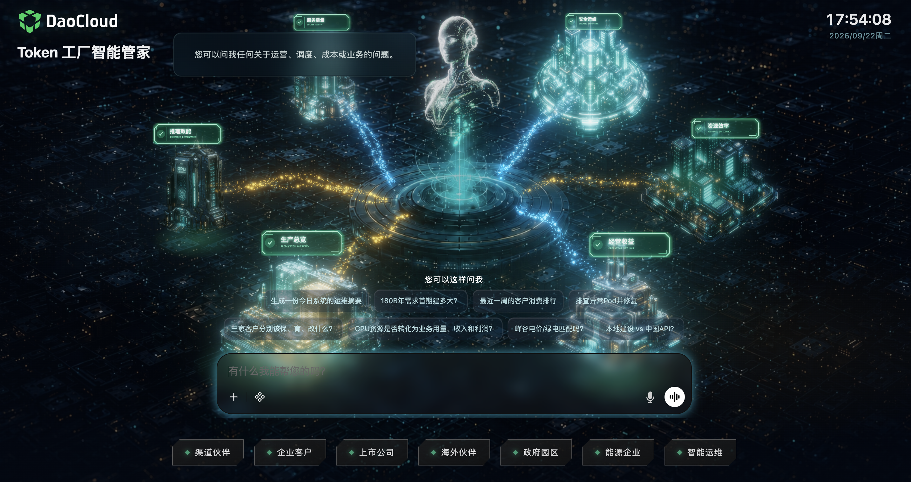

# Token Factory Copilot

Token Factory Copilot, also known as the Token Factory smart workbench, is a unified intelligent work entry point for Token production and operations scenarios. It connects the resources, inference, scheduling, governance, and operations capabilities of Token Factory, helping users understand system status, analyze running conditions, formulate handling strategies, and execute related tasks through natural language.

The goal of Copilot is not to add an independent chat window, but to unify observability, analysis, strategy, scheduling, governance, and execution, lowering the barrier to using and managing Token Factory so that different roles can use complex AI infrastructure in a way that suits them.

## What Is Token Factory

Token Factory is not simply a model deployment platform, nor is it a layer of UI added on top of inference services. It is a set of system capabilities built around Token production, supply, operations, and settlement.

Token Factory treats compute as raw material and organizes cloud-native AI infrastructure, inference engines, models, cache, traffic, and scheduling capabilities into a production system that continuously delivers stable, low-cost, metered, and operable Token capacity.

It cares about more than whether models can run. It also addresses the following questions:

- How to host and manage heterogeneous compute resources;
- How to organize models and inference engines into stable services;
- How to schedule and scale based on load and policies;
- How to improve GPU utilization and reduce unit Token cost;
- How to observe inference services, locate faults, and ensure stable supply;
- How to meter Token usage, aggregate costs, and perform operations analysis.

## Copilot Smart Workbench

Token Factory adopts a five-layer production architecture, horizontally connected by the smart workbench:

1. **Usage layer**: Serves users, departments, applications, Agents, and other Token consumers.
2. **Service delivery layer**: Packages inference capabilities into services that can be applied for, used, governed, and metered.
3. **Token manufacturing layer**: Organizes requests, models, engines, GPUs, cache, and scheduling to form actual capacity.
4. **CloudNative AI foundation layer**: Provides clusters, heterogeneous scheduling, network, storage, observability, security, and delivery capabilities.
5. **Compute and infrastructure layer**: Hosts GPUs, network, storage, power, cabinets, data centers, and other underlying resources.

The Copilot smart workbench connects these layers to form a unified entry point from resource hosting and Token manufacturing to service delivery and operations governance. It supports both conversational interaction and task execution for daily work, as well as global analysis, policy understanding, and governance collaboration.

Therefore, Copilot and the smart workbench are the same product: Copilot is the product name, and the smart workbench is its product form and usage entry point. Users can converse with the system, view running data, understand platform policies, and execute related tasks within their permissions through the workbench.

## Core Values

### Lowering the barrier to complex systems

Users do not need to master all resource, model, inference, scheduling, and operations concepts first; they can ask questions in natural language and complete tasks step by step.

### Improving problem analysis efficiency

Copilot connects information scattered across resource, service, observability, metering, and operations modules, helping users find problems faster, understand causes, and compare solutions.

### Making system capabilities easier to use

The value of Token Factory lies not only in having underlying capabilities, but also in those capabilities being used stably and continuously by users. Copilot turns complex system capabilities into clear task entry points, helping the platform move from "it can run" to "it is easy to use".

### Supporting ongoing operations

For operations-oriented customers, Copilot serves not only technical maintenance, but also helps analyze the relationship between capacity, consumption, cost, and supply, helping users move from building compute systems to operating Token capacity.

## Usage Boundaries

Copilot is the intelligent work entry point of Token Factory. It does not equal the full capabilities of Token Factory, nor can it replace confirmation of key decisions by professionals.

When using Copilot, keep in mind:

- Copilot's answers depend on accessible data and connected system capabilities;
- Different users can only view and operate resources and data within their permissions;
- Operations that affect production environments, resource changes, and costs require confirmation;
- Analyses of cost, capacity, performance, and fault causes should be verified against actual metrics;
- Copilot's suggestions cannot replace change reviews, operations processes, and business confirmation.
